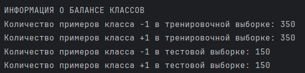
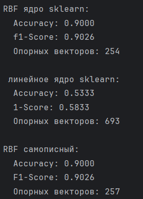
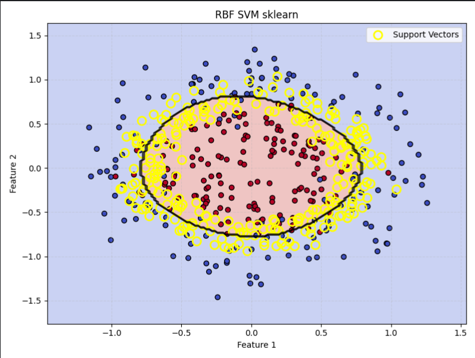
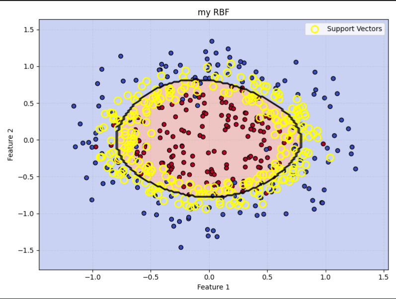
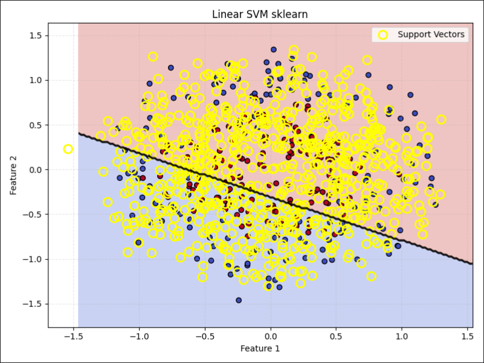

# SVM

## Датасет

### Информация о датасете

•   **Фичи:** Датасет содержит всего две числовые фичи: `X` и `Y` координаты.
•   **Тип данных:** Все данные являются числовыми.
•   **Качество данных:** Отсутствуют пропуски и категориальные значения.
•   **Масштабирование:** Данные уже масштабированы и находятся примерно в диапазоне `[-1.5, 1.5]`.

### Структура классов

Классы в этом датасете визуально представлены двумя концентрическими кругами: один большего радиуса, другой меньшего.

### Параметры генерации датасета

При генерации датасета используются следующие параметры:
•   `factor`: Коэффициент, определяющий, во сколько раз радиус одного круга больше радиуса другого.
•   `n_samples`: Количество примеров (точек данных) для генерации.
•   `noise`: Уровень шума, добавляемого к данным.

### Баланс классов

## Решения

Была использована модель из sklearn с линейным и rbf ядром, а также самописная модель с rbf ядром.

### Сравнение ядер

### RBF ядро (sklearn)

### RBF ядро (личное)

### Линейное ядро (sklearn)

