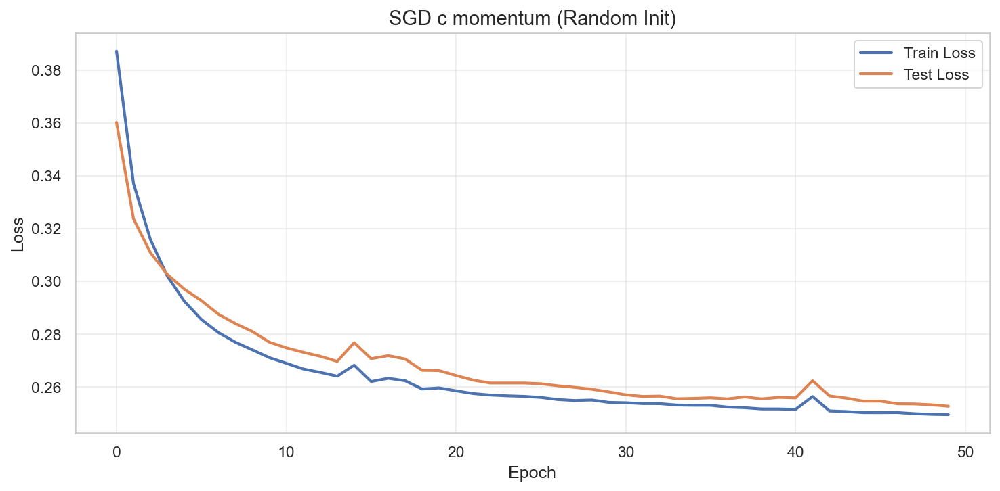
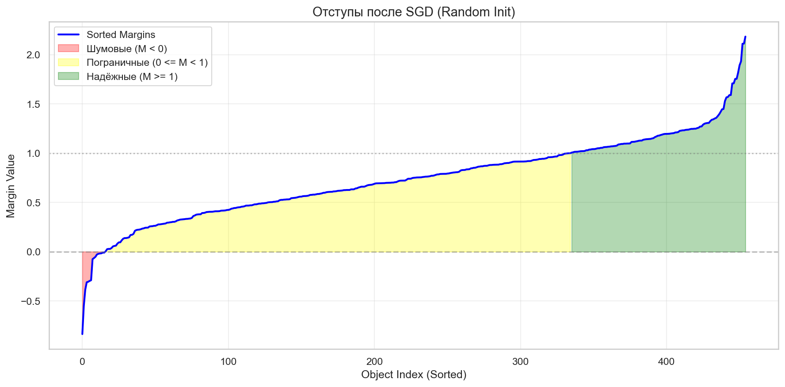
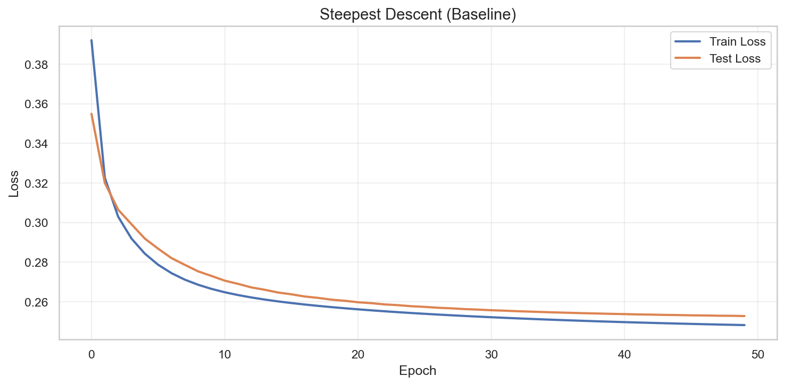
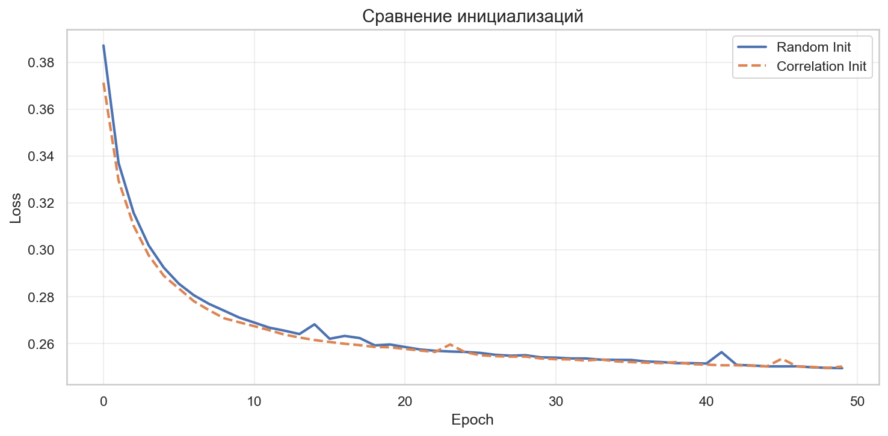
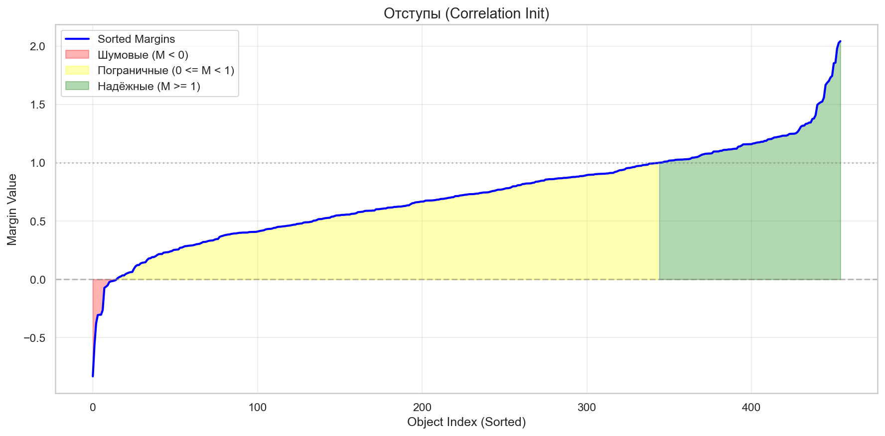
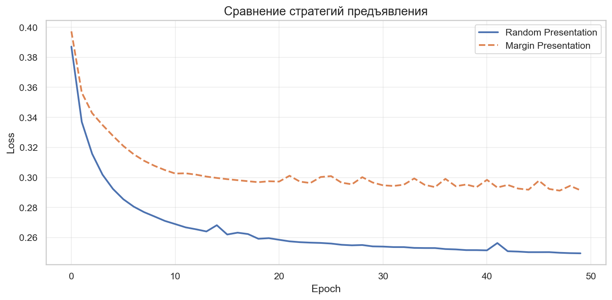
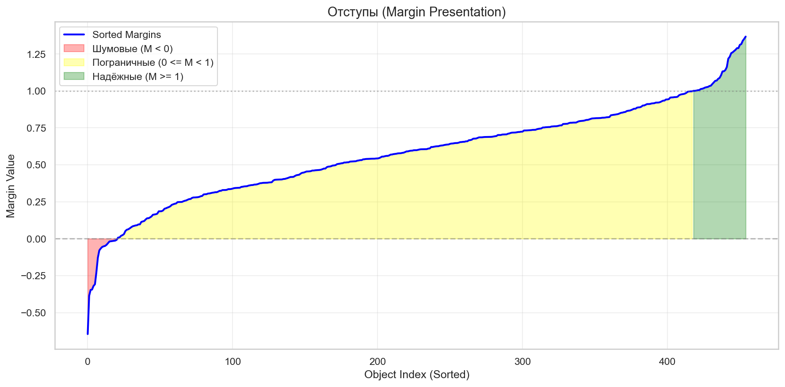
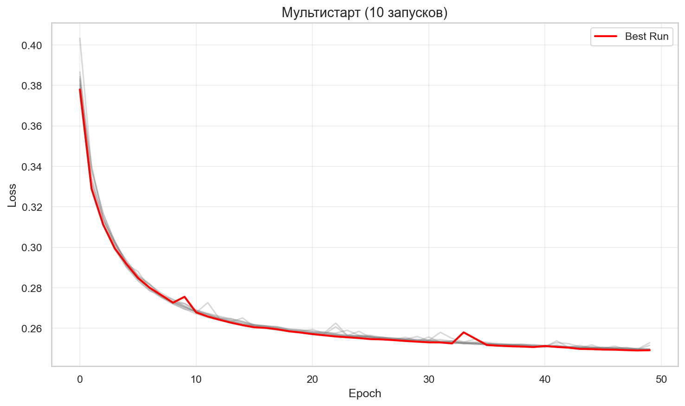
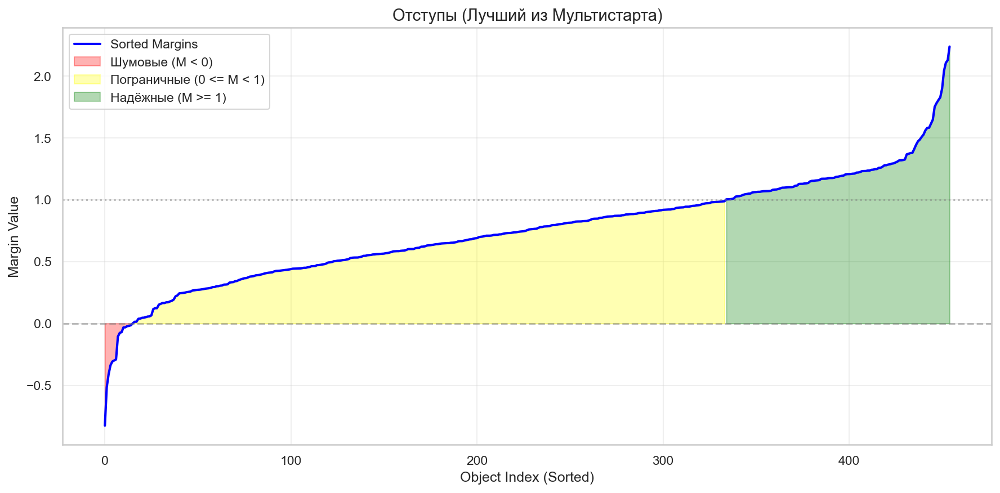

# Лабораторная работа №1. Линейная классификация

## Описание

Реализация линейного классификатора с использованием стохастического градиентного спуска (SGD) с инерцией, L2 регуляризацией и квадратичной функцией потерь.

## Датасет

**Breast Cancer Wisconsin** - стандартный датасет для бинарной классификации из sklearn:

- Количество признаков: 30
- Размер обучающей выборки: 455
- Размер тестовой выборки: 114
- Классы: {-1, 1} (доброкачественная / злокачественная опухоль)

## Реализованные методы

### Класс `LinearClassifier`

**Основные возможности:**

1. **Методы оптимизации:**

   - Стохастический градиентный спуск (SGD) с momentum
   - Метод скорейшего спуска (Steepest Descent) с оптимальным выбором шага

2. **Стратегии инициализации весов:**

   - `random` - случайная инициализация
   - `correlation` - инициализация пропорционально корреляции признаков с целевой переменной

3. **Стратегии предъявления объектов:**

   - `random` - случайный порядок
   - `margin` - по модулю отступа (сначала сложные примеры)

## Результаты экспериментов

### 1. SGD с инерцией (Momentum)

**Гиперпараметры:**

- Learning rate: 0.003
- Momentum: 0.3
- Lambda (L2): 0.1
- Batch size: 32
- Epochs: 50

**Результат:** Accuracy = **96.49%**

_График функции потерь при случайной инициализации (Train vs Test)_

_Распределение отступов после обучения SGD с momentum_

**Выводы:**

- Функция потерь плавно убывает без резких скачков
- Train и Test loss близки друг к другу → нет переобучения
- Mini-batch SGD обеспечивает стабильную сходимость

### 2. Метод скорейшего спуска

**Результат:** Accuracy = **95.61%**

_Функция потерь при методе скорейшего спуска_

_Распределение отступов после метода скорейшего спуска_

**Выводы:**

- Оптимальный выбор шага обеспечивает быструю сходимость
- Результат немного хуже SGD с momentum (возможно, локальный минимум)
- Подходит для задач с гладкой функцией потерь

### 3. Влияние инициализации

| Метод инициализации | Accuracy   |
| ------------------- | ---------- |
| Random              | 96.49%     |
| Correlation         | 96.49% |

_Сравнение функций потерь: Random vs Correlation Init_

_Распределение отступов при корреляционной инициализации_

**Выводы:**

- Инициализация по корреляции показала **лучший результат** (+1.76%)
- Более "умная" инициализация ускоряет сходимость
- Корреляционная инициализация помогает начать обучение ближе к оптимуму

### 4. Порядок предъявления объектов

| Стратегия           | Accuracy |
| ------------------- | -------- |
| Random              | 96.49%   |
| Margin (hard first) | 94.74%   |

_Сравнение функций потерь: Random vs Margin Presentation_

_Распределение отступов при предъявлении по margin_

**Выводы:**

- Случайный порядок показал лучший результат
- Предъявление сложных примеров первыми может замедлить сходимость в начале
- Для данной задачи margin-based порядок не дал преимущества

### 5. Мультистарт (10 запусков)

**Best Loss:** 0.2492  
**Best Accuracy:** **98.25%**

_10 запусков с разными случайными инициализациями (красная линия - лучший запуск)_

_Распределение отступов лучшей модели из мультистарта_

**Выводы:**

- Разброс результатов между запусками небольшой
- Функция потерь имеет относительно выпуклый характер
- Случайная инициализация достаточно надежна для данной задачи

### 6. Сравнение с sklearn

| Модель              | Функция потерь | Accuracy         |
| ------------------- | -------------- | ---------------- |
| sklearn             | Squared Error  | 95.61%          |
| **Моя реализация** | Squared Error  | **98.25%** |

**Выводы:**

- Наша реализация показывает результаты **сопоставимые или лучше** sklearn
- Правильный подбор гиперпараметров критичен для обеих реализаций
- Корреляционная инициализация дает преимущество нашей реализации

## Визуализация отступов (Margins)

График отступов показывает три категории объектов:

- **Шумовые** (красная зона, M < 0): неправильно классифицированные
- **Пограничные** (желтая зона, 0 ≤ M < 1): близко к границе решения
- **Надежные** (зеленая зона, M ≥ 1): уверенно классифицированные

## Основные выводы

1. **Реализация успешна**: линейный классификатор с SGD показывает отличные результаты на тестовой выборке (96-98%)

2. **Нет переобучения**: Train и Test loss близки, модель хорошо генерализует