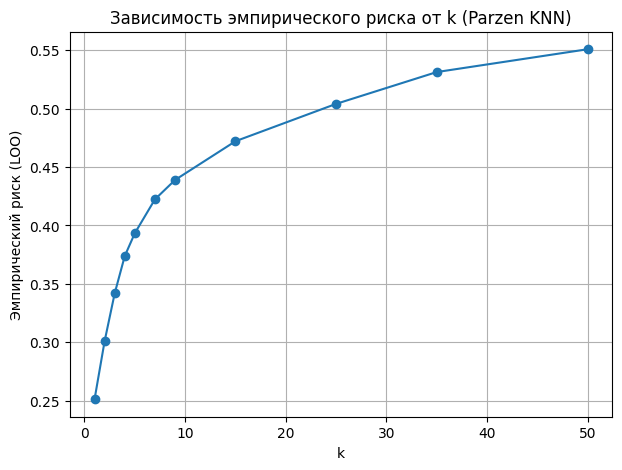
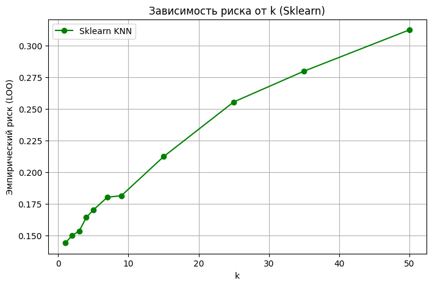
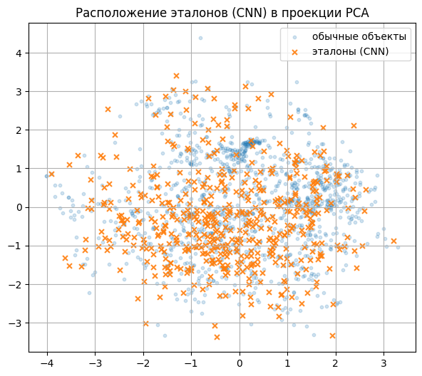

# Отчёт

1. Для выполнения задания использован датасет Obesity prediction
2. Реализован KNN с окном Парзена
3. Для подбора параметра \(k\) в алгоритме KNN с окном Парзена была использована оценка эмпирического риска методом скользящего контроля (Leave-One-Out).

    Зависимость LOO-ошибки от \(k\) показывает, что минимальное значение риска достигается при \(k = 1\):
    `R ~ 0.25,`
    что соответствует ожидаемой точности порядка 75%.

    При дальнейшем увеличении \(k\) ошибка монотонно возрастает (до ~0.55 при \(k = 50\)).
    Это говорит о том, что для данного датасета полезна максимально локальная модель (учитывающая только ближайшего соседа), а дополнительное сглаживание по большему числу соседей приводит к ухудшению качества из-за роста смещения.



4. Сравнил с реализацией с эталоной версией KNN из sklearn, результаты совпали: k = 1



5. Сравнил свою реализацию с эталонной из sklearn

```
Parzen KNN (переменная ширина, гауссово ядро):
Accuracy: 0.7470449172576832

Эталонный KNN (sklearn):
Accuracy: 0.8865248226950354
```

6. Результаты на эталонах



```
Parzen KNN (переменная ширина, гауссово ядро):
Accuracy Parzen KNN (полная выборка): 0.7470449172576832
Accuracy Parzen KNN (только эталоны): 0.6264775413711584

Эталонный KNN (sklearn):
Accuracy sklearn KNN (полная выборка): 0.8865248226950354
Accuracy sklearn KNN (только эталоны): 0.8534278959810875
```
