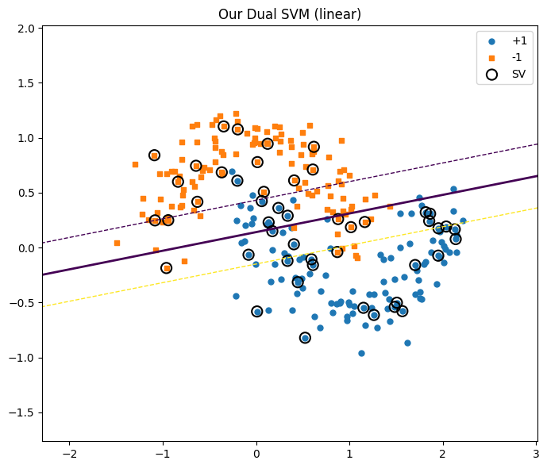

# Лабораторная работа №3. Метод опорных векторов (SVM)

## Описание

Реализация бинарного классификатора на основе метода опорных векторов (SVM). Обучение производится через решение двойственной задачи оптимизации (поиск множителей Лагранжа). Поддерживается использование ядер для работы с нелинейно разделимыми данными.

## Датасет

**Make Moons** - синтетический набор данных из библиотеки `sklearn`, представляющий собой два переплетающихся полумесяца.

- **Количество объектов:** 250
- **Шум (noise):** 0.18
- **Разбиение:** 65% train / 35% test

## Реализованные методы

### Класс `DualSVM`

Основные особенности реализации:

1.  **Оптимизация:** Использование `scipy.optimize.minimize` (метод SLSQP) для минимизации целевой функции при линейных ограничениях ($\sum y_i \lambda_i = 0$) и граничных условиях ($0 \le \lambda_i \le C$).
2.  **Ядра:**
    - `linear` (линейное): $K(x, z) = x \cdot z^T$
    - `rbf` (радиальная базисная функция): $K(x, z) = \exp(-\gamma ||x - z||^2)$
3.  **Вычисление bias ($b$):** Производится усреднение значения смещения, вычисленного по всем "свободным" опорным векторам (лежащим строго на границе отступа, $0 < \lambda < C$).

## Результаты экспериментов

Эксперименты проводились с использованием Линейного и RBF ядер.

### 1. Линейное ядро (Linear)

Линейный классификатор пытается разделить данные прямой линией, что дает невысокую точность на нелинейном датасете "Make Moons".

**Параметры:** $C=1.5$
**Метрики:**

- **Accuracy:** 84.09%
- **#SV:** 48

### 2. RBF ядро

Радиальная базисная функция позволяет построить сложную нелинейную разделяющую поверхность, огибающую классы.

**Параметры:** $C=1.5, \gamma=1.5$
**Метрики:**

- **Accuracy:** 96.59%
- **#SV:** 39

## Сравнение с sklearn

Проведено сравнение с эталонной реализацией `SVC` из библиотеки `scikit-learn` на тех же данных (с предварительной стандартизацией) и гиперпараметрах.

| Ядро       | Реализация         | Accuracy   | Support Vectors |
| :--------- | :----------------- | :--------- | :-------------- |
| **Linear** | **DualSVM (Своя)** | **0.8409** | **48**          |
|            | Sklearn SVC        | 0.8409     | 48              |
| **RBF**    | **DualSVM (Своя)** | **0.9659** | **39**          |
|            | Sklearn SVC        | 0.9659     | 39              |

**Выводы:**

1.  **Корректность реализации:** Результаты (Accuracy и количество опорных векторов) полностью совпадают с библиотечной реализацией `sklearn` для обоих типов ядер.
2.  **Эффективность ядер:** Для датасета "Make Moons" линейное ядро показывает существенно худший результат (84%) по сравнению с RBF (96%), так как данные не являются линейно разделимыми.