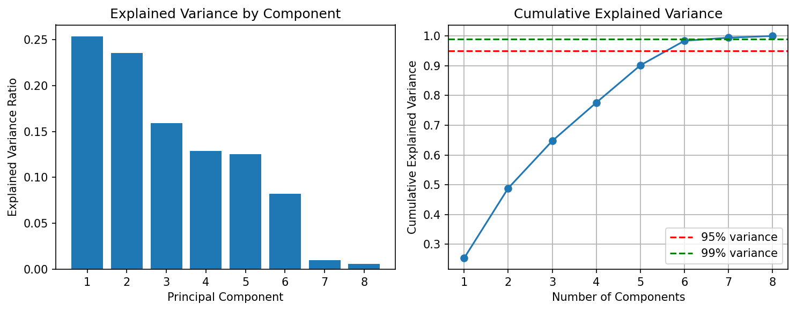

# Лабораторная работа 4: PCA и линейная регрессия

## Цель работы
Реализовать метод главных компонент (PCA) через сингулярное разложение (SVD) и применить его для снижения размерности в задаче линейной регрессии.

## Датасет
**California Housing Dataset**
- Размерность: 20640 объектов × 8 признаков
- Задача: регрессия (предсказание медианной стоимости домов)
- Признаки: медианный доход, возраст дома, количество комнат и др.

## Реализация PCA

Реализован класс `PCA` с использованием сингулярного разложения:

```python
U, S, Vt = np.linalg.svd(X_centered, full_matrices=False)
```

Главные компоненты: `components_ = Vt`  
Объясненная дисперсия: `explained_variance_ = S² / (n - 1)`

## Проверка эквивалентности

Сравнение собственной реализации с `sklearn.decomposition.PCA`:

- Разница в компонентах (норма Фробениуса): **3.54 × 10⁻¹⁴**
- Разница в преобразованных данных: **2.75 × 10⁻¹²**

**Вывод**: Реализации эквивалентны с точностью до машинной точности.

## Определение эффективной размерности



**Результаты:**
- Для сохранения **95% дисперсии** требуется **6 компонент**
- Для сохранения **99% дисперсии** требуется **7 компонент**
- Исходная размерность: 8 признаков


## Выводы

1. **Реализация PCA через SVD** работает корректно и эквивалентна эталонной реализации sklearn
2. **Эффективная размерность** датасета составляет 6-7 компонент (95-99% дисперсии)
3. **Снижение размерности** с 8 до 6 компонент приводит к минимальной потере качества
