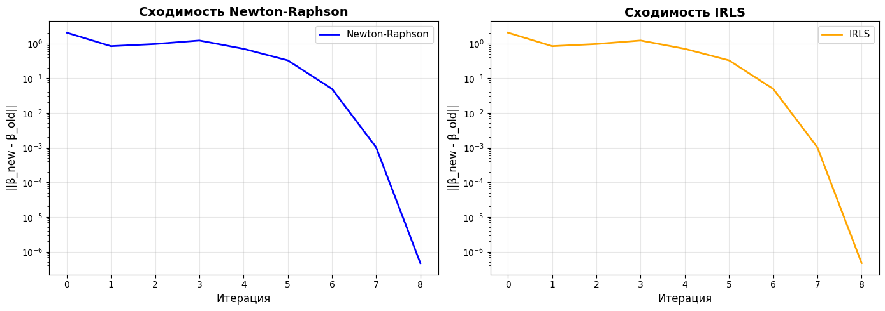

# Лабораторной работе №5: Логистическая регрессия

## Постановка задачи
Реализовать логистическую регрессию с использованием методов оптимизации второго порядка и сравнить результаты с эталонной реализацией из библиотеки `scikit-learn`.

## Реализация
Были реализованы два алгоритма обучения логистической регрессии с поддержкой **L2-регуляризации**:
1.  **Метод Ньютона-Рафсона (Newton-Raphson)**: итеративное обновление весов с использованием градиента и гессиана (матрицы вторых производных).
2.  **Итеративно взвешенный метод наименьших квадратов (IRLS)**: эквивалентная формулировка, сводящая задачу к серии задач взвешенных наименьших квадратов.

> **Примечание:** Для обеспечения полного совпадения с `sklearn` была внедрена L2-регуляризация, так как эталонная реализация использует её по умолчанию (`C=1.0`).

## Результаты
Сравнение проводилось на датасете **Breast Cancer Wisconsin**. Все три модели показали идентичные метрики качества.

### Метрики на тестовой выборке

| Модель | Accuracy | Precision (class 1) | Recall (class 1) | F1-Score (class 1) |
| :--- | :--- | :--- | :--- | :--- |
| **Newton-Raphson** | **0.9825** | 0.99 | 0.98 | 0.99 |
| **IRLS** | **0.9825** | 0.99 | 0.98 | 0.99 |
| **Sklearn (Эталон)** | **0.9825** | 0.99 | 0.98 | 0.99 |

Различие в весовых коэффициентах между собственной реализацией и sklearn составляет менее $1 \times 10^{-6}$.

## Сходимость методов
Оба реализованных метода демонстрируют быструю (квадратичную) сходимость. Функция потерь минимизируется менее чем за 10 итераций.

## Вывод
Реализованные алгоритмы Ньютона-Рафсона и IRLS с учетом регуляризации работают корректно и полностью воспроизводят результаты эталонной библиотеки `sklearn`.
