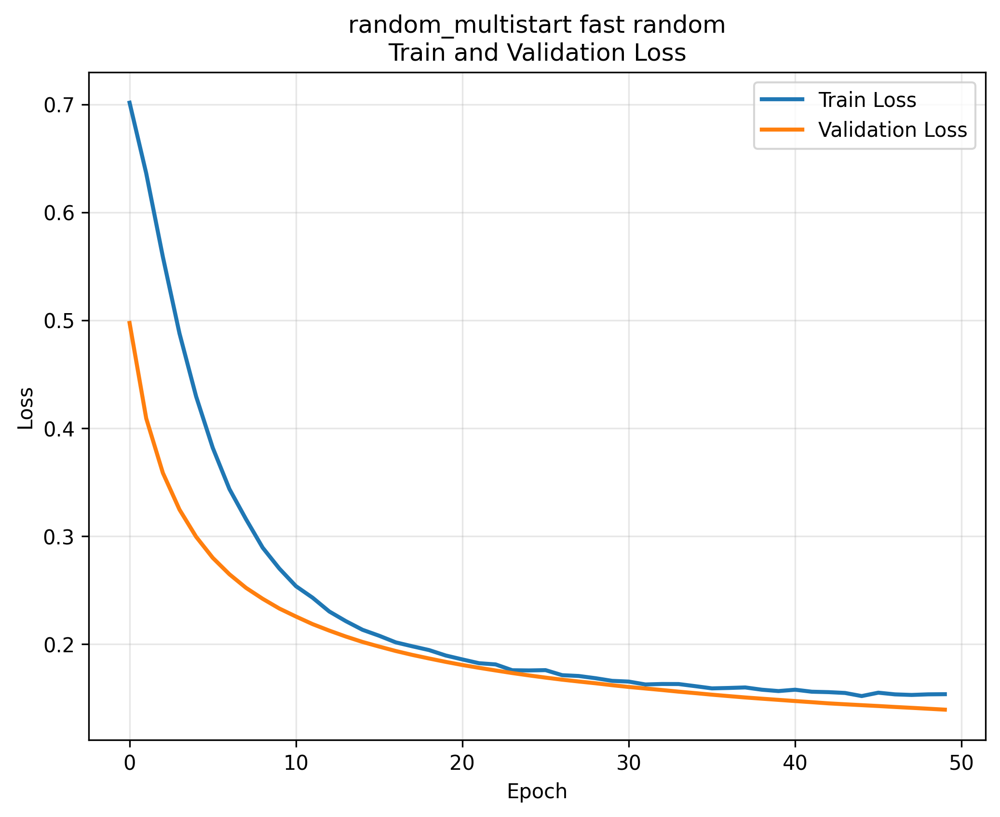
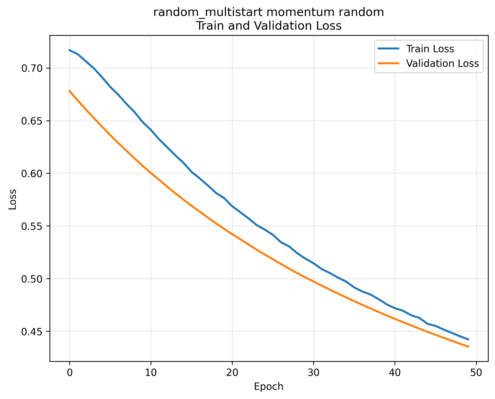
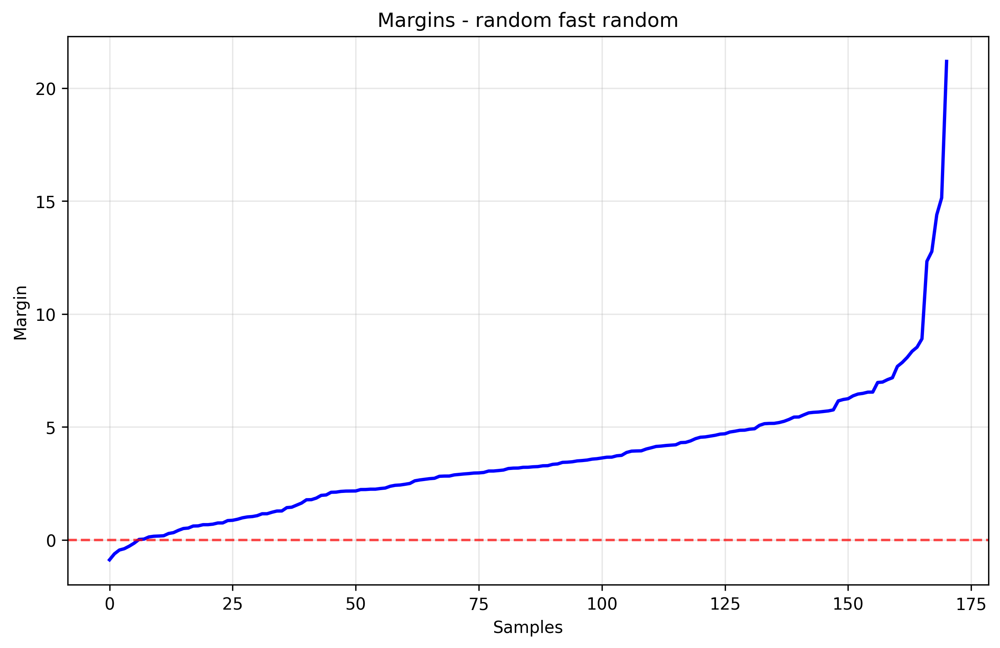
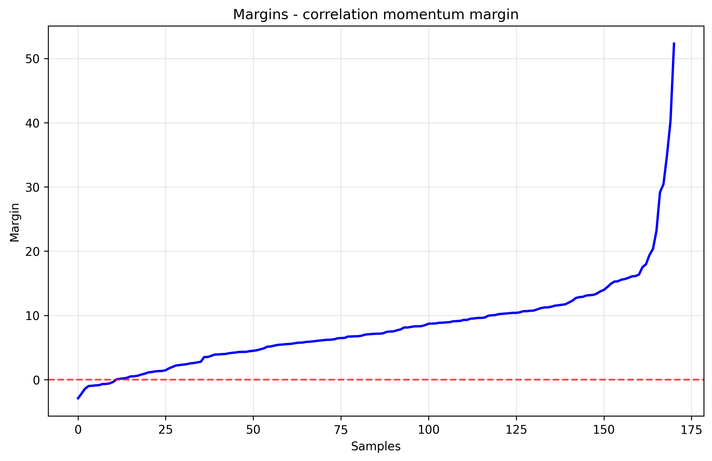

# Лабораторная работа №1
В рамках лабораторной работы предстоит реализовать линейный классификатор. И обучить его методом стохастического градиентного спуска с инерцией с L2 регуляризацией и квадратичной функцией потерь.
## Задание

1. выбрать датасет для классификации, например на [kaggle](https://www.kaggle.com/datasets?&tags=13304-Clustering);
2. реализовать вычисление отступа объекта (визуализировать, проанализировать);
3. реализовать вычисление градиента функции потерь;
4. реализовать рекуррентную оценку функционала качества;
5. реализовать метод стохастического градиентного спуска с инерцией;
6. реализовать L2 регуляризацию;
7. реализовать скорейший градиентный спуск;
8. реализовать предъявление объектов мо модулю отступа;
9. обучить линейный классификатор на выбранном датасете;
   1. обучить с инициализацией весов через корреляцию;
   2. обучить со случайной инициализацией весов через мультистарт;
   3. обучить со случайным предъявлением и с п.8;
10. оценить качество классификации;
11. сравнить лучшую реализацию с эталонной;
12. подготовить отчет.

## Отчет
В качестве датасета был использован стандартный датасет из sklearn для бинарной классификации: breast cancer 
В общей сложности было проведено 12 экспериментов с различными сочетаниями парметров:
1. Инициализация весов - случайная, через корреляцию или случайная+мультистарт
2. Предъявление объектов - случайное или по модулю отступа
3. Градиентный спуск - скорейший или с инерцией

В следующей таблице приведены рзультаты экспериментов с метриками accuracy, precision, recall и f1. Добавлен результат эталонной реализации алгоритма из sklearn

### Результаты экспериментов

|    | Method                            |   Accuracy |   Precision |   Recall |    F1 |
|---:|:----------------------------------|-----------:|------------:|---------:|------:|
|  0 | random momentum margin            |      0.918 |       0.943 |    0.925 | 0.934 |
|  1 | random momentum random            |      0.877 |       0.922 |    0.879 | 0.9   |
|  2 | random fast margin                |      0.953 |       0.981 |    0.944 | 0.962 |
|  3 | random fast random                |      0.965 |       0.981 |    0.963 | 0.972 |
|  4 | random_multistart momentum margin |      0.936 |       0.962 |    0.935 | 0.948 |
|  5 | random_multistart momentum random |      0.936 |       0.962 |    0.935 | 0.948 |
|  6 | random_multistart fast margin     |      0.965 |       0.981 |    0.963 | 0.972 |
|  7 | random_multistart fast random     |      0.965 |       0.981 |    0.963 | 0.972 |
|  8 | correlation momentum margin       |      0.936 |       0.944 |    0.953 | 0.949 |
|  9 | correlation momentum random       |      0.936 |       0.944 |    0.953 | 0.949 |
| 10 | correlation fast margin           |      0.959 |       0.981 |    0.953 | 0.967 |
| 11 | correlation fast random           |      0.959 |       0.981 |    0.953 | 0.967 |
| 12 | Sklearn SGD Classifier            |      0.959 |       0.955 |    0.981 | 0.968 |

Наилучший результат по f1 получился при использовании мультистарта со скорейшим градиентным спуском. Метрики незначительно превзошли эталонную реализцию

### Функции потерь
Была использована рекуррентная оценка логарифмической функции потерь

График функции потерь для наилучшей реализации

Пример графика потерь для эксперимента с меньшими метриками

### Отступы

Отступы для наилучшей реализации

На графике видно минимальное количество ошибок и выбросов

Пример графика отступов для другой реализации

На данном графике можно различить ошибки и выбросы
