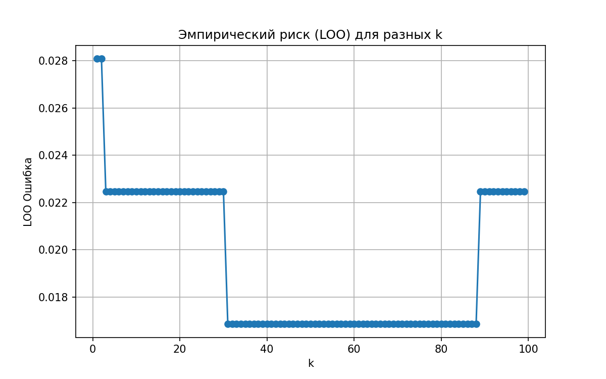
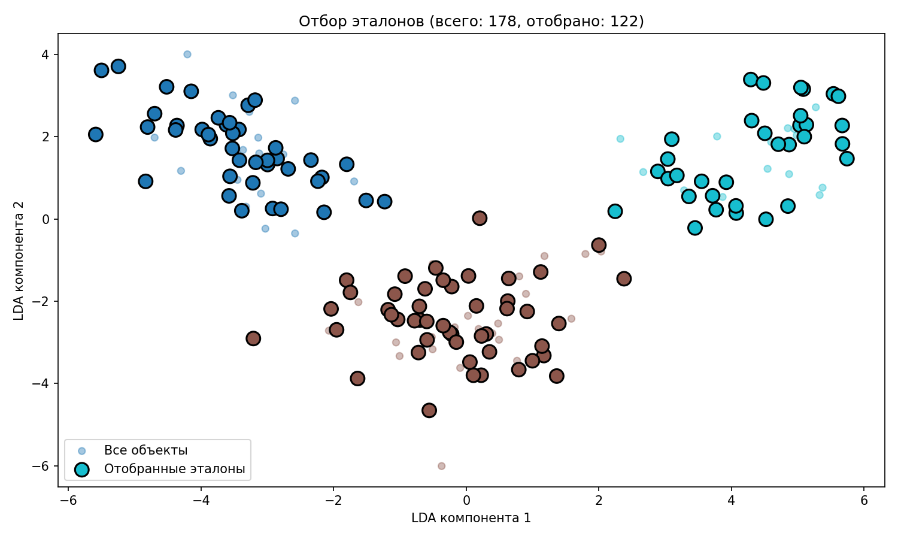

# Лабораторная работа №2

В рамках лабораторной работы предстоит реализовать алгоритм классификации KNN и подобрать параметр k методом скользящего контроля.

На лекции были рассмотрены следующие алгоритмы:
* алгоритм метрической классификации KNN;
* метод окна Парзена;
* алгоритм отбора эталонов.

## Задание

1. выбрать датасет для классификации, например на [kaggle](https://www.kaggle.com/datasets?tags=13302-Classification);
2. реализовать алгоритм KNN с методом окна Парзена переменной ширины;
   1. в качестве ядра можно использовать гауссово ядро;
3. подобрать параметр k методом скользящего контроля (LOO);
4. обосновать выбор параметров алгоритма, построить графики эмпирического риска для различных k;
5. сравнить с [эталонной](https://scikit-learn.org/stable/) реализацией KNN;
   1. сравнить качество работы алгоритмов;
6. реализовать алгоритм отбора эталонов;
7. подготовить визуализацию результатов работы алгоритма отбора эталонов;
8. сравнить качество работы KNN с и без отбора эталонов; 
9. подготовить небольшой отчет о проделанной работе.

## Отчет

Для экспериментов был использован датасет Wine:  
  - 178 объектов,  
  - 13 признаков,  
  - 3 класса.

К данным был применен StandartScaler для нормализации распределений признаков, что устраняет искажение расстояний из-за разных масштабов признаков

### Подбор k методом LOO

Оптимальное значение: k=31

График эмпирического риска для различных значений k

На графике риска видно плато с k=3 до k=30, после чего значение ошибки снижается

### Результаты

Реализация `ParzenWindowKNN` (k=31): 0.98 
Эталонная реализация `sklearn.neighbors.KNeighborsClassifier`: 0.98
Реализованный алгоритм показывает точность аналогичную эталонной реализации

### Отбор эталонов
Был реализован жадный отбор эталонов по критерию CCV. После применения алгоритма количество объектов в датасете сократилось с 124 до 122

После применения алгоритма точность классификатора не изменилась

Визуализация алгоритма отбора эталонов (приведена к двумерному виду методом LinearDiscriminantAnalysis)
