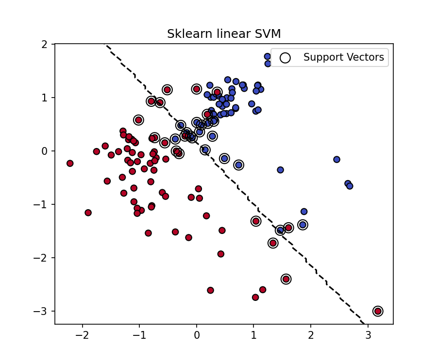
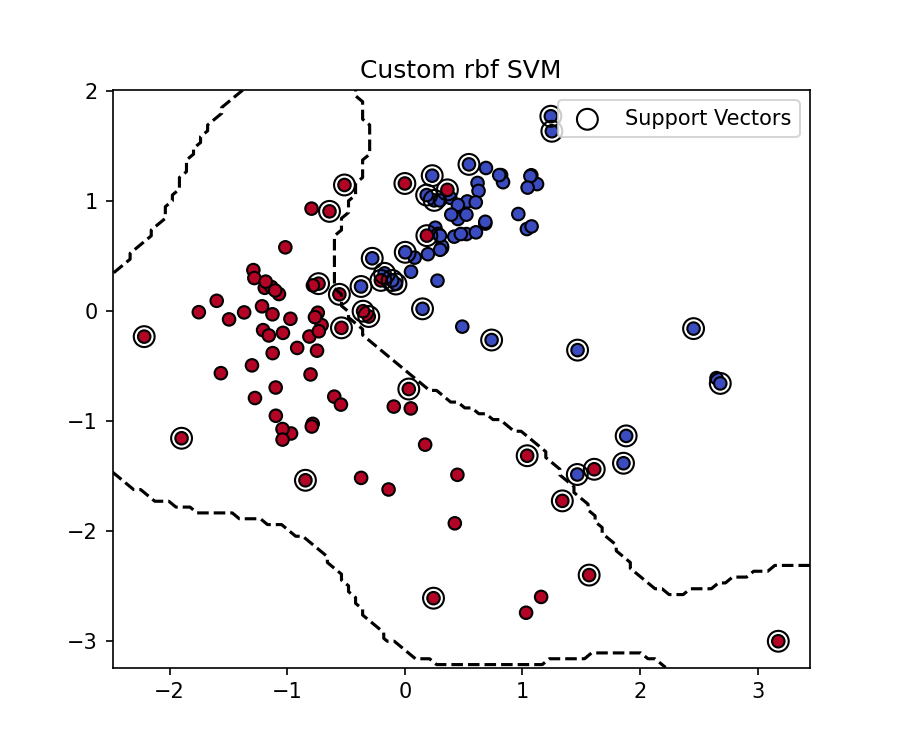
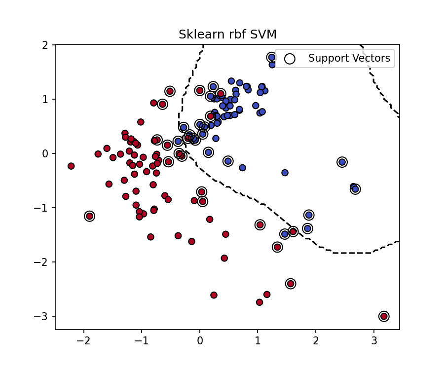
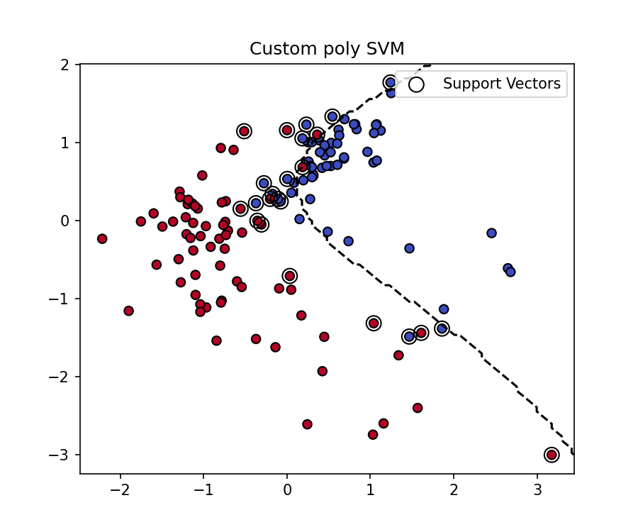
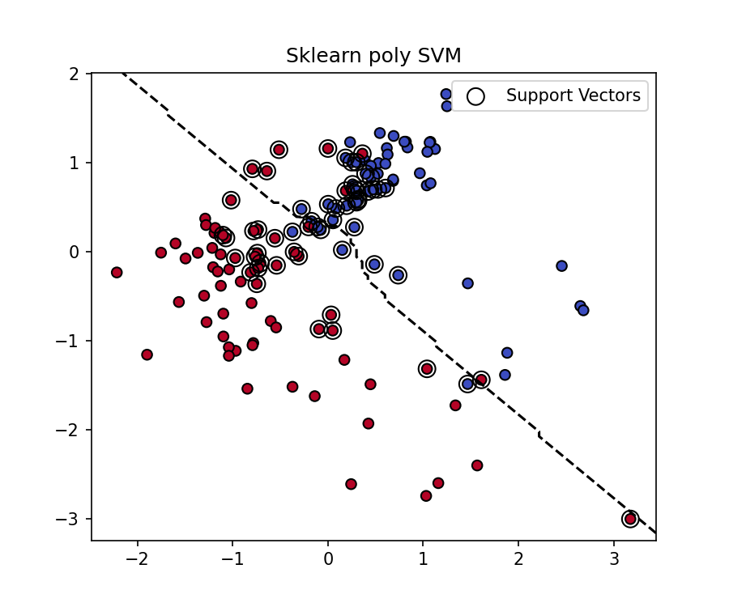

# Лабораторная работа №3

В рамках лабораторной работы предстоит реализовать SVM и сравнить с эталонной реализацией алгоритма.

## Теоретическая часть
На лекции рассмотрели две постановки задачи SVM: аналитическая и геометрическая. Показали, как геометрическая постановка приводит к задаче квадратичного программирования. Рассмотрели решение двойственной задачи по лямбда. Показали, как с помощью трюка с ядром можно строить нелинейные классификаторы. Рассмотрели различные ядра и их свойства. Рассмотрели различные способы регуляризации и их влияние на отбор признаков.

## Задание
- выбрать датасет для бинарной классификации;
- реализовать решение двойственной задачи по лямбда; для решения задачи использовать scipy.optimize.minimize или любую другую библиотеку;
- провернуть трюк с ядром;
- построить линейный классификатор;
- визуализировать решение;
- сравнить с эталонным решением;

## Отчет

Был использован датасет Wine с выборкой из 2 классов. Данные были нормализованы и приведены к 2D через PCA

Реализован SVM классификатор в 3 вариантах: линейный, с полиномиальным ядром, с радиально-базисной функцией

### Линейный классификатор
Точность: 0.949 
Визуализация границы разделения: 

Точность эталонной реализации из sklearn: 0.974 
Визуализация границы разделения (эталонная реализация): 

### Радиально-базисная функция
Точность: 1.0 
Визуализация границы разделения: 

Точность эталонной реализации из sklearn: 0.949 
Визуализация границы разделения (эталонная реализация): 

### Полиномиальное ядро
Точность: 0.821 
Визуализация границы разделения: 

Точность эталонной реализации из sklearn: 0.897 
Визуализация границы разделения (эталонная реализация): 

## Вывод
Наилучший результат достигнут при использовании радиально-базисной функции (превосходит эталонную реализацию из sklearn). Линейный классификатор на втором месте, с точностью немного уступающей эталонной реализации