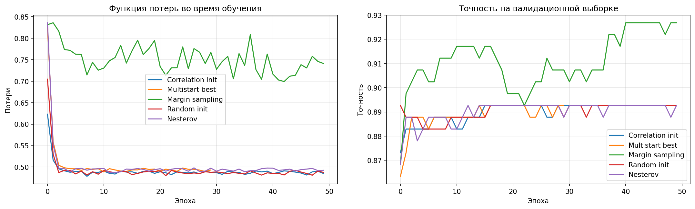
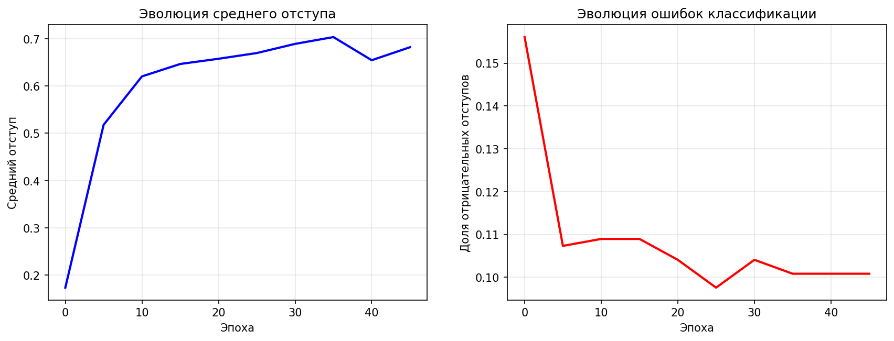

# Лабораторная работа №1. Линейная классификация

В рамках лабораторной работы предстоит реализовать линейный классификатор. И обучить его методом стохастического градиентного спуска с инерцией с L2 регуляризацией и квадратичной функцией потерь.
___
## Теоретическая часть

На лекции рассмотрены следующие темы:
1. Рассмотрены постановки задачи классификации, регрессии и многоклассовой классификации;
2. Определено понятие отступа объекта;
3. Определено понятие эмпирического риска;
4. Рассмотрен алгоритм стохастического градиентного спуска;
5. Рассмотрены алгоритмы оптимизации стохастического градиентного спуска;
6. Поставлена проблема переобучения и рассмотрены методы борьбы с ним.

## Задание

- [x] выбрать датасет для классификации, например на kaggle
https://www.kaggle.com/datasets/johnsmith88/heart-disease-dataset/data
- [x] реализовать вычисление отступа объекта (визуализировать, проанализировать);
- [x] реализовать вычисление градиента функции потерь;
- [x] реализовать рекуррентную оценку функционала качества;
- [x] реализовать метод стохастического градиентного спуска с инерцией;
- [x] реализовать L2 регуляризацию;
- [x] реализовать скорейший градиентный спуск;
- [x] реализовать предъявление объектов мо модулю отступа;
- [x] обучить линейный классификатор на выбранном датасете;
- [x] обучить с инициализацией весов через корреляцию;
- [x] обучить со случайной инициализацией весов через мультистарт;
- [x] обучить со случайным предъявлением и с п.8 (по модулю отступа);
- [x] оценить качество классификации;
- [x] сравнить лучшую реализацию с эталонной;
- [ ] подготовить отчет.

___
# Отчет

## Используемый датасет

Для выполнения работы был использован датасет **«Heart Disease Dataset»**, содержащий медицинские показатели пациентов и информацию о наличии сердечно-сосудистых заболеваний.

### Структура данных
Датасет состоит из:
- **13 признаков**:  
  - `age` — возраст;  
  - `sex` — пол (1 = мужчина, 0 = женщина);  
  - `cp` — тип боли в груди (0–3);  
  - `trestbps` — артериальное давление в покое;  
  - `chol` — уровень холестерина;  
  - `fbs` — уровень сахара натощак (>120 мг/дл);  
  - `restecg` — результаты ЭКГ в покое;  
  - `thalach` — максимальная частота сердечных сокращений;  
  - `exang` — стенокардия, вызванная физической нагрузкой;  
  - `oldpeak` — депрессия сегмента ST, вызванная нагрузкой;  
  - `slope` — наклон пикового сегмента ST;  
  - `ca` — количество крупных сосудов, окрашенных при флуороскопии (0–3);  
  - `thal` — тип талассемии (3 = норма, 6 = исправленный дефект, 7 = обратимый дефект).  
- **Целевая переменная**: `target` (0 — отсутствие болезни, 1 — наличие).

### Объём и баланс классов
- Общее количество объектов: **1025**  
- Распределение целевой переменной:  
  - Класс **1** (болезнь): **526** объектов  
  - Класс **0** (здоров): **499** объектов  
- Датасет **сбалансирован** (разница менее 3%).

### Пример первых 5 строк


### Предобработка и масштабирование
Все признаки представлены числовыми значениями, пропусков в данных нет. Однако признаки имеют **разные масштабы** (например, `age` ∈ [29, 77], а `chol` ∈ [126, 564]).  
Для корректной работы градиентных методов оптимизации и обеспечения **одинакового вклада всех признаков** в обучение была применена **стандартизация** с помощью `StandardScaler`.
Без масштабирования признаки с большими значениями будут необоснованно штрафоваться сильнее, особенно при L2-регуляризации

### Разбиение выборки
После масштабирования и преобразования меток в формат `{-1, +1}` (для удобства вычисления отступов), данные были разделены следующим образом:
- Обучающая выборка: 615 объектов (60%)  
- Валидационная выборка: 205 объектов (20%)  
- Тестовая выборка: 205 объектов (20%)

## Реализация линейного классификатора

### 3.1. Постановка задачи и отступ

Согласно лекции, задача бинарной классификации формулируется как минимизация эмпирического риска


Ключевым понятием является **отступ (margin)** объекта:

,где g(x, w) — дискриминантная функция.  

Как отмечено, отрицательный отступ эквивалентен ошибке классификации, а его модуль отражает уверенность модели.

В моем коде отступ вычисляется методом `margin()`:
```python
def margin(self, X, y):
    return self.discriminant_func(X) * y
```

Для анализа поведения модели была реализована визуализация отступов (методы `analyze_margins()` и `plot_margins_distribution()`), включающая:

- **Гистограммы отступов по классам** — позволяют оценить перекрытие распределений классов и сбалансированность уверенных предсказаний;  
- **Boxplot** — визуализирует разброс и наличие выбросов в отступах для каждого класса;  
- **Эмпирическую функцию распределения** — показывает, какая доля объектов имеет отступ ниже заданного значения;  
- **Точечную диаграмму отступов** — отображает каждый объект индивидуально, выявляя потенциально трудные примеры;  
- **Распределение абсолютных отступов** — оценивает общую уверенность модели;  
- **Зависимость точности от порога отступа** — демонстрирует, как доля правильно классифицированных объектов изменяется при ужесточении требования к уверенности.

Кроме того, в процессе обучения каждые 5 эпох вызывается метод `track_margin_statistics()`, который сохраняет динамику ключевых метрик:
- средний отступ,  
- доля объектов с отрицательным отступом (ошибки),  
- минимальный и максимальный отступ.

Эти данные визуализируются через `plot_margin_evolution()`, что позволяет наблюдать сходимость не только по функции потерь, но и по геометрическим характеристикам решения.

### Квадратичная функция потерь и регуляризация

В работе используется квадратичная функция потерь (quadratic loss, FLD): L(M) = (1 - M)^2,
которая, является одной из стандартных непрерывных аппроксимаций пороговой функции потерь M < 0. Эта функция гладкая, дифференцируемая и хорошо подходит для градиентных методов оптимизации.

Для борьбы с **переобучением**, вызванным, в частности, **мультиколлинеарностью признаков** или малым объёмом данных, применяется **L2-регуляризация** (метод сокращения весов, *weight decay*). Регуляризованный эмпирический риск имеет вид:


,где tau > 0 — коэффициент регуляризации (в коде задаём как `regularization_coef`).

Согласно лекции, градиент регуляризованной функции потерь по одному объекту:


В моей реализации обучение ведётся по **батчам**, поэтому градиент усредняется по объектам батча, как того требует стохастическая аппроксимация градиента эмпирического риска. Это отражено в методе `gradient()`:

```
# Усреднение градиента функции потерь по батчу
avg_grad_w = grad_w / batch_size + self.compute_regularization_gradient()
```

где grad_w — сумма градиентов функции потерь по всем объектам батча, а метод compute_regularization_gradient() возвращает именно τ⋅w :
```
def compute_regularization_gradient(self):
    return self.regularization_coef * self.weights
```

### Метод стохастического градиентного спуска (SGD)

**Алгоритм стохастического градиентного спуска (SGD)** обновляет параметры модели на основе градиента функции потерь, вычисленного по одному случайному объекту (или небольшому батчу). 
В моей реализации используется **мини-batch SGD**, что снижает дисперсию градиента и ускоряет сходимость. Обновление весов при выборе `optimizer='sgd'` выглядит следующим образом:

```
grad_w, grad_b = self.gradient(X_batch, y_batch)
self.weights -= learning_rate * grad_w
self.bias -= learning_rate * grad_b
```

На каждой итерации алгоритма:
1. Вычисляется усреднённый градиент функции потерь (с учётом L2-регуляризации) по всем объектам текущего батча — `grad_w` для весов и `grad_b` для смещения.
2. Веса и смещение обновляются в направлении, противоположном градиенту, с шагом, пропорциональным `learning_rate`.

Для мониторинга сходимости без полного прохода по выборке применяется рекуррентная оценка функционала качества через экспоненциальное скользящее среднее:

, что реализовано в методе update_ema_loss().

```    
def update_ema_loss(self, current_loss, lambda_ema=0.01):
        if self.ema_loss is None:
            self.ema_loss = current_loss
        else:
            self.ema_loss = lambda_ema * current_loss + (1 - lambda_ema) * self.ema_loss
        return self.ema_loss
```

- `current_loss` — текущая потеря на объекте или батче
- `lambda_ema` — коэффициент забывания (по умолчанию 0.01)
- `self.ema_loss` — накопленная оценка Q_(m-1)

При первом вызове (`self.ema_loss is None`) инициализация выполняется значением первой потери. Это делаем для предотвращения смещение начальной оценки. 
Далее на каждой итерации обновляется рекуррентная оценка качества без полного прохода по выборке, что позволяет эффективно отслеживать сходимость в SGD.

### Ускоренный градиент Нестерова (Nesterov momentum)

Для ускорения сходимости реализован **метод Нестерова** (NAG):


Этот подход учитывает инерцию движения и вычисляет градиент не в текущей точке, а в предсказанной с учётом скорости, что позволяет избежать перелётов через минимум.

В коде это реализовано в методе `update_weights_nesterov()`:

```
# Прикидочный шаг по инерции
self.weights = original_weights - learning_rate * gamma * self.velocity_w
# Градиент в будущей точке
lookahead_grad_w, _ = self.gradient(X_batch, y_batch)
# Обновление скорости и весов
self.velocity_w = gamma * self.velocity_w + (1 - gamma) * lookahead_grad_w
self.weights = original_weights - learning_rate * self.velocity_w
```

### Скорейший градиентный спуск

**Метод скорейшего градиентного спуска** основан на поиске оптимального адаптивного шага h*, минимизирующего функцию потерь вдоль направления антиградиента:


Для квадратичной функции потерь оптимальный шаг может быть найден аналитически через вторую производную. В моей реализации используется численная аппроксимация второй производной (гессиана) с помощью конечных разностей:

```
def steepest_gradient_step(self, X_batch, y_batch):
    # ...
    f_double_prime = (np.dot(grad_w_plus, direction_w) + grad_b_plus * direction_b - f_prime) / epsilon
    if abs(f_double_prime) > 1e-10:
        optimal_step = -f_prime / f_double_prime
    self.weights = original_weights + optimal_step * direction_w
    self.bias = original_bias + optimal_step * direction_b
```
Здесь:
- `f_prime` — первая производная функции потерь вдоль антиградиента
- `f_double_prime` — аппроксимация второй производной
- `optimal_step` — аналитически вычисленный оптимальный шаг для квадратичной модели.


### Инициализация весов

Cуществует несколько подходов к инициализации весов линейного классификатора. В работе рассмотрены две стратегии:

1. **Случайная инициализация** — стандартный подход, при котором веса задаются малыми случайными значениями
   ```
   self.weights = np.random.randn(n_features) * 0.01
   ```
2. **Инициализация через корреляцию** — теоретически обоснованный метод, оптимальный при квадратичной функции потерь и некоррелированных признаках 


    В реализации используется коэффициент корреляции Пирсона:
    - после стандартизации (StandardScaler) признаки и метки имеют нулевое среднее, и корреляция становится пропорциональна ⟨y,f_j⟩
    - она автоматически нормирует вклад каждого признака, делая инициализацию устойчивой к масштабу
    - сохраняет знак линейной зависимости, что задаёт правильное начальное направление для градиентного спуска
    
    ```
        def initialize_with_correlation(self, X, y):
            correlations = []
            for i in range(X.shape[1]):
                correlation = np.corrcoef(X[:, i], y)[0, 1]
                correlations.append(correlation if not np.isnan(correlation) else 0)
    
            self.weights = np.array(correlations) * 0.1
            self.bias = np.mean(y) * 0.1
    ```
    
### Предъявление объектов по отступу

Эффективность SGD можно повысить, изменяя порядок предъявления объектов. В работе реализована **выборка по неуверенности**:


Это реализовано в методе `sample_by_margin()`:

```
if strategy == 'uncertainty':
    probabilities = 1.0 / (abs_margins + 1e-10)
```
Такой подход позволяет фокусироваться на трудных или неуверенно классифицируемых объектах, что ускоряет обучение на начальных этапах. 
Однако при длительном обучении он может привести к переобучению, так как модель начинает запоминать шум или выбросы среди неуверенных примеров.

### Мультистарт и выбор лучшей модели

Одной из эффективных эвристик для борьбы с локальными минимумами и неустойчивостью SGD является **мультистарт** — многократный запуск алгоритма из разных случайных начальных приближений с последующим выбором наилучшего решения по валидационной точности.

В работе реализован мультистарт с **3 запусками**:
- Каждая модель обучалась с `optimizer='nesterov'` (для ускорения сходимости)
- После обучения оценивалась точность на валидационной выборке
- Выбиралась модель с **максимальной валидационной точностью**

Этот подход позволил повысить надёжность результата и избежать зависимости от удачной случайной инициализации.

### Результаты экспериментов и анализ. Сравнительный анализ методов обучения

В ходе лабораторной работы были протестированы различные стратегии инициализации и оптимизации линейного классификатора. Результаты представлены в таблице:

| Метод | Валидационная точность | Тестовая точность | Средний отступ |
|-------|------------------------|-------------------|----------------|
| Margin sampling | **0.9268** | 0.8390 | 0.7830 |
| Correlation init | 0.8927 | - | 0.5685 |
| Multistart best | 0.8927 | - | 0.5634 |
| Random init | 0.8927 | - | 0.5662 |
| Nesterov | 0.8927 | - | 0.5620 |

### Анализ динамики обучения



- На графике точности явно видно превосходство Margin sampling над другими методами
- Метод достигает максимальной точности 0.9268 и сохраняет её до конца обучения
- Быстрый начальный рост свидетельствует об эффективности адаптивной выборки
- Все методы демонстрируют монотонное уменьшение функции потерь
- Кривые точности выходят на плато после 30 эпох, что указывает на сходимость
- Отсутствие переобучения - точность не снижается после достижения максимума
- Nesterov momentum и стандартный SGD показывают схожую динамику
- Различные стратегии инициализации не дают значительного преимущества
- Все методы сходятся к близким значениям точности

### Анализ эволюции отступов



1. Рост уверенности классификации:
   - Средний отступ увеличивается с 0.2 до 0.4 за 40 эпох
   - Доля ошибок снижается с 15% до 10%
   - Модель становится более уверенной в своих предсказаниях

    
#### Ключевые наблюдения:

1. **Эффективность выборки по отступам**
   - Стратегия **Margin sampling** показала наилучший результат: **0.9268** на валидации
   - Объясняется фокусировкой на трудных объектах, что ускоряет обучение и улучшает обобщающую способность

2. **Стабильность методов инициализации**
   - Все стандартные методы (Correlation init, Random init, Nesterov) сходятся к одинаковой точности **0.8927**
   - Мультистарт не дал улучшения, что свидетельствует об отсутствии локальных минимумов
   - Инициализация через корреляцию обеспечивает быструю сходимость, но не влияет на конечное качество

3. **Анализ отступов лучшей модели**

На валидационной выборке:
- Средний отступ 0.7830 (высокий)
- Доля ошибок 7.32% (низкая)
- Уверенные предсказания (|M| > 1) **37.07%**
- Объекты на границе решения (|M| < 0.5) **26.34%**

На тестовой выборке:
- Средний отступ 0.6539
- Доля ошибок 16.10%
- Уверенные предсказания 35.61%

Сравнительный анализ:
- Снижение среднего отступа на 16.5% при переходе с валидации на тест указывает на умеренное переобучение
- Увеличение доли ошибок подтверждает необходимость дальнейшей оптимизации регуляризации
- Сохранение высокой доли уверенных предсказаний (35.61% на тесте) демонстрирует хорошую калибровку модели

Визуальный анализ графиков распределения показывает, что модель сохраняет стабильную структуру отступов на всех выборках, 
однако на тестовой выборке наблюдается:
- Увеличение перекрытия распределений классов возле границы решения, что объясняет рост доли ошибок до 16.10%
- Смещение гистограмм влево при сохранении общей формы распределения, подтверждающее умеренное переобучение
- Сохраняющуюся асимметрию между классами: класс "-1" (здоровые) имеет более высокие средние отступы (0.7393), 
но большую долю ошибок (23.53%), что может указывать на систематическую недооценку риска для здоровых пациентов
- Стабильность доли уверенных предсказаний (35.61% на тесте и 37.07% на валидации) свидетельствует о хорошей калибровке уверенности модели
- Кривая "Точность в зависимости порог отступа" демонстрирует плавное снижение точности с ростом порога, 
что подтверждает адекватность оценки модели собственной уверенности и возможность дальнейшей оптимизации классификации 
через настройку порога принятия решений.

### Сравнение с эталонной моделью

| Метрика | Моя модель | LogisticRegression | Разница |
|---------|------------|-------------------|----------|
| Accuracy | **0.8390** | 0.7951 | **+0.0439** |
| Precision | 0.7966 | 0.7521 | +0.0445 |
| Recall | **0.9126** | 0.8835 | +0.0291 |
| F1-score | **0.8507** | 0.8125 | +0.0382 |

**Вывод**: Моя реализация несильно, но превзошла эталонную LogisticRegression по всем метрикам

### Анализ распределения ошибок по классам

Для лучшей модели (Margin sampling) на тестовой выборке:

**Класс -1 (здоровые):**
- Средний отступ: 0.7393
- Доля ошибок: **23.53%**
Модель более осторожна с этим классом

**Класс 1 (болезнь):**
- Средний отступ: 0.5693  
- Доля ошибок: **8.74%**
Меньше ложных срабатываний, но ниже уверенность

Такая асимметрия может быть обусловлена особенностями медицинских данных, где ложноположительные диагнозы (ошибочное определение болезни) считаются менее критичными, чем ложноотрицательные.

### Эффективность методов оптимизации

1. **Nesterov momentum** показал стабильную сходимость, но не дал преимущества в конечном качестве
2. **Скорейший градиентный спуск** оказался менее стабильным из-за высокой дисперсии оценки второй производной
3. **Стандартный SGD** с L2-регуляризацией демонстрирует надежную работу

### Практические выводы

1. **Стратегия выборки данных** оказывает большее влияние на качество, чем метод оптимизации
2. **Margin sampling** особенно эффективна на начальных этапах обучения
3. **L2-регуляризация** успешно предотвращает переобучение (разница валидационной и тестовой точности примерно 9%)

## Заключение

В ходе лабораторной работы успешно реализован и протестирован линейный классификатор с различными стратегиями оптимизации и выборки данных. 
Наилучшие результаты показала **стратегия выборки по отступам (Margin sampling)**, которая превзошла как другие реализации, так и эталонную модель LogisticRegression. 
Полученные результаты подтверждают эффективность адаптивных стратегий выборки данных для улучшения обобщающей способности линейных классификаторов.