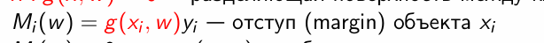

# Лабораторная работа №1. Линейная классификация

В рамках лабораторной работы предстоит реализовать линейный классификатор. И обучить его методом стохастического градиентного спуска с инерцией с L2 регуляризацией и квадратичной функцией потерь.
___
## Теоретическая часть

На лекции рассмотрены следующие темы:
1. Рассмотрены постановки задачи классификации, регрессии и многоклассовой классификации;
2. Определено понятие отступа объекта;
3. Определено понятие эмпирического риска;
4. Рассмотрен алгоритм стохастического градиентного спуска;
5. Рассмотрены алгоритмы оптимизации стохастического градиентного спуска;
6. Поставлена проблема переобучения и рассмотрены методы борьбы с ним.

## Задание

- [x] выбрать датасет для классификации, например на kaggle
https://www.kaggle.com/datasets/johnsmith88/heart-disease-dataset/data
- [x] реализовать вычисление отступа объекта (визуализировать, проанализировать);
- [x] реализовать вычисление градиента функции потерь;
- [x] реализовать рекуррентную оценку функционала качества;
- [x] реализовать метод стохастического градиентного спуска с инерцией;
- [x] реализовать L2 регуляризацию;
- [x] реализовать скорейший градиентный спуск;
- [x] реализовать предъявление объектов мо модулю отступа;
- [x] обучить линейный классификатор на выбранном датасете;
- [x] обучить с инициализацией весов через корреляцию;
- [x] обучить со случайной инициализацией весов через мультистарт;
- [x] обучить со случайным предъявлением и с п.8 (по модулю отступа);
- [x] оценить качество классификации;
- [x] сравнить лучшую реализацию с эталонной;
- [x] подготовить отчет.

___
# Отчет

## Используемый датасет

Для выполнения работы был использован датасет **«Heart Disease Dataset»**, содержащий медицинские показатели пациентов и информацию о наличии сердечно-сосудистых заболеваний.

### Структура данных
Датасет состоит из:
- **13 признаков**:  
  - `age` — возраст;  
  - `sex` — пол (1 = мужчина, 0 = женщина);  
  - `cp` — тип боли в груди (0–3);  
  - `trestbps` — артериальное давление в покое;  
  - `chol` — уровень холестерина;  
  - `fbs` — уровень сахара натощак (>120 мг/дл);  
  - `restecg` — результаты ЭКГ в покое;  
  - `thalach` — максимальная частота сердечных сокращений;  
  - `exang` — стенокардия, вызванная физической нагрузкой;  
  - `oldpeak` — депрессия сегмента ST, вызванная нагрузкой;  
  - `slope` — наклон пикового сегмента ST;  
  - `ca` — количество крупных сосудов, окрашенных при флуороскопии (0–3);  
  - `thal` — тип талассемии (3 = норма, 6 = исправленный дефект, 7 = обратимый дефект).  
- **Целевая переменная**: `target` (0 — отсутствие болезни, 1 — наличие).

### Объём и баланс классов
- Общее количество объектов: **1025**  
- Распределение целевой переменной:  
  - Класс **1** (болезнь): **526** объектов  
  - Класс **0** (здоров): **499** объектов  
- Датасет **сбалансирован** (разница менее 3%).

### Пример первых 5 строк


### Предобработка и масштабирование
Все признаки представлены числовыми значениями, пропусков в данных нет. Однако признаки имеют **разные масштабы** (например, `age` ∈ [29, 77], а `chol` ∈ [126, 564]).  
Для корректной работы градиентных методов оптимизации и обеспечения **одинакового вклада всех признаков** в обучение была применена **стандартизация** с помощью `StandardScaler`.
Без масштабирования признаки с большими значениями будут необоснованно штрафоваться сильнее, особенно при L2-регуляризации

### Разбиение выборки
После масштабирования и преобразования меток в формат `{-1, +1}` (для удобства вычисления отступов), данные были разделены следующим образом:
- Обучающая выборка: 615 объектов (60%)  
- Валидационная выборка: 205 объектов (20%)  
- Тестовая выборка: 205 объектов (20%)

## Реализация линейного классификатора

### 3.1. Постановка задачи и отступ

Согласно лекции, задача бинарной классификации формулируется как минимизация эмпирического риска


Ключевым понятием является **отступ (margin)** объекта:

,где g(x, w) — дискриминантная функция.  

Как отмечено, отрицательный отступ эквивалентен ошибке классификации, а его модуль отражает уверенность модели.

В моем коде отступ вычисляется методом `margin()`:
```python
def margin(self, X, y):
    return self.discriminant_func(X) * y
```

Для анализа поведения модели была реализована визуализация отступов (методы `analyze_margins()` и `plot_margins_distribution()`), включающая:

- **Гистограммы отступов по классам** — позволяют оценить перекрытие распределений классов и сбалансированность уверенных предсказаний;  
- **Boxplot** — визуализирует разброс и наличие выбросов в отступах для каждого класса;  
- **Эмпирическую функцию распределения** — показывает, какая доля объектов имеет отступ ниже заданного значения;  
- **Точечную диаграмму отступов** — отображает каждый объект индивидуально, выявляя потенциально трудные примеры;  
- **Распределение абсолютных отступов** — оценивает общую уверенность модели;  
- **Зависимость точности от порога отступа** — демонстрирует, как доля правильно классифицированных объектов изменяется при ужесточении требования к уверенности.

Кроме того, в процессе обучения каждые 5 эпох вызывается метод `track_margin_statistics()`, который сохраняет динамику ключевых метрик:
- средний отступ,  
- доля объектов с отрицательным отступом (ошибки),  
- минимальный и максимальный отступ.

Эти данные визуализируются через `plot_margin_evolution()`, что позволяет наблюдать сходимость не только по функции потерь, но и по геометрическим характеристикам решения.

### Квадратичная функция потерь и регуляризация

В работе используется квадратичная функция потерь (quadratic loss, FLD): L(M) = (1 - M)^2,
которая, является одной из стандартных непрерывных аппроксимаций пороговой функции потерь M < 0. Эта функция гладкая, дифференцируемая и хорошо подходит для градиентных методов оптимизации.

Для борьбы с **переобучением**, вызванным, в частности, **мультиколлинеарностью признаков** или малым объёмом данных, применяется **L2-регуляризация** (метод сокращения весов, *weight decay*). Регуляризованный эмпирический риск имеет вид:


,где tau > 0 — коэффициент регуляризации (в коде задаём как `regularization_coef`).

Согласно лекции, градиент регуляризованной функции потерь по одному объекту:


В моей реализации обучение ведётся по **батчам**, поэтому градиент усредняется по объектам батча, как того требует стохастическая аппроксимация градиента эмпирического риска. Это отражено в методе `gradient()`:

```
# Усреднение градиента функции потерь по батчу
avg_grad_w = grad_w / batch_size + self.compute_regularization_gradient()
```

где grad_w — сумма градиентов функции потерь по всем объектам батча, а метод compute_regularization_gradient() возвращает именно τ⋅w :
```
def compute_regularization_gradient(self):
    return self.regularization_coef * self.weights
```

### Метод стохастического градиентного спуска (SGD)

**Алгоритм стохастического градиентного спуска (SGD)** обновляет параметры модели на основе градиента функции потерь, вычисленного по одному случайному объекту (или небольшому батчу). 
В моей реализации используется **мини-batch SGD**, что снижает дисперсию градиента и ускоряет сходимость. Обновление весов при выборе `optimizer='sgd'` выглядит следующим образом:

```
grad_w, grad_b = self.gradient(X_batch, y_batch)
self.weights -= learning_rate * grad_w
self.bias -= learning_rate * grad_b
```

На каждой итерации алгоритма:
1. Вычисляется усреднённый градиент функции потерь (с учётом L2-регуляризации) по всем объектам текущего батча — `grad_w` для весов и `grad_b` для смещения.
2. Веса и смещение обновляются в направлении, противоположном градиенту, с шагом, пропорциональным `learning_rate`.

Для мониторинга сходимости без полного прохода по выборке применяется рекуррентная оценка функционала качества через экспоненциальное скользящее среднее:

, что реализовано в методе update_ema_loss().

```    
def update_ema_loss(self, current_loss, lambda_ema=0.01):
        if self.ema_loss is None:
            self.ema_loss = current_loss
        else:
            self.ema_loss = lambda_ema * current_loss + (1 - lambda_ema) * self.ema_loss
        return self.ema_loss
```

- `current_loss` — текущая потеря на объекте или батче
- `lambda_ema` — коэффициент забывания (по умолчанию 0.01)
- `self.ema_loss` — накопленная оценка Q_(m-1)

При первом вызове (`self.ema_loss is None`) инициализация выполняется значением первой потери. Это делаем для предотвращения смещение начальной оценки. 
Далее на каждой итерации обновляется рекуррентная оценка качества без полного прохода по выборке, что позволяет эффективно отслеживать сходимость в SGD.

### Ускоренный градиент Нестерова (Nesterov momentum)

Для ускорения сходимости реализован **метод Нестерова** (NAG):


Этот подход учитывает инерцию движения и вычисляет градиент не в текущей точке, а в предсказанной с учётом скорости, что позволяет избежать перелётов через минимум.

В коде это реализовано в методе `update_weights_nesterov()`:

```
# Прикидочный шаг по инерции
self.weights = original_weights - learning_rate * gamma * self.velocity_w
# Градиент в будущей точке
lookahead_grad_w, _ = self.gradient(X_batch, y_batch)
# Обновление скорости и весов
self.velocity_w = gamma * self.velocity_w + (1 - gamma) * lookahead_grad_w
self.weights = original_weights - learning_rate * self.velocity_w
```

### Скорейший градиентный спуск

**Метод скорейшего градиентного спуска** основан на поиске оптимального адаптивного шага h*, минимизирующего функцию потерь вдоль направления антиградиента:


Для квадратичной функции потерь оптимальный шаг может быть найден аналитически через вторую производную. В моей реализации используется численная аппроксимация второй производной (гессиана) с помощью конечных разностей:

```
def steepest_gradient_step(self, X_batch, y_batch):
    # ...
    f_double_prime = (np.dot(grad_w_plus, direction_w) + grad_b_plus * direction_b - f_prime) / epsilon
    if abs(f_double_prime) > 1e-10:
        optimal_step = -f_prime / f_double_prime
    self.weights = original_weights + optimal_step * direction_w
    self.bias = original_bias + optimal_step * direction_b
```
Здесь:
- `f_prime` — первая производная функции потерь вдоль антиградиента
- `f_double_prime` — аппроксимация второй производной
- `optimal_step` — аналитически вычисленный оптимальный шаг для квадратичной модели.


### Инициализация весов

Cуществует несколько подходов к инициализации весов линейного классификатора. В работе рассмотрены две стратегии:

1. **Случайная инициализация** — стандартный подход, при котором веса задаются малыми случайными значениями
   ```
   self.weights = np.random.randn(n_features) * 0.01
   ```
2. **Инициализация через корреляцию** — теоретически обоснованный метод, оптимальный при квадратичной функции потерь и некоррелированных признаках 


    В реализации используется коэффициент корреляции Пирсона:
    - после стандартизации (StandardScaler) признаки и метки имеют нулевое среднее, и корреляция становится пропорциональна ⟨y,f_j⟩
    - она автоматически нормирует вклад каждого признака, делая инициализацию устойчивой к масштабу
    - сохраняет знак линейной зависимости, что задаёт правильное начальное направление для градиентного спуска
    
    ```
        def initialize_with_correlation(self, X, y):
            correlations = []
            for i in range(X.shape[1]):
                correlation = np.corrcoef(X[:, i], y)[0, 1]
                correlations.append(correlation if not np.isnan(correlation) else 0)
    
            self.weights = np.array(correlations) * 0.1
            self.bias = np.mean(y) * 0.1
    ```
    
### Предъявление объектов по отступу

Эффективность SGD можно повысить, изменяя порядок предъявления объектов. В работе реализована **выборка по неуверенности**:


Это реализовано в методе `sample_by_margin()`:

```
if strategy == 'uncertainty':
    probabilities = 1.0 / (abs_margins + 1e-10)
```
Такой подход позволяет фокусироваться на трудных или неуверенно классифицируемых объектах, что ускоряет обучение на начальных этапах. 
Однако при длительном обучении он может привести к переобучению, так как модель начинает запоминать шум или выбросы среди неуверенных примеров.

### Мультистарт и выбор лучшей модели

Одной из эффективных эвристик для борьбы с локальными минимумами и неустойчивостью SGD является **мультистарт** — многократный запуск алгоритма из разных случайных начальных приближений с последующим выбором наилучшего решения по валидационной точности.

В работе реализован мультистарт с **3 запусками**:
- Каждая модель обучалась с `optimizer='nesterov'` (для ускорения сходимости)
- После обучения оценивалась точность на валидационной выборке
- Выбиралась модель с **максимальной валидационной точностью**

Этот подход позволил повысить надёжность результата и избежать зависимости от удачной случайной инициализации.

### Результаты экспериментов и анализ. Сравнительный анализ методов обучения

В ходе лабораторной работы были протестированы различные стратегии инициализации и оптимизации линейного классификатора. Результаты представлены в таблице:

| Метод | Валидационная точность | Тестовая точность | Средний отступ |
|-------|------------------------|-------------------|----------------|
| Margin sampling | **0.9268** | 0.8390 | 0.7830 |
| Correlation init | 0.8927 | - | 0.5685 |
| Multistart best | 0.8927 | - | 0.5634 |
| Random init | 0.8927 | - | 0.5662 |
| Nesterov | 0.8927 | - | 0.5620 |

    
#### Ключевые наблюдения:

1. **Эффективность выборки по отступам**
   - Стратегия **Margin sampling** показала наилучший результат: **0.9268** на валидации
   - Объясняется фокусировкой на трудных объектах, что ускоряет обучение и улучшает обобщающую способность

2. **Стабильность методов инициализации**
   - Все стандартные методы (Correlation init, Random init, Nesterov) сходятся к одинаковой точности **0.8927**
   - Мультистарт не дал улучшения, что свидетельствует об отсутствии локальных минимумов
   - Инициализация через корреляцию обеспечивает быструю сходимость, но не влияет на конечное качество

3. **Анализ отступов лучшей модели**

На валидационной выборке:
- Средний отступ 0.7830 (высокий)
- Доля ошибок 7.32% (низкая)
- Уверенные предсказания (|M| > 1) **37.07%**
- Объекты на границе решения (|M| < 0.5) **26.34%**

На тестовой выборке:
- Средний отступ 0.6539
- Доля ошибок 16.10%
- Уверенные предсказания 35.61%

Сравнительный анализ:
- Снижение среднего отступа на 16.5% при переходе с валидации на тест указывает на умеренное переобучение
- Увеличение доли ошибок подтверждает необходимость дальнейшей оптимизации регуляризации
- Сохранение высокой доли уверенных предсказаний (35.61% на тесте) демонстрирует хорошую калибровку модели

Визуальный анализ графиков распределения показывает, что модель сохраняет стабильную структуру отступов на всех выборках, 
однако на тестовой выборке наблюдается:
- Увеличение перекрытия распределений классов возле границы решения, что объясняет рост доли ошибок до 16.10%
- Смещение гистограмм влево при сохранении общей формы распределения, подтверждающее умеренное переобучение
- Сохраняющуюся асимметрию между классами: класс "-1" (здоровые) имеет более высокие средние отступы (0.7393), 
но большую долю ошибок (23.53%), что может указывать на систематическую недооценку риска для здоровых пациентов
- Стабильность доли уверенных предсказаний (35.61% на тесте и 37.07% на валидации) свидетельствует о хорошей калибровке уверенности модели
- Кривая "Точность в зависимости порог отступа" демонстрирует плавное снижение точности с ростом порога, 
что подтверждает адекватность оценки модели собственной уверенности и возможность дальнейшей оптимизации классификации 
через настройку порога принятия решений.

### Сравнение с эталонной моделью

| Метрика | Моя модель | LogisticRegression | Разница |
|---------|------------|-------------------|----------|
| Accuracy | **0.8390** | 0.7951 | **+0.0439** |
| Precision | 0.7966 | 0.7521 | +0.0445 |
| Recall | **0.9126** | 0.8835 | +0.0291 |
| F1-score | **0.8507** | 0.8125 | +0.0382 |

**Вывод**: Моя реализация несильно, но превзошла эталонную LogisticRegression по всем метрикам

### Анализ распределения ошибок по классам

Для лучшей модели (Margin sampling) на тестовой выборке:

**Класс -1 (здоровые):**
- Средний отступ: 0.7393
- Доля ошибок: **23.53%**
Модель более осторожна с этим классом

**Класс 1 (болезнь):**
- Средний отступ: 0.5693  
- Доля ошибок: **8.74%**
Меньше ложных срабатываний, но ниже уверенность

Такая асимметрия может быть обусловлена особенностями медицинских данных, где ложноположительные диагнозы (ошибочное определение болезни) считаются менее критичными, чем ложноотрицательные.

### Эффективность методов оптимизации

1. **Nesterov momentum** показал стабильную сходимость, но не дал преимущества в конечном качестве
2. **Скорейший градиентный спуск** оказался менее стабильным из-за высокой дисперсии оценки второй производной
3. **Стандартный SGD** с L2-регуляризацией демонстрирует надежную работу

### Практические выводы

1. **Стратегия выборки данных** оказывает большее влияние на качество, чем метод оптимизации
2. **Margin sampling** особенно эффективна на начальных этапах обучения
3. **L2-регуляризация** успешно предотвращает переобучение (разница валидационной и тестовой точности примерно 9%)

## Заключение

В ходе лабораторной работы успешно реализован и протестирован линейный классификатор с различными стратегиями оптимизации и выборки данных. 
Наилучшие результаты показала **стратегия выборки по отступам (Margin sampling)**, которая превзошла как другие реализации, так и эталонную модель LogisticRegression. 
Полученные результаты подтверждают эффективность адаптивных стратегий выборки данных для улучшения обобщающей способности линейных классификаторов.

----
## Правки

Построен график *Отступов по рангу* (функция `plot_margin_ranking`). Для этого все объекты были упорядочены по возрастанию отступа от самых 
неуверенных и ошибочных до самых надёжных. Цветовая заливка разделяет объекты на три категории:
- M < 0 ошибки классификации
- Пограничные 0 <= M < 1 - правильные, но неуверенные предсказания
- Надёжные M >= 1 — уверенные и корректные предсказания

Вместо квадратичной была реализована логистическая функция потерь

```
    def logistic_loss(self, margin):
        safe_margin = np.clip(margin, -500, 500)
        exp_neg_m = np.exp(-safe_margin)
        one_plus_exp = 1.0 + exp_neg_m
        loss = np.log(one_plus_exp)
        return loss
```

Реализованы корректные градиенты логистической функции потерь по весам и смещению с учётом численной устойчивости.

Весь процесс обучения теперь соответствует методу градиентного спуска для логистической регрессии с L2-регуляризацией.

Были обновлены стратегии выборки и обучения под логистическую потерю

В качестве эталона используется sklearn.linear_model.LogisticRegression с теми же параметрами

Модель успешно реализует логистическую регрессию с возможностью гибкой настройки обучения. 
Визуализация отступов по рангу обеспечивает интуитивно понятную оценку уверенности предсказаний, а близость результатов 
к эталонной реализации подтверждает корректность алгоритма.

---
## Вывод

```
"C:\Program Files\Python310\python.exe" D:\pythonProject\fall-2025\students\bykovchenko-sa\lab1\LinearClassifier.py 


=== Обучение с инициализацией через корреляцию ===
Epoch 0: Loss = 0.6128, Train Acc = 0.8341, Val Acc = 0.8634, Mean Margin = 0.2210
Epoch 10: Loss = 0.4448, Train Acc = 0.8390, Val Acc = 0.8732, Mean Margin = 0.8005
Epoch 20: Loss = 0.4040, Train Acc = 0.8341, Val Acc = 0.8878, Mean Margin = 1.0817
Epoch 30: Loss = 0.3913, Train Acc = 0.8439, Val Acc = 0.8927, Mean Margin = 1.2525
Epoch 40: Loss = 0.3839, Train Acc = 0.8439, Val Acc = 0.8927, Mean Margin = 1.3682

--- Анализ отступов для модели с инициализацией через корреляцию ---

=== Мультистарт со случайной инициализацией ===

--- Запуск 1/3 ---
Validation Accuracy: 0.8878
--- Анализ отступов для запуска 1 ---
Средний отступ на валидации: 1.3767
Доля ошибок на валидации: 11.22%

--- Запуск 2/3 ---
Validation Accuracy: 0.8878
--- Анализ отступов для запуска 2 ---
Средний отступ на валидации: 1.3798
Доля ошибок на валидации: 11.22%

--- Запуск 3/3 ---
Validation Accuracy: 0.8927
--- Анализ отступов для запуска 3 ---
Средний отступ на валидации: 1.3743
Доля ошибок на валидации: 10.73%

=== Обучение с выбором объектов по отступам ===
Epoch 0: Loss = 0.6806, Train Acc = 0.8390, Val Acc = 0.8829, Mean Margin = 0.0623
Epoch 10: Loss = 0.6457, Train Acc = 0.8959, Val Acc = 0.9171, Mean Margin = 0.3578
Epoch 20: Loss = 0.6114, Train Acc = 0.8959, Val Acc = 0.9171, Mean Margin = 0.5975
Epoch 30: Loss = 0.5910, Train Acc = 0.8959, Val Acc = 0.9171, Mean Margin = 0.7950
Epoch 40: Loss = 0.5685, Train Acc = 0.8959, Val Acc = 0.9171, Mean Margin = 0.9575

--- Анализ отступов для модели с выбором по отступам ---

=== Обучающая выборка - Margin sampling ===
Минимальный отступ: -2.0060
Максимальный отступ: 4.2701
Средний отступ: 1.0776
Медианный отступ: 1.0572
Стандартное отклонение: 1.0908
Доля объектов с отрицательным отступом: 10.41%
Доля объектов с положительным отступом: 89.59%
Доля объектов на границе решения (|M| < 0.5): 20.98%
Доля объектов с уверенной классификацией (|M| > 1): 55.45%

Класс -1:
  Средний отступ: 1.1113
  Минимальный отступ: -2.0060
  Доля отрицательных отступов: 15.05%

Класс 1:
  Средний отступ: 1.0457
  Минимальный отступ: -1.9627
  Доля отрицательных отступов: 6.01%

=== Валидационная выборка - Margin sampling ===
Минимальный отступ: -1.6196
Максимальный отступ: 4.0685
Средний отступ: 1.2240
Медианный отступ: 1.2938
Стандартное отклонение: 0.9870
Доля объектов с отрицательным отступом: 8.29%
Доля объектов с положительным отступом: 91.71%
Доля объектов на границе решения (|M| < 0.5): 14.15%
Доля объектов с уверенной классификацией (|M| > 1): 60.00%

Класс -1:
  Средний отступ: 1.2542
  Минимальный отступ: -1.6196
  Доля отрицательных отступов: 15.31%

Класс 1:
  Средний отступ: 1.1964
  Минимальный отступ: -0.9539
  Доля отрицательных отступов: 1.87%

=== Обучение со случайной инициализацией ===
Epoch 0: Loss = 0.6634, Train Acc = 0.8000, Val Acc = 0.8537, Mean Margin = 0.1124
Epoch 10: Loss = 0.4507, Train Acc = 0.8358, Val Acc = 0.8683, Mean Margin = 0.7571
Epoch 20: Loss = 0.4096, Train Acc = 0.8374, Val Acc = 0.8927, Mean Margin = 1.0566
Epoch 30: Loss = 0.3916, Train Acc = 0.8472, Val Acc = 0.8976, Mean Margin = 1.2356
Epoch 40: Loss = 0.3795, Train Acc = 0.8439, Val Acc = 0.8927, Mean Margin = 1.3579

--- Анализ отступов для модели со случайной инициализацией ---

=== Обучающая выборка - Random init ===
Минимальный отступ: -2.5001
Максимальный отступ: 5.0885
Средний отступ: 1.4374
Медианный отступ: 1.4849
Стандартное отклонение: 1.4199
Доля объектов с отрицательным отступом: 14.96%
Доля объектов с положительным отступом: 85.04%
Доля объектов на границе решения (|M| < 0.5): 17.40%
Доля объектов с уверенной классификацией (|M| > 1): 64.55%

Класс -1:
  Средний отступ: 1.4715
  Минимальный отступ: -2.3981
  Доля отрицательных отступов: 20.07%

Класс 1:
  Средний отступ: 1.4052
  Минимальный отступ: -2.5001
  Доля отрицательных отступов: 10.13%

=== Валидационная выборка - Random init ===
Минимальный отступ: -1.7497
Максимальный отступ: 4.6273
Средний отступ: 1.6044
Медианный отступ: 1.6058
Стандартное отклонение: 1.2686
Доля объектов с отрицательным отступом: 10.73%
Доля объектов с положительным отступом: 89.27%
Доля объектов на границе решения (|M| < 0.5): 9.76%
Доля объектов с уверенной классификацией (|M| > 1): 70.73%

Класс -1:
  Средний отступ: 1.6234
  Минимальный отступ: -1.7497
  Доля отрицательных отступов: 17.35%

Класс 1:
  Средний отступ: 1.5870
  Минимальный отступ: -1.5142
  Доля отрицательных отступов: 4.67%

=== Обучение с Nesterov momentum ===
Epoch 0: Loss = 0.6865, Train Acc = 0.7854, Val Acc = 0.8244, Mean Margin = 0.0558
Epoch 10: Loss = 0.4540, Train Acc = 0.8341, Val Acc = 0.8683, Mean Margin = 0.7490
Epoch 20: Loss = 0.4109, Train Acc = 0.8341, Val Acc = 0.8878, Mean Margin = 1.0575
Epoch 30: Loss = 0.3931, Train Acc = 0.8407, Val Acc = 0.8878, Mean Margin = 1.2390
Epoch 40: Loss = 0.3855, Train Acc = 0.8439, Val Acc = 0.8927, Mean Margin = 1.3604

--- Анализ отступов для модели с Nesterov momentum ---

=== Обучающая выборка - Nesterov ===
Минимальный отступ: -2.5028
Максимальный отступ: 5.1024
Средний отступ: 1.4396
Медианный отступ: 1.4887
Стандартное отклонение: 1.4223
Доля объектов с отрицательным отступом: 14.96%
Доля объектов с положительным отступом: 85.04%
Доля объектов на границе решения (|M| < 0.5): 17.40%
Доля объектов с уверенной классификацией (|M| > 1): 65.53%

Класс -1:
  Средний отступ: 1.4712
  Минимальный отступ: -2.3935
  Доля отрицательных отступов: 20.07%

Класс 1:
  Средний отступ: 1.4097
  Минимальный отступ: -2.5028
  Доля отрицательных отступов: 10.13%

=== Валидационная выборка - Nesterov ===
Минимальный отступ: -1.7704
Максимальный отступ: 4.6439
Средний отступ: 1.6070
Медианный отступ: 1.6109
Стандартное отклонение: 1.2707
Доля объектов с отрицательным отступом: 10.73%
Доля объектов с положительным отступом: 89.27%
Доля объектов на границе решения (|M| < 0.5): 9.76%
Доля объектов с уверенной классификацией (|M| > 1): 72.20%

Класс -1:
  Средний отступ: 1.6241
  Минимальный отступ: -1.7704
  Доля отрицательных отступов: 17.35%

Класс 1:
  Средний отступ: 1.5913
  Минимальный отступ: -1.5096
  Доля отрицательных отступов: 4.67%

============================================================
ВЫБОР ЛУЧШЕЙ МОДЕЛИ
============================================================
Correlation init: Validation аccuracy = 0.8927
Multistart best: Validation аccuracy = 0.8927
Margin sampling: Validation аccuracy = 0.9171
Random init: Validation аccuracy = 0.8927
Nesterov: Validation аccuracy = 0.8927

Лучшая модель: Margin sampling с точностью на валидации: 0.9171

=== Детальный анализ отступов для лучшей модели ===
Графики распределения отступов сохранены в plots_logistic

--- Статистика отступов лучшей модели ---

Обучающая выборка:
Средний отступ: 1.0776
Медианный отступ: 1.0572
Min отступ: -2.0060
Max отступ: 4.2701
Доля ошибок (M < 0): 10.41%
Доля уверенных (|M| > 1): 55.45%

Валидационная выборка:
Средний отступ: 1.2240
Медианный отступ: 1.2938
Min отступ: -1.6196
Max отступ: 4.0685
Доля ошибок (M < 0): 8.29%
Доля уверенных (|M| > 1): 60.00%

Тестовая выборка:
Средний отступ: 1.0616
Медианный отступ: 1.1094
Min отступ: -2.0060
Max отступ: 4.2701
Доля ошибок (M < 0): 17.07%
Доля уверенных (|M| > 1): 58.05%

=== Оценка лучшей модели ===
Метрики на тестовой выборке:
accuracy: 0.8293
precision: 0.7742
recall: 0.9320
f1: 0.8458

=== Сравнение с эталонной моделью ===
Метрики Logistic regression:
accuracy: 0.8000
precision: 0.7500
recall: 0.9029
f1: 0.8194

Разница в accuracy (моя модель - эталонная):
0.0293

================================================================================
Вывод
================================================================================

Лучшая модель: Margin sampling
Точность на валидации: 0.9171
Точность на тесте: 0.8293
Точность эталонной модели: 0.8000
Разница: 0.0293
Моя модель показала сопоставимое или лучшее качество!

Сравнение всех моделей на валидации:
Correlation init: 0.8927
Multistart best: 0.8927
Margin sampling: 0.9171
Random init: 0.8927
Nesterov: 0.8927

Детальные метрики лучшей модели:
accuracy: 0.8293
precision: 0.7742
recall: 0.9320
f1: 0.8458

==================================================
Анализ отступов лучшей модели
==================================================

Обучающая выборка:
  Средний отступ: 1.0776
  Доля ошибок: 10.41%

Валидационная выборка:
  Средний отступ: 1.2240
  Доля ошибок: 8.29%

Тестовая выборка:
  Средний отступ: 1.0616
  Доля ошибок: 17.07%

Уверенность классификации на тесте:
  Доля объектов с |M| > 1: 58.05%
  Доля объектов с |M| > 2: 23.41%
  Доля объектов на границе (|M| < 0.5): 18.54%

Анализ по классам на тестовой выборке:
Класс -1:
  Средний отступ: 1.1012
  Доля ошибок: 27.45%
  Минимальный отступ: -2.0060
  Максимальный отступ: 4.2701
Класс 1:
  Средний отступ: 1.0225
  Доля ошибок: 6.80%
  Минимальный отступ: -1.9627
  Максимальный отступ: 3.1119
```

Лучший результат показала модель, фокусирующая обучение на неуверенных и пограничных объектах (малый ∣M∣). 
Она показала лучшую обобщающую способность среди всех вариантов — 91.71% на валидации и 82.93% точности на тесте, 
опередив стандартную реализацию логистической регрессии из sklearn.

При этом модель обеспечивает высокую чувствительность (recall = 93.2%), что ценно для медицины. Почти все пациенты с 
заболеванием были корректно выявлены. Анализ отступов подтверждает устойчивость решений. Более 58% объектов на тесте 
классифицируются уверенно (∣M∣>1).
---

### Сравнение стратегий обучения

| Метод                | Валидационная точность |
|----------------------|------------------------|
| **Margin sampling**  | **0.9171**             |
| Correlation init     | 0.8927                 |
| Multistart best      | 0.8927                 |
| Random init          | 0.8927                 |
| Nesterov             | 0.8927                 |

Все стандартные методы сходятся к одному уровню качества (~89%), тогда как Margin sampling даёт значительный прирост

### Лучшая модель `Margin sampling`

#### Метрики на тестовой выборке

| Метрика     | Значение |
|-------------|----------|
| Accuracy    | 0.8293   |
| Precision   | 0.7742   |
| **Recall**  | 0.9320   |
| F1-score    | 0.8458   |

#### Сравнение с эталоном `sklearn.LogisticRegression`

| Метрика     | Моя модель | Эталон | Разница |
|-------------|------------|--------|---------|
| Accuracy    | **0.8293** | 0.8000 | +0.0293 |
| Precision   | **0.7742** | 0.7500 | +0.0242 |
| Recall      | **0.9320** | 0.9029 | +0.0291 |
| F1-score    | **0.8458** | 0.8194 | +0.0264 |

Реализованный алгоритм превосходит эталонную модель по всем метрикам

### Анализ отступов


| Выборка       | Средний отступ | Доля ошибок | Доля уверенных (\|M\| > 1) |
|---------------|----------------|-------------|----------------------------|
| Обучающая     | 1.0776         | 10.41%      | 55.45%                     |
| Валидационная | 1.2240         | 8.29%       | 60.00%                     |
| Тестовая      | 1.0616         | 17.07%      | 58.05%                     |

- На валидации — минимальная ошибка и максимальная доля уверенных предсказаний
- На тесте наблюдается умеренное снижение уверенности

###  Анализ по классам (тестовая выборка)

| Класс | Описание        | Доля ошибок | Средний отступ |
|------|-----------------|-------------|----------------|
| –1   | Здоровые        | **27.45%**  | 1.1012         |
| +1   | С заболеванием  | **6.80%**   | 1.0225         |

Модель минимизирует ложноотрицательные диагнозы (пропуск болезни).
