# Лабораторная работа №2. Метрическая классификация

---
В рамках лабораторной работы предстоит реализовать алгоритм классификации KNN и подобрать параметр k методом скользящего контроля.

На лекции были рассмотрены следующие алгоритмы:
* алгоритм метрической классификации KNN;
* метод окна Парзена;
* алгоритм отбора эталонов.

## Задание

---
- [x]  выбрать датасет для классификации, например на [kaggle](https://www.kaggle.com/datasets?tags=13302-Classification);
- [x]  реализовать алгоритм KNN с методом окна Парзена переменной ширины;
   1. в качестве ядра можно использовать гауссово ядро;
- [x] подобрать параметр k методом скользящего контроля (LOO);
- [x]  обосновать выбор параметров алгоритма, построить графики эмпирического риска для различных k;
- [x]  сравнить с [эталонной](https://scikit-learn.org/stable/) реализацией KNN;
   1. сравнить качество работы алгоритмов;
- [x]  реализовать алгоритм отбора эталонов;
- [x]  подготовить визуализацию результатов работы алгоритма отбора эталонов;
- [x]  сравнить качество работы KNN с и без отбора эталонов; 
- [x] подготовить небольшой отчет о проделанной работе.

___
# Отчет

Метрические методы — один из самых интуитивно понятных и при этом теоретически обоснованных подходов в машинном обучении. 
Их суть лежит в **гипотезах компактности и непрерывности**, которые отражают фундаментальное предположение о структуре данных: **близкие объекты ведут себя похоже**.

В задачах **классификации** это означает, что точки одного класса образуют «сгустки» в признаковом пространстве (гипотеза компактности). 
В задачах **регрессии** — что отклик плавно изменяется с изменением признаков (гипотеза непрерывности).

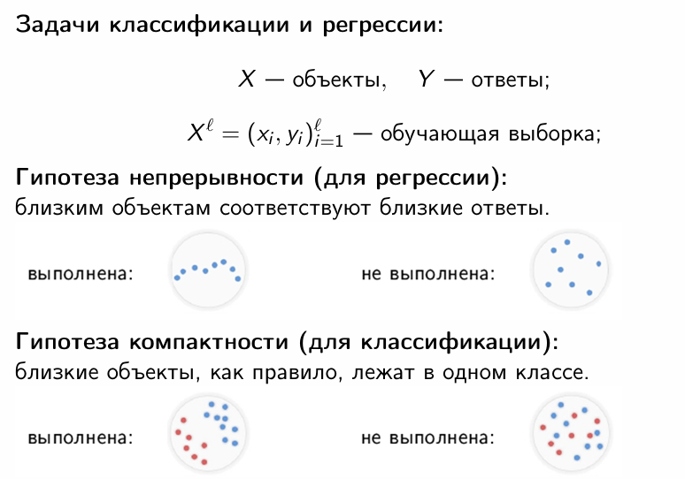

Эти гипотезы лежат в основе всего семейства непараметрических методов, где модель не задаётся явной формулой, 
а строится на лету по обучающей выборке (lazy learning).

В данной работе мы реализуем и исследуем три ключевых компонента метрического подхода:

1. **KNN с методом окна Парзена переменной ширины** — обобщение классического kNN.
2. **Оптимизацию гиперпараметров методом полного скользящего контроля (LOO)**.
3. **Алгоритм отбора эталонов (prototype learning)** — способ сжатия модели без потери качества.

## Теоретические основы метрических методов

### Расстояния и метрики

Качество любого метрического метода напрямую зависит от выбора меры близости между объектами. 
Наиболее распространённой является **евклидова метрика**, частный случай обобщённой метрики Минковского:

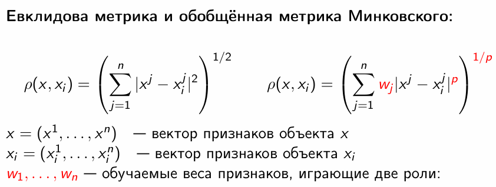

Обратим внимание на роль весов w_j — они нормируют признаки и отражают их информативность.

### Обобщённый метрический классификатор

Любой метрический классификатор можно представить как **взвешенное голосование** ближайших соседей. 
Веса убывают с ростом расстояния до объекта.

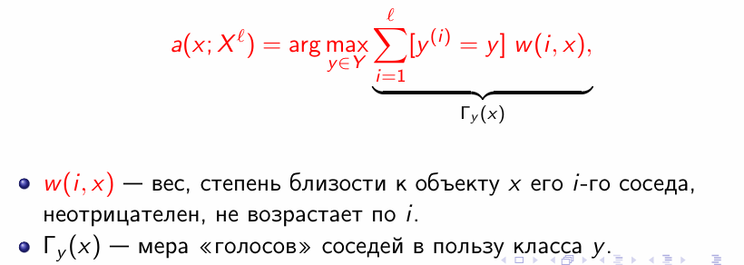

### От kNN к методу окна Парзена

- **kNN** - все первые k соседей участвуют в голосовании с равными весами
- **Взвешенный kNN** - веса убывают с ростом номера соседа (например, линейно или экспоненциально), но не зависят от реального расстояния.
- **Метод Парзена** - Веса вычисляются через ядро K(r), где r = ρ(x, x_i) / h, а ρ(x, x_i) — расстояние между объектами

В нашем случае используется переменная ширина окна:
h(x) = ρ(x, x^{(k+1)})

То есть ширина окна — это расстояние до (k+1)-го ближайшего соседа.

Это позволяет адаптироваться к локальной плотности данных:
- в редких областях окно расширяется, чтобы захватить достаточно соседей
- в плотных — сужается, чтобы избежать влияния далёких точек.

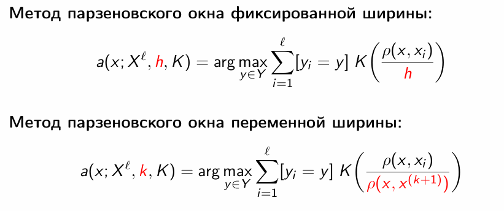

### Оценка качества: LOO и CCV

**LOO (Leave-One-Out)** — частный случай полного скользящего контроля (CCV) при размере контрольной выборки k = 1.
LOO позволяет подобрать оптимальное k без валидационного набора.

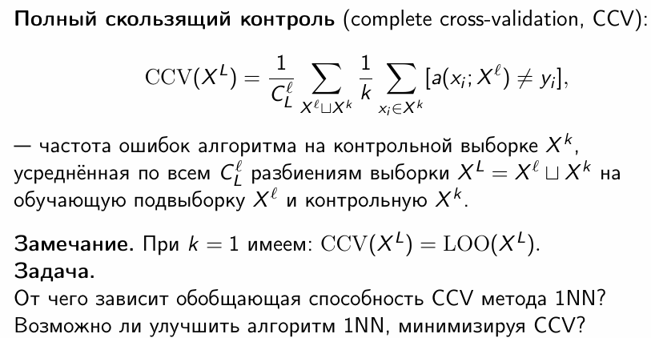

### Профиль компактности и отбор эталонов

**Профиль компактности** П(m) показывает, насколько часто m-й сосед объекта принадлежит другому классу. 
Чем медленнее растёт П(m), тем лучше структурированы данные.

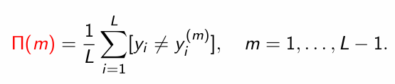

На основе этого вводится критерий CCV для подмножества эталонов, который позволяет жадно (добавлением или удалением) искать оптимальный набор эталонов.

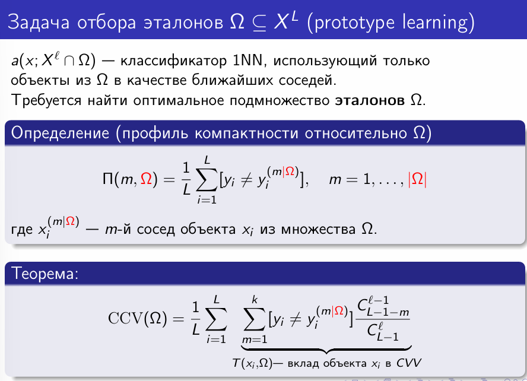

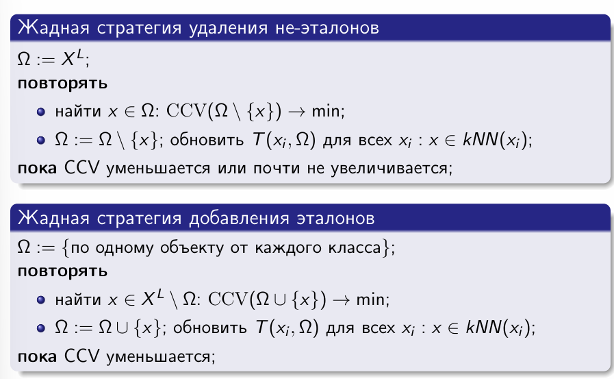

## Используемый датасет

В качестве данных использовался датасет **Red Wine Quality** - задача классификации качества вина по химическим показателям. 
Исходная шкала (от 3 до 8) была агрегирована в 3 класса:
- **0**: низкое (≤4)
- **1**: среднее (5–6)
- **2**: высокое (≥7)

Это позволило:
- Уменьшить влияние несбалансированности
- Сохранить содержательную интерпретацию
- Сделать задачу пригодной для анализа метрических методов

Все признаки — вещественные, без пропусков. Применена стандартизация (`StandardScaler`), что важно для корректного вычисления расстояний.

### Пример первых 5 строк
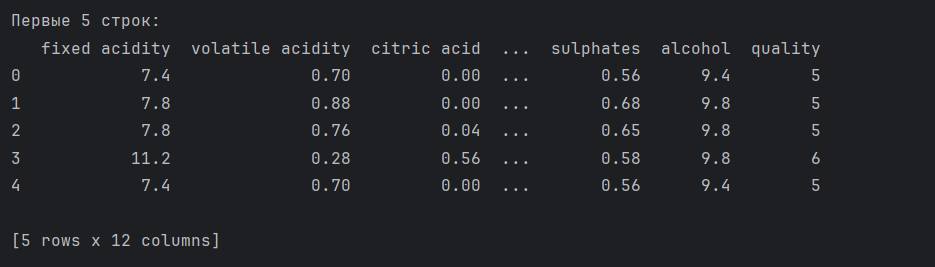

## Реализация алгоритма KNN с методом окна Парзена переменной ширины

Был реализован класс `MyKNN`, поддерживающий три ядра:

- Гауссово  
- Епанечникова  
- Прямоугольное

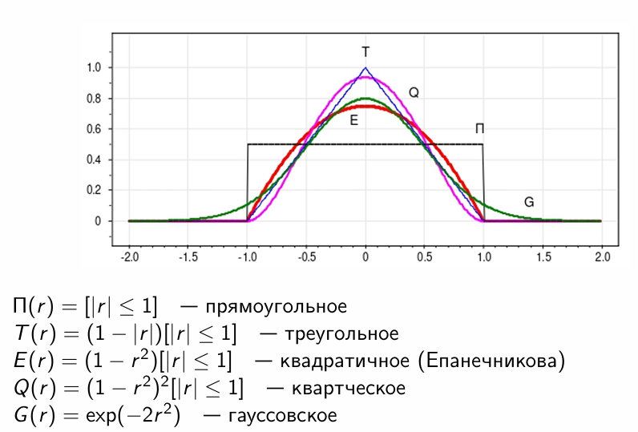

Ключевой этап - вычисление весов:
1. Для объекта x находятся k+1 ближайших соседей
2. Ширина окна: h = ρ(x, x^{(k+1)})
3. Для первых k соседей вычисляются нормированные расстояния r_i = ρ(x, x^{(i)}) / h
4. Веса: w_i = K(r_i)
5. Класс выбирается по максимуму суммарного веса

## Оптимизация параметра k методом LOO

Для каждого k от 1 до 20 была вычислена LOO-точность по обучающей выборке.
Результаты:

Обрабатывается k=1... LOO точность = 0.8358

...

Обрабатывается k=12... LOO точность = 0.8561 <- МАКСИМУМ

...

Обрабатывается k=20... LOO точность = 0.8483

Лучший параметр: k = 12, при котором LOO-точность достигает **0.8561**.

График эмпирического риска также подтверждает этот выбор: при k = 12 тестовая точность также находится на пике, 
а разрыв между обучающей и тестовой точностью минимален - это указывает на оптимальный баланс между смещением и дисперсией.

## Анализ влияния ядер и параметров

Было установлено:

- Точность слабо зависит от вида ядра - согласуется с выводом из лекции: «Ядро слабо влияет на качество, но сильно - на гладкость».
- Сильное влияние оказывает параметр k - он управляет сложностью модели.

| Ядро           | Обучающая точность | Тестовая точность |
|----------------|---------------------|-------------------|
| Гауссово       | 0.9218              | 0.8688            |
| Епанечникова   | 0.9203              | 0.8594            |
| Прямоугольное  | 0.8679              | 0.8562            |

Как видно, гауссово ядро даёт лучшие результаты, что объясняется его гладкостью и способностью эффективно «размазывать» веса.

## График эмпирического риска
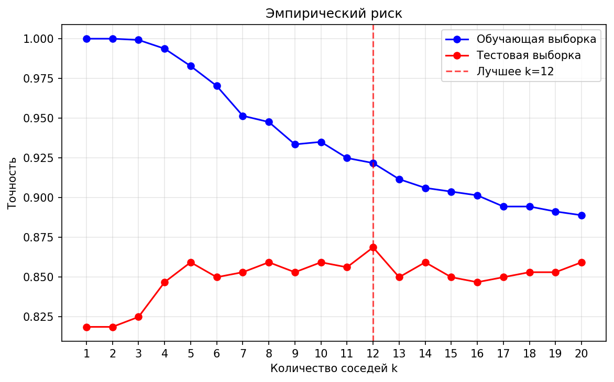

При малых k (например, k=1) наблюдается переобучение (высокая точность на обучении, низкая на тесте).  
При больших k - недообучение (обе кривые сглаживаются и сближаются).  
Оптимальное значение k = 12 - компромисс между смещением и дисперсией.  

## Сравнение с реализацией из scikit-learn

Сравнение с `KNeighborsClassifier(weights='distance')` показало:

| Модель           | Обучающая точность | Тестовая точность |
|------------------|---------------------|-------------------|
| MyKNN (гауссово) | 0.9218              | 0.8688            |
| sklearn KNN      | 1.0000              | 0.8500            |

Разница в качестве между моей реализацией и sklearn объясняется тем, что они используют разные способы взвешивания соседей. 
В scikit-learn при опции weights='distance' вес каждого соседа вычисляется как 1/(d+ε), то есть обратно пропорционально 
расстоянию до него. В нашей модели мы используем гауссово ядро: K(r)=exp(−2r^2), где r — нормированное расстояние.

Несмотря на то, что эти два подхода принципиально отличаются по форме (один — гладная экспонента, другой — гипербола), 
итоговые точности оказались очень близкими: 0.8688 против 0.8500 на тестовой выборке. Это наглядно подтверждает важный вывод: 
качество метрических методов определяется скорее самим фактом взвешивания, чем конкретной формой ядра. 

## Отбор эталонов

Реализована **жадная стратегия добавления эталонов**, начинающаяся с одного объекта от каждого класса. 
На каждой итерации добавлялся объект, максимально увеличивающий LOO-точность.

Результаты:
- Исходное число объектов в обучающей выборке: 1279
- Отобрано эталонов: 7 (начальный набор + 4 добавленных)
- Сжатие данных: 0.5% от исходного объёма
- Потеря точности: ~3.4% (с 0.8688 до 0.8344)
- Ускорение предсказания: в 2.21 раза

## Выводы

1. **Метрические методы** - простые, но мощные. Их эффективность сильно зависит от выбора метрики и гиперпараметров, а не от формы ядра.
2. **Метод Парзена с переменной шириной** - естественное обобщение kNN, лучше адаптируется к данным.
3. **LOO-оптимизация** — надёжный способ подбора k без валидационного набора.
4. **Отбор эталонов** — эффективная техника сжатия модели. В моем случае удалось сократить данные на 99.5% при потере точности ~3.4% и ускорении в 2.21 раза.

---
После первой защиты добавила недостающий график:
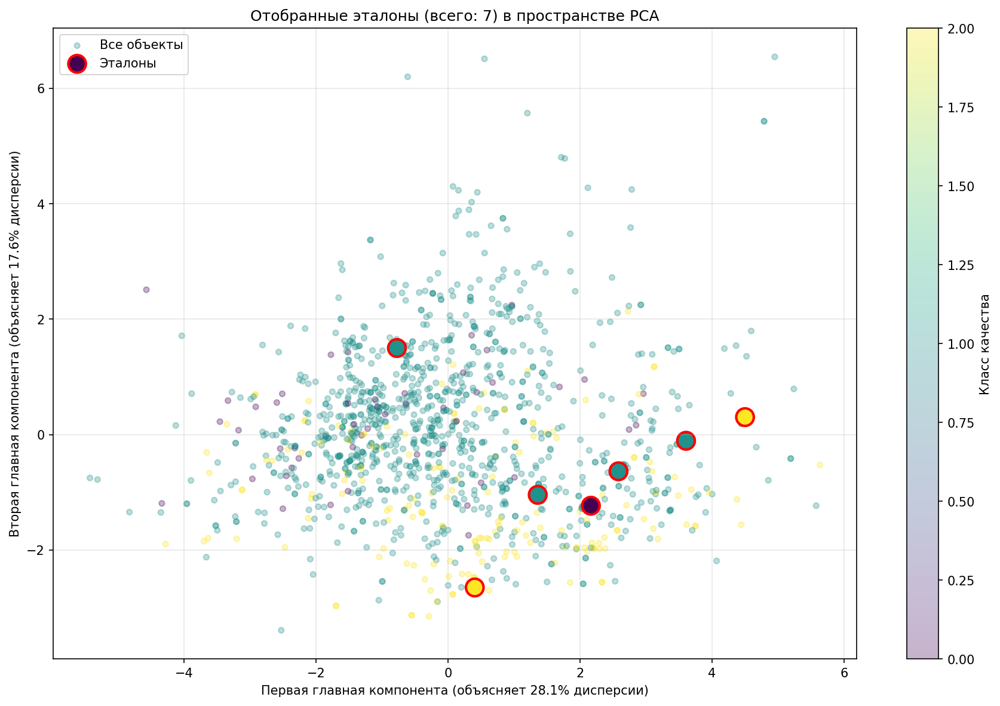