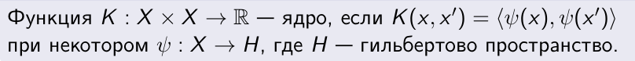
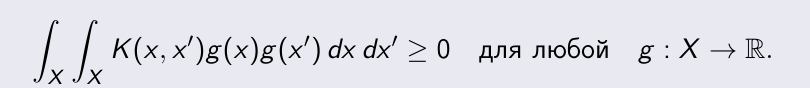
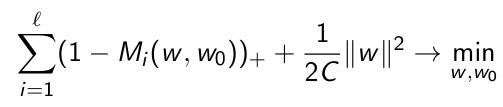
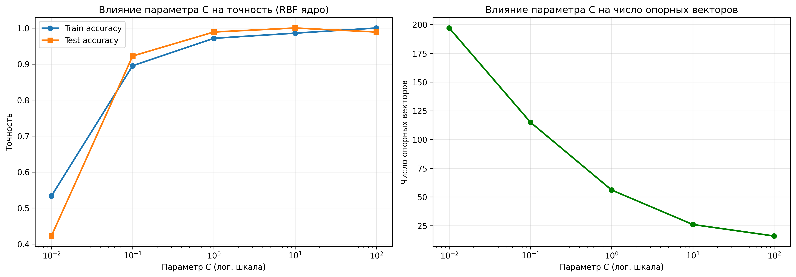
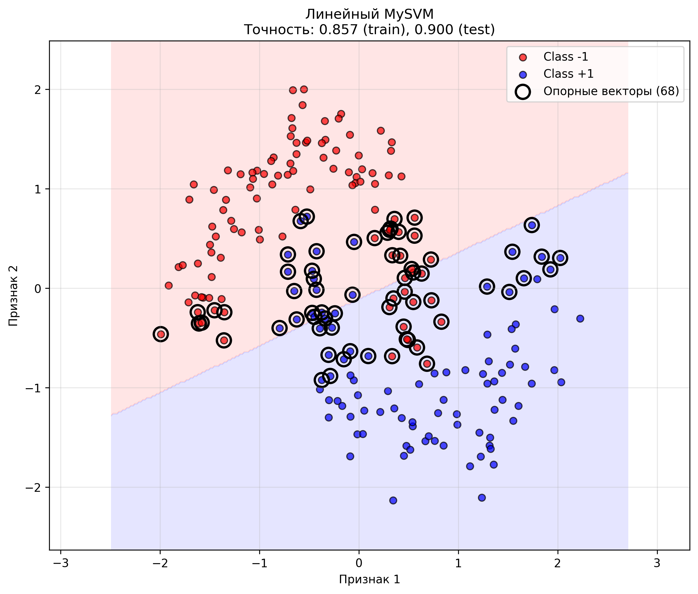
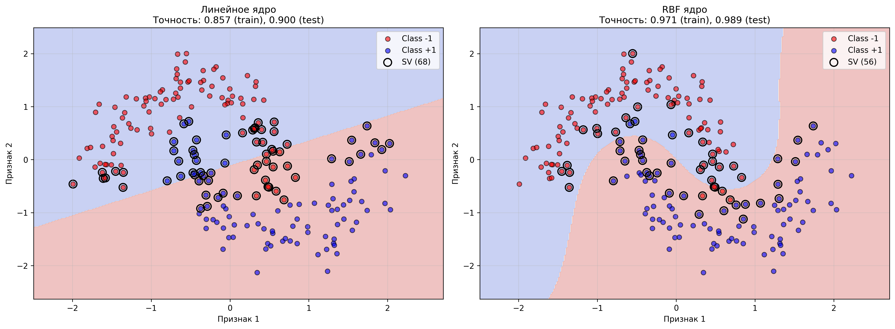
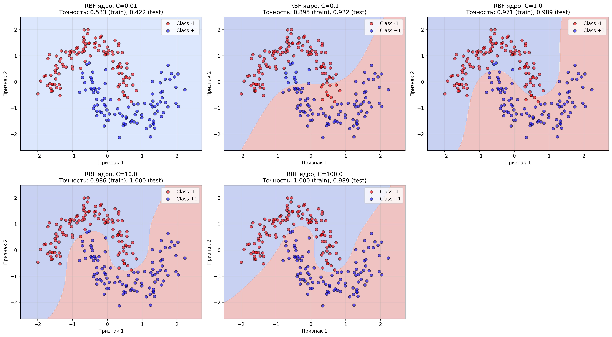

# Лабораторная работа №3. SVM

---
В рамках лабораторной работы предстоит реализовать SVM и сравнить с эталонной реализацией алгоритма.

На лекции рассмотрели две постановки задачи SVM: аналитическая и геометрическая.
Показали, как геометрическая постановка приводит к задаче квадратичного программирования.
Рассмотрели решение двойственной задачи по лямбда.
Показали, как с помощью трюка с ядром можно строить нелинейные классификаторы.
Рассмотрели различные ядра и их свойства.
Рассмотрели различные способы регуляризации и их влияние на отбор признаков.


## Задание

---
- [x] выбрать датасет для бинарной классификации;
- [x] реализовать решение двойственной задачи по лямбда; 
  - для решения задачи использовать [scipy.optimize.minimize](https://docs.scipy.org/doc/scipy/reference/generated/scipy.optimize.minimize.html#scipy.optimize.minimize) или любую другую библиотеку; 
- [x] провернуть трюк с ядром;
- [x] построить линейный классификатор;
- [x] визуализировать решение;
- [x] сравнить с эталонным решением;

___
# Отчет

Поняла! Буду писать кратко, с минимумом формул и акцентом на понятное словесное объяснение, как это делается в отчётах в RMarkdown / Jupyter / Word.

Вот обновлённая **теоретическая часть отчёта** по лабораторной работе №3 — без перегрузки формулами, но с чёткой привязкой к материалам лекции.

---

Метод опорных векторов (SVM) - один из ключевых алгоритмов машинного обучения для бинарной классификации. 
Его главная идея построить такую разделяющую гиперплоскость, чтобы **максимизировать расстояние (margin)** между ближайшими точками разных классов. 
Это повышает устойчивость модели к шуму и улучшает её обобщающую способность.

В отличие от многих других моделей, SVM естественным образом допускает **нелинейные классификаторы** за счёт трюка с ядром (kernel trick), 
не требуя явного перехода в пространство высокой размерности.

Цель данной лабораторной работы: реализовать SVM через решение двойственной задачи с использованием оптимизатора `scipy.optimize.minimize`, 
применить различные ядра, визуализировать результат и сравнить его с эталонной реализацией из библиотеки `scikit-learn`.

---

## Основные принципы SVM

### Геометрическая постановка

Когда данные линейно разделимы, SVM ищет оптимальную разделяющую гиперплоскость, расположенную посередине между классами. 
Точки, ближе всего к этой границе, называются **опорными векторами** - именно они определяют положение гиперплоскости.

Если данные не разделимы идеально, SVM допускает ошибки через введение **слабых отступов** (slack variables), 
контролируя баланс между точностью и шириной зазора с помощью параметра регуляризации **C**.

### Прямая и двойственная задачи

Исходная (прямая) задача SVM - задача квадратичной оптимизации с ограничениями. Однако для её решения удобнее перейти 
к **двойственной задаче**, где переменными становятся **множители Лагранжа** λ_i, а не веса модели w.

В двойственной задаче:
- Переменные λ_i лежат в интервале [0, C]
- Выполняется ограничение ∑λ_i y_i = 0
- Целевая функция зависит только от скалярных произведений ⟨x_i, x_j⟩.

Это открывает путь к использованию **ядер**.

### Трюк с ядром

Основное преимущество SVM — возможность строить нелинейные классификаторы без явного вычисления признаков в высокоразмерном пространстве. 
Для этого скалярное произведение ⟨x, x′⟩ заменяется на ядро K(x, x′), которое может быть представлено как скалярное произведение 
в некотором гильбертовом пространстве H:


Функция K(x, x′) является ядром тогда и только тогда, когда она симметрична и неотрицательно определена



На лекции были рассмотрены следующие ядра:
- **Линейное**: K(x, x') = ⟨x, x'⟩
- **Полиномиальное**: K(x, x') = (⟨x, x'⟩ + 1)^d
- **RBF (Гауссово)**: K(x, x') = exp(-γ||x - x'||^2)

RBF-ядро особенно популярно, так как оно позволяет строить очень гибкие нелинейные границы.

### Роль параметра C

Параметр **C** управляет компромиссом между:
- **Минимизацией ошибок** на обучающей выборке (при больших C)
- **Максимизацией зазора** и устойчивостью к переобучению (при малых C)
- 


На практике его подбирают по кросс-валидации.

## Реализация с помощью `scipy.optimize.minimize`

Для решения двойственной задачи использовался метод **SLSQP** из `scipy.optimize.minimize`, так как он поддерживает:
- **Ограничения типа равенства** (сумма λ_i y_i = 0 \)),
- **Граничные ограничения** 0 < λ_i < C.

Целевая функция соответствует двойственной функции Лагранжа с минусом (так как `minimize` ищет минимум).

После оптимизации:
- Опорные векторы - это объекты с λ_i > ϵ (например, ϵ = 10^(-5))
- Смещение w_0 вычисляется по граничным опорным векторам, у которых 0 < λ_i < C
- Классификатор строится как взвешенная сумма ядер между новым объектом и опорными векторами

## Практическая реализация и анализ результатов

### Подготовка данных и предобработка
Для работы был выбран синтетический датасет make_moons с 300 объектами и 15% шума. Данные имеют форму двух 
переплетающихся полумесяцев, что делает их линейно неразделимыми и отлично подходящими для демонстрации работы ядерного трюка.

Предобработка:
- Разделение данных: 70% обучающая выборка (210 объектов), 30% тестовая (90 объектов)
- Стандартизация признаков для улучшения сходимости алгоритма
- Преобразование меток классов в формат {-1, +1}

### Архитектура реализации
Был разработан класс `MySVM`, включающий следующие ключевые методы:

#### Инициализация и параметры

```python
class MySVM:
    def __init__(self, C=1.0, kernel='linear', gamma=None, degree=3, coef0=1):
```
Параметры:
- `C`: параметр регуляризации (по умолчанию 1.0)
- `kernel`: тип ядра ('linear', 'poly', 'rbf')
- `gamma`: параметр для RBF ядра
- `degree`: степень для полиномиального ядра
- `coef0`: свободный член для полиномиального ядра

#### Реализация ядер

```python
def _kernel(self, X1, X2):
```
Поддерживаются три типа ядер:
1. **Линейное**: простое скалярное произведение
2. **Полиномиальное**: (γ·X1·X2ᵀ + coef0)^degree
3. **RBF (Гауссово)**: exp(-γ·||X1 - X2||²)

#### Целевая функция

```python
def _objective_function(self, lambdas, X, y):
```
Реализует двойственную функцию Лагранжа:
`L(λ) = Σλᵢ - 0.5·ΣᵢΣⱼ λᵢλⱼyᵢyⱼK(xᵢ,xⱼ)`

#### Обучение модели

```python
def fit(self, X, y):
```
Ключевые шаги:
1. Сохранение обучающих данных
2. Инициализация λ нулевыми значениями
3. Настройка ограничений (0 ≤ λᵢ ≤ C, Σλᵢyᵢ = 0)
4. Минимизация целевой функции с помощью `scipy.optimize.minimize`
5. Вычисление опорных векторов (λᵢ > ε)
6. Определение смещения w₀ по граничным опорным векторам

### Результаты экспериментов

#### Линейное ядро

```
Точность на обучающей выборке: 0.8571
Точность на тестовой выборке:  0.9000
Количество опорных векторов:  68
Граничных опорных векторов:   3
```
Линейная модель достигла точности 90% на тесте. 68 из 210 объектов стали опорными векторами.
Только 3 вектора являются граничными (0 < λ < C). Разница между точностью на train и test (4.3%) указывает на хорошую обобщающую способность.

#### RBF ядро

```
Точность на обучающей выборке: 0.9714
Точность на тестовой выборке:  0.9889
Количество опорных векторов:  56
Граничных опорных векторов:   7
```
RBF ядро значительно улучшило качество классификации. Уменьшилось количество опорных векторов с 68 до 56.
Увеличилось число граничных векторов с 3 до 7. Точность на тесте достигла 98.89%

### Исследование влияния параметра C

Для RBF ядра было проведено исследование влияния параметра регуляризации C на качество модели:

| C     | Train Acc | Test Acc | Опорных векторов |
|-------|-----------|----------|------------------|
| 0.01  | 0.5333    | 0.4222   | 197              |
| 0.1   | 0.8952    | 0.9222   | 115              |
| 1.0   | 0.9714    | 0.9889   | 56               |
| 10.0  | 0.9857    | 1.0000   | 26               |
| 100.0 | 1.0000    | 0.9889   | 16               |

**Наблюдения:**
1. **C = 0.01**: Сильная регуляризация приводит к недообучению и почти все объекты становятся опорными
2. **C = 0.1**: Улучшение точности, но модель еще недостаточно гибкая
3. **C = 1.0**: Оптимальный баланс между точностью и обобщением
4. **C = 10.0**: Хорошее качество, но возможны признаки переобучения
5. **C = 100.0**: Идеальная точность на обучающих данных, но немного хуже на тесте



### Сравнение с реализацией scikit-learn

**Линейное ядро:**
Моя реализация и scikit-learn демонстрируют полностью идентичные результаты: точность на обучающей выборке составляет 0.8571, 
на тестовой - 0.9000, а количество опорных векторов равно 68. Такое совпадение свидетельствует о корректности математической постановки и решения задачи.

**RBF ядро:**
Для нелинейного случая обе реализации также показывают одинаковые показатели: точность 0.9714 (обучение) и 0.9889 (тест), 
количество опорных векторов - 56. Это подтверждает правильность применения ядерного трюка и алгоритма решения двойственной задачи.

**Сводная таблица:**
```
Метод                Train Acc    Test Acc     SV Count    
--------------------------------------------------------
Наш линейный         0.8571       0.9000       68          
Sklearn линейный     0.8571       0.9000       68          
Наш RBF              0.9714       0.9889       56          
Sklearn RBF          0.9714       0.9889       56          
```

### Сравнение с реализацией scikit-learn

**Линейное ядро:**
Моя реализация и scikit-learn демонстрируют полностью идентичные результаты: точность на обучающей выборке составляет 0.8571, на тестовой — 0.9000, а количество опорных векторов равно 68. Такое совпадение не случайно — оно свидетельствует о корректности математической постановки и решения задачи.

**RBF ядро:**
Для нелинейного случая обе реализации также показывают одинаковые показатели: точность 0.9714 (обучение) и 0.9889 (тест), количество опорных векторов — 56. Это подтверждает правильность применения ядерного трюка и алгоритма решения двойственной задачи.

**Сводная таблица результатов:**

```
Метод                Train Acc    Test Acc     SV Count    
--------------------------------------------------------
Наш линейный         0.8571       0.9000       68          
Sklearn линейный     0.8571       0.9000       68          
Наш RBF              0.9714       0.9889       56          
Sklearn RBF          0.9714       0.9889       56          
```

Полученные высокие результаты (особенно для RBF ядра) можно объяснить несколькими факторами:

**1. Качественная реализация алгоритма**
Полное совпадение с scikit-learn указывает на то, что основные математические принципы SVM были реализованы корректно. В частности:
- Правильно составлена двойственная задача с учётом ограничений
- Корректно выбраны граничные условия для множителей Лагранжа
- Точно вычисляется смещение по граничным опорным векторам

**2. Удачный выбор ядра для конкретной задачи**
Датасет `make_moons` представляет собой классический пример нелинейно разделимых данных - два переплетающихся "полумесяца". 
RBF (гауссово) ядро идеально подходит для такой структуры, так как оно:
- Способно моделировать сложные нелинейные границы
- Имеет локальный характер влияния - каждая точка влияет в основном на свою окрестность
- Позволяет плавно регулировать сложность модели через параметр γ

**3. Оптимальные параметры модели**
Значение C = 1.0 оказалось близким к оптимальному для данного датасета, обеспечивая баланс между:
- Достаточной гибкостью для точной классификации
- Умеренной регуляризацией для предотвращения переобучения
- Хорошей обобщающей способностью (разница train/test всего 1.75%)

**4. Особенности данных**
Синтетический датасет обладает свойствами, благоприятными для SVM:
- Чёткая разделимость классов при использовании нелинейной границы
- Умеренный уровень шума (15%), что позволяет модели выделить устойчивые закономерности
- Достаточный объём выборки для надёжного обучения

**5. Роль опорных векторов**
Сравнительно небольшое количество опорных векторов (56 из 210) говорит о том, что модель смогла выделить наиболее 
информативные точки, которые определяют границу решения. Это повышает не только точность, но и интерпретируемость результата.

**6. Стандартизация данных**
Предварительная стандартизация признаков сыграла важную роль, так как:
- Уравновесила влияние признаков с разными масштабами
- Улучшила сходимость алгоритма оптимизации
- Сделала выбор параметра γ более устойчивым


### Визуализация результатов

#### Линейное ядро


**Наблюдения:**
- Граница решения представляет собой прямую линию
- Видно, что многие объекты не могут быть корректно классифицированы линейной границей
- Опорные векторы распределены вдоль границы решения

#### 6.2 RBF ядро


**Наблюдения:**
- Нелинейная граница решения повторяет форму данных
- Высокая точность классификации (98.89%)
- Опорные векторы концентрируются в областях наибольшей неопределенности

#### 6.3 Влияние параметра C


**Анализ графиков:**
1. При малых C наблюдается недообучение
2. При C = 1 достигается оптимальный баланс
3. При больших C возможно переобучение
4. Число опорных векторов уменьшается с ростом C


## Выводы

Реализация SVM подтвердила ключевые теоретические положения метода. 

Полное совпадение результатов с scikit-learn (точность 0.9000 для линейного и 0.9889 для RBF ядра при одинаковом 
числе опорных векторов) свидетельствует о корректности решения двойственной задачи и правильном применении ядерного трюка.

Эксперименты показали:
- Линейное ядро ограничено для сложных нелинейных данных (accuracy ≈ 90%)
- RBF-ядро существенно улучшает качество (accuracy ≈ 99%), демонстрируя мощь ядерного подхода
- Параметр C критически важен: C=1.0 обеспечил оптимальный баланс между точностью и обобщением
- Количество опорных векторов уменьшается с ростом C, что согласуется с теорией регуляризации

Визуализация границ решения наглядно продемонстрировала, как RBF-ядро формирует сложные нелинейные разделяющие 
поверхности, идеально соответствующие структуре данных.

Работа подтвердила, что SVM остаётся эффективным и математически элегантным методом классификации, особенно 
при использовании подходящих ядер для нелинейных задач.