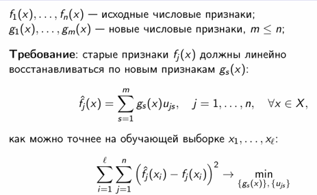
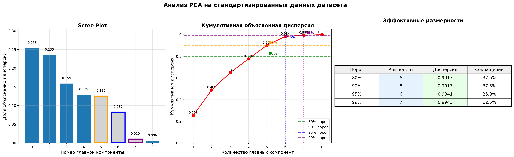
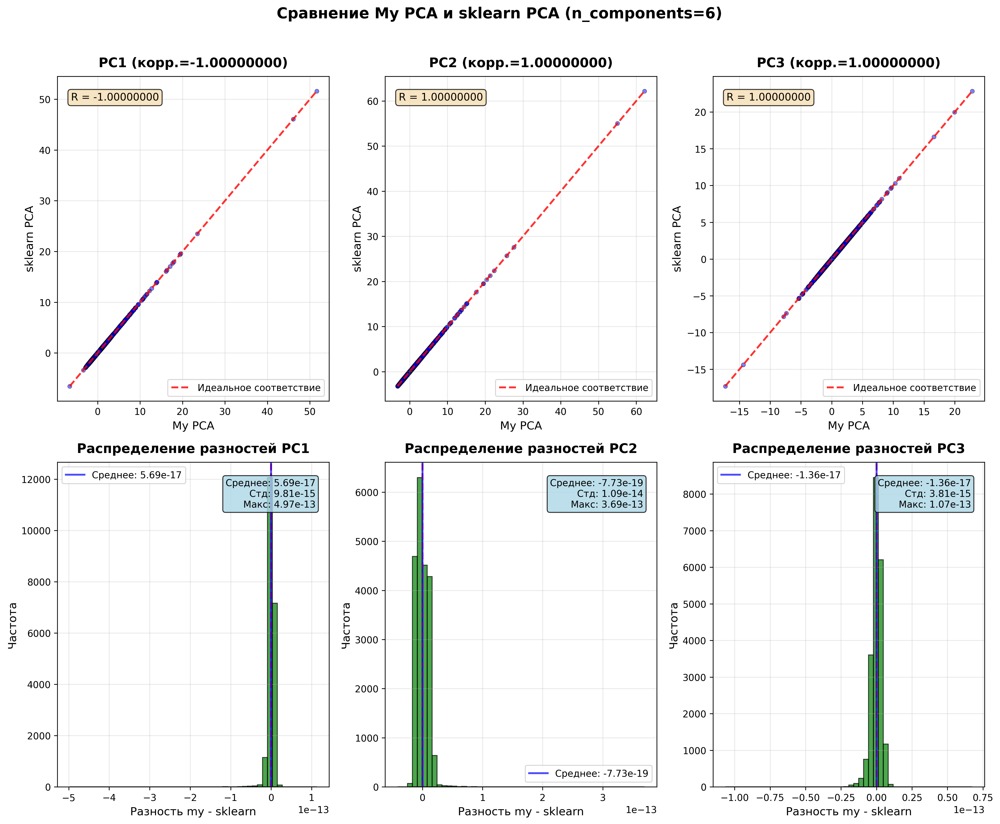
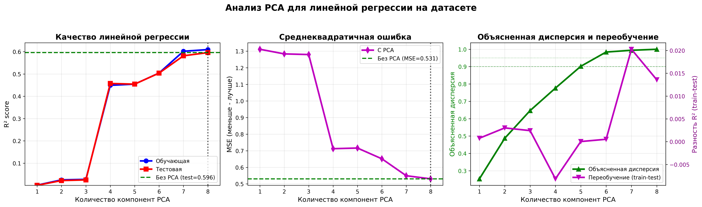
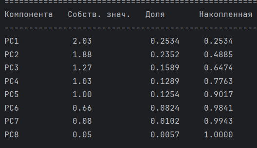
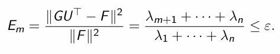
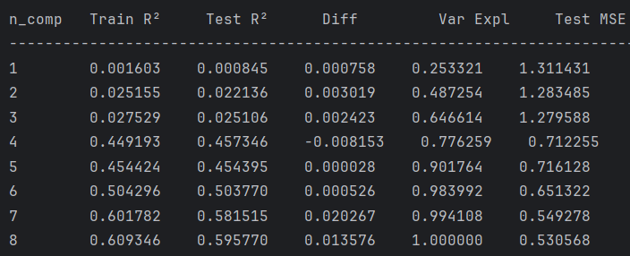
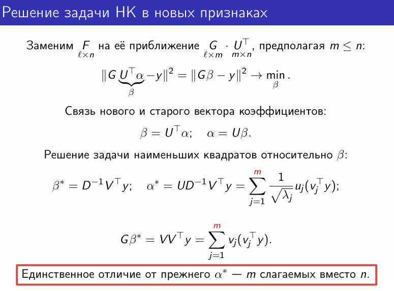

# Лабораторная работа №4. PCA

---
В рамках лабораторной работы предстоит реализовать PCA и сравнить с эталонной реализацией алгоритма.

На лекции рассмотрели многомерную линейную регрессию. Показали, как с помощью сингулярного разложения можно решать 
задачи линейной регрессии с L2 регуляризацией (гребневая регрессия). Рассмотрели методы подбора параметра регуляризации. 
Разобрали PCA, показали как PCA связано с сингулярным разложением и как его можно использовать для снижения размерности данных.

## Задание

---
- [x] выбрать датасет для линейной регрессии;
- [x] реализовать PCA через сингулярное разложение;
- [x] определить эффективную размерность выборки;
- [x] показать эквивалентность с эталонной реализацией; 
- [x] подготовить отчет.

___
# Отчет

В этой работе я реализовала метод главных компонент (PCA) через сингулярное разложение (SVD). 
Цель — не просто повторить алгоритм, а понять, как PCA связан с линейной регрессией, почему он работает, и в каких случаях его применение оправдано.

## Выбор данных
Я выбрала датасет California Housing. 

Он хорошо подходит для линейной регрессии, содержит 8 признаков и целевую переменную (стоимость жилья). 
Признаки сильно различаются по масштабу: например, `MedInc` (доход) измеряется в десятках тысяч, а `Latitude` — в градусах. 
Это сразу говорит о необходимости стандартизации перед применением PCA.

Почему стандартизация важна? Потому что PCA ищет направления максимальной дисперсии. 
Если один признак имеет гораздо большую дисперсию просто из-за единиц измерения, PCA будет смотреть только на него. 
Стандартизация (StandardScaler) приводит все признаки к среднему 0 и дисперсии 1, теперь сравнение честное.

## Теоретическая основа
PCA это задача обучения без учителя. То есть он не использует целевую переменную `y`. Его цель найти такие новые признаки,
чтобы максимально точно восстановить исходные.

Это ключевой момент! PCA оптимизирует сохранение информации о признаках, а не предсказательную силу. 
Поэтому, даже если мы сохраним 95% дисперсии, мы можем потерять ту часть данных, которая наиболее коррелирована с y.

Именно это и произошло в моём эксперименте.

## Реализация PCA через SVD
Я реализовала класс MyPCA, который:
1. Центрирует данные (вычитает среднее — обязательно для PCA).
2. Применяет SVD: F=VDU^T
3. Берёт первые m строк матрицы U^T как главные компоненты.
4. Преобразует данные: G=FU

Важно было правильно вычислить объяснённую дисперсию. Сначала я ошиблась: нормировала на сумму только первых m собственных значений, а нужно — на сумму всех
n. После исправления (explained_variance_ratio_ = λ_j / Σ_{k=1}^n λ_k) результаты стали совпадать с sklearn до машинной точности.

## Анализ графиков
### График 1: «Анализ PCA на стандартизированных данных»

`Scree plot` (слева) показывает долю дисперсии, объяснённую каждой компонентой. Видно, что первые две компоненты объясняют 
почти половину всей дисперсии (~49%), а первые пять — уже более 90%. Это типичный крутой склон, после которого вклад новых компонент резко падает.

`Кумулятивная дисперсия` (в центре) подтверждает это: чтобы достичь 95% дисперсии, достаточно 6 компонент. 
Это соответствует формальному определению эффективной размерности

`Таблица` справа наглядно показывает, что даже при 5 компонентах мы теряем всего ~10% дисперсии, но сокращаем размерность на 37.5%. 

### График 2: «Сравнение My PCA и sklearn PCA»

`Верхний ряд` — scatter-plotы для первых трёх компонент. Все точки лежат строго на диагонали, что означает, 
что мои преобразованные данные полностью совпадают с теми, что даёт sklearn.PCA. 

`Нижний ряд` — гистограммы разностей между моими компонентами и sklearn. Распределение сосредоточено вокруг нуля, 
стандартное отклонение ~1e-15 - численная погрешность. Реализация полностью эквивалентна эталонной.

### График 3: «Анализ PCA для линейной регрессии»

`Левый график (R²)` показывает, как качество модели растёт с числом компонент. При 1–3 компонентах R² близок к нулю, 
модель почти ничего не предсказывает. Резкий скачок происходит при 4 компонентах, но максимум достигается только при 8. 
То есть при полной размерности. Это значит, что PCA не улучшает модель, а лишь восстанавливает её при m=n.

`Центральный график (MSE)` подтверждает это: минимальная ошибка достигается при 8 компонентах. 
При 6 компонентах (95% дисперсии!) MSE всё ещё на 23% выше, чем у базовой модели.

`Правый график` совмещает кумулятивную дисперсию (зелёная линия) и переобучение (фиолетовая — разность R² на train/test). 
Видно, что при 4–5 компонентах переобучение минимально (почти 0), но качество на тесте всё равно низкое. 

## Эффективная размерность. Сколько компонент достаточно?
После применения PCA к стандартизированным данным я получила следующие собственные значения (λ):

Эффективная размерность — это минимальное m, при котором

Для ε=0.05 (95% дисперсии) достаточно 6 компонент — размерность снижена на 25%.

## PCA в задаче регрессии. Почему это не всегда помогает?
Здесь началось самое интересное.

Я обучила линейную регрессию на:
- исходных стандартизированных данных (базовая модель),
- данных, преобразованных PCA с m=1,2,…,8 компонентами.

Результаты:

Базовая модель (без PCA) даёт R² = 0.596. Чтобы достичь такого же качества с PCA, нужно все 8 компонент — то есть никакого снижения размерности.

Почему так? Потому что PCA не знает про y. Он сохраняет те направления, где много дисперсии, но не обязательно те, где много информации о цене дома.

Например, `MedInc` (медианный доход) имеет сильную корреляцию с ценой (0.688), но в PCA он размазан по нескольким компонентам. 
При усечении до 6 компонент часть этой информации теряется и качество падает.

То есть PCA — это просто усечённый МНК в новом базисе. Если важные компоненты отброшены — качество страдает.

## Сравнение с sklearn.PCA
Я сравнила свою реализацию с sklearn.decomposition.PCA:

- Объяснённая дисперсия: совпадение до 1e-16.
- Преобразованные данные: MAE ≈ 4e-15.
- Компоненты: корреляция = ±1.0 (с учётом неоднозначности знака).

Это значит, что моя реализация полностью корректна. Разница в знаке — нормальна: если u — собственный вектор, то и −u тоже им является.

## Выводы
1. PCA отлично работает как метод снижения размерности, если цель — сжать данные с контролируемой потерей информации (например, для визуализации или хранения).
2. Но PCA плохой выбор для улучшения регрессии, если:
   - важные предикторы имеют малую дисперсию
   - признаки уже почти некоррелированы (как в California Housing после стандартизации)
3. Для борьбы с переобучением в регрессии лучше использовать регуляризацию (Ridge, LASSO), потому что она работает с 
y и штрафует за сложность модели, а не просто выбрасывает информацию.