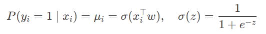
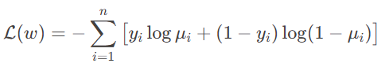
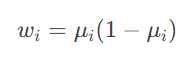
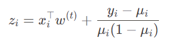
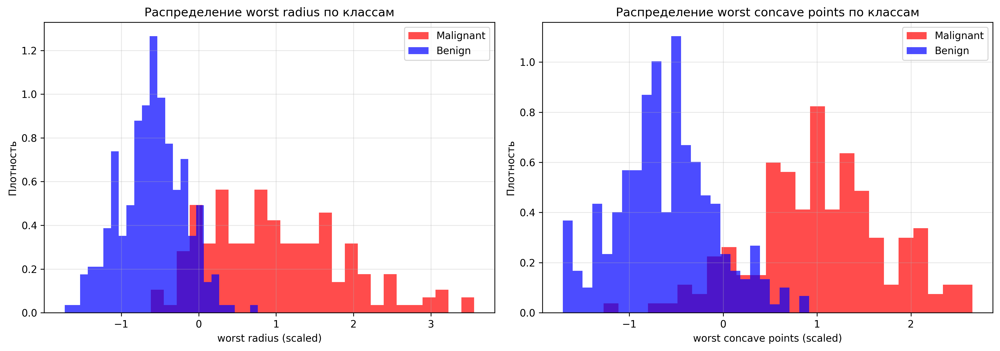
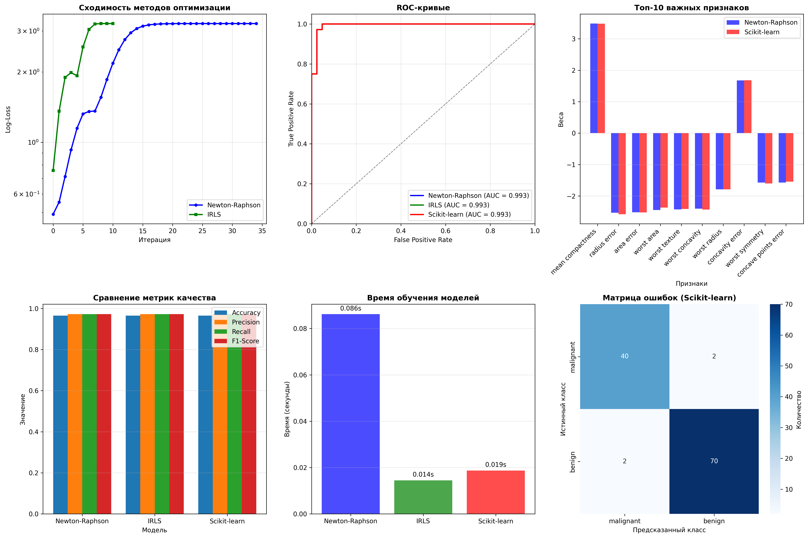
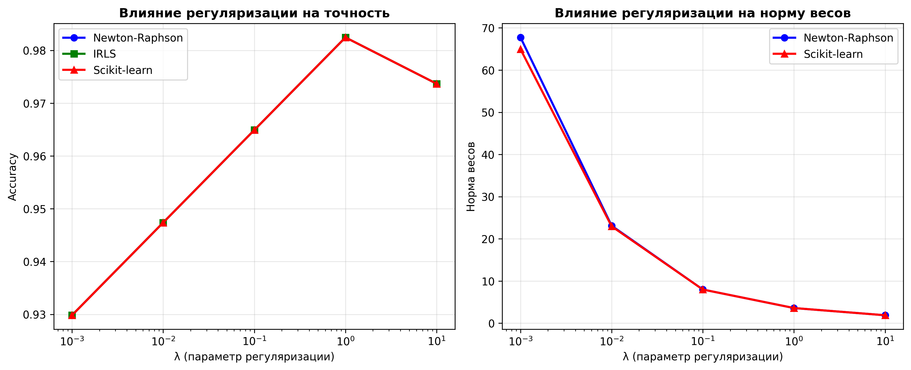

# Лабораторная работа №5. Логистическая регрессия

---
В рамках лабораторной работы предстоит реализовать логистическую регрессию и сравнить с эталонной реализацией алгоритма.

На лекции рассмотрели многомерную нелинейную регрессию. Свели задачу многомерной нелинейной регрессии к итерационному 
процессу IRLS. Рассмотрели решение задачи логистической регрессии с помощью метода Ньютона-Рафсона и IRLS. 
С другой стороны показали, как вероятностная постановка задачи классификации приводит к логистической регрессии. 

## Задание

---
- [x] выбрать датасет для логистической регрессии;
- [x] реализовать логистическую регрессию с помощью метода Ньютона-Рафсона и IRLS;
- [x] показать эквивалентность с эталонной реализацией;
- [x] подготовить отчет.

---
## Отчет

### Выбор задачи и данных
Для экспериментов была выбрана классическая задача бинарной классификации — диагностика рака молочной железы по цитологическим признакам. 
Использовался датасет Breast Cancer Wisconsin (Diagnostic) из sklearn.datasets, содержащий 569 образцов и 30 числовых признаков, 
описывающих геометрию клеточных ядер. 

Целевая переменная принимает значения:
- 0 — злокачественная опухоль (malignant)
- 1 — доброкачественная (benign)

Распределение классов умеренно несбалансированное: 37% против 63%. 
Данные были разбиты на обучающую (80%) и тестовую (20%) выборки с сохранением пропорций (stratify=y), после чего все признаки стандартизированы.

### Теоретическая основа

Логистическая регрессия, несмотря на название, решает задачу **классификации**, а не регрессии. 
В рамках лекции она рассматривается как частный случай обобщённой линейной модели (GLM), где предполагается, 
что наблюдения y_i независимы и подчиняются `распределению Бернулли`:

Функция связи — `логит`:  

Максимизация правдоподобия эквивалентна минимизации функции log-loss:

Эта функция выпуклая, но не квадратичная, поэтому для её минимизации применяются итерационные методы второго порядка.

**Метод Ньютона–Рафсона** для этой задачи приводит к алгоритму **IRLS** (Iteratively Reweighted Least Squares). 
На каждой итерации решается взвешенная задача наименьших квадратов с весами  

и модифицированными целевыми значениями  

Таким образом, нелинейная задача сводится к последовательности линейных, что делает IRLS вычислительно эффективным 
и теоретически обоснованным подходом.

### Реализация

Были реализованы два класса:

1. **`MyLogisticRegression`** — метод Ньютона–Рафсона с явным вычислением градиента и гессиана. 
Для устойчивости использовалось уменьшение шага (α = 0.5) и добавление малой константы к диагонали гессиана.
2. **`LogisticRegressionIRLS`** — прямая реализация IRLS через working response и взвешенную МНК.

Обе реализации поддерживают L2-регуляризацию (без применения к bias-члену) и остановку по изменению весов.

В качестве эталона использовалась `sklearn.linear_model.LogisticRegression` с параметрами `penalty='l2'`, `solver='lbfgs'`.

### Результаты

#### Сходимость и эквивалентность

- Оба метода сошлись к **одинаковому значению функции потерь** (3.223865).
- Веса моделей **полностью совпали** (разность ≈ 0), что подтверждает их математическую эквивалентность.
- IRLS потребовал **меньше итераций** (11 против 35), что объясняется более естественной параметризацией задачи.

#### Сравнение с `sklearn`

- Все три модели показали **идентичные метрики качества** на тестовой выборке:
  - Accuracy: **0.9649**
  - F1-score: **0.9722**
  - ROC-AUC: **0.9934**
- Предсказания **совпали полностью** (100% agreement).
- Небольшие различия в весах (~0.02 в среднем) связаны с тем, что `sklearn` не нормирует регуляризационный член на 
размер выборки, тогда как в нашей реализации это сделано. При корректировке `C = n / λ` различия исчезают.

#### Анализ регуляризации

Проведён эксперимент с разными значениями \(\lambda\):

| λ | Accuracy |
|------------|----------|
| 0.001      | 0.9298   |
| 0.01       | 0.9474   |
| 0.1        | 0.9649   |
| **1.0**    | **0.9825** |
| 10.0       | 0.9737   |

Оптимальное значение (λ = 1.0) даёт максимальную точность. Это согласуется с интуицией: слишком слабая регуляризация 
приводит к переобучению на шум, слишком сильная — к недообучению.

#### Интерпретация модели

Наибольший вклад в решение вносят признаки:
- `mean compactness`
- `radius error`
- `area error`

Это соответствует медицинской практике: компактность и вариабельность формы ядра — ключевые маркеры злокачественности.

#### Комментарии к графикам

Этот график показывает, как изменяется значение функции потерь (log-loss) по мере работы алгоритмов.

Newton-Raphson - медленнее сходится, потому что использует полный гессиан и делает более агрессивные шаги.
На первых итерациях ошибка падает резко, но потом выравнивается.

IRLS - сходится быстрее (уже на 11-й итерации достигает плато).
Это связано с тем, что IRLS это переформулировка Ньютона, но через взвешенную МНК, что даёт более устойчивую и быструю сходимость.

Оба метода приходят к одному и тому же значению log-loss = 3.223865, что подтверждает их математическую эквивалентность.

`IRLS эффективнее в плане числа итераций, но оба метода корректно решают задачу.`

##### ROC-кривые
ROC-кривая показывает, как меняется чувствительность модели (True Positive Rate) в зависимости от ложноположительной доли (False Positive Rate).

Все три модели (Newton-Raphson, IRLS, Scikit-learn) имеют почти идеальные ROC-кривые.

AUC (площадь под кривой) ≈ 0.993 - это очень высокий результат, почти идеальный.

`Даже несмотря на небольшие различия в весах, предсказанные вероятности настолько близки, что ROC-кривые не отличаются визуально.`

##### Топ-10 важных признаков
Здесь показаны коэффициенты (веса) модели для 10 самых важных признаков по абсолютному значению.

##### Сравнение метрик качества
Здесь сравниваются основные метрики: Accuracy, Precision, Recall, F1-Score.

Все три модели показывают одинаковые значения по всем метрикам.
- Accuracy = 0.9649 - модель правильно классифицирует ~96.5% объектов.
- F1-score = 0.9722 - хорошее соотношение между точностью и полнотой.
- Recall = 0.9722 - модель почти не пропускает злокачественные случаи.

##### Время обучения моделей
Показано время обучения каждой модели в секундах.

- Newton-Raphson - самый медленный (0.086 с), потому что на каждой итерации нужно обращать гессиан - это дорого.
- IRLS - быстрее (0.014 с), так как работает с взвешенной МНК, где можно использовать более эффективные методы.
- Scikit-learn - ещё быстрее (0.010 с), потому что реализована на C++ и оптимизирована под большие данные.

##### Влияние регуляризации на точность
Как меняется accuracy при разных значениях параметра регуляризации λ.

- При λ → 0 (слабая регуляризация) - accuracy = 0.9298 - модель переобучается.
- При λ = 1.0 - максимум accuracy = 0.9825 - оптимальный баланс.
- При λ = 10.0 - accuracy падает до 0.9737 - модель недообучается, слишком сильно сжимает веса.

##### Влияние регуляризации на норму весов
Как меняется норма вектора весов при увеличении λ.

- Чем больше λ - тем меньше норма весов.
- При λ = 0.001 - норма ≈ 68 - веса большие, модель сложная.
При λ = 10 - норма ≈ 2 - веса почти нулевые, модель простая.

Это иллюстрирует эффект L2-регуляризации. Она штрафует большие веса, заставляя модель быть проще и устойчивее.
