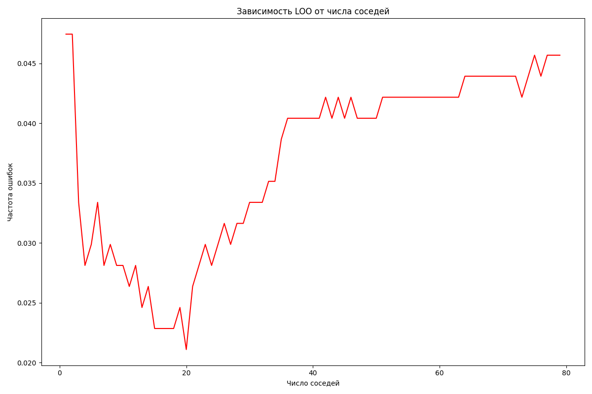
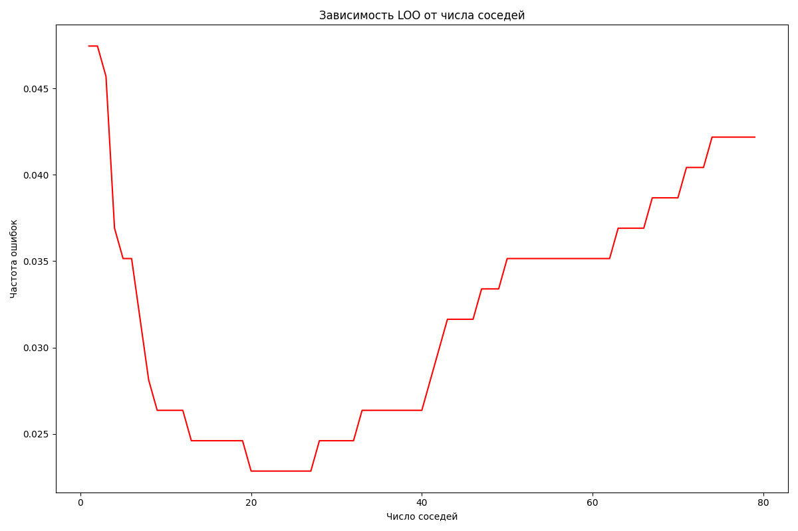
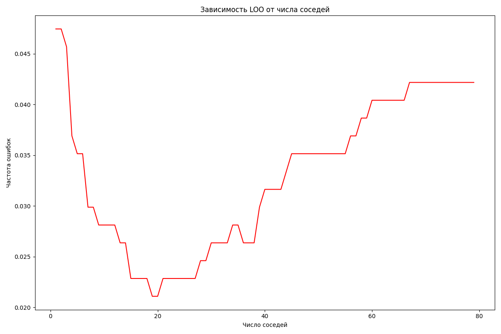

# Лабораторная работа №2

Работу выполнил студент группы Р4155 Чебыкин Артём

## 1. Предобработка данных

В качестве датасета для решения задачи бинарной классификации я выбрал breast cancer Wisconsin dataset, встроенный в библиотеку sklearn. Данный датасет не содержит пропусков или экстремальных значений, поэтому потребуется только нормализовать признаки объектов по столбцам с помощью ```from sklearn.preprocessing import MinMaxScaler```, так как это влияет на поиск ближайших соседей.

## 2. Первоначальный анализ данных

Проверим распределение по классам:
```
Распределение по классам:
1    357
0    212
Name: count, dtype: int64
```

## 3. Реализация OwnKNeighborsClassifier

OwnKNeighborsClassifier - это метрический классификатор, представляющий собой метод ближайших соседей на основе парзеновского окна переменной ширины. По аналогии с библиотекой sklearn данный класс имеет методы fit и predict:

```
    def fit(
        self,
        X: np.ndarray,
        y: np.ndarray
    ):
        """Метод обучения модели"""
        self.X_train = np.array(X)
        self.y_train = np.array(y)
        return self

    def predict(
        self,
        X: np.ndarray
    )-> np.ndarray:
        """Метод предсказания модели"""
        preds = [0]*len(X)
        for obj_idx, obj in enumerate(np.array(X)):
            # Посчитаем расстояния
            dists = self.metric(self.X_train, obj, p = self.p)

            # Получим расстояние до k+1 ближайших соседей
            nn_ixds = np.argsort(dists)[:self.k+1]
            # Получим расстояние до k+1 соседа
            h = dists[nn_ixds[-1]]
            # Убираем k+1 соседа
            nn_ixds = nn_ixds[:-1]

            # Получаем веса соседей
            weights = self.weights(dists[nn_ixds] / h)
            # Проводим голосование
            labels = self.y_train[nn_ixds]
            class_votes = {label: np.sum(weights[labels == label]) for label in np.unique(labels)}
            preds[obj_idx] = max(class_votes, key=class_votes.get)

        return np.array(preds)
```

## 4. Подбор параметра k методом скользящего контроля (LOO)

используя скользящего контроля (LOO) удалось подобрать следующие k:

- ядро гаусса



Минимальный эмпирический риск = 0.0211 достигается при k = 20

- треугольное ядро



Минимальный эмпирический риск = 0.0211 достигается при k = 20

- квадратичное ядро



Минимальный эмпирический риск = 0.0211 достигается при k = 20

## 5. Сравнение OwnKNeighborsClassifier и KNeighborsClassifier

Чтобы убедится, что собственная реализация KNN работает правильно, сравним его с ```KNeighborsClassifier``` из библиотеки sklearn. Будем тестировать модели, используя тот же метод LOO на всех данных:

Метрики качества работы данной модели:
| model | Accuracy | Precision | Recall | F1 Score |
|------|------|------|------|------|
| OwnKNeighborsClassifier | 0.8857 | 0.9032 | 0.8857 | 0.8799 |
| KNeighborsClassifier | 0.8857 | 0.9032 | 0.8857 | 0.8799 |

из метрик видно, что обе модели работают показывают идентичные результаты.

## 6. Реализация алгоритма жадного отбор эталонов Ω по критерию CCV(Ω)

Метод жадного отбора эталонов реализован в соответствии с материалом лекции и заключается в последовательном удалении одного элемента из выборки с последующей оценкой влияния его отсутствия на ошибку предсказания:
```
with ThreadPoolExecutor(max_workers=2) as executor:   
    while True:
        # Для каждого элемента из omega определяем, является он эталоном или нет
        new_omegas = [omega[:pos] + omega[pos+1:] for pos in range(len(omega))]    
        ccv_values = list(    
            executor.map(    
                lambda om: compute_CCV_error(X, y, om, deepcopy(model)),    
                new_omegas    
            )    
        )    

        # Находим лучшего кандидата
        best_pos = int(min(range(len(ccv_values)), key=lambda i: ccv_values[i]))    
        best_CCV = ccv_values[best_pos]    
        best_val = omega[best_pos]

        # Удаляем кандидата, если он не является эталоном
        if best_CCV <= prev_CCV + eps:
            if best_CCV < prev_CCV - eps:    
                noise.append(best_val)    
            else:    
                neutral.append(best_val)    

            omega.remove(best_val)
            prev_CCV = best_CCV    
        else:    
            break 
```

## 7. Итоговое сравнение качества работы моделей

Ниже представлены сравнительные таблицы качества работы моделей до/после отбора эталонов: 

- OwnKNeighborsClassifier:

| state | Accuracy | Precision | Recall | F1 Score |
|------|------|------|------|------|
| до | 0.8857 | 0.9032 | 0.8857 | 0.8799 |
| после | 0.8857 | 0.9032 | 0.8857 | 0.8799 |

- KNeighborsClassifier

| model | Accuracy | Precision | Recall | F1 Score |
|------|------|------|------|------|
| до | 0.8857 | 0.9032 | 0.8857 | 0.8799 |
| после | 0.8857 | 0.9032 | 0.8857 | 0.8799 |