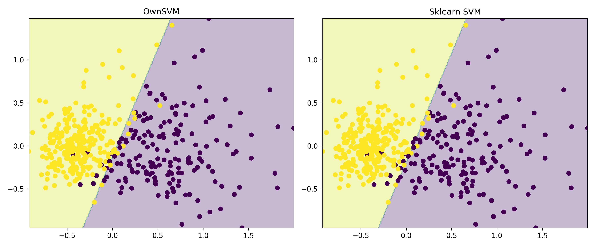
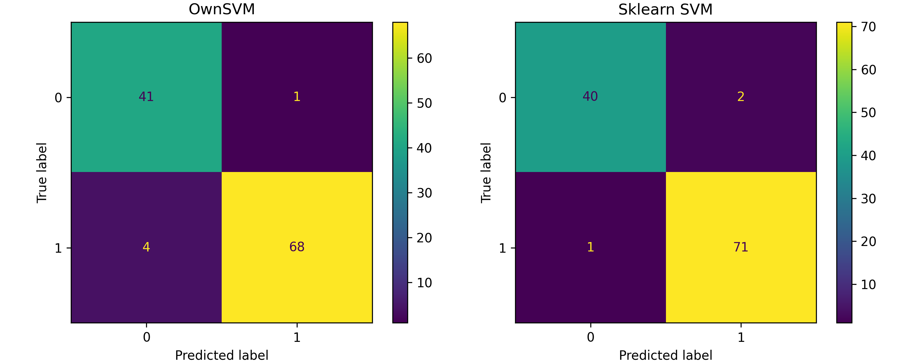
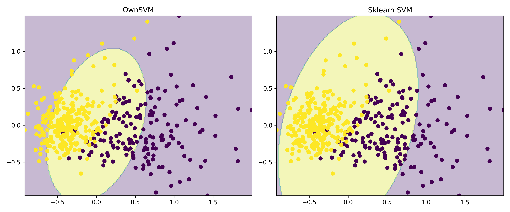
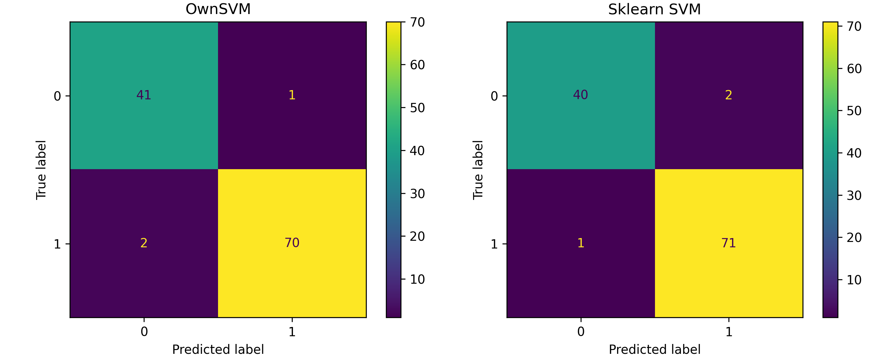
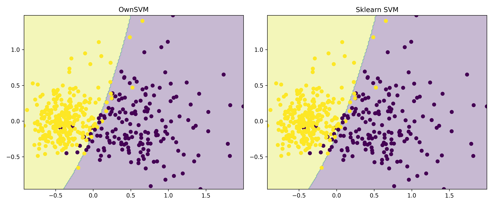

# Лабораторная работа №3

Работу выполнил студент группы Р4155 Чебыкин Артём

## 1. Предобработка данных

В качестве датасета для решения задачи бинарной классификации я выбрал breast cancer Wisconsin dataset, встроенный в библиотеку sklearn. Данный датасет не содержит пропусков или экстремальных значений, поэтому потребуется только конвертировать метки классов из {0; 1} в {-1; 1} и нормализовать признаки объектов по столбцам с помощью ```from sklearn.preprocessing import MinMaxScaler```, так как это влияет на процесс начальной инициализации параметров, а также в целом на результат обучения линейных моделей.

## 2. Первоначальный анализ данных

Проверим распределение по классам:
```
Распределение по классам:
 1    357
-1    212
Name: count, dtype: int64
```

## 3. Реализация OwnSVM

**OwnSVM** — это собственная реализация классификатора SVM с возможностью использования различных ядер. Класс реализует методы `fit` и `predict`, аналогично `sklearn.svm.SVC`.

Основные шаги реализации:

1. **Вычисление матрицы ядра**:

```python
def compute_kernel_matrix(self, X):
    n = X.shape[0]
    return np.array([[self.kernel(X[i], X[j]) for j in range(n)] for i in range(n)])
```

2. **Определение целевой функции двойственной задачи**:

```python
def objective(self, lambdas, y):
    return 0.5 * np.sum((lambdas[:, None] * lambdas[None, :]) * (y[:, None] * y[None, :]) * self.K) - np.sum(lambdas)
```

3. **Ограничение равенства для lambda**:

```python
def equality_constraint(self, lambdas, y):
    return np.dot(lambdas, y)
```

4. **Обучение модели**:

```python
def fit(self, X, y):
    n_samples, _ = X.shape
    self.K = self.compute_kernel_matrix(X)
    initial = np.zeros(n_samples)
    bounds = [(0, self.C) for _ in range(n_samples)]
    constraints = {"type": "eq", "fun": self.equality_constraint, "args": (y,)}
    solution = minimize(self.objective, initial, args=(y,), bounds=bounds, constraints=constraints)

    self.lambdas = solution.x
    sv_mask = self.lambdas > 1e-5
    self.support_vectors = X[sv_mask]
    self.support_lambdas = self.lambdas[sv_mask]
    self.support_y = y[sv_mask]

    K_sv = np.array([[self.kernel(sv_i, sv_j) for sv_j in self.support_vectors] for sv_i in self.support_vectors])
    self.b = np.mean(self.support_y - K_sv @ (self.support_lambdas * self.support_y))
    return self
```

5. **Предсказание классов**:

```python
def project(self, X):
    K = np.array([[self.kernel(x, sv) for sv in self.support_vectors] for x in X])
    return (K @ (self.support_lambdas * self.support_y)) + self.b

def predict(self, X):
    return np.sign(self.project(X))
```

---

## 4. Сравнение OwnSVM и SVM из Sklearn

### 4.1 Метрики качества на тестовой выборке

**Линейное ядро**

<div align="center">

| Модель      | Accuracy | Precision | Recall | F1 Score |
| ----------- | -------- | --------- | ------ | -------- |
| OwnSVM      | 0.9737   | 0.9859    | 0.9722 | 0.9790   |
| Sklearn SVM | 0.9737   | 0.9726    | 0.9861 | 0.9793   |
</div>

**Полиномиальное ядро (degree=2)**

<div align="center">

| Модель      | Accuracy | Precision | Recall | F1 Score |
| ----------- | -------- | --------- | ------ | -------- |
| OwnSVM      | 0.9561   | 0.9855    | 0.9444 | 0.9645   |
| Sklearn SVM | 0.9737   | 0.9726    | 0.9861 | 0.9793   |
</div>

**RBF ядро (gamma=0.5)**

<div align="center">

| Модель      | Accuracy | Precision | Recall | F1 Score |
| ----------- | -------- | --------- | ------ | -------- |
| OwnSVM      | 0.9737   | 0.9859    | 0.9722 | 0.9790   |
| Sklearn SVM | 0.9737   | 0.9726    | 0.9861 | 0.9793   |
</div>

---

### 4.2 Confusion Matrix и опорные объекты

**Линейное ядро**




**Полиномиальное ядро (degree=2)**




**RBF ядро (gamma=0.5)**


