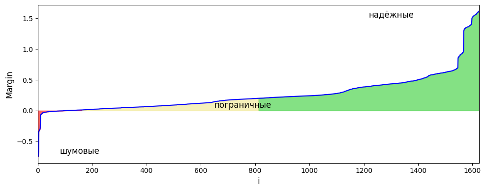
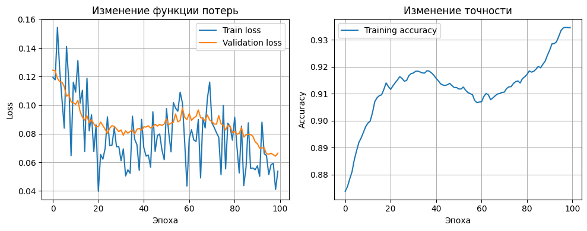
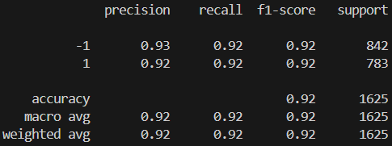
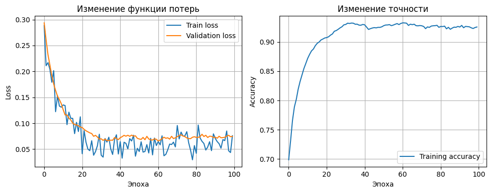
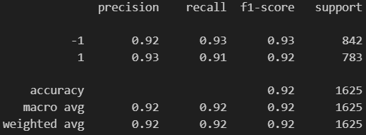
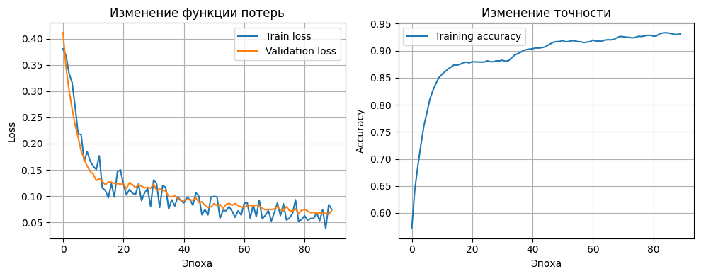
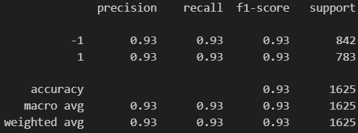
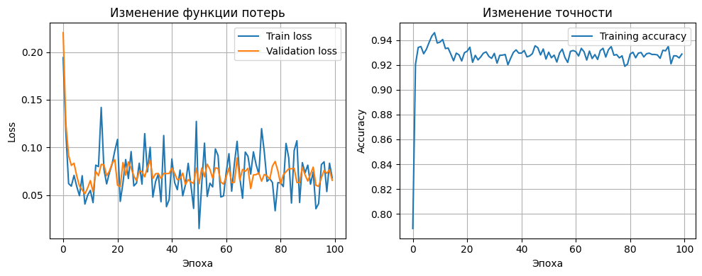
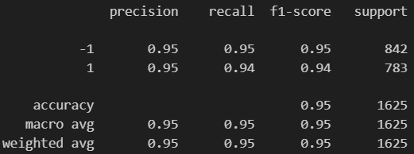
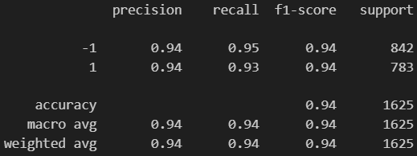

# Лабораторная работа №1. Линейная классификация

В рамках лабораторной работы предстоит реализовать линейный классификатор. И обучить его методом стохастического градиентного спуска с инерцией с L2 регуляризацией и квадратичной функцией потерь.

# Задание

1. выбрать датасет для классификации, например на [kaggle](https://www.kaggle.com/datasets?&tags=13304-Clustering);
2. реализовать вычисление отступа объекта (визуализировать, проанализировать);
3. реализовать вычисление градиента функции потерь;
4. реализовать рекуррентную оценку функционала качества;
5. реализовать метод стохастического градиентного спуска с инерцией;
6. реализовать L2 регуляризацию;
7. реализовать скорейший градиентный спуск;
8. реализовать предъявление объектов мо модулю отступа;
9. обучить линейный классификатор на выбранном датасете;
   1. обучить с инициализацией весов через корреляцию;
   2. обучить со случайной инициализацией весов через мультистарт;
   3. обучить со случайным предъявлением и с п.8;
10. оценить качество классификации;
11. сравнить лучшую реализацию с эталонной;
12. подготовить отчет.

# Решение

1. Был выбран датасет [Mushrooms](https://archive.ics.uci.edu/ml/datasets/Mushroom) для задачи бинарной классификации. Код для загрузки датасета в `source/data_loaders/datasets.py` функция `load_mushroom_dataset`.

2. Для вычисления отступа мы берём разделяющую функцию и домножаем её результаты на истинные метки класса. Т.о. получаем отступ объекта от разделяющей поверхности. Если значение M < 0, то классификатор ошибкается, если значения в районе 0, то предсказания неуверенные, если отступ большой, то классификация уверенная. Код реализации здесь `source/tools/utils.py` функция `get_margins`.

3. Вычисление градиента функции потерь по весам реализовано последовательно для каждого слоя, начиная от самой Loss функции. Код лежит в каждом слое и структурном элементе в функции `backward_pass` или `pd_wrt_w` (для регуляризаторов).

4. Оценка функционала качества может осуществляться в данной работе 3-я способами (см. `source/models/abc_model.py` функция `_count_verbose`):
   - сохраняя усредненный результат каждой эпохи по батчам,
   - используя SMA (Simple Moving Averages) - каждое значение имеет одинаковый вес,
   - используя EMA (Exponential Moving Averages) - последние значения имеют больший вес.

5. Метод стохастического градиентного спуска с импульсами реализован в `source/optimizers/gd_optimizer.py` функции `step`. Импульсы позволяют накапливать предыдущие значения градиента и использовать их при проходе локальных минимумов по инерции. Чтобы оценить сколько градиентов учитывается в импульсе можно посчитать `N = 2/(1 - momentum) + 1`.

6. Реализация L2 регуляризации лежит в `source/regularizers/l2_regularizer.py`. Позволяет сглаживать градиентный спуск за счёт штрафа за большие значения градиентов весов. В отличии от L1 не создаёт разреженные решения (много нулей).

7. Метод градиентного спуска реализован в `source/optimizers/gd_optimizer.py` функции `step`.

8. Предъявление объектов мо модулю отступа реализовано в `source/data_loaders/module_margin_loader.py` и реализация его применения в `source/models/abc_model.py` в методе `train_model`. Пороги для выбора объектов по отступам мы задаём автоматически на основе статистик:
   - порог для отсечения хороших объектов `threshold_good_objects = mean_M + 0.5*std_M`,
   - порог для отсечения выбросов `threshold_outliners = mean_M - 2*std_M`.

9. Обучение линейного классификатора на выбранном датасете лежит в файле `source/main.py`:
   - обучение с инициализацией весов через корреляцию в функции `train_model_w_correlation_init`. График и метрики:

   - обучение со случайной инициализацией весов через мультистарт в функции `train_model_w_multistart_init`. График и метрики:

   - обучение со случайным предъявлением и с предъявлением объектов мо модулю отступа в функции `train_model_w_margins`. График и метрики:

___

Лучшая реализация в файле `source/main.py` функция `train_model_best`:

Эталонная реализация:

