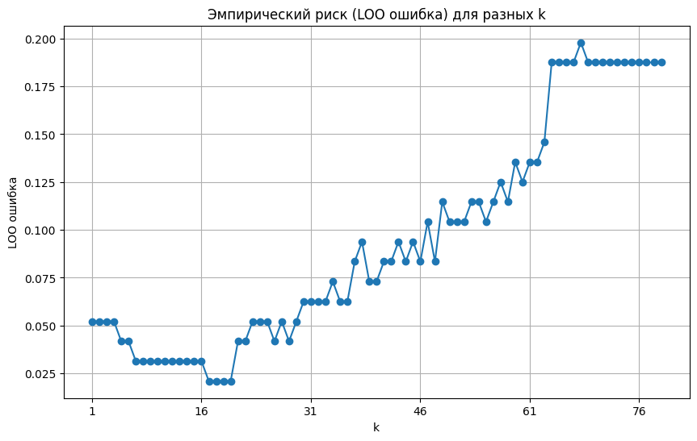
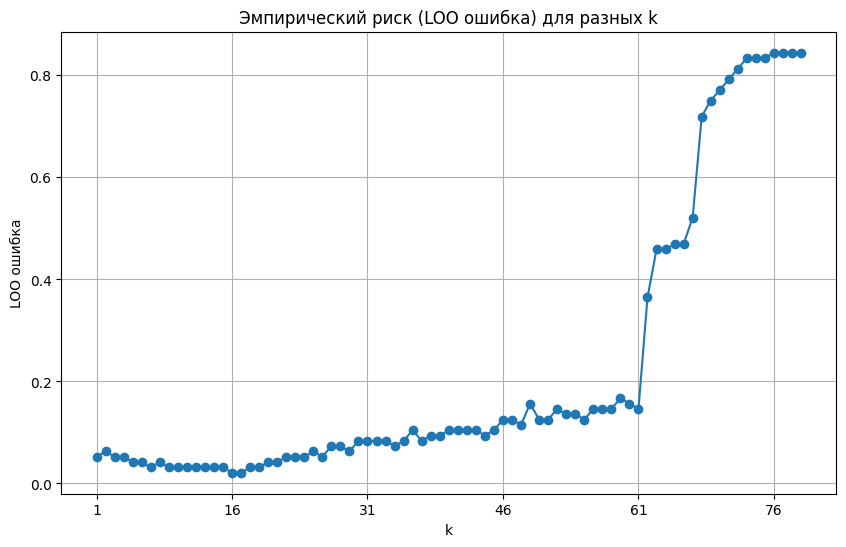
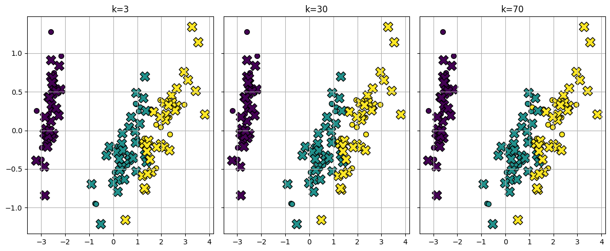
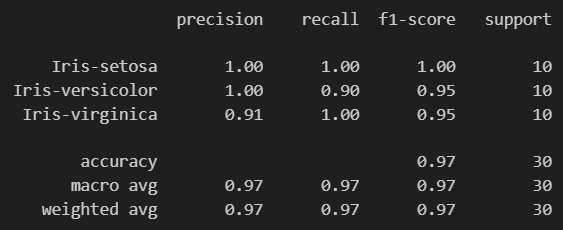
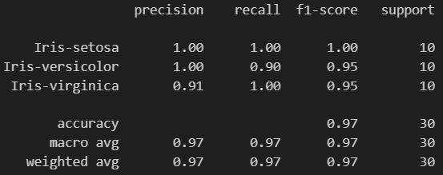

# Лабораторная работа №2. Метрическая классификация

В рамках лабораторной работы реализован алгоритм классификации KNN и метод подобора параметра k с помощью скользящего контроля.

## Задания

1. Выбрать датасет для классификации, например на [kaggle](https://www.kaggle.com/datasets?tags=13302-Classification).
2. Реализовать алгоритм KNN с методом окна Парзена переменной ширины:
   - в качестве ядра можно использовать гауссово ядро.
3. Подобрать параметр k методом скользящего контроля (LOO).
4. Обосновать выбор параметров алгоритма, построить графики эмпирического риска для различных k.
5. Сравнить с [эталонной](https://scikit-learn.org/stable/) реализацией KNN:
   - сравнить качество работы алгоритмов.
6. Реализовать алгоритм отбора эталонов.
7. Подготовить визуализацию результатов работы алгоритма отбора эталонов.
8. Сравнить качество работы KNN с и без отбора эталонов.

## Решения

1. Был выбран датасет для классификации [Iris](https://www.kaggle.com/datasets/uciml/iris/data).

2. Реализован алгоритм KNN с методом окна Парзена переменной ширины, где в качестве ядра используется гауссово ядро. Код лежит в файле `source/model.py`.

В этом алгоритме вычисляем расстояния объекта до всех других, потом считаем h (ширина окна) как расстояние до k-го соседа. Вместо голосования используем Гауссово ядро, которое задаёт плавное убывание веса с увеличением расстояния. В конце считаем веса для каждой метки, которая встречается в предсказаниях и выбираем метку с максимальным весом.

3. Реализован алгоритм отбора параметра k методом Leave-One-Out в файле `source/selector.py`.

Суть в том, чтобы считать ошибки методом кросс-валидации с выбросом одного объекта из выборки. Выбирается тот параметр k, который показывает меньшую ошибку.

4. Построение графика эмпирического риска для различных k реализовано в файле `source/visualizer.py` функции `vis_LOO_errors`. Оптимальное k=17 с ошибкой LOO=0.0208.

5. Сравнение с [эталонной реализацией KNN](https://scikit-learn.org/stable/modules/generated/sklearn.neighbors.KNeighborsClassifier.html), где оптимальное k=16 с ошибкой LOO=0.0208:

6. Реализован метод отбора эталонов на основе кластеризации в файле `source/model.py` метод `cluster_fit`.

Суть метода в том, что классы делятся на кластеры с помощью k-средних. Далее центры кластеров становятся эталонами с которыми в дальнейшем идёт сравнение при предикте. Т.о. мы сравниваем поступающий объект не со всем набором данных, а только с выбранными эталонами.

7. Подготовлена визуализация работы алгоритма отбора эталонов.

Функция `visualize_knn_predictions` реализована в `source/visualizer.py`.

8. Сравнение качества работы KNN с и без отбора эталонов.

Для KNN без отбора эталонов с k=17:

Для KNN с отбором эталонов с помощью жадного алгоритма удаления объектов, где k=5:

