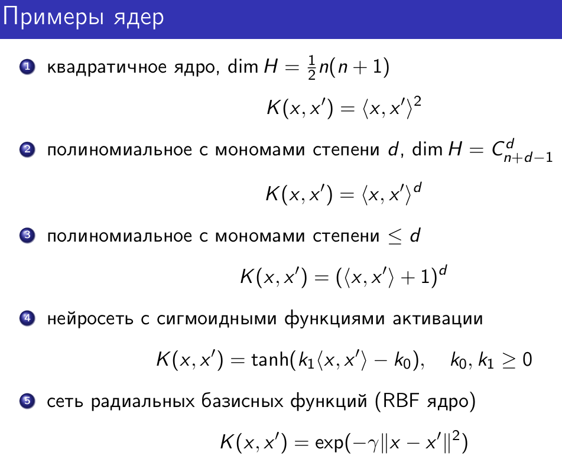
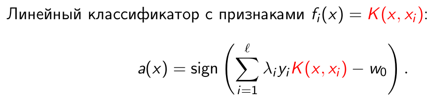
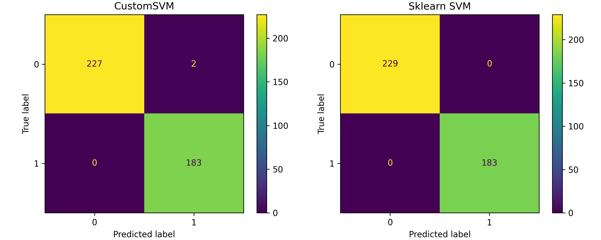
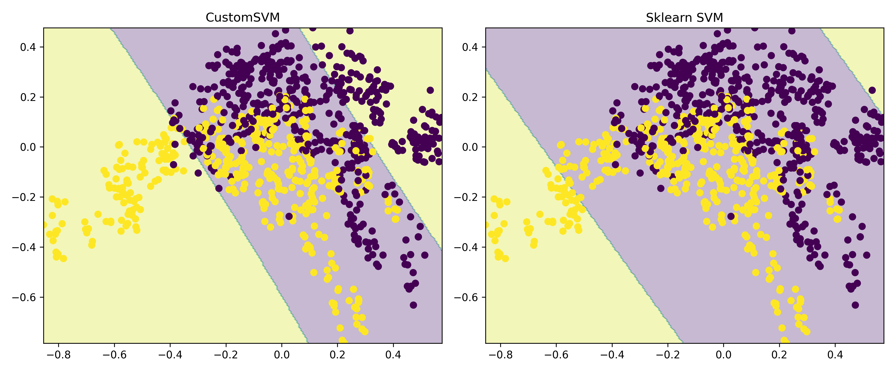
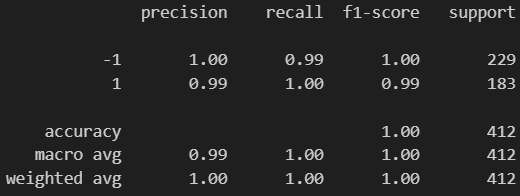
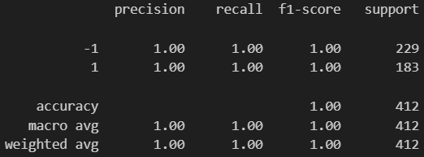

# Лабораторная работа №3. SVM

В рамках лабораторной работы реализован SVM и произведено сравнение с эталонной реализацией алгоритма.

## Теоретическая часть

На лекции рассмотрели две постановки задачи SVM: аналитическая и геометрическая.
Показали, как геометрическая постановка приводит к задаче квадратичного программирования.
Рассмотрели решение двойственной задачи по лямбда.
Показали, как с помощью трюка с ядром можно строить нелинейные классификаторы.
Рассмотрели различные ядра и их свойства.
Рассмотрели различные способы регуляризации и их влияние на отбор признаков.

## Задание

1. выбрать датасет для бинарной классификации;
2. реализовать решение двойственной задачи по лямбда; для решения задачи использовать [scipy.optimize.minimize](https://docs.scipy.org/doc/scipy/reference/generated/scipy.optimize.minimize.html#scipy.optimize.minimize) или любую другую библиотеку;
3. провернуть трюк с ядром;
4. построить линейный классификатор;
5. визуализировать решение;
6. сравнить с эталонным решением;

## Решение

1. Выбран датасет [Banknote authentication](https://www.kaggle.com/datasets/romaneyvazov/32-dsdds) для бинарной классификации.
2. Реализовано решение двойственной задачи по лямбда (`source.svm_model.CustomSVM.objective_function`).

Для решения задачи использовали [scipy.optimize.minimize](https://docs.scipy.org/doc/scipy/reference/generated/scipy.optimize.minimize.html#scipy.optimize.minimize).

```python
def objective_function(self, l, y):
    return 0.5*np.sum((l[:, None]*l[None, :])*(y[:, None]*y[None, :])*self.K) - np.sum(l)
```

3. Реализовали kernel trick (`source/utils.py`).



```python
def linear_kernel(x, y):
    return np.dot(x, y)


def poly_kernel(x, y, degree=3):
    return (np.dot(x, y) + 0.0)**degree


def rbf_kernel(x, y, gamma):
    diff = x - y
    return np.exp(-gamma*np.dot(diff, diff))
```

4. Реализация линейного классификатора (`source.svm_model.CustomSVM.predict`).



```python
def predict(self, X):
    K = np.array([[self.kernel(x, sv) for sv in self.support_vectors] for x in X])
    return np.sign(K@(self.support_lambdas*self.support_y) + self.b)
```

5. Визуализация решений.

Confusion matrix:



Разграничительная полоса:



6. Сравнение с эталонным решением.

Кастомное решение:



Эталонное решение:


___

Для проверки работы кода необходимо настроить виртуальное окружение и запустить main.py файл.

Настройки среды:

```bash
python -m venv .venv
source .venv/bin/activate
pip install -U scikit-learn SciPy kagglehub pandas matplotlib
```

Код для запуска кода:

```bash
python ./main.py
```