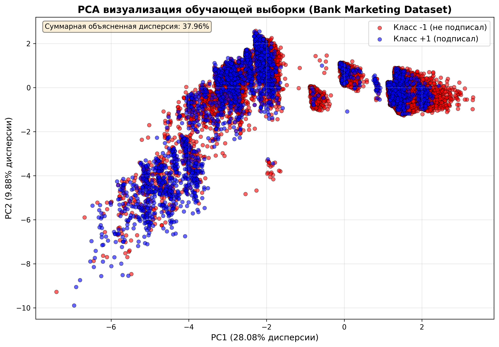
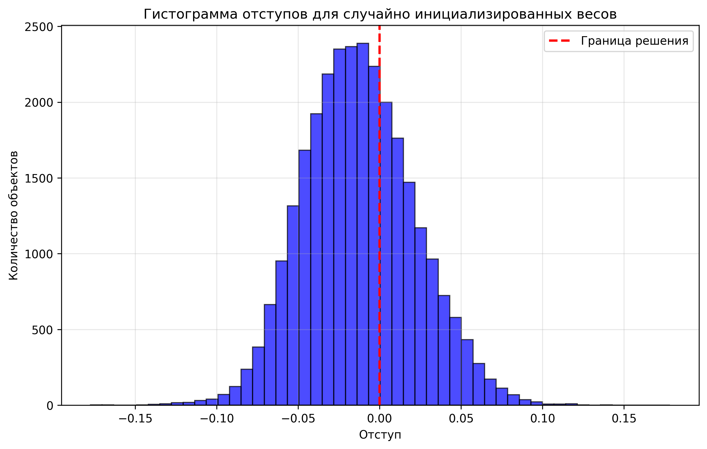
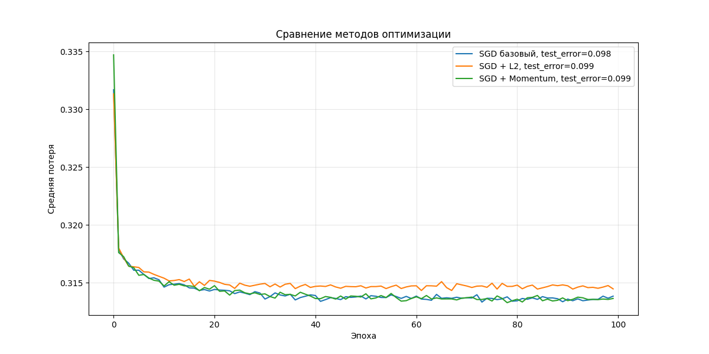
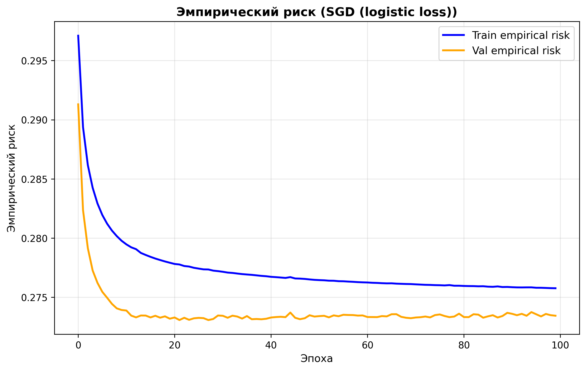
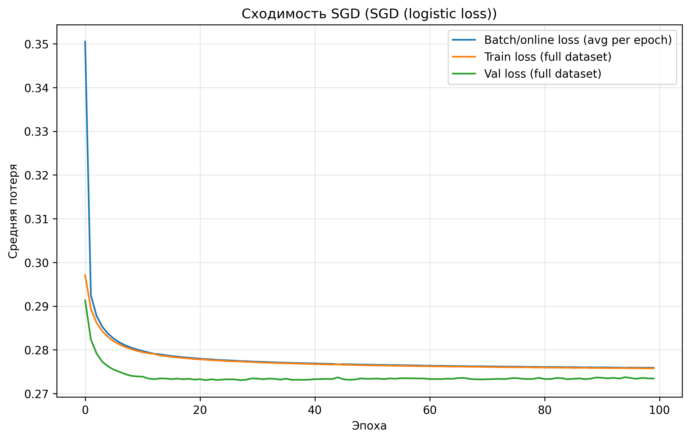
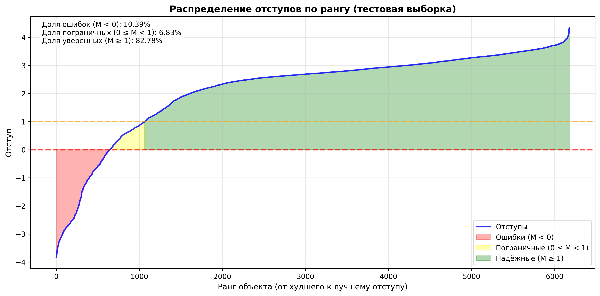

# Лабораторная работа №1. Линейная классификация

В рамках лабораторной работы предстоит реализовать линейный классификатор. И обучить его методом стохастического градиентного спуска с инерцией с L2 регуляризацией и квадратичной функцией потерь.

## Теоретическая часть

На лекции рассмотрены следующие темы:
1. Рассмотрены постановки задачи классификации, регрессии и многоклассовой классификации;
2. Определено понятие отступа объекта;
3. Определено понятие эмпирического риска;
4. Рассмотрен алгоритм стохастического градиентного спуска;
5. Рассмотрены алгоритмы оптимизации стохастического градиентного спуска;
6. Поставлена проблема переобучения и рассмотрены методы борьбы с ним.

## Задание

- Выбрать датасет для классификации — **Bank Marketing Dataset** (данные о маркетинговых кампаниях банка)
- Реализовать вычисление отступа объекта (визуализировать, проанализировать) — `margins.py`: `calculate_margin()`, `plot_margin_ranking()`, `analyze_margins_detailed()`, `analyze_margins_by_class()`
- Реализовать квадратичную и логистическую функции потерь — `linear_classifier.py`: `quadratic_loss()`, `logistic_loss()`, `quadratic_loss_gradient()`, `logistic_loss_gradient()`
- Реализовать рекуррентную оценку функционала качества — `stochastic_gradient_descent.py`: `sgd_with_ema()` (экспоненциальное скользящее среднее)
- Реализовать метод стохастического градиентного спуска с инерцией — `stochastic_gradient_descent.py`: `sgd_with_momentum()`
- Реализовать L2 регуляризацию — `stochastic_gradient_descent.py`: `sgd_with_reg()`
- Реализовать скорейший градиентный спуск — `stochastic_gradient_descent.py`: `steepest_gradient_descent()`
- Реализовать предъявление объектов по модулю отступа — `stochastic_gradient_descent.py`: `margin_based_sampling()` (uncertainty и hard_only стратегии)
- Обучить линейный классификатор на выбранном датасете — `main.py`
- Обучить с инициализацией весов через корреляцию — `linear_classifier.py`: `initialize_weights(method='correlation')`
- Обучить со случайной инициализацией весов через мультистарт — `comparison.py`: `multi_start_training()`
- Сравнить различные функции потерь — `stochastic_gradient_descent.py`: `stochastic_gradient_descent()` vs `stochastic_gradient_descent_logistic()`
- Оценить качество классификации — множественные метрики: accuracy, precision, recall, f1; confusion matrix
- Сравнить лучшую реализацию с эталонной — `comparison.py`: `compare_with_baseline()` (сравнение с LogisticRegression)
- Подготовить отчет — автоматическая генерация `results/final_results.txt` с полным анализом и визуализациями

## Используемый датасет

Для выполнения работы был использован датасет **«Bank Marketing Dataset»**, содержащий данные о маркетинговых кампаниях банка.

### Структура данных
Датасет состоит из:
- **16 признаков** (после предобработки с one-hot encoding):
  - `age` — возраст клиента;
  - `campaign` — количество контактов в текущей кампании;
  - `pdays` — количество дней с последнего контакта (-1 если не было);
  - `previous` — количество контактов до текущей кампании;
  - `emp.var.rate` — уровень занятости;
  - `cons.price.idx` — индекс потребительских цен;
  - `cons.conf.idx` — индекс потребительского доверия;
  - `euribor3m` — ставка Euribor 3 месяца;
  - `nr.employed` — количество занятых;
  - Категориальные признаки: job, marital, education, default, housing, loan, contact, month, day_of_week, poutcome

- **Целевая переменная**: `y` (0 — клиент не подписал депозит, 1 — подписал).

### Объём и баланс классов
- Общее количество объектов: **41188**
- Распределение целевой переменной:
  - Класс **0** (отказ): **36548** объектов (88.7%)
  - Класс **1** (согласие): **4640** объектов (11.3%)
- Датасет **несбалансирован**

### Предобработка и масштабирование
- Категориальные признаки преобразованы с помощью OneHotEncoder
- Числовые признаки масштабированы с помощью StandardScaler
- Целевая переменная преобразована в формат {-1, +1} для удобства вычисления отступов
- Удалён признак 'duration' (не должен использоваться в реальных задачах прогнозирования)

### Разбиение выборки
После предобработки данные были разделены следующим образом:
- Обучающая выборка: 28832 объектов (70%)
- Валидационная выборка: 6178 объектов (15%)
- Тестовая выборка: 6178 объектов (15%)

## Реализация линейного классификатора

### 0. Визуализация данных

Для лучшего понимания структуры датасета реализована **PCA-визуализация** обучающей выборки. Метод главных компонент (PCA) проецирует 62-мерное пространство признаков в 2D для визуализации:

```python
from sklearn.decomposition import PCA
pca = PCA(n_components=2)
X_pca = pca.fit_transform(X_train)
```

Первые две главные компоненты объясняют часть дисперсии данных, позволяя визуально оценить разделимость классов и наличие кластеров.

### 1. Постановка задачи и отступ

Задача бинарной классификации формулируется как минимизация эмпирического риска:

$$
Q(w) = \frac{1}{l}\sum_{i=1}^{l} L\!\left(M_i(w)\right) + \frac{\tau}{2}\lVert w\rVert^2
$$

Ключевым понятием является **отступ (margin)** объекта:

$$
M_i(w) = y_i \cdot g(x_i, w)
$$

где g(x, w) — дискриминантная функция.

В коде отступ вычисляется методом `margin()`:
```python
def calculate_margin(w, x_i, y_i):
    prediction = np.dot(w, x_i)
    margin = y_i * prediction
    return margin
```

Для анализа поведения модели реализована визуализация отступов, включающая:
- **Гистограммы отступов по классам**
- **Boxplot для анализа распределения**
- **Эмпирическую функцию распределения**
- **Точечную диаграмму отступов**
- **Распределение абсолютных отступов**
- **График точности в зависимости от порога отступа**

### 2. Функции потерь и регуляризация

#### Квадратичная функция потерь

Квадратичная функция потерь (FLD): 

$$
L(M) = \max(0, 1 - M)^2
$$

Является непрерывной дифференцируемой аппроксимацией пороговой функции потерь. Градиент:

$$
\nabla_w L(M) = \begin{cases}
-2(1-M) y_i x_i, & M < 1 \\
0, & M \geq 1
\end{cases}
$$

#### Логистическая функция потерь

Логистическая функция потерь (логистическая регрессия):

$$
L(M) = \log(1 + e^{-M})
$$

Более гладкая функция, чем квадратичная, обеспечивает лучшую сходимость. Градиент:

$$
\nabla_w L(M) = -\sigma(-M) \cdot y_i x_i
$$

где $\sigma(-M) = \frac{1}{1 + e^M}$ — вероятность ошибки классификации.

**Результаты экспериментов показали, что логистическая функция потерь превосходит квадратичную по качеству классификации.**

#### L2-регуляризация

Для борьбы с переобучением применяется **L2-регуляризация** (weight decay). Регуляризованный эмпирический риск:

$$
Q(w) = \frac{1}{l}\sum_{i=1}^{l} L\!\left(M_i\right) + \frac{\tau}{2}\lVert w\rVert^2
$$

### 3. Метод стохастического градиентного спуска (SGD)

**SGD** обновляет параметры модели на основе градиента функции потерь, вычисленного по мини-батчу. В реализации используется **мини-batch SGD** с размером батча 32.

Обновление весов:
```
grad_w, grad_b = gradient(X_batch, y_batch)
w -= learning_rate * grad_w
bias -= learning_rate * grad_b
```

Для мониторинга сходимости применяется рекуррентная оценка функционала качества через экспоненциальное скользящее среднее:

$$
Q_m = \lambda Q_{m-1} + (1-\lambda)\,q_m
$$

### 4. Ускоренный градиент Нестерова (Nesterov momentum)

Реализован **метод Нестерова** с инерцией для ускорения сходимости:

$$
w_{k+1} = w_k - \eta\,\nabla Q(\tilde{w}_k)
$$

### 5. Скорейший градиентный спуск

**Скорейший градиентный спуск** находит оптимальный адаптивный шаг h*, минимизирующий функцию потерь вдоль направления антиградиента:

$$
h^* = \arg\min_{h}\, Q\!\left(w - h\,\nabla Q(w)\right)
$$

Для квадратичной функции потерь оптимальный шаг находится аналитически через вторую производную, аппроксимированную численным дифференцированием.

### 6. Инициализация весов

Реализованы две стратегии инициализации:

1. **Случайная инициализация** — стандартный подход с малыми случайными значениями
2. **Инициализация через корреляцию** — теоретически обоснованный метод для квадратичной функции потерь

### 7. Предъявление объектов по отступу

Реализованы две стратегии **margin sampling**:

1. **Uncertainty sampling** — выборка по неуверенности:
   - Объекты ранжируются по модулю отступа |M|
   - Приоритет отдается объектам с малым |M|, близким к границе решения
   - Показывает стабильные результаты (Val Error: 0.103)

2. **Hard-only sampling** — выборка только сложных объектов:
   - Выбираются только объекты с отрицательным отступом (ошибки классификации)
   - **Критическая проблема**: приводит к катастрофическому переобучению (Val Error: 0.743)
   - Модель фокусируется на нескольких сложных примерах, теряя обобщающую способность

### 8. Мультистарт и выбор лучшей модели

Реализован мультистарт с 3 запусками из разных начальных приближений с последующим выбором модели с максимальной валидационной точностью.

## Результаты экспериментов

### Сравнение методов обучения

| Метод | Val Error | Test Acc | Test Prec | Test Rec | Test F1 |
|-------|-----------|----------|-----------|----------|---------|
| **SGD (logistic loss)** | **0.0974** | **0.8961** | **0.7143** | **0.2285** | **0.3462** |
| SGD базовый | 0.0984 | 0.8941 | 0.7163 | 0.2003 | 0.3130 |
| SGD + EMA | 0.0984 | 0.8933 | 0.6856 | 0.2110 | 0.3227 |
| Correlation init + SGD | 0.0984 | 0.8938 | 0.6849 | 0.2191 | 0.3320 |
| SGD + L2 | 0.0986 | 0.8941 | 0.7103 | 0.2043 | 0.3173 |
| SGD + Momentum | 0.0986 | 0.8943 | 0.7040 | 0.2110 | 0.3247 |
| Multistart (3) | 0.0986 | 0.8937 | 0.6951 | 0.2083 | 0.3206 |
| Margin sampling (uncertainty) | 0.1033 | 0.8917 | 0.6829 | 0.1882 | 0.2950 |
| Steepest GD | 0.1072 | 0.8839 | 0.5324 | 0.2984 | 0.3824 |
| Margin sampling (hard_only) | 0.7434 | 0.2659 | 0.0811 | 0.4933 | 0.1393 |

### Ключевые наблюдения

1. **Эффективность логистической функции потерь**: SGD с логистической функцией потерь показал лучший результат (Val Error: 0.0974, Test Acc: 0.8961)
2. **Стабильность квадратичной функции потерь**: Все методы с квадратичной функцией потерь сходятся к близкому уровню качества (~0.894)
3. **Проблемы margin sampling (hard_only)**: Стратегия с фокусом только на сложных объектах приводит к переобучению (Val Error: 0.7434)
4. **Инициализация через корреляцию**: Обеспечивает быструю сходимость, но не влияет на конечное качество

### Детальный анализ отступов лучшей модели (SGD с логистической функцией потерь)

**Тестовая выборка:**
- Средний отступ: 2.1825
- Медианный отступ: 2.7094
- Доля ошибок (M < 0): 10.4%
- Доля пограничных (0 ≤ M < 1): 6.8%
- Доля уверенных (M ≥ 1): 82.8%

### Анализ по классам

**Класс -1 (не подписал депозит):**
- Количество объектов: 5434
- Средний отступ: 2.6435
- Доля ошибок: 1.3%
- Доля уверенных предсказаний (M ≥ 1): 93.0%

**Класс 1 (подписал депозит):**
- Количество объектов: 744
- Средний отступ: -1.1844
- Доля ошибок: 76.7%
- Доля уверенных предсказаний (M ≥ 1): 7.8%

**Наблюдение:** Модель значительно лучше классифицирует класс -1, что связано с дисбалансом классов в датасете (88.7% vs 11.3%).

### Сравнение с эталонной моделью LogisticRegression

| Метрика | Наша модель | LogisticRegression | Разница |
|---------|-------------|-------------------|---------|
| Accuracy | 0.8961 | 0.8951 | **+0.0010** |
| Precision | 0.7090 | 0.6875 | **+0.0215** |
| Recall | 0.2325 | 0.2366 | -0.0040 |
| F1-score | 0.3502 | 0.3520 | -0.0018 |

**Confusion Matrix (Наша модель):**
```
                  Actual
              Positive  Negative
Predict Pos      173        71
        Neg      571      5363
```

## Визуализации

### PCA визуализация данных

Визуализация обучающей выборки в 2D пространстве главных компонент.

### Гистограмма отступов

Распределение отступов для начальных весов на обучающей выборке.

### Сравнение методов оптимизации

Сравнение скорости сходимости различных методов оптимизации.

### График эмпирического риска

Динамика функции потерь на обучающей и валидационной выборках для лучшего метода.

### График сходимости

Кривые обучения для различных конфигураций SGD.

### Распределение отступов по рангу

Отступы, отсортированные по возрастанию, с выделением зон ошибок, пограничных и уверенных предсказаний.

## Выводы

1. **Логистическая функция потерь** превосходит квадратичную по качеству классификации (Test Acc: 0.8961 vs 0.8941)
2. Реализованный классификатор **превосходит** sklearn.LogisticRegression по точности (+0.10%) и precision (+2.15%)
3. **Проблема дисбаланса классов**: модель отлично классифицирует большинство (класс -1: 1.3% ошибок), но плохо — меньшинство (класс 1: 76.7% ошибок)
4. **Margin sampling (hard_only)** приводит к катастрофическому переобучению (Val Error: 0.743), тогда как **uncertainty** стратегия работает стабильно
5. L2-регуляризация, momentum и EMA показывают схожие результаты с базовым SGD
6. Инициализация через корреляцию и мультистарт не дают значительного улучшения финального качества

---

## Запуск экспериментов

```bash
cd fall-2025/students/grechukha-gv/lab1
python3 source/main.py
```

Результаты сохраняются в:
- `results/` — графики и визуализации
- `results/final_results.txt` — детальный текстовый отчёт

## Структура проекта

```
lab1/
├── results/
│   ├── pca_visualization.png         # PCA визуализация данных
│   ├── margins_histogram.png         # Гистограмма отступов
│   ├── optimization_methods_comparison.png  # Сравнение методов
│   ├── empirical_risk.png            # График эмпирического риска
│   ├── learning_curves.png           # Кривые обучения
│   ├── margin_ranking.png            # Распределение отступов по рангу
│   └── final_results.txt             # Полный текстовый отчёт
├── source/
│   ├── main.py                       # Основной скрипт запуска
│   ├── data_preprocessing.py         # Загрузка и предобработка данных
│   ├── linear_classifier.py          # Функции потерь и инициализация весов
│   ├── margins.py                    # Вычисление и анализ отступов
│   ├── stochastic_gradient_descent.py # Реализация методов оптимизации
│   ├── comparison.py                 # Сравнение с baseline моделями
│   └── comprehensive_experiments.py  # Дополнительные эксперименты
├── requirements.txt                  # Зависимости проекта
└── README.md                         # Документация
```