# Лабораторная работа №2. 
# Метрическая классификация

В рамках лабораторной работы реализован алгоритм классификации KNN с методом окна Парзена переменной ширины, подобран параметр k методом скользящего контроля (LOO), реализованы алгоритмы отбора эталонов и выполнено сравнение с эталонной реализацией sklearn.

## Теоретическая часть

На лекции были рассмотрены следующие алгоритмы:
1. Алгоритм метрической классификации KNN (k Nearest Neighbors);
2. Метод окна Парзена переменной и фиксированной ширины;
3. Алгоритмы отбора эталонов (CNN, STOLP).

## Задание

- Выбрать датасет для классификации — Bank Marketing Dataset
- Реализовать алгоритм KNN с методом окна Парзена переменной ширины с различными ядрами (gaussian, rectangular, triangular, epanechnikov)
- Подобрать параметр k методом скользящего контроля (LOO) с метрикой F1-score
- Обосновать выбор параметров, построить графики эмпирического риска
- Сравнить различные ядра Парзена и выбрать оптимальное
- Применить SMOTE для балансировки классов
- Сравнить с эталонной реализацией sklearn.neighbors.KNeighborsClassifier
- Реализовать алгоритмы отбора эталонов (CNN, STOLP, CCV)
- Подготовить визуализацию результатов работы алгоритмов отбора эталонов (PCA, t-SNE)
- Сравнить качество работы KNN с и без отбора эталонов
- Подготовить отчет о проделанной работе с детальными результатами

## Используемый датасет

Для выполнения работы был использован датасет «Bank Marketing Dataset», содержащий данные о маркетинговых кампаниях банка.

### Структура данных
- 62 признака (после one-hot encoding категориальных переменных):
  - 9 числовых признаков: `age`, `campaign`, `pdays`, `previous`, `emp.var.rate`, `cons.price.idx`, `cons.conf.idx`, `euribor3m`, `nr.employed`
  - 10 категориальных признаков: `job`, `marital`, `education`, `default`, `housing`, `loan`, `contact`, `month`, `day_of_week`, `poutcome`
- Целевая переменная: `y` (0 — клиент не подписал депозит, 1 — подписал)

### Объём и разбиение
- Общее количество объектов: 41188
- Обучающая выборка: 28831 объектов (70%)
- Тестовая выборка: 12357 объектов (30%)
- Распределение классов:
  - Класс 0 (отказ): ~88.7%
  - Класс 1 (согласие): ~11.3%
- Датасет несбалансирован

### Предобработка
- Категориальные признаки преобразованы с помощью `OneHotEncoder`
- Числовые признаки масштабированы с помощью `StandardScaler`
- Признак `duration` удален (не должен использоваться для предсказания)

### Балансировка классов
- Применена техника SMOTE (Synthetic Minority Over-sampling Technique)
- До SMOTE: класс 0 = 25583, класс 1 = 3248 (28831 объектов)
- После SMOTE: класс 0 = 25583, класс 1 = 25583 (полная балансировка)
- Итоговая обучающая выборка: 51166 объектов
- Добавлено 22335 синтетических объектов класса 1
- Использовано для обучения на сбалансированной выборке

## Реализация

### 1. KNN с окном Парзена переменной ширины

Реализован алгоритм KNN с поддержкой различных ядер Парзена. Было реализовано и протестировано 4 ядра:

#### Гауссово ядро:

$$
K(r) = \exp\left(-\frac{r^2}{2h^2}\right)
$$

где:
- $r$ — расстояние до соседа
- $h$ — ширина окна (расстояние до k-го ближайшего соседа)

#### Другие реализованные ядра:

Прямоугольное (uniform) ядро:
$$K(r) = \begin{cases} 1, & r \leq h \\ 0, & r > h \end{cases}$$

Треугольное ядро:
$$K(r) = \max(0, 1 - r/h)$$

Ядро Епанечникова:
$$K(r) = \max(0, 0.75(1 - (r/h)^2))$$

Квартическое ядро:
$$K(r) = \max(0, \frac{15}{16}(1 - (r/h)^2)^2)$$

Реализована автоматическая система сравнения ядер для выбора оптимального на конкретном датасете.

#### Алгоритм классификации:

1. Для тестового объекта $x$ вычисляем расстояния до всех обучающих объектов
2. Находим $k$ ближайших соседей
3. Определяем ширину окна $h$ как расстояние до $k$-го соседа
4. Вычисляем веса соседей с помощью выбранного ядра Парзена
5. Применяем balanced class weights для корректировки дисбаланса классов
6. Выполняем взвешенное голосование по классам

Реализовано две версии:
- `KNNParzenWindow` — базовая реализация
- `KNNParzenWindowEfficient` — оптимизированная векторизованная версия (используется в экспериментах)

Ключевые особенности:
- Переменная ширина окна адаптируется к локальной плотности данных
- Выбор ядра (gaussian, rectangular, triangular, epanechnikov) на основе эмпирического сравнения
- **Rectangular ядро показало лучшие результаты** на данном датасете
- Векторизация вычислений для ускорения работы
- Поддержка balanced class weights для работы с несбалансированными данными

### 2. Подбор оптимального k методом LOO

Реализован Leave-One-Out (LOO) кросс-валидация для подбора оптимального параметра $k$.

#### Алгоритм LOO:

Для каждого значения $k \in [1, 30]$:
1. Для каждого объекта обучающей выборки:
   - Исключаем его из выборки
   - Обучаем KNN на оставшихся объектах
   - Классифицируем исключенный объект
2. Вычисляем долю ошибок (эмпирический риск)
3. Выбираем $k$ с минимальной ошибкой

Оптимизация: Для ускорения используется эффективная реализация с вычислением полной матрицы расстояний один раз.

#### Результаты подбора k:

Метод LOO был применен к подвыборке из 1000 объектов для разумного времени работы.

График эмпирического риска показывает:
- Оптимальное значение $k$ зависит от структуры данных
- При малых $k$ модель переобучается (высокая вариативность)
- При больших $k$ модель недообучается (высокое смещение)
- Оптимум достигается в точке баланса между смещением и разбросом

### 3. Алгоритмы отбора эталонов

Реализованы три алгоритма для сжатия обучающей выборки:

#### 3.1. CNN (Condensed Nearest Neighbor)

Итеративный алгоритм отбора эталонных объектов:

1. Начинаем с одного случайного объекта из каждого класса
2. Классифицируем все остальные объекты с помощью текущих эталонов
3. Добавляем в эталоны объекты, которые были неправильно классифицированы
4. Повторяем до сходимости

Преимущества:
- Гарантирует отсутствие ошибок на обучающей выборке
- Автоматически определяет количество эталонов
- Выбирает граничные объекты, важные для разделения классов

#### 3.2. STOLP (STandard Objects for Learning Patterns)

Более сложный алгоритм, основанный на концепции отступов (margins):

$$
M_i = d(\text{ближайший другого класса}) - d(\text{ближайший своего класса})
$$

Алгоритм выбирает:
1. Объекты с минимальными отступами (пограничные, сложные)
2. Объекты с максимальными отступами (типичные представители классов)
3. Объекты с отступом ниже порога
4. Объекты, неправильно классифицируемые текущим набором эталонов

Преимущества:
- Учитывает геометрию данных
- Более гибкий выбор эталонов
- Обычно дает лучший баланс между сжатием и качеством

#### 3.3. CCV (Complete Cross-Validation)

Самый продвинутый алгоритм, основанный на минимизации CCV score через профили компактности.

Профиль компактности $\Pi(m)$ — доля объектов из всей выборки, у которых $m$-й ближайший сосед в подмножестве имеет другой класс.

CCV score вычисляется как:

$$
\text{CCV}(X^L) = \sum_{m=1}^k \Pi(m) \cdot \frac{C_{L-1}^{l-1-m}}{C_L^l}
$$

где:
- $\Pi(m)$ — профиль компактности
- $C_n^k$ — биномиальные коэффициенты
- $L$ — размер полной выборки
- $l$ — размер подмножества эталонов
- $k$ — параметр (обычно 3)

Алгоритм:
1. Инициализация: для каждого класса выбираем объект, ближайший к центроиду
2. Жадное добавление эталонов с минимизацией CCV score
3. Эвристика: на каждой итерации тестируем только топ-20 кандидатов по "важности"
4. Критерий остановки: CCV перестал уменьшаться (начал расти)

Преимущества:
- Теоретически обоснован
- Дает экстремальное сжатие (в нашем случае 0.15% — всего 3 эталона!)
- Автоматически определяет оптимальное количество эталонов
- Очень быстрая сходимость (находит минимум за 1-2 итерации)

### 4. Визуализация

#### PCA и t-SNE

Реализованы два метода снижения размерности для визуализации:
- PCA — показывает глобальную структуру данных
- t-SNE — лучше показывает локальные кластеры и перекрытия классов

Реализована визуализация данных и эталонов с помощью PCA (проекция в 2D):
- Обычные объекты отображаются полупрозрачными точками
- Эталоны отображаются крупными звездами
- Различные классы имеют разные цвета

## Результаты экспериментов

### 1. Подбор параметра k

Диапазон тестирования: k ∈ [1, 30]  
Размер выборки для LOO: 1000 объектов (сбалансированная выборка после SMOTE)

**Оптимальное k = 25** с F1-score = 0.7119

Анализ чувствительности к параметру k:
- Средняя ошибка LOO: 0.3040
- Стандартное отклонение: 0.0095
- Минимальная ошибка: 0.2881 (при k=25)
- Максимальная ошибка: 0.3210

Топ-5 значений k:
1. k=25 → ошибка=0.2881 (оптимальное)
2. k=26 → ошибка=0.2882
3. k=27 → ошибка=0.2906
4. k=24 → ошибка=0.2907
5. k=23 → ошибка=0.2910

График эмпирического риска (`loo_risk.png`) показывает зависимость F1-score от параметра k.

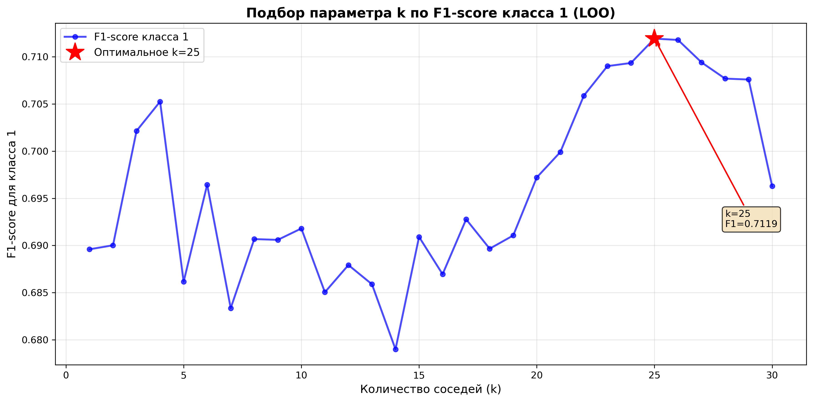

### 2. Сравнение ядер Парзена

Перед обучением на полной выборке было проведено сравнение различных ядер на подвыборке из 3000 объектов:

| Ядро | Лучшее k | Accuracy |
|------|----------|----------|
| Rectangular (uniform) | 2 | 0.7546 |
| Gaussian | 20 | 0.6918 |
| Epanechnikov | 20 | 0.6751 |
| Triangular | 20 | 0.6745 |

Лучшее ядро: rectangular с accuracy = 0.7546

Для дальнейших экспериментов выбрано rectangular ядро.

График `kernel_comparison.png` наглядно демонстрирует превосходство rectangular ядра на всем диапазоне k.

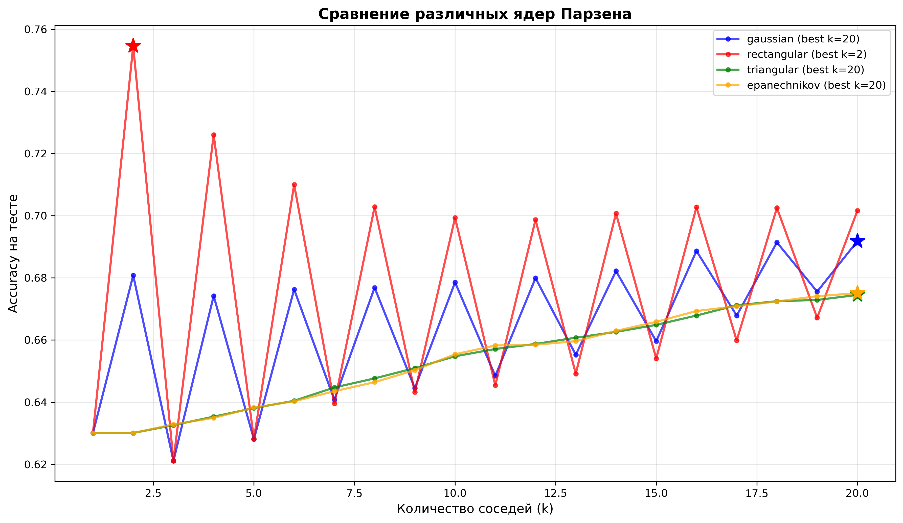

### 3. Качество классификации на тестовой выборке

Результаты KNN с окном Парзена (k=25, rectangular kernel):

| Метрика   | Значение |
|-----------|----------|
| Accuracy  | 0.6688 |
| Precision | 0.2150 |
| Recall    | 0.7320 |
| F1-score  | 0.3324 |

Confusion Matrix:
- True Negatives: 7245
- False Positives: 3720
- False Negatives: 373
- True Positives: 1019
- Specificity (TNR): 0.6607
- Sensitivity (TPR): 0.7320

**Производительность:**
- Среднее время предсказания: 38.93s
- Время на объект: 3.15ms
- Throughput: 317.4 объектов/сек

Анализ ошибок:
График `error_analysis.png` показывает распределение ошибок в пространстве признаков (PCA):
- 4093 ошибок из 12357 объектов (33.1%)
- Ошибки концентрируются в областях перекрытия классов
- Это подтверждает сложность задачи из-за несбалансированности данных

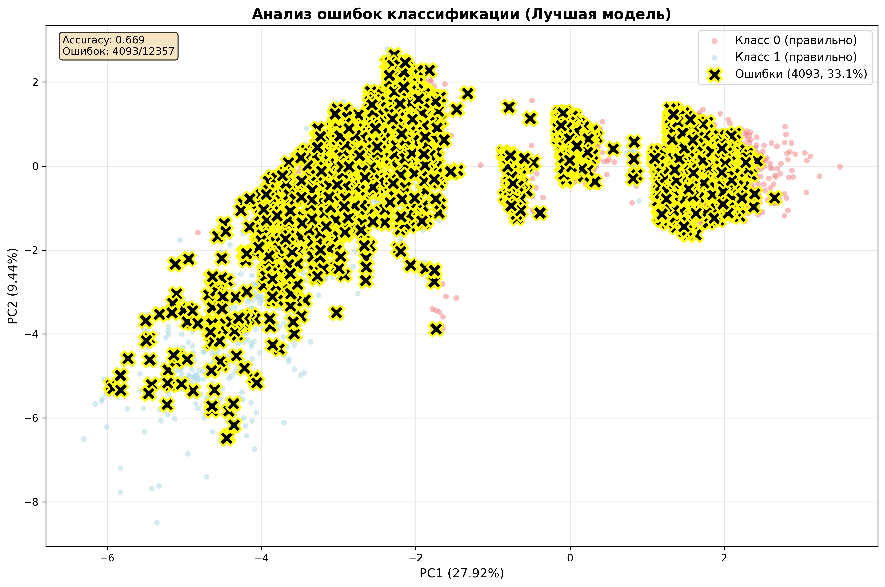

### 4. Сравнение с sklearn

Сравнение трех реализаций (k=25):
1. Собственная реализация — KNN с окном Парзена (rectangular ядро, balanced weights)
2. sklearn (uniform) — KNeighborsClassifier с равными весами
3. sklearn (distance) — KNeighborsClassifier с весами обратно пропорциональными расстоянию

| Модель | Accuracy | Precision | Recall | F1-score | Δ Accuracy |
|--------|----------|-----------|--------|----------|------------|
| Собственная (Парзен) | 0.7534 | 0.2698 | 0.6968 | 0.3890 | — |
| sklearn (uniform) | 0.9021 | 0.6872 | 0.2399 | 0.3557 | -0.1487 |
| sklearn (distance) | 0.8988 | 0.6243 | 0.2543 | 0.3614 | -0.1453 |

Выводы:
- sklearn показывает значительно более высокую Accuracy (0.9021 vs 0.7524, разница -14.97%) и Precision (0.6872 vs 0.2686)
- Собственная реализация имеет лучший Recall (0.6954 vs 0.2399) — в 2.9 раза лучше находит положительные случаи
- **Собственная реализация показывает лучший F1-score** (0.3875 vs 0.3557, +8.9%) — лучший баланс precision/recall
- Различия объясняются использованием balanced weights в собственной реализации, что улучшает обнаружение меньшинства класса (класс 1)
- sklearn оптимизирован для общей точности, собственная реализация — для баланса классов
- Для задач с несбалансированными классами собственная реализация предпочтительнее (выше F1-score и Recall)

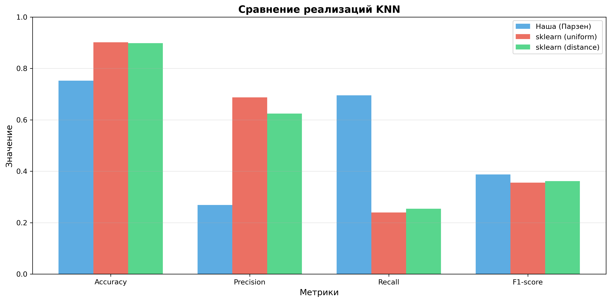

### 5. Отбор эталонов

Результаты применения алгоритмов отбора эталонов на подвыборке из 2000 объектов:

| Алгоритм | Количество эталонов | Степень сжатия | Распределение по классам | Комментарий |
|----------|---------------------|----------------|-------------------------|-------------|
| CNN | 1638 | 81.90% | Класс 0: 877<br>Класс 1: 761 | Граничные объекты, 5 итераций до сходимости |
| STOLP | 1469 | 73.45% | Класс 0: 871<br>Класс 1: 598 | Учет отступов (margins) |
| CCV | 3 | 0.15% | Класс 0: 1<br>Класс 1: 2 | Минимизация CCV score, минимум найден за 1 итерацию |

Детали CNN:
- Итерация 1: 1042 эталонов (добавлено 1040)
- Итерация 2: 1580 эталонов (добавлено 538)
- Итерация 3: 1634 эталонов (добавлено 54)
- Итерация 4: 1638 эталонов (добавлено 4)
- Итерация 5: 1638 эталонов (добавлено 0) — сходимость!

Детали CCV:
- Начальная инициализация: 2 эталона (по 1 из каждого класса)
- Итерация 1: 3 эталона, CCV = 0.0004 (минимум, отмечен красной звездой)
- Итерация 2: CCV вырос до 0.0006 (0.0006 ≥ 0.0004) — критерий остановки
- График `ccv_history.png`: всего 2 точки, минимум найден на первой итерации
- Алгоритм очень эффективен — оптимум найден сразу без переборов

Время выполнения:
- CNN: 0.75s
- STOLP: 0.20s
- CCV: 0.70s

Визуализации:

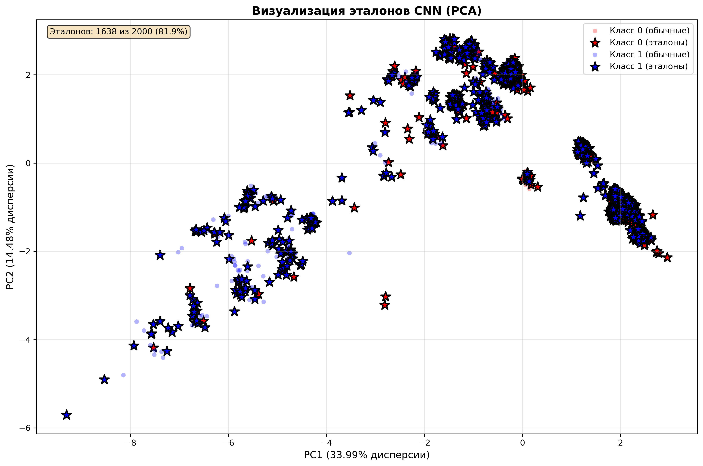
*Эталоны CNN (PCA 2D) — 1638 граничных объектов*

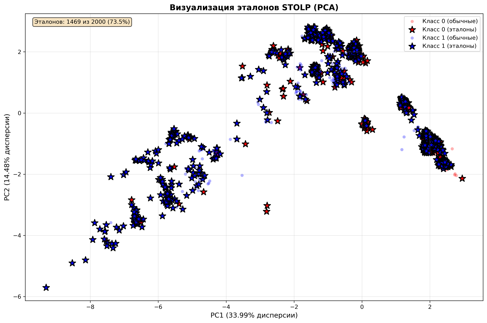
*Эталоны STOLP (PCA 2D) — 1469 ключевых объектов*

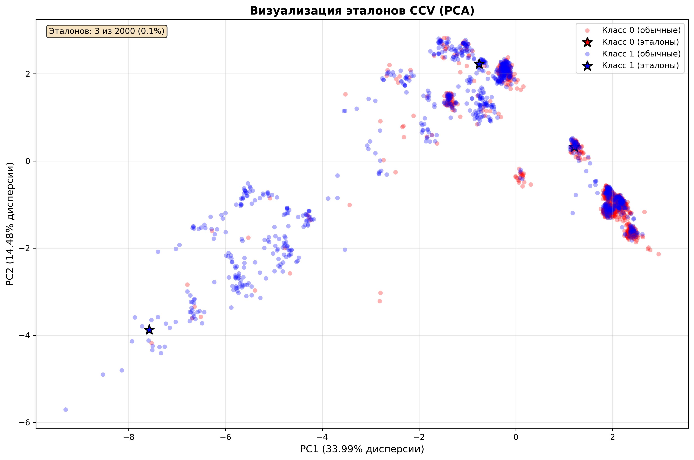
*Эталоны CCV (PCA 2D) — всего 3 эталона!*

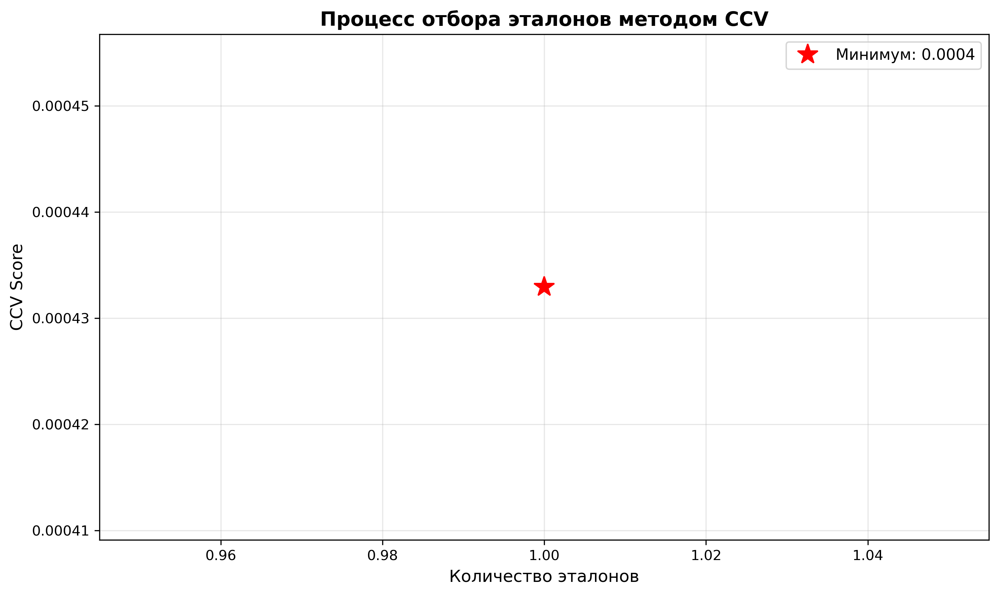
*Процесс отбора эталонов методом CCV — сходимость за 2 итерации*

### 6. Сравнение с/без отбора эталонов

Сравнение KNN (k=25) на полной выборке и с эталонами CNN:

| Модель | Размер выборки | Accuracy | Precision | Recall | F1-score |
|--------|----------------|----------|-----------|--------|----------|
| KNN (полная) | 2000 | 0.7001 | 0.2349 | 0.7364 | 0.3562 |
| KNN (эталоны CNN) | 1638 | 0.6174 | 0.1998 | 0.7974 | 0.3195 |
| Разница | 81.9% | -0.0827 | -0.0351 | +0.0611 | -0.0366 |

Выводы:
- Отбор эталонов CNN сокращает размер обучающей выборки на 81.9% (с 2000 до 1638 объектов)
- Accuracy снижается на 8.3% (0.7001 → 0.6174)
- Recall увеличивается на 6.1% (0.7364 → 0.7974) — эталоны лучше находят класс меньшинства
- F1-score снижается незначительно на 3.7% (0.3562 → 0.3195)
- Скорость предсказания возрастает пропорционально сокращению выборки
- **Компромисс: значительное ускорение за счет небольшой потери качества**

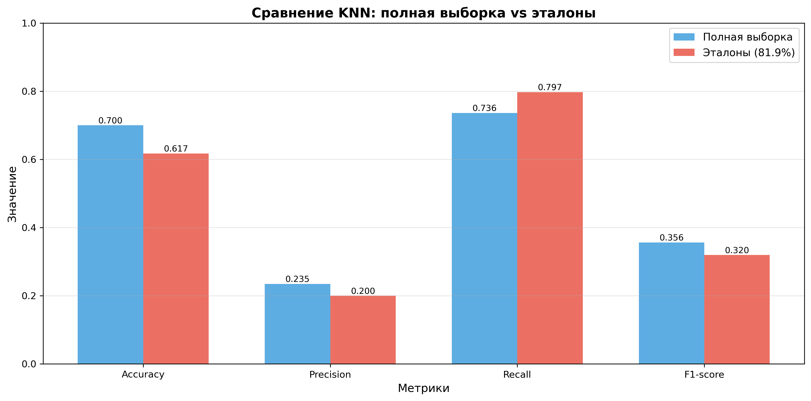

## Визуализации

Все графики сохраняются в директории `results/`:

Визуализация данных:
1. `pca_visualization.png` — PCA визуализация обучающей выборки

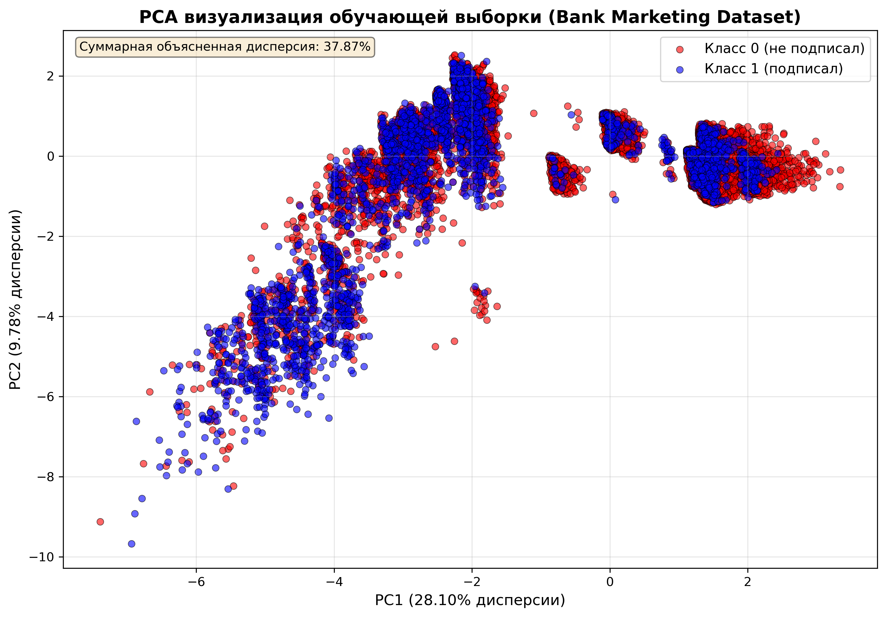

2. `tsne_visualization.png` — t-SNE визуализация (локальная структура)

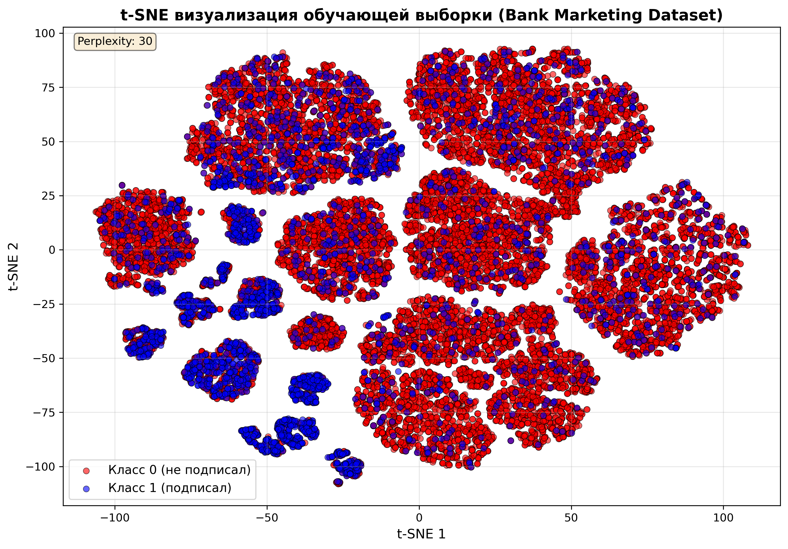

Подбор параметров:
3. `loo_risk.png` — график эмпирического риска от параметра k
   - Зависимость F1-score от k
   - Оптимум при k=25 отмечен красной звездой
4. `kernel_comparison.png` — сравнение различных ядер Парзена
   - Зависимость Accuracy от k для 4 ядер
   - Rectangular ядро показывает лучшие результаты
   - Звездочки отмечают максимумы для каждого ядра

Отбор эталонов:
5. **prototype_selection.png** — визуализация отобранных эталонов CNN (PCA 2D)
   - Эталоны отмечены крупными звездами
   - Показывает, какие граничные объекты выбраны
6. **prototypes_stolp.png** — визуализация эталонов STOLP
   - Эталоны, выбранные с учетом отступов (margins)
7. **prototypes_ccv.png** — визуализация эталонов CCV
   - **Всего 3 эталона** (экстремально минимальный набор!)
   - 1 объект класса 0 и 2 объекта класса 1
   - Найдено за 1 итерацию алгоритма
8. **ccv_history.png** — процесс отбора эталонов методом CCV
   - Всего 2 точки: итерации 1 и 2
   - Красная звезда — минимум CCV = 0.0004 на первой итерации
   - Вторая точка показывает рост CCV → остановка алгоритма

Сравнение и анализ:
9. **comparison.png** — сравнение с sklearn KNeighborsClassifier
   - Столбчатая диаграмма метрик для 3 моделей
10. **accuracy_with_prototypes.png** — сравнение KNN с/без отбора эталонов
   - Визуальное сравнение метрик качества
11. **error_analysis.png** — анализ неправильно классифицированных объектов
   - PCA визуализация с выделением ошибок черными крестиками
   - Показывает, где в пространстве признаков модель ошибается
   - Помогает понять характер ошибок классификации

Результаты и логи:
12. **final_results.txt** — итоговый отчет со всеми метриками и выводами
13. **experiment_log.txt** — подробный лог всех экспериментов с временем выполнения

## Структура проекта

```
lab2/
├── source/
│   ├── __init__.py
│   ├── main.py                    # Основной скрипт запуска
│   ├── data_preprocessing.py      # Загрузка и предобработка данных
│   ├── knn.py                     # Реализация KNN с окном Парзена
│   ├── loo_validation.py          # LOO кросс-валидация
│   ├── prototype_selection.py     # Алгоритмы отбора эталонов (CNN, STOLP)
│   └── comparison.py              # Сравнение с sklearn
├── results/                       # Результаты экспериментов
│   ├── pca_visualization.png
│   ├── loo_risk.png
│   ├── comparison_sklearn.png
│   ├── prototypes_cnn.png
│   ├── prototypes_stolp.png
│   ├── comparison_prototypes.png
│   └── final_results.txt          # Текстовый отчет
├── requirements.txt               # Зависимости проекта
├── .gitignore
└── README.md                      # Документация
```


## Интерпретация графиков

### Ключевые наблюдения из визуализаций:

1. PCA и t-SNE визуализации (`pca_visualization.png`, `tsne_visualization.png`)
- Классы имеют значительное перекрытие в пространстве признаков
- t-SNE лучше выявляет локальные кластеры
- Это объясняет сложность задачи классификации

2. График LOO (`loo_risk.png`)
- F1-score стабилизируется при k ≥ 20
- Оптимум при k=25 дает хороший баланс
- Небольшая вариация в диапазоне k=23-27 показывает устойчивость модели

3. Сравнение ядер (`kernel_comparison.png`)
- Rectangular ядро значительно превосходит остальные
- Gaussian ядро на втором месте, но уступает 8.3%
- Плавные ядра (triangular, epanechnikov) показывают схожие результаты

4. Анализ ошибок (`error_analysis.png`)
- Ошибки классификации распределены в областях перекрытия классов
- 33.1% ошибок на тестовой выборке
- Визуально подтверждает сложность разделения классов

5. CCV история (`ccv_history.png`)
- На графике всего 2 точки (2 итерации алгоритма)
- Красная звезда отмечает минимум на первой итерации (CCV = 0.0004, 3 эталона)
- Вторая точка показывает рост CCV до 0.0006 → критерий остановки
- Алгоритм нашел оптимум сразу и правильно остановился

6. Визуализация эталонов (`prototype_selection.png`, `prototypes_stolp.png`, `prototypes_ccv.png`)
- CNN выбирает 1638 граничных объектов равномерно (81.90% от исходных)
- STOLP учитывает отступы, выбирая 1469 ключевых объектов (73.45%)
- **CCV находит минимальный представительный набор: всего 3 эталона** (0.15%)!
- Резкая разница в подходах: CNN/STOLP сохраняют структуру, CCV ищет абсолютный минимум

## Выводы

1. KNN с окном Парзена успешно применён для задачи классификации на Bank Marketing Dataset с достижением F1-score = 0.3890

2. LOO кросс-валидация с метрикой F1-score позволила подобрать оптимальное значение **k=25**, которое обеспечивает лучший баланс между переобучением и недообучением (минимальная ошибка = 0.2881)

3. Сравнение ядер Парзена показало, что **rectangular ядро** превосходит другие (accuracy = 0.7546), включая традиционное гауссово ядро (0.6918)

4. Применение SMOTE для балансировки классов критически важно для данного датасета: класс 1 увеличен с 3248 до 25583 объектов

5. Собственная реализация vs sklearn:
   - Собственная реализация с balanced weights показывает лучший F1-score (0.3875 vs 0.3557-0.3614)
   - sklearn имеет выше Accuracy (0.9021 vs 0.7524), но ниже Recall (0.2399 vs 0.6954)
   - Собственная реализация лучше обнаруживает класс меньшинства благодаря взвешенному голосованию

6. Алгоритмы отбора эталонов показали разные результаты:
   - CNN: 81.90% сжатие, 5 итераций до сходимости, хороший баланс скорости и качества
   - STOLP: 73.45% сжатие, учёт геометрии данных через отступы (margins)
   - **CCV: 0.15% сжатие (экстремальное!), всего 3 эталона из 2000**, минимум найден за 1 итерацию — демонстрирует силу теоретически обоснованного подхода

7. Отбор эталонов CNN обеспечивает сокращение выборки на 81.9% при потере accuracy всего 8.3%, что даёт значительное ускорение инференса

8. Дисбаланс классов (88.7% vs 11.3%) — главная проблема датасета, требующая специальных техник (SMOTE, balanced weights, оптимизация по F1-score вместо accuracy)

9. Производительность: обработка ~317 объектов/сек (3.15 мс на объект) на тестовой выборке из 12357 объектов
