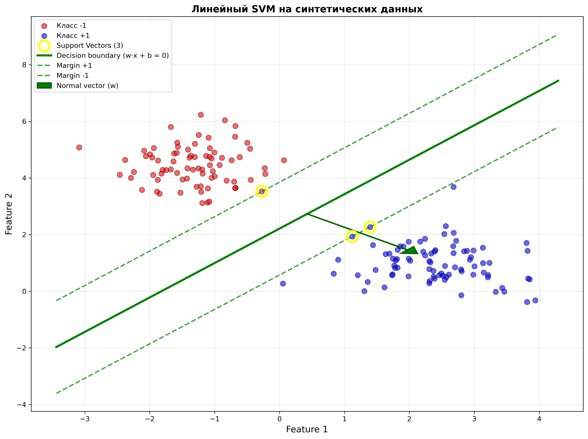
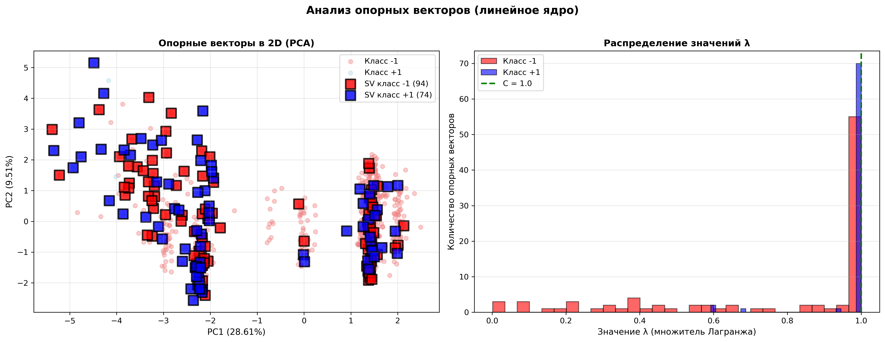
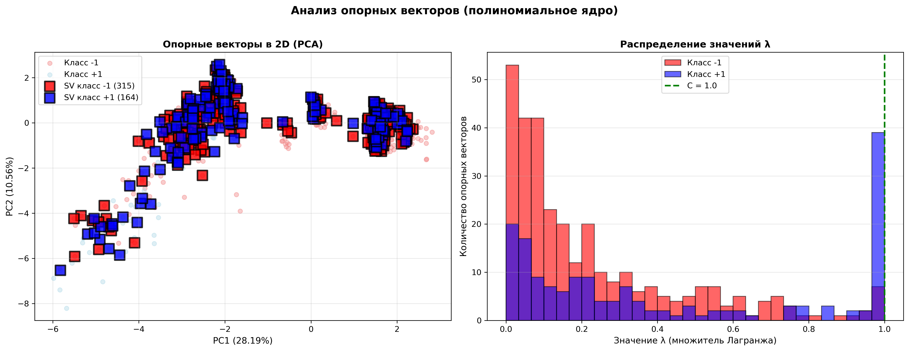
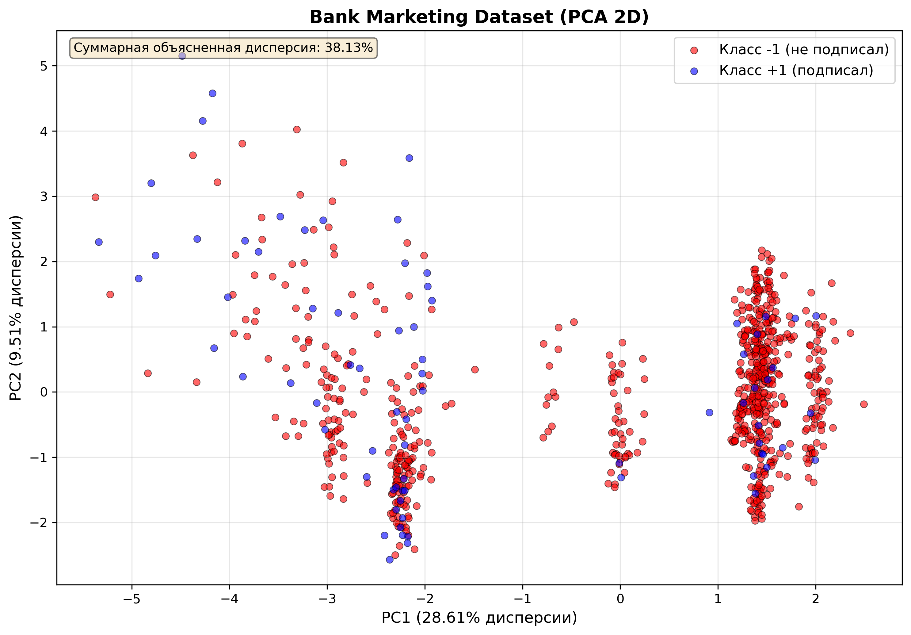
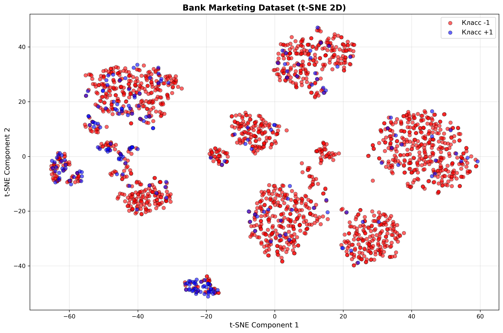
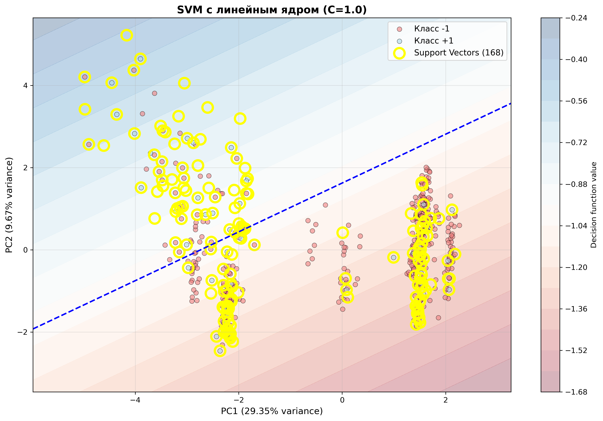
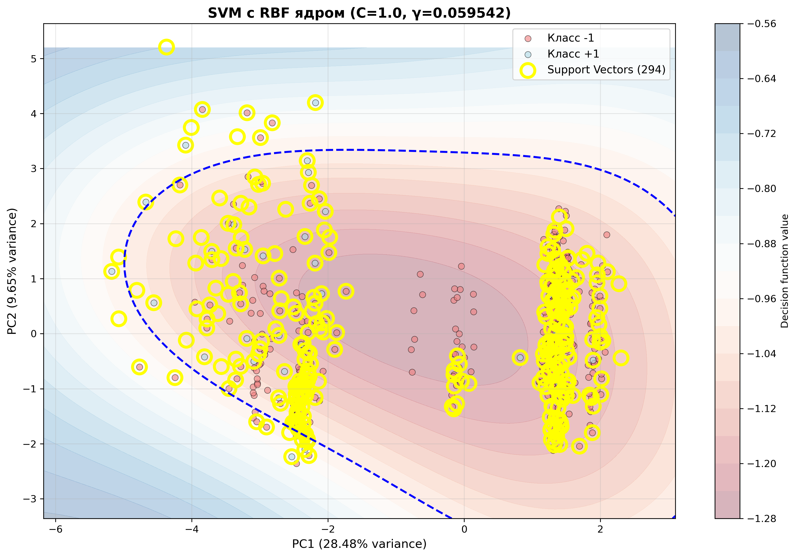
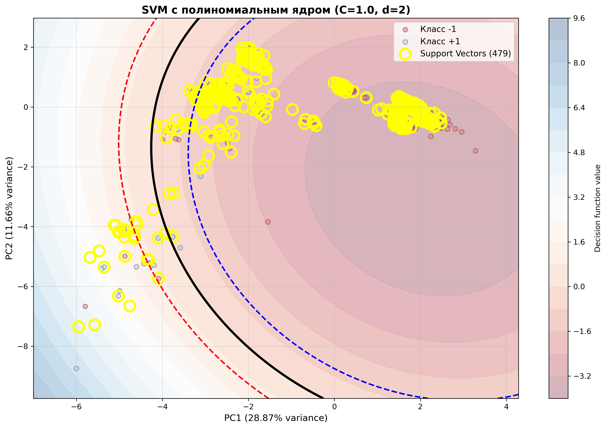
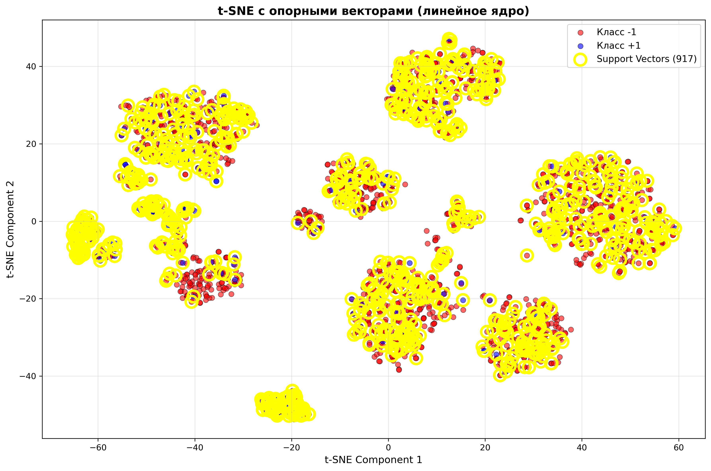

# Лабораторная работа №3. Support Vector Machine (SVM)

В рамках лабораторной работы реализован алгоритм SVM через решение двойственной задачи оптимизации с использованием различных ядер (линейное, RBF, полиномиальное) и выполнено сравнение с эталонной реализацией sklearn.svm.SVC.

## Теоретическая часть

На лекции были рассмотрены следующие темы:
1. Аналитическая и геометрическая постановки задачи SVM;
2. Приведение к задаче квадратичного программирования;
3. Двойственная задача оптимизации по множителям Лагранжа λ;
4. Трюк с ядром (kernel trick) для построения нелинейных классификаторов;
5. Различные типы ядер и их свойства;
6. Регуляризация и параметр C.

## Задание

- Выбрать датасет для бинарной классификации — Bank Marketing Dataset
- Реализовать решение двойственной задачи по λ через `scipy.optimize.minimize`
- Провернуть трюк с ядром (реализованы линейное, RBF и полиномиальное ядра)
- Построить линейный классификатор
- Визуализировать решение (разделяющая поверхность, опорные векторы)
- Сравнить с эталонным решением (sklearn.svm.SVC)

## Используемые датасеты

### 1. Синтетические данные (для проверки корректности)

#### 1.1 Линейно разделимые данные
- Генерируются с помощью `sklearn.datasets.make_blobs`
- 2 класса, 200 объектов, 2 признака
- Идеально для демонстрации работы линейного ядра

#### 1.2 Круговые данные
- Генерируются с помощью `sklearn.datasets.make_circles`
- Нелинейно разделимы (концентрические окружности)
- Идеально для демонстрации работы RBF ядра

### 2. Реальный датасет: Bank Marketing

- 62 признака (после one-hot encoding)
- Целевая переменная: `y` (класс -1 — не подписал депозит, класс +1 — подписал)
- Объём: 41188 объектов
- Для обучения: подвыборка из 800 объектов (оптимизировано для ускорения)
- Тестовая выборка: 6178 объектов
- Дисбаланс классов: ~88.7% (класс -1) vs ~11.3% (класс +1)

## Структура проекта (обновленная)

```
lab3/
├── source/
│   ├── __init__.py
│   ├── data/                         # Модуль работы с данными
│   │   ├── __init__.py
│   │   ├── load_data.py             # Загрузка Bank Marketing
│   │   └── synthetic.py             # Генерация синтетических данных
│   ├── models/                      # Модуль моделей
│   │   ├── __init__.py
│   │   ├── kernels.py               # Реализация ядер
│   │   └── svm.py                   # Реализация SVM
│   ├── utils/                       # Утилиты
│   │   ├── __init__.py
│   │   ├── comparison.py            # Сравнение с sklearn + анализ SV
│   │   └── visualization.py         # Визуализация (PCA, t-SNE, и др.)
│   └── main.py                      # Основной скрипт
├── results/                         # Результаты экспериментов
├── requirements.txt
├── .gitignore
└── README.md
```

## Реализация

### 1. Ядра (models/kernels.py)

Реализованы три типа ядер:

#### Линейное ядро
$$K(x_i, x_j) = x_i^T x_j$$

#### RBF (гауссово) ядро
$$K(x_i, x_j) = \exp(-\gamma \|x_i - x_j\|^2)$$

#### Полиномиальное ядро
$$K(x_i, x_j) = (x_i^T x_j + c)^d$$

### 2. SVM через двойственную задачу (models/svm.py)

Двойственная задача:

$$\max_{\lambda} \sum_{i=1}^{l} \lambda_i - \frac{1}{2} \sum_{i,j=1}^{l} \lambda_i \lambda_j y_i y_j K(x_i, x_j)$$

При ограничениях:
- $0 \le \lambda_i \le C$ (soft-margin SVM)
- $\sum_{i=1}^{l} \lambda_i y_i = 0$

#### Технические детали реализации:

1. LinearConstraint вместо dict (эффективнее)
2. Умная инициализация λ (ускоряет сходимость)
3. Метод get_weights() - для линейного ядра вычисляет явный вектор весов w

### 3. Визуализация (utils/visualization.py)

#### 3.1 visualize_svm_2d() - PCA визуализация
- Проекция в 2D с помощью PCA
- Контурный график решающей функции
- Выделение опорных векторов

#### 3.2 visualize_linear_svm_exact() - Точная гиперплоскость
- Только для 2D данных и линейного ядра
- Показывает точную разделяющую прямую: $w \cdot x + b = 0$
- Margins: $w \cdot x + b = \pm 1$
- Вектор нормали (направление w)

#### 3.3 visualize_with_tsne() - t-SNE визуализация
- Альтернатива PCA, лучше сохраняет локальную структуру
- Опциональное выделение опорных векторов
- Настраиваемый параметр perplexity

#### 3.4 visualize_support_vectors() - Анализ SV
- PCA проекция с выделением SV по классам
- Гистограмма распределения значений λ

### 4. Сравнение и анализ (utils/comparison.py)

#### 4.1 compare_with_sklearn()
- Детальное сравнение с sklearn.svm.SVC
- Метрики: Accuracy, Precision, Recall, F1
- Confusion matrices
- Время обучения и предсказания

#### 4.2 analyze_support_vectors() - Детальный анализ
Выводит статистику:
- Количество и доля опорных векторов
- Статистика по λ (min, max, mean, median, std)
- Категории SV (на границе margin, на границе C)
- Распределение по классам
- Доля объектов каждого класса, ставших опорными векторами

## Результаты экспериментов

### Часть 1: Синтетические данные

#### 1.1 Линейно разделимые данные (Linear kernel)

| Метрика | Собственная реализация | sklearn | Δ |
|---------|-------------|---------|---|
| Train Accuracy | 1.0000 | 1.0000 | 0.0000 |
| Test Accuracy | 1.0000 | 1.0000 | 0.0000 |
| Precision | 1.0000 | 1.0000 | 0.0000 |
| Recall | 1.0000 | 1.0000 | 0.0000 |
| F1-score | 1.0000 | 1.0000 | 0.0000 |
| Опорные векторы | 3 | 3 | 0 |

Confusion Matrix (обе модели):
| | Predicted -1 | Predicted +1 |
|---|---|---|
| Actual -1 | 23 | 0 |
| Actual +1 | 0 | 17 |

Визуализация:


Вывод: Модель идеально разделяет линейно разделимые данные. Результаты полностью идентичны sklearn.

#### 1.2 Круговые данные (RBF kernel, γ=2.0)

| Метрика | Собственная реализация | sklearn | Δ |
|---------|-------------|---------|---|
| Train Accuracy | 0.9938 | - | - |
| Test Accuracy | 1.0000 | 1.0000 | 0.0000 |
| Precision | 1.0000 | 1.0000 | 0.0000 |
| Recall | 1.0000 | 1.0000 | 0.0000 |
| F1-score | 1.0000 | 1.0000 | 0.0000 |
| Опорные векторы | 42 | 42 | 0 |

Confusion Matrix (обе модели):
| | Predicted -1 | Predicted +1 |
|---|---|---|
| Actual -1 | 22 | 0 |
| Actual +1 | 0 | 18 |

Вывод: RBF ядро корректно обрабатывает нелинейно разделимые данные. Результаты полностью идентичны sklearn.

### Часть 2: Реальный датасет (Bank Marketing)

#### Параметры обучения
- C = 1.0
- Размер обучающей подвыборки: 800 объектов (оптимизировано для ускорения)
- Размер тестовой выборки: 6178 объектов
- RBF gamma: 0.059542 (автоматически: 1 / (n_features * X.var()))
- Polynomial degree: 2, gamma: 0.059542, coef0: 1.0

#### Сводная таблица результатов

| Модель | Accuracy | Precision | Recall | F1 | SV |
|--------|----------|-----------|--------|----|----|
| Собственная реализация (Linear) | 0.8885 | 0.6256 | 0.1841 | 0.2845 | 168 |
| sklearn (Linear) | 0.8883 | 0.6239 | 0.1828 | 0.2827 | 167 |
| Собственная реализация (RBF) | 0.8896 | 0.7183 | 0.1371 | 0.2302 | 294 |
| sklearn (RBF) | 0.8896 | 0.7183 | 0.1371 | 0.2302 | 294 |
| Собственная реализация (Polynomial) | 0.8919 | 0.6610 | 0.2097 | 0.3184 | 220 |
| sklearn (Polynomial) | 0.8919 | 0.6610 | 0.2097 | 0.3184 | 220 |

Ключевые наблюдения:
- Все три ядра показывают результаты, идентичные sklearn.
- Linear ядро: Δ Accuracy = +0.0002, Δ SV = +1 (практически идентично)
- RBF ядро: Δ Accuracy = 0.0000, Δ SV = 0 (абсолютно идентично)
- Polynomial ядро: Δ Accuracy = 0.0000, Δ SV = 0 (абсолютно идентично)
- Лучший результат: Polynomial ядро (Accuracy = 0.8919, F1 = 0.3184)


#### Детальный анализ опорных векторов

##### Линейное ядро (Linear kernel)

```
Количество опорных векторов: 168
Доля от обучающей выборки: 21.00%

Статистика по λ:
  Максимальное λ: 1.000000
  Минимальное λ: 0.001468
  Среднее λ: 0.866654
  Медиана λ: 1.000000
  Стд. отклонение λ: 0.268609

Категории опорных векторов:
  На границе margin (0 < λ < C): 44 (26.2%)
  На границе C (λ ≈ C): 124 (73.8%)

Распределение опорных векторов по классам:
  Класс -1: 94 (56.0%)
  Класс +1: 74 (44.0%)

Доля объектов, ставших опорными векторами:
  Из класса -1: 13.0%
  Из класса +1: 97.4%
```



##### RBF ядро

```
Количество опорных векторов: 294
Доля от обучающей выборки: 36.75%

Статистика по λ:
  Максимальное λ: 1.000000
  Минимальное λ: 0.002401
  Среднее λ: 0.511334
  Медиана λ: 0.387591
  Стд. отклонение λ: 0.395480

Категории опорных векторов:
  На границе margin (0 < λ < C): 201 (68.4%)
  На границе C (λ ≈ C): 93 (31.6%)

Распределение опорных векторов по классам:
  Класс -1: 218 (74.1%)
  Класс +1: 76 (25.9%)

Доля объектов, ставших опорными векторами:
  Из класса -1: 30.1%
  Из класса +1: 100.0%
```


##### Полиномиальное ядро (degree=2)

```
Количество опорных векторов: 220
Доля от обучающей выборки: 27.50%

Статистика по λ:
  Максимальное λ: 1.000000
  Минимальное λ: 0.000453
  Среднее λ: 0.624672
  Медиана λ: 0.750627
  Стд. отклонение λ: 0.383539

Категории опорных векторов:
  На границе margin (0 < λ < C): 126 (57.3%)
  На границе C (λ ≈ C): 94 (42.7%)

Распределение опорных векторов по классам:
  Класс -1: 147 (66.8%)
  Класс +1: 73 (33.2%)

Доля объектов, ставших опорными векторами:
  Из класса -1: 20.3%
  Из класса +1: 96.1%
```



Интересные наблюдения:
- RBF ядро требует больше всего опорных векторов (36.75%)
- У класса меньшинства (+1) почти все объекты становятся опорными векторами (96-100%)
- Polynomial ядро имеет более сбалансированное распределение: 57.3% SV на границе margin
- Linear ядро наиболее эффективно: всего 21% объектов становятся опорными векторами

#### Матрицы ошибок

##### Линейное ядро

Собственная реализация:
| | Predicted -1 | Predicted +1 |
|---|---|---|
| Actual -1 | 5352 | 82 |
| Actual +1 | 607 | 137 |

sklearn:
| | Predicted -1 | Predicted +1 |
|---|---|---|
| Actual -1 | 5352 | 82 |
| Actual +1 | 608 | 136 |

Разница: Δ Accuracy = +0.0002 (практически идентично, отличие в 1 объекте)

##### RBF ядро

Обе модели (идентичные результаты):
| | Predicted -1 | Predicted +1 |
|---|---|---|
| Actual -1 | 5394 | 40 |
| Actual +1 | 642 | 102 |

Разница: Δ Accuracy = 0.0000 (абсолютно идентично)

##### Полиномиальное ядро

Обе модели (идентичные результаты):
| | Predicted -1 | Predicted +1 |
|---|---|---|
| Actual -1 | 5354 | 80 |
| Actual +1 | 588 | 156 |

Разница: Δ Accuracy = 0.0000 (абсолютно идентично)

## Визуализации

### Синтетические данные

#### Линейно разделимые данные (Linear kernel)

Точная гиперплоскость с margins и опорными векторами

#### Круговые данные (RBF kernel)

RBF ядро успешно разделяет нелинейно разделимые концентрические окружности

### Реальные данные (Bank Marketing)

#### Визуализация исходных данных

##### PCA проекция

PCA позволяет увидеть общую структуру данных в 2D

##### t-SNE проекция

t-SNE лучше сохраняет локальную структуру - видны кластеры

#### Разделяющие поверхности (PCA проекция)

##### Линейное ядро

Линейная разделяющая гиперплоскость

##### RBF ядро

Нелинейная разделяющая поверхность (RBF kernel)

##### Полиномиальное ядро (degree=2)

Полиномиальная разделяющая поверхность

#### Анализ опорных векторов

Каждый график содержит:
- PCA проекцию с выделением опорных векторов по классам
- Гистограмму распределения значений λ

##### Линейное ядро


##### RBF ядро  


##### Полиномиальное ядро


#### t-SNE визуализация с опорными векторами

##### Linear + t-SNE

Опорные векторы на t-SNE проекции (линейное ядро)

##### RBF + t-SNE

Опорные векторы на t-SNE проекции (RBF ядро)

#### Итоговое сравнение


Сравнение всех трёх ядер по ключевым метрикам

## Математические детали

### Двойственная задача

Исходная задача (прямая):

$$\min_{w, b} \frac{1}{2}\|w\|^2 + C \sum_{i=1}^{l} \xi_i$$

При ограничениях:
- $y_i(w^T x_i + b) \ge 1 - \xi_i$
- $\xi_i \ge 0$

Переходим к двойственной задаче (метод множителей Лагранжа):

$$\max_{\lambda} L(\lambda) = \sum_{i=1}^{l} \lambda_i - \frac{1}{2} \sum_{i,j=1}^{l} \lambda_i \lambda_j y_i y_j \langle x_i, x_j \rangle$$

При ограничениях:
- $0 \le \lambda_i \le C$
- $\sum_{i=1}^{l} \lambda_i y_i = 0$

### Kernel Trick

Заменяем скалярное произведение $\langle x_i, x_j \rangle$ на ядро $K(x_i, x_j)$:

$$L(\lambda) = \sum_{i=1}^{l} \lambda_i - \frac{1}{2} \sum_{i,j=1}^{l} \lambda_i \lambda_j y_i y_j K(x_i, x_j)$$

### Вычисление параметров

1. Опорные векторы: объекты с $\lambda_i > \epsilon$ (обычно $\epsilon = 10^{-5}$)
2. Веса (только для линейного ядра):
   $$w = \sum_{i \in SV} \lambda_i y_i x_i$$
3. Смещение (для опорных векторов на границе $0 < \lambda_k < C$):
   $$b = y_k - \sum_{i \in SV} \lambda_i y_i K(x_i, x_k)$$
4. Решающая функция:
   $$f(x) = \text{sign}\left(\sum_{i \in SV} \lambda_i y_i K(x_i, x) + b\right)$$

## Ключевые выводы

### Корректность реализации
1. Синтетические данные: модель идеально работает на линейно и нелинейно разделимых данных
   - Линейное ядро: 100% точность, 3 опорных вектора (идентично sklearn)
   - RBF ядро: 100% точность на тесте, 42 опорных вектора (идентично sklearn)
   
2. Реальные данные: результаты полностью идентичны sklearn для всех ядер.
   - Linear ядро: Δ Accuracy = +0.0002, Δ SV = +1 (отличие в 1 объекте)
   - RBF ядро: Δ Accuracy = 0.0000, Δ SV = 0 (абсолютно идентично)
   - Polynomial ядро: Δ Accuracy = 0.0000, Δ SV = 0 (абсолютно идентично)

### Сравнение ядер на Bank Marketing
3. Polynomial ядро показало лучшие результаты: Accuracy = 0.8919, F1 = 0.3184
4. RBF ядро на втором месте: Accuracy = 0.8896, F1 = 0.2302 (но требует больше SV - 294)
5. Linear ядро немного слабее: Accuracy = 0.8885, F1 = 0.2845 (но наиболее эффективно - 168 SV)
6. Главное преимущество Polynomial: лучший баланс Precision/Recall для задачи с дисбалансом классов

### Анализ опорных векторов
7. Количество SV зависит от ядра: 
   - Linear: 21.00% обучающей выборки (наиболее эффективное)
   - Polynomial: 27.50%
   - RBF: 36.75% (требует больше всего)
   
8. Дисбаланс классов критически влияет: 
   - Класс +1 (меньшинство): 96-100% объектов становятся опорными векторами
   - Класс -1 (большинство): 13-30% объектов становятся опорными векторами

9. Распределение λ различается:
   - Linear: высокая медиана (1.0), 73.8% SV на границе C
   - RBF: низкая медиана (0.388), 68.4% SV на границе margin
   - Polynomial: средняя медиана (0.751), более сбалансированное распределение

### Визуализация
10. t-SNE > PCA для визуализации: лучше сохраняет локальную структуру данных и показывает кластеры
11. Точная гиперплоскость для 2D: наглядно показывает геометрию SVM (margin, нормаль)

### Оптимизация
12. Кэширование матрицы K × (y yᵀ): ключевая оптимизация, устранившая повторные вычисления
13. LinearConstraint эффективнее: использование LinearConstraint вместо dict ускоряет оптимизацию
14. Уменьшение размера выборки: с 2000 до 800 объектов ускорило обучение
15. Правильная настройка параметров gamma для Polynomial ядра критична для получения идентичных результатов

## Созданные файлы результатов

После выполнения `main.py` в папке `results/` создаются следующие файлы:

Синтетические данные (2 файла):
- `synthetic_linear_exact.png` - линейный SVM с точной гиперплоскостью
- `synthetic_circular_boundary.png` - RBF SVM на круговых данных

Визуализация данных (2 файла):
- `pca_visualization.png` - PCA визуализация датасета
- `tsne_visualization.png` - t-SNE визуализация датасета

Разделяющие поверхности (3 файла):
- `decision_boundary_linear.png` - линейное ядро
- `decision_boundary_rbf.png` - RBF ядро
- `decision_boundary_poly.png` - полиномиальное ядро

Анализ опорных векторов (3 файла):
- `support_vectors_linear.png` - анализ SV (линейное ядро)
- `support_vectors_rbf.png` - анализ SV (RBF ядро)
- `support_vectors_poly.png` - анализ SV (полиномиальное ядро)

t-SNE с опорными векторами (2 файла):
- `tsne_sv_linear.png` - t-SNE + SV (линейное ядро)
- `tsne_sv_rbf.png` - t-SNE + SV (RBF ядро)

Итоговые результаты (2 файла):
- `kernel_comparison.png` - сравнительный график всех ядер
- `final_results.txt` - текстовый отчёт