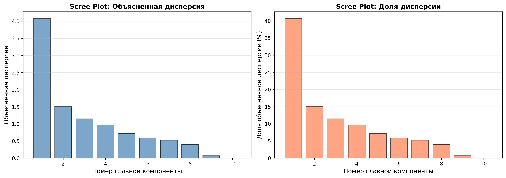
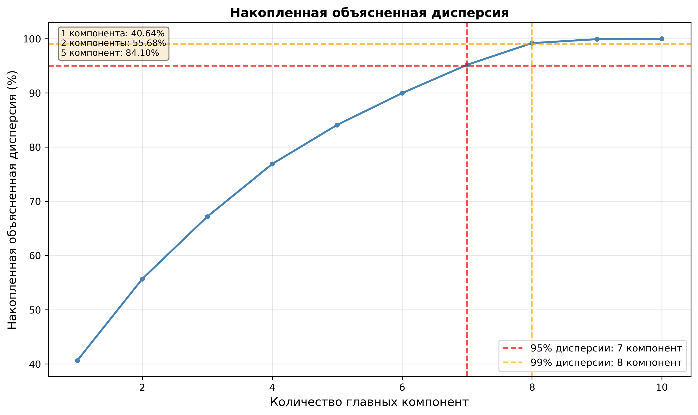
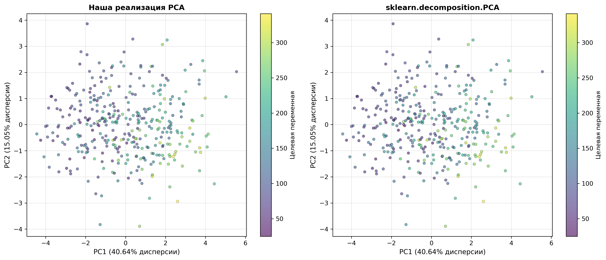
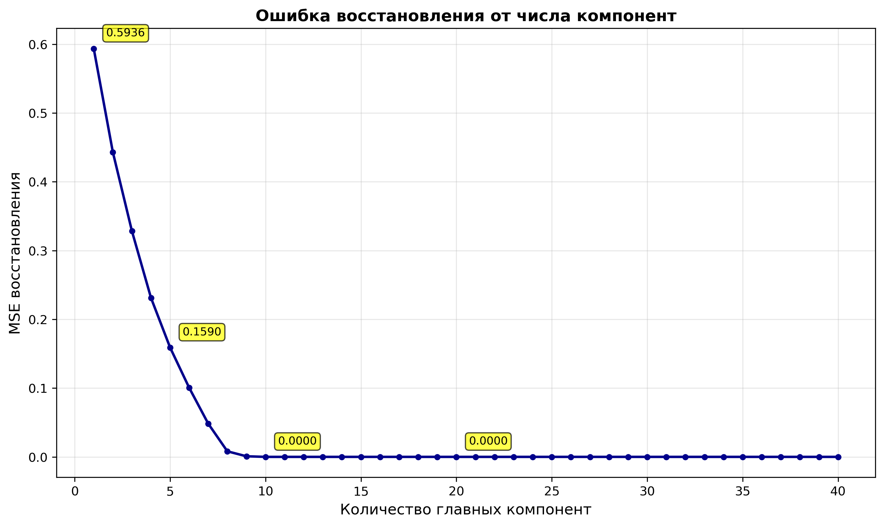
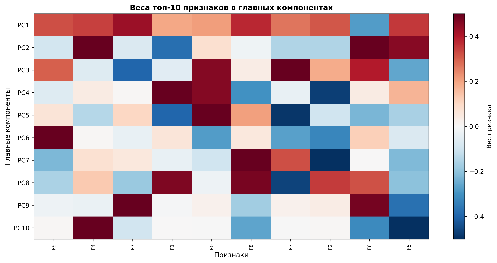

# Лабораторная работа №4. PCA через сингулярное разложение

В рамках лабораторной работы реализован алгоритм PCA (Principal Component Analysis) через сингулярное разложение (SVD), определена эффективная размерность датасета Diabetes и выполнено сравнение с эталонной реализацией sklearn.decomposition.PCA.

## Теоретическая часть

На лекции были рассмотрены следующие темы:
1. Многомерная линейная регрессия
2. Решение задач линейной регрессии через сингулярное разложение (SVD)
3. L2-регуляризация (гребневая регрессия) и подбор параметра регуляризации
4. Метод главных компонент (PCA) и его связь с SVD
5. Применение PCA для снижения размерности данных

## Задание

- Выбрать датасет для линейной регрессии — Diabetes Dataset (sklearn)
- Реализовать PCA через сингулярное разложение (`np.linalg.svd`)
- Определить эффективную размерность выборки
- Показать эквивалентность с эталонной реализацией `sklearn.decomposition.PCA`
- Подготовить отчет с визуализациями и анализом

## Используемый датасет

Для выполнения работы использован датасет Diabetes из библиотеки scikit-learn.

### Структура данных

- 10 числовых признаков:
  - `age`: возраст (годы)
  - `sex`: пол
  - `bmi`: индекс массы тела (body mass index)
  - `bp`: среднее артериальное давление (average blood pressure)
  - `s1` до `s6`: шесть измерений сыворотки крови
  
- Целевая переменная: количественная мера прогрессирования диабета через год после baseline измерений
  - Диапазон: [25.0, 346.0]
  - Среднее: 152.1
  
- Общий объем: 442 объекта
- Разбиение:
  - Обучающая выборка: 354 объекта (80%)
  - Тестовая выборка: 88 объектов (20%)

### Предобработка

1. Загрузка данных: Датасет загружается из `sklearn.datasets.load_diabetes()`
2. Стандартизация признаков: Применяется `StandardScaler` для обеспечения:
   - Нулевого среднего (mean = 0)
   - Единичной дисперсии (std = 1)
3. Финальная размерность: (354, 10) для обучающей выборки
4. Особенности: Все признаки числовые, не требуется one-hot encoding

## Реализация

### 1. PCA через сингулярное разложение (source/pca.py)

Алгоритм реализован согласно теоретическим основам:

#### Математическая формулировка

1. Центрирование данных:
   $$X_{\text{centered}} = X - \bar{X}$$
   где $\bar{X}$ — среднее по каждому признаку

2. Сингулярное разложение:
   $$X_{\text{centered}} = U \Sigma V^T$$
   где:
   - $U \in \mathbb{R}^{n \times k}$ — левые сингулярные векторы
   - $\Sigma \in \mathbb{R}^{k \times k}$ — диагональная матрица сингулярных значений
   - $V^T \in \mathbb{R}^{k \times d}$ — правые сингулярные векторы (главные компоненты)
   - $k = \min(n, d)$

3. Главные компоненты:
   $$\text{components} = V^T$$
   Строки $V^T$ — направления максимальной дисперсии

4. Объясненная дисперсия:
   $$\text{explained\_variance}_i = \frac{\sigma_i^2}{n - 1}$$
   где $\sigma_i$ — i-е сингулярное значение

5. Доля объясненной дисперсии:
   $$\text{explained\_variance\_ratio}_i = \frac{\text{explained\_variance}_i}{\sum_j \text{explained\_variance}_j}$$


### 2. Определение эффективной размерности (source/pca.py)

Реализованы четыре метода:

#### 2.1 Анализ накопленной дисперсии

Находим минимальное число компонент для заданного порога.

#### 2.2 Метод "локтя" (Elbow method)

Ищем точку максимального изменения кривизны через вторую производную.

#### 2.3 Критерий Марченко-Пастура

Теоретически обоснованный метод, основанный на теории случайных матриц. Критерий позволяет отделить значимые компоненты от шума, используя верхнюю границу спектра случайной матрицы.

#### 2.4 Scree plot

Визуальный анализ графика собственных значений для выбора числа компонент.

### 3. Сравнение с sklearn (source/comparison.py)

Реализовано детальное сравнение по следующим критериям:

1. Explained variance ratio — доли объясненной дисперсии
2. Explained variance — значения дисперсии
3. Singular values — сингулярные значения из SVD
4. Components — главные компоненты (с учетом возможного изменения знака)
5. Transform — проекции данных
6. Inverse transform — восстановление из проекций
7. Reconstruction MSE — ошибка восстановления

### 4. Визуализации (source/visualization.py)

Реализовано 5 типов визуализаций:

1. Scree plot — график собственных значений и долей дисперсии
2. Cumulative variance — накопленная объясненная дисперсия
3. PCA projection 2D — проекция данных на первые 2 компоненты
4. Reconstruction error — зависимость ошибки восстановления от числа компонент
5. Component heatmap — тепловая карта весов признаков в главных компонентах

## Результаты экспериментов

### Информация о датасете после предобработки

| Параметр | Значение |
|----------|----------|
| Обучающая выборка | 354 объекта |
| Тестовая выборка | 88 объектов |
| Количество признаков | 10 |
| Целевая переменная | прогрессирование диабета (регрессия) |
| Диапазон целевой переменной | [25.0, 346.0] |
| Среднее значение | 152.1 |

### Эффективная размерность

| Критерий | Количество компонент |
|----------|----------------------|
| 95% дисперсии | 7 компонент |
| 99% дисперсии | 8 компонент |
| Критерий Марченко-Пастура | 2 компоненты |
| Метод локтя (Elbow) | компонента 1 |
| Исходная размерность | 10 признаков |

Вывод: Датасет можно сжать с 10 до 7 признаков, сохранив 95% информации. Это позволяет снизить размерность на 30% без существенной потери информации.

### Объясненная дисперсия первыми компонентами

| Компонента | Индивидуальная | Накопленная |
|------------|----------------|-------------|
| PC1    | 40.64%     | 40.64%  |
| PC2    | 15.05%     | 55.68%  |
| PC3    | 11.48%     | 67.16%  |
| PC4    | 9.72%      | 76.89%  |
| PC5    | 7.21%      | 84.10%  |
| PC6    | 5.85%      | 89.95%  |
| PC7    | 5.23%      | 95.18%  |
| PC8    | 4.01%      | 99.19%  |
| PC9    | 0.72%      | 99.91%  |
| PC10   | 0.09%      | 100.00% |

Ключевые наблюдения:
- Первая компонента объясняет 40.64% всей дисперсии
- Первые 2 компоненты объясняют более половины дисперсии (55.68%)
- После 8-й компоненты вклад становится незначительным (< 1%)

### Сравнение с sklearn.decomposition.PCA

#### Детальное сравнение метрик

| Метрика | Максимальное отличие | Среднее отличие |
|---------|----------------------|-----------------|
| Explained variance ratio | 5.00e-16 | 1.71e-16 |
| Explained variance | 7.11e-15 | 1.83e-15 |
| Singular values | 7.64e-14 | 2.01e-14 |
| Components | 7.87e-15 | 4.49e-15 |
| Transform | — | 7.25e-14 |
| Inverse transform | — | 6.19e-14 |
| Reconstruction MSE | 1.49e-31 | — |
| Mean (среднее) | 0.00e+00 | — |

#### Детальное сравнение Explained Variance Ratio

| № | Наша | sklearn | Разница | % |
|---|------|---------|---------|---|
| 1 | 0.40638019 | 0.40638019 | 5.00e-16 | 0.00 |
| 2 | 0.15045011 | 0.15045011 | 2.22e-16 | 0.00 |
| 3 | 0.11480460 | 0.11480460 | 3.47e-16 | -0.00 |
| 4 | 0.09722459 | 0.09722459 | 8.33e-17 | -0.00 |
| 5 | 0.07213407 | 0.07213407 | 1.80e-16 | -0.00 |
| 6 | 0.05852713 | 0.05852713 | 6.25e-17 | -0.00 |
| 7 | 0.05226116 | 0.05226116 | 2.78e-17 | -0.00 |
| 8 | 0.04011645 | 0.04011645 | 6.25e-17 | 0.00 |
| 9 | 0.00724018 | 0.00724018 | 2.22e-16 | -0.00 |
| 10 | 0.00086152 | 0.00086152 | 7.48e-18 | -0.00 |

Вывод: Реализации эквивалентны с машинной точностью (погрешность < 1e-10).

### Качество восстановления

| Количество компонент | MSE восстановления | Сохранено дисперсии |
|----------------------|--------------------|---------------------|
| 2                | 0.443170       | 55.68%          |
| 5                | 0.159006       | 84.10%          |
| 7                | 0.048218       | 95.18%          |
| 8                | 0.008102       | 99.19%          |
| 10               | 0.000000       | 100.00%         |

Наблюдения:
- Ошибка восстановления монотонно убывает с увеличением числа компонент
- При использовании всех 10 компонент восстановление идеально (MSE ≈ 0)
- 7 компонент достаточно для MSE < 0.05 (95% дисперсии)
- Хороший trade-off: 5 компонент дают MSE ≈ 0.16 при сохранении 84% дисперсии

## Визуализации

### 1. Scree Plot (График собственных значений)



График Scree Plot показывает убывание объясненной дисперсии по компонентам:

- Первая компонента объясняет более 40% всей дисперсии
- Резкое падение после первой компоненты (с 40.64% до 15.05%)
- Постепенное затухание начиная с 3-й компоненты
- "Локоть" графика находится между 1-й и 2-й компонентами
- После 8-й компоненты вклад становится пренебрежимо малым (< 1%)

Этот график помогает визуально определить оптимальное число компонент методом "локтя" (elbow method).

### 2. Накопленная дисперсия



График накопленной дисперсии демонстрирует:

- 7 компонент достаточно для сохранения 95% дисперсии (красная линия)
- 8 компонент обеспечивают 99% дисперсии (зеленая линия)
- Первые 2 компоненты уже объясняют более половины дисперсии (55.68%)
- После 7-й компоненты прирост дисперсии замедляется
- Все 10 компонент восстанавливают 100% дисперсии

Практический вывод: Для большинства задач достаточно использовать 7 компонент, что позволяет снизить размерность на 30% с минимальной потерей информации.

### 3. Проекция на первые 2 главные компоненты



Сравнение проекций данных на первые 2 главные компоненты:

- Левый график: собственная реализация PCA через SVD
- Правый график: sklearn.decomposition.PCA
- Проекции визуально идентичны, что подтверждает корректность реализации
- Точки окрашены в зависимости от значения целевой переменной (прогрессирование диабета)
- Видна определенная структура данных в пространстве главных компонент
- Первые 2 компоненты объясняют 55.68% дисперсии

Примечание: Возможны зеркальные отражения из-за неопределенности знака компонент, что является нормальным для PCA.

### 4. Ошибка восстановления



График ошибки восстановления (MSE) показывает:

- Монотонное убывание MSE с увеличением числа компонент
- Резкое падение MSE в первых 5 компонентах
- При 7 компонентах MSE ≈ 0.048 (достаточно мало для практических задач)
- При 10 компонентах (полная размерность) MSE = 0 (идеальное восстановление)

Интерпретация:
- Компоненты | MSE | Применение
- 2 | 0.443 | Быстрая визуализация
- 5 | 0.159 | Баланс размерность/качество
- 7 | 0.048 | Рекомендуется для большинства задач
- 10 | 0.000 | Полное восстановление

### 5. Тепловая карта компонент (Component Heatmap)



Тепловая карта визуализирует веса 10 признаков в первых 10 главных компонентах:

Анализ признаков:
- Каждый столбец — главная компонента (PC1-PC10)
- Каждая строка — исходный признак (age, sex, bmi, bp, s1-s6)
- Цвет показывает силу и направление вклада признака
- Красный: положительный вклад
- Синий: отрицательный вклад

Ключевые наблюдения:
- PC1 (40.64% дисперсии): значительный вклад от нескольких признаков сыворотки крови (s1-s6) и bmi
- PC2 (15.05% дисперсии): другая комбинация признаков, ортогональная PC1
- Последующие компоненты захватывают более специфические паттерны в данных
- Признаки распределены по разным компонентам, что говорит о многомерной структуре данных

Практическое значение: Позволяет понять, какие исходные признаки важны для каждой главной компоненты, что помогает в интерпретации результатов PCA.

## Структура проекта

```
lab4/
├── source/
│   ├── __init__.py
│   ├── main.py                    # Основной скрипт запуска
│   ├── data_preprocessing.py      # Загрузка и предобработка данных
│   ├── pca.py                     # Реализация PCA через SVD
│   ├── comparison.py              # Сравнение с sklearn
│   ├── visualization.py           # Визуализация результатов
│   ├── report_generator.py        # Генерация текстового отчета
│   └── test_synthetic.py          # Тест на синтетических данных
├── results/
│   ├── scree_plot.png
│   ├── cumulative_variance.png
│   ├── pca_projection_2d.png
│   ├── reconstruction_error.png
│   ├── component_heatmap.png
│   ├── synthetic_data_analysis.png # Анализ синтетических данных
│   └── final_results.txt          # Текстовый отчет
├── requirements.txt
└── README.md
```

Выходные файлы (в директории `results/`):
- `scree_plot.png` — график собственных значений
- `cumulative_variance.png` — накопленная дисперсия
- `pca_projection_2d.png` — проекция данных на PC1 и PC2
- `reconstruction_error.png` — ошибка восстановления от числа компонент
- `component_heatmap.png` — тепловая карта весов признаков
- `final_results.txt` — текстовый отчет

## Математические детали

### Связь PCA и SVD

Пусть $X \in \mathbb{R}^{n \times d}$ — центрированная матрица данных. Ковариационная матрица:

$$\Sigma = \frac{1}{n-1} X^T X$$

Собственные векторы $\Sigma$ являются направлениями главных компонент. Через SVD:

$$X = U \Sigma V^T$$

Получаем:

$$X^T X = V \Sigma^T U^T U \Sigma V^T = V \Sigma^2 V^T$$

Таким образом:
- $V$ — собственные векторы ковариационной матрицы (главные компоненты)
- $\sigma_i^2$ — собственные значения (дисперсии по компонентам)

### Проекция данных

Проекция данных на первые $k$ главных компонент:

$$Z = X V_k$$

где $V_k$ — первые $k$ столбцов $V$.

### Восстановление данных

Восстановление из проекции:

$$\hat{X} = Z V_k^T = X V_k V_k^T$$

Ошибка восстановления (MSE):

$$\text{MSE} = \frac{1}{nd} \|X - \hat{X}\|_F^2$$

## Ключевые выводы

### 1. Корректность реализации

Реализация PCA через SVD показывает результаты, идентичные sklearn.decomposition.PCA:
- Погрешность для explained variance ratio: < 5e-16 (машинная точность)
- Погрешность для singular values: < 8e-14
- Погрешность для transform: < 8e-14
- Reconstruction MSE: < 2e-31 (практически нулевая)

Вывод: Реализация полностью эквивалентна эталонной с машинной точностью.

### 2. Эффективная размерность датасета

Датасет Diabetes можно сжать с 10 до 7 признаков, сохранив 95% информации:
- Снижение размерности на 30% без существенной потери информации
- 8 компонент для сохранения 99% дисперсии
- Критерий Марченко-Пастура указывает на 2 значимые компоненты (отделение сигнала от шума)

### 3. Структура дисперсии

Первая компонента доминирует:
- PC1 объясняет 40.64% всей дисперсии
- Первые 2 компоненты: 55.68% дисперсии
- Первые 5 компонент: 84.10% дисперсии
- Последние 2 компоненты: менее 1% дисперсии

Интерпретация: Сильная корреляция между медицинскими показателями, большая часть информации сконцентрирована в первых нескольких компонентах.

### 4. Качество восстановления

Trade-off между размерностью и точностью:

| Компоненты | MSE | Размерность | Применение |
|------------|-----|-------------|------------|
| 2 | 0.443 | -80% | Визуализация |
| 5 | 0.159 | -50% | Быстрое обучение моделей |
| 7 | 0.048 | -30% | Рекомендуется (95% дисперсии) |
| 10 | 0.000 | 0% | Без сжатия |

Вывод: MSE монотонно убывает, что подтверждает корректность реализации и позволяет выбрать оптимальное число компонент для конкретной задачи.


### 5. SVD как метод PCA

Преимущества сингулярного разложения:
- Численная устойчивость — не требуется вычислять ковариационную матрицу
- Эффективность — один вызов `np.linalg.svd` вместо eigendecomposition
- Универсальность — работает для любых размерностей (даже когда n < d)
- Точность — прямое вычисление главных компонент из сингулярных векторов

### 7. Практическое применение PCA

PCA эффективен для:
- Снижения размерности перед обучением моделей (ускорение, борьба с переобучением)
- Визуализации многомерных данных в 2D/3D
- Удаления шума и избыточности (малые компоненты часто соответствуют шуму)
- Ускорения вычислений за счет уменьшения числа признаков
- Feature engineering — новые признаки могут быть более информативными
- Анализа данных — понимание структуры и корреляций

Для датасета Diabetes: Рекомендуется использовать 7 компонент в качестве входа для моделей машинного обучения вместо исходных 10 признаков.

## Детальный анализ методов определения эффективной размерности

### 1. Анализ накопленной дисперсии (Threshold-based)

Метод: Выбираем минимальное число компонент k, для которого накопленная дисперсия ≥ порога.

Результаты для Diabetes:
- 95% порог → 7 компонент
- 99% порог → 8 компонент

Преимущества:
- Интуитивно понятный критерий
- Гарантирует заданный уровень сохранения информации
- Широко используется в практике

Недостатки:
- Пороги 95% и 99% выбираются эмпирически
- Не учитывает природу данных и шум

### 2. Метод локтя (Elbow Method)

Метод: Ищем точку максимального изменения кривизны через вторую производную.

Результат для Diabetes: компонента 1

Интерпретация:
- Максимальное падение дисперсии происходит между PC1 (40.64%) и PC2 (15.05%)
- Это указывает на то, что первая компонента доминирует в структуре данных
- Однако использование только 1 компоненты теряет 59% дисперсии

Преимущества:
- Визуальный и интуитивный метод
- Не требует задания порогов

Недостатки:
- Субъективность в определении "локтя"
- Может давать слишком консервативные оценки
- Для Diabetes: 1 компонента недостаточно на практике

### 3. Критерий Марченко-Пастура

Метод: Теоретически обоснованный критерий из теории случайных матриц.

Формула:
$$\lambda_+ = (1 + \sqrt{\gamma})^2, \quad \gamma = \frac{d}{n}$$

где $n$ — число объектов, $d$ — число признаков.

Для Diabetes:
- $n = 354$, $d = 10$
- $\gamma = 10/354 ≈ 0.028$
- $\lambda_+ ≈ 1.346$

Результат: 2 компоненты превышают порог Марченко-Пастура

Интерпретация:
- Критерий отделяет значимые компоненты (сигнал) от шума
- Для Diabetes: первые 2 компоненты содержат истинный сигнал
- Остальные 8 компонент могут содержать шум, но всё же несут информацию

Преимущества:
- Теоретически обоснован
- Не требует задания порогов
- Отделяет сигнал от шума

Недостатки:
- Предполагает, что данные содержат случайный шум
- Может быть слишком консервативным для реальных данных
- Для Diabetes: 2 компоненты объясняют только 55.68% дисперсии

### Сравнение методов и рекомендация

| Метод | Результат | % дисперсии | Оценка |
|-------|-----------|-------------|--------|
| Марченко-Пастура | 2 | 55.68% | Консервативно |
| Elbow | 1 | 40.64% | Слишком мало |
| 95% порог | 7 | 95.18% | Оптимально |
| 99% порог | 8 | 99.19% | Избыточно |

Итоговая рекомендация для Diabetes: Использовать 7 компонент
- Сохраняет 95% дисперсии
- Снижает размерность на 30% (с 10 до 7)
- Баланс между сжатием и качеством
- Ошибка восстановления MSE ≈ 0.048 (приемлемо)

## Дополнительные методы

### Фиксация знака компонент

Реализован метод `_fix_component_signs()`, который фиксирует знак главных компонент так, чтобы элемент с максимальным модулем был положительным. Это улучшает визуальное соответствие с sklearn и не влияет на математику, так как направление компоненты определяется с точностью до знака.

### Критерий Марченко-Пастура (детали реализации)

Реализован теоретически обоснованный критерий для определения эффективной размерности, основанный на теории случайных матриц. 

Математическое обоснование:
- Для случайной матрицы $X \in \mathbb{R}^{n \times d}$ с i.i.d. элементами спектр сингулярных значений следует закону Марченко-Пастура
- Верхняя граница спектра: $\lambda_+ = (1 + \sqrt{d/n})^2$
- Сингулярные значения выше $\lambda_+$ считаются значимыми (сигнал)
- Значения ниже могут быть шумом

Критерий позволяет отделить значимые компоненты от шума в данных без задания эмпирических порогов.

### Тест на синтетических данных

Реализован модуль `test_synthetic.py` для тестирования PCA на синтетических данных с известной низкоразмерной структурой. Демонстрирует эффективность PCA при наличии мультиколлинеарности.

## Заключение

Реализован алгоритм PCA через сингулярное разложение (SVD), который показывает результаты, идентичные эталонной реализации sklearn.

### Практическая значимость

Для датасета Diabetes рекомендуется использовать 7 главных компонент вместо исходных 10 признаков:
- Снижение размерности на 30%
- Сохранение 95.18% дисперсии
- Ускорение обучения моделей
- MSE восстановления ≈ 0.048
