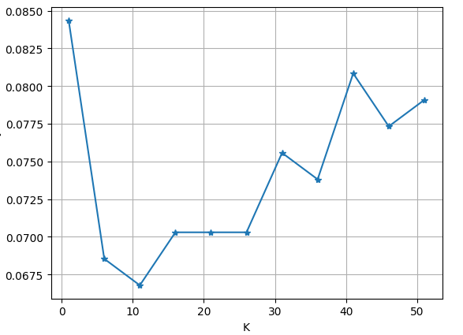
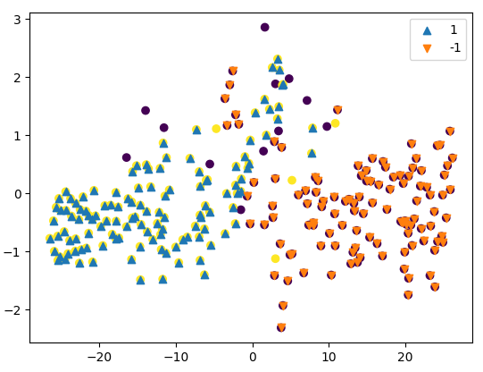
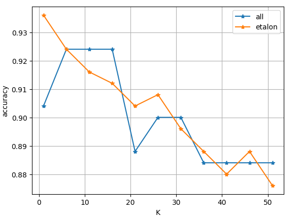

# Лабораторная работа №1

## Задание

1. выбрать датасет для классификации, например на [kaggle](https://www.kaggle.com/datasets?tags=13302-Classification);
2. реализовать алгоритм KNN с методом окна Парзена переменной ширины;
   1. в качестве ядра можно использовать гауссово ядро;
3. подобрать параметр k методом скользящего контроля (LOO);
4. обосновать выбор параметров алгоритма, построить графики эмпирического риска для различных k;
5. сравнить с [эталонной](https://scikit-learn.org/stable/) реализацией KNN;
   1. сравнить качество работы алгоритмов;
6. реализовать алгоритм отбора эталонов;
7. подготовить визуализацию результатов работы алгоритма отбора эталонов;
8. сравнить качество работы KNN с и без отбора эталонов; 
9. подготовить небольшой отчет о проделанной работе.

## Ход работы
Для лабораторной работы выбран датасет: **breast_cancer**  
Реализован алгоритм KNN с методом окна Парзена переменной ширины, в качестве ядра по умолчанию установлено прямоугольное ядро.
Используя алгоритм LOO подобран параметр k=11. Для этого значения эмпирический риск минимален.

В эталонной реализации при predict не используется фильтрация идентичного объекта (т.е. при k=1 при валидации на обучающей выборке эмпирический риск = 0).
Реализован алгоритм жадного удаления объектов для определения эталонов.
Качество при предсказании на эталонах стало выше.

