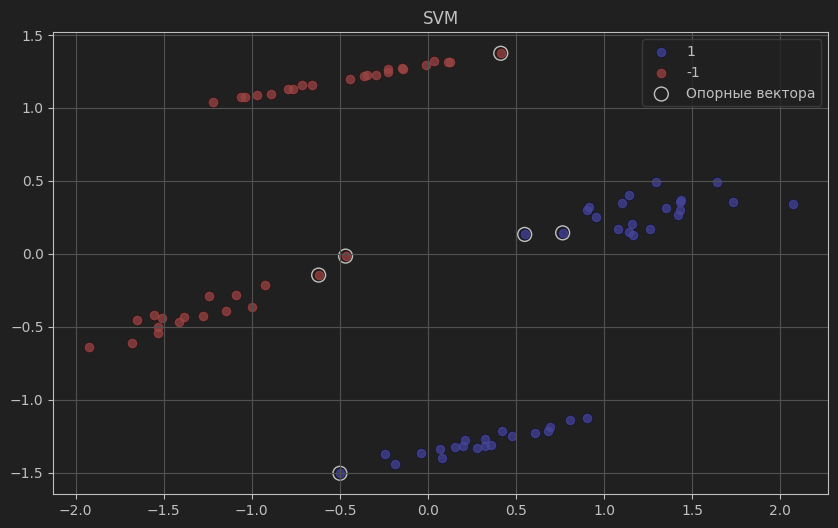

# Лабораторная работа №3

## Задание

1. выбрать датасет для бинарной классификации;
2. реализовать решение двойственной задачи по лямбда; для решения задачи использовать [scipy.optimize.minimize](https://docs.scipy.org/doc/scipy/reference/generated/scipy.optimize.minimize.html#scipy.optimize.minimize) или любую другую библиотеку;
3. провернуть трюк с ядром;
4. построить линейный классификатор;
5. визуализировать решение;
6. сравнить с эталонным решением;

## Ход работы

В ходе работы реализован алгоритм SVM, 3 ядра: линейное, полиномиальное, РБФ.  
Скорость работы нативной реализации в разы медленнее, чем в sklearn.   
Реализована визуализация исходного датасета с использованием алгоритма снижения размерности.
Также визуализированы опорные вектора.

Сравнение метрик эталонного алгоритма и реализованного алгоритма с разными ядрами (метрика F1):  

| Ядро           | Эталон | Реализация |
|----------------|--------|------------|
| Линейное       | 1.0    | 1.0        |
| RBF            | 1.0    | 1.0        |
| Полиномиальное | 1.0    | 1.0        | 

