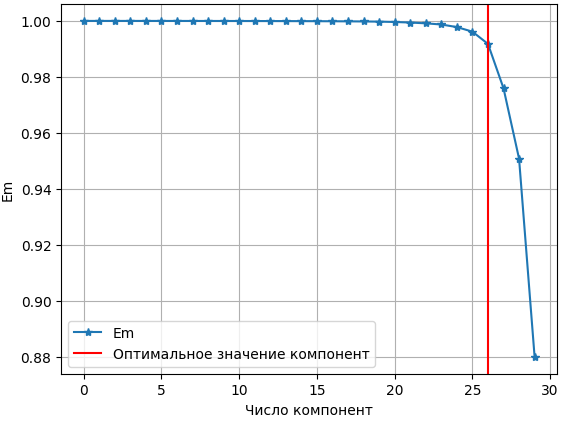
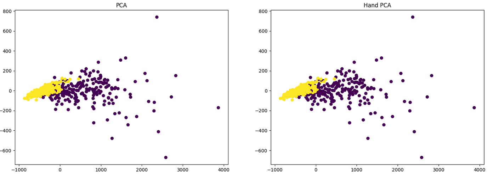

# Лабораторная работа №4

## Задание

1. выбрать датасет для линейной регрессии;
2. реализовать PCA через сингулярное разложение;
3. определить эффективную размерность выборки;
4. показать эквивалентность с эталонной реализацией;
5. подготовить отчет.

## Ход работы
Для лабораторной работы выбран датасет: **breast_cancer**.   
Реализован алгоритм PCA через сингулярное разложение матрицы.  
Эффективная размерность определена по критерию "крутого склона".  
  
Преобразования с помощью написанного алгоритма и эталонного идентичны.  
