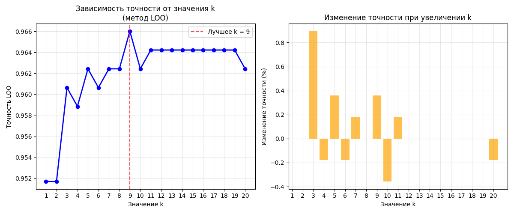
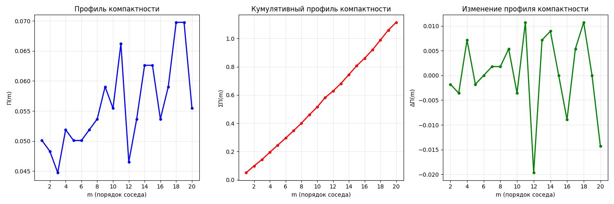
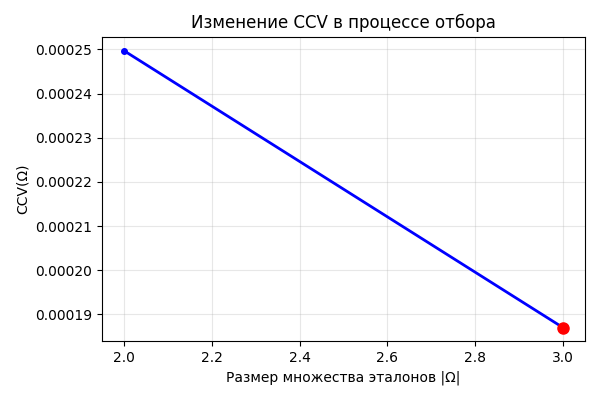
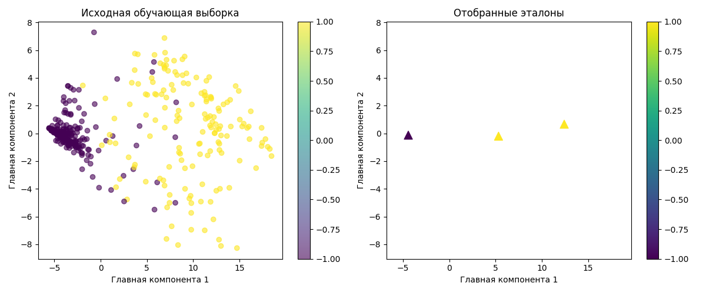

# Лабораторная работа №2

## Задание

1. выбрать датасет для классификации, например на kaggle;
2. реализовать алгоритм KNN с методом окна Парзена переменной ширины; 
   * в качестве ядра можно использовать гауссово ядро;
3. подобрать параметр k методом скользящего контроля (LOO);
4. обосновать выбор параметров алгоритма, построить графики эмпирического риска для различных k;
5. сравнить с эталонной реализацией KNN;
   * сравнить качество работы алгоритмов;
6. реализовать алгоритм отбора эталонов;
7. подготовить визуализацию результатов работы алгоритма отбора эталонов;
8. сравнить качество работы KNN с и без отбора эталонов;
9. подготовить небольшой отчет о проделанной работе.

## Отчёт выполнения

Все описанные шаги выполнялись исключительно с использованием библиотек numpy, pandas, matplotlib и seaborn, без использования каких-либо функций из sklearn (за исключением эталонных алгоритмов для сравнения с собственной реализацией)

1. В качестве датасета для классификации был выбран [Breast Cancer Wisconsin](https://www.kaggle.com/datasets/zzero0/uci-breast-cancer-wisconsin-original), содержащий информацию о различных медицинских показателях человека и его опухоли. 
   Целевая переменная бинарная и определяет тип опухоли - доброкачественная или злокачественная
2. Исходные данные уже предоставленны в закодированном виде, единственное, что требовало обработки это поле Bare_Nuclei, которое было строкового типа и содержало несколько пропусков. 
    Так как это поле категориальное, то его значения были приведены к числам, а пропуски были заполнены модой. Также поле Id не давало никакой информации и было удалено из датасета.
    Таргеты были приведены к формату -1 и 1 для удобства
3. Исходный набор данных был разделён на тренировочную и тестовую выборки в пропорциях 80/20, а также стратификацией по значению таргета. Код разбиения можно посмотретть [тут](source/data/process_data.py)
4. Далее был реализован алгоритм KNN с методом окна Парзена переменной ширины и гауссовым ядром. Исходный код можно посмотреть [тут](source/models/parzen_knn.py)
5. Для подбора оптимального параметра k был реализован методод скользящего контроля (LOO), который обучал KNN со всеми k в заданном промежутке на тренировочном наборе данных и рассчитывал accuracy. В итоге выбиралось значение k, при котором достигалась наибольшее значение accuracy
   
   Для данного набора данных лучшим значеним k стало `k=9`
   Исходный код реализации LLO можно посмотреть [тут](source/utils/llo.py)
6. Далее было произведено сравнение с эталонной реализацией KNN из sklearn (для подобранного значения k). В итоге были получены следующие метрики:
    ```text
    Сравнение качества:
          Method  Test size  Accuracy  Precision   Recall        F1
         Our KNN        140  0.957143   0.987805  0.94186  0.964286
     Sklearn KNN        140  0.957143   0.987805  0.94186  0.964286
    
    Совпадение предсказаний:
                 Our KNN  Sklearn KNN
    Our KNN          1.0          1.0
    Sklearn KNN      1.0          1.0
    ```
    Как видно, наш алгортим работает в точности также, как и алгортим в sklearn (100% совпадение предсказаний)
7. После был реализован метод отбора эталонов (прототипов) для уменьшения размера обучающей выборки, увеличения скорости предсказаний и уменьшения воздействия шума.
    
   Отбор эталонов происходил через минимизцию CCV при жадной стратегии добавления эталонов. Само значение CCV рассчитывалось через профили компактности вплоть до k-го (было выбрано значение k=3) с комбинаторными весовыми коэфициентами.
   

   Для начальной инициализации эталонов из каждого класса выбирался 1 объект, который был наиболее близок к центроиду этого класса.
   
   Далее на каждом шаге выбиралось 20 кандидатов, при этом для эффективного отбора кандадатов приминялась эвристика: для всех возможных кандидатов рассчитывалась "важность" этого кандидата, по сути то, какой возможный вклад он внесёт (может быть как положительный, так и отрицательный) и после выбиралось 20 кандидатов, для которых была рассчитана наибольшая "важность"
   
   
   
   В итоге получилось, что при 3х эталонных объектах CCV переставал уменьшаться
   
   Исходный код для расчёта профиля компактности и CCV можно найти [тут](source/selection/compactness.py), а для отбора эталонов [тут](source/selection/prototype_selector.py) 
8. Далее был написан метод для визуализации отобранных эталонов, исходный код можно посмотреть [тут](source/utils/plotting.py) 
   
   Для отображения на точечном графике использовался PCA для уменьшения размерности до 2х главных компонент
   
    
9. Далее было произведено ещё одно сравнение исходного KNN и KNN с обучением только на эталонах, а также с моделями sklearn (обученными на всем тренировочном наборе и только на эталонах).
    Результаты сравнения:
   ```text
    Сравнение качества:
                       Method  Test size  Accuracy  Precision    Recall        F1
                      Our KNN        140  0.957143   0.987805  0.941860  0.964286
                  Sklearn KNN        140  0.957143   0.987805  0.941860  0.964286
         Our KNN (Prototypes)        140  0.985714   0.988372  0.988372  0.988372
     Sklearn KNN (Prototypes)        140  0.985714   0.988372  0.988372  0.988372
    
    Совпадение предсказаний:
                               Our KNN  Sklearn KNN  Our KNN (Prototypes)  Sklearn KNN (Prototypes)
    Our KNN                   1.000000     1.000000              0.971429                  0.971429
    Sklearn KNN               1.000000     1.000000              0.971429                  0.971429
    Our KNN (Prototypes)      0.971429     0.971429              1.000000                  1.000000
    Sklearn KNN (Prototypes)  0.971429     0.971429              1.000000                  1.000000
    ```
   Как можно заметить, KNN обученнные только на эталонах показали более высокие метрики, чем исходная KNN, обученнная на всём тренировочном наборе. В целом это весьма логично, так как даже на графике PCA выше заметно, что классы -1 имеют выборсы и иногда сидят глубоко в классе 1, что даёт ошибку при обучении на полном наборе данных. В то же время на эталонах такой проблемы нет, так как они весьма чётко определяют границы классов.

Полный лог обучения моделей, нахождения k через LLO, отбора эталонов и анализа результатов доступен [тут](logs/logs.txt)
