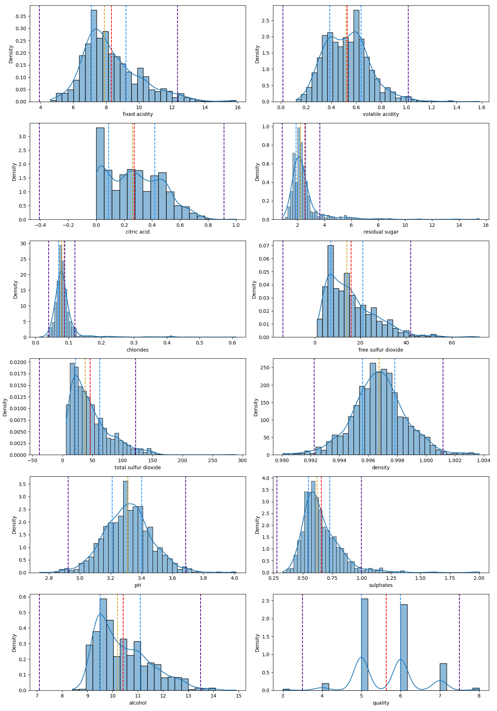
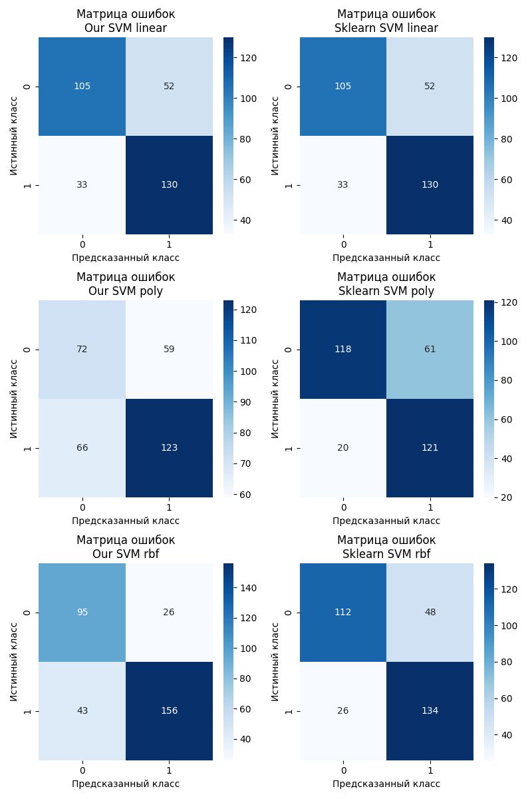
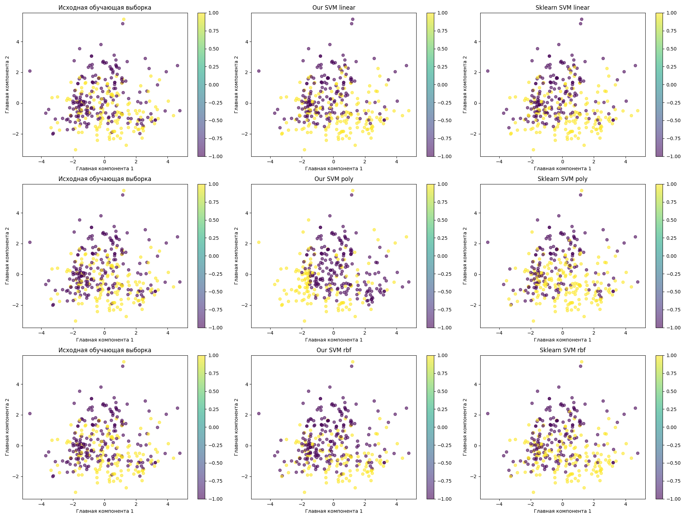

# Лабораторная работа №3

## Задание

1. выбрать датасет для бинарной классификации;
2. реализовать решение двойственной задачи по лямбда; для решения задачи использовать [scipy.optimize.minimize](https://docs.scipy.org/doc/scipy/reference/generated/scipy.optimize.minimize.html#scipy.optimize.minimize) или любую другую библиотеку;
3. провернуть трюк с ядром;
4. построить линейный классификатор;
5. визуализировать решение;
6. сравнить с эталонным решением.

## Отчёт выполнения

1. В качестве датасета для классификации был выбран [Red Wine Quality](https://www.kaggle.com/datasets/uciml/red-wine-quality-cortez-et-al-2009), содержащий информацию о различных показателях красного вина.
   Целевая переменная означающая качество вина (по описанию) принимает значения от 1 до 10, но в реальности она принимала значения только от 3 до 8.
2. Исходные признаки представляют из себя непрерывные значения, большинство из них распределены нормально.
   В качестве предобработки таргет был определён как `качество вина >= 6`, по смыслу означая 1 = хорошее вино, -1 = плохое.
   Сама фича "качество вина" была удалена из набора данных (так как это таргет)
   
   График распредления признаков:
   
   
3. Так как признаки распределны весьма нормально, то к ним всем был применён StandartScaler, реализация [тут](source/data/process_data.py)
4. Полученный набор данных был разделён на тренировочную и тестовую выборки в пропорциях 80/20 со стратификацией по значению таргета. Код разбиения можно посмотреть [тут](source/data/process_data.py)

5. Далее была реализована собственная версия SVM с поддержкой различных ядер:
   * Линейное ядро - для линейно разделимых данных
   * RBF (радиально-базисное) ядро - для нелинейных разделяющих поверхностей
   * Полиномиальное ядро - для полиномиальных решающих поверхностей
   
   Код ядер можно посмотреть [тут](source/model/kerel.py), а код SVM [тут](source/model/svm.py)
6. Для решения двойственной задачи SVM был использован метод SLSQP из библиотеки scipy.optimize с аналитическим вычислением градиента:
   ```python
   @staticmethod
   def objective_function(lambdas, weighted_kernel):
       objective = 0.5 * np.sum(
           lambdas[:, np.newaxis] * lambdas[np.newaxis, :] * weighted_kernel
       ) - np.sum(lambdas)
       jacobian = np.sum(lambdas[np.newaxis, :] * weighted_kernel, axis=1) - 1
       return objective, jacobian
   ```
   Аналитический градиент позволил значительно ускорить процесс оптимизации по сравнению с численными методами.
   
7. Для сравнения с эталонной реализацией была написана функция, которая параллельно обучает собственные и sklearn реализации SVM с различными ядрами и сравнивает их метрики качества:
   Результаты сравнения:
   ```text
      Metrics comparison:
           Method  Kernel  Test size  Train Time (sec)  Accuracy  Precision    Recall        F1
   0      Our SVM  linear        320            117.19  0.734375   0.668790  0.760870  0.711864
   1      Our SVM    poly        320             29.58  0.609375   0.549618  0.521739  0.535316
   2      Our SVM     rbf        320            112.65  0.784375   0.785124  0.688406  0.733591
   3  Sklearn SVM  linear        320              0.02  0.734375   0.668790  0.760870  0.711864
   4  Sklearn SVM    poly        320              0.01  0.746875   0.659218  0.855072  0.744479
   5  Sklearn SVM     rbf        320              0.01  0.768750   0.700000  0.811594  0.751678
   ```
   
   Выводы из сравнения:
   1. Кастомная реализация показывает похожие метрики качества с sklearn версией для всех типов ядер, кроме полиномиального, вероятно из-за изначальной инициализации. 
      При этом наша реализация SVM c RBF ядром показало наилучшие результаты на данном датасете (по accuracy).
   2. Sklearn реализация значительно быстрее благодаря оптимизациям на C++ и, вероятно, другим внутренним оптимизациям
   
   Исходный код сравнения можно посмотреть [тут](source/utils/compare.py)

8. Для визуализации работы алгоритма был применен PCA для снижения размерности до 2 главных компонент:
   

   На визуализации можно увидеть, что данные явно не разделимы линейно, поэтому RBF ядро и оработало лучше других. 

9. После был проведён анализ опорных векторов собственных моделей:
   ```text
   Our SVM with kernel Linear:
   - Количество опорных векторов: 755
   - Максимальное lambda: 1.000000
   - Минимальное lambda: 0.134944
   Our SVM with kernel Poly(degree=3):
   - Количество опорных векторов: 1279
   - Максимальное lambda: 0.894887
   - Минимальное lambda: 0.092374
   Our SVM with kernel RBF(gamma=0.090):
   - Количество опорных векторов: 784
   - Максимальное lambda: 1.000000
   - Минимальное lambda: 0.025164
   ```

Полный лог обучения моделей и анализа результатов доступен [тут](logs/logs.txt)

