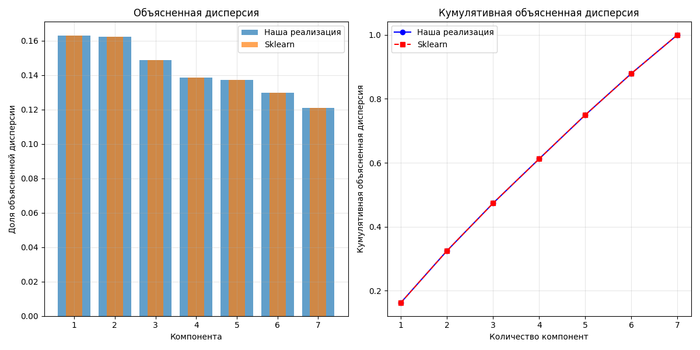
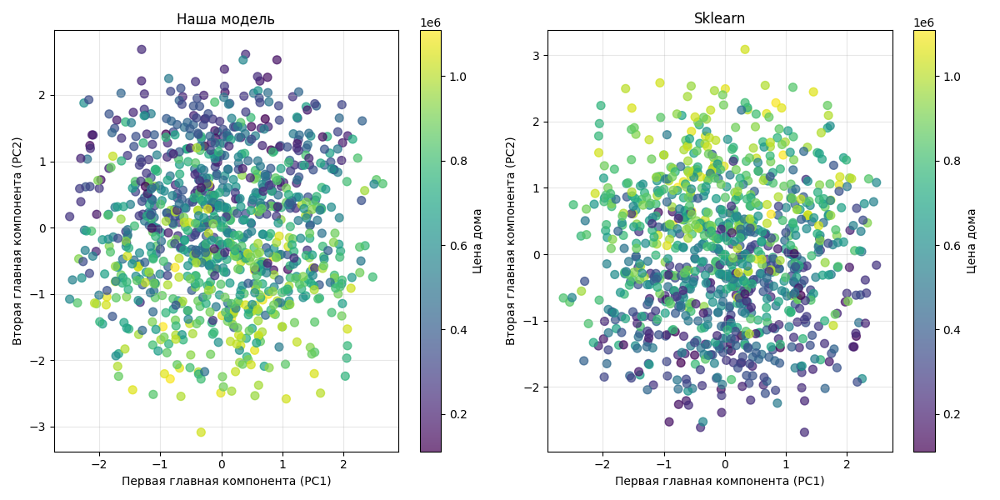

# Лабораторная работа №4

## Задание

1. выбрать датасет для линейной регрессии;
2. реализовать PCA через сингулярное разложение;
3. определить эффективную размерность выборки;
4. показать эквивалентность с эталонной реализацией;
5. подготовить отчет.

## Отчёт выполнения

1. В качестве датасета для PCA был выбран [MNIST](https://www.kaggle.com/datasets/oddrationale/mnist-in-csv), содержащий информацию об изображениях цифр. 
   Изображения имеют размер 28x28 пикселей и в датасете представлены в csv формате (784 колонки для каждого пикселя). 
2. Далее был реализован пайплайн предобработки данных, был реализован MinMaxScaler для нормализации значений пикселей.
3. Далее был реализован сам метод PCA через сингулярное разложение, используя встроенную функцию `numpy` - `linalg.svd`. Код реализации [тут](source/model/pca.py)
4. Далее был реализован алгортим определения эффективной размерности выборки для заданого порога объясненной дисперсии. 
   Суть состояла в том, что мы строим преобразавание в пространство той же размеронсти и после отбираем по комммулятивной нормированной объясненной дисперсии нужное кол-во компонент.
   Код можно посмотреть [тут](source/utils/find_n_comp.py)
   
   В итоге, для датасета было получено, что для 90% объясненной дисперсии необходимо 87 компонент.
5. Далее было произведено сравнение с эталонной релизаций PCA через sklearn, было получено 100% сходство собственной реализации с sklearn по объясненной дисперсии каждой компоненты, а также корреляцции между самими компонентами.
   
   
   При этом, сами полученные занчения координат для некоторых компонент различлись (на визулизации можно заметить, что 2-ая ГК отзеркалена), вероятно из-за каких-то внутренних предобработок sklearn в PCA. 
   Но это никак не повлияло на качетсво работы, так как опять же, корреляция между координатами полученными нашим PCA и sklearn PCA = 100%.
   
   
   Код сравнения моделей можно найти [тут](source/utils/compare.py)

Ну и как обычно, полный лог обучения моделей и анализа результатов доступен [тут](logs/logs.txt)
