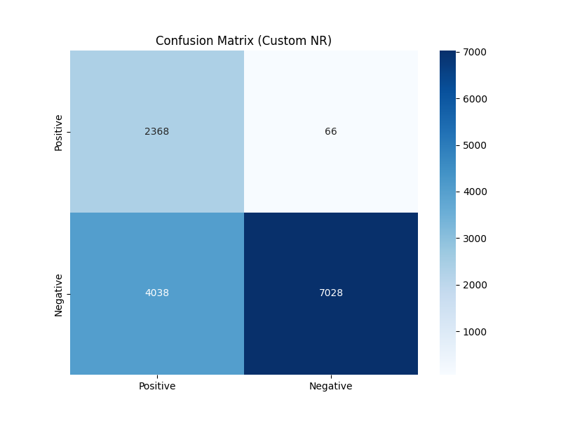
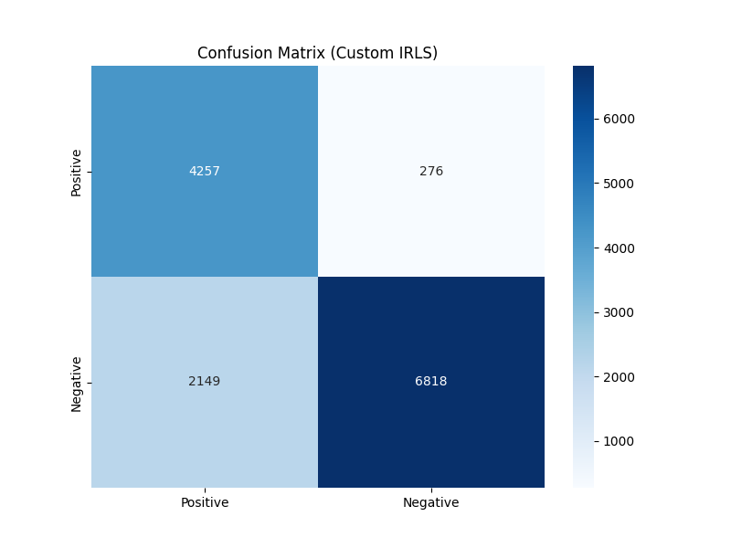
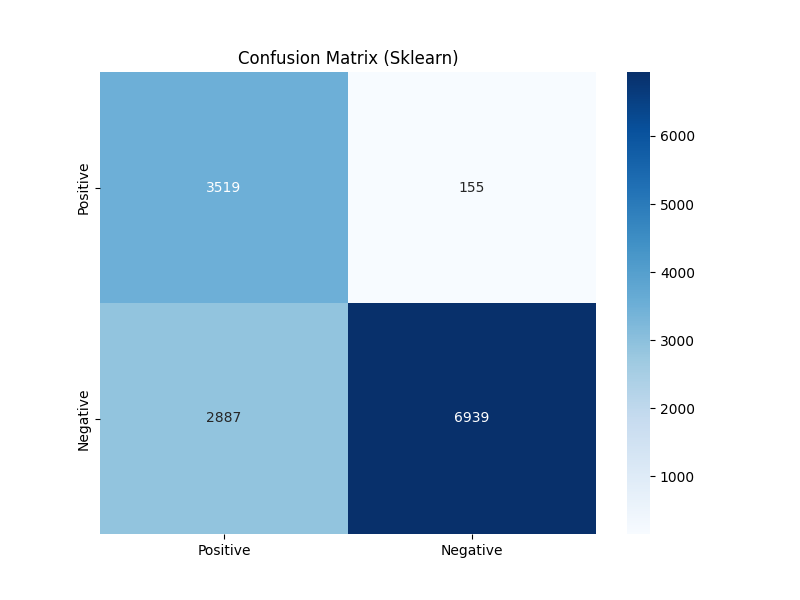
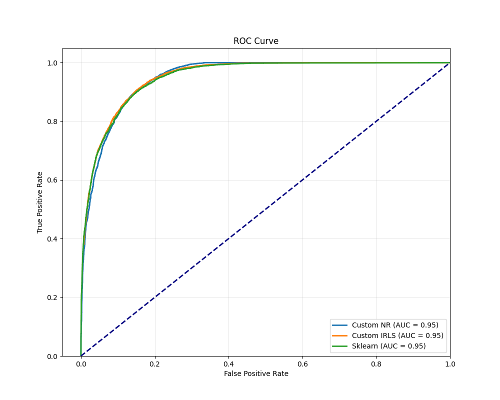

# Лабораторная работа №5

## Задание

В рамках лабораторной работы необходимо реализовать логистическую регрессию и сравнить с эталонной реализацией алгоритма.

Задание:
1. Выбрать датасет для логистической регрессии;
2. Реализовать логистическую регрессию с помощью метода Ньютона-Рафсона и IRLS;
3. Показать эквивалентность с эталонной реализацией;
4. Подготовить отчет.

## Отчёт выполнения

1. В качестве датасета для логистической регрессии был выбран [Loan Approval Classification Dataset](https://www.kaggle.com/datasets/taweilo/loan-approval-classification-data), содержащий информацию о статусе кредитных заявок в банке. 
   Целевая переменная бинарная - 0 заявка на кредит отклонена, 1 заявка одобрена. Датасет содержит как числовые, так и категориальные признаки.

2. Была реализована логистическая регрессия с двумя методами оптимизации:
    - **Метод Ньютона-Рафсона (NR)**: Итерационный метод поиска корней, который использует гессиан для более быстрых обновлений.
    - **МНК с итерационным перевзвешиванием объектов (IRLS)**: Эквивалентный Ньютону-Рафсону метод для логистической регрессии, который на каждой итерации решает взвешенную задачу наименьших квадратов.
    Код реализации можно посмотреть [тут](source/models/logistic_regression.py).

3. Для сравнения с эталонной реализацией была написана функция, которая обучает обе наши модели и модель `LogisticRegression` из `sklearn` и сравнивает их метрики качества.
   Результаты сравнения:
   ```text
           Method  Test size  Accuracy  Precision    Recall        F1   ROC AUC
   0    Custom NR      13500  0.695926   0.973652  0.369185  0.535371  0.949833
   1  Custom IRLS      13500  0.841704   0.816927  0.858882  0.837379  0.949281
   2      Sklearn      13500  0.774667   0.957812  0.549329  0.698214  0.949731
   ```
   
   Матрицы ошибок:

   
    
   

   Кривые ROC:
   
   

   **Выводы из сравнения:**
   - Реализация с помощью **IRLS** показывает наилучшие результаты по F1-мере и сбалансированности между точностью (Precision) и полнотой (Recall).
   - Реализация с помощью **метода Ньютона-Рафсона** показывает очень высокую точность, но низкую полноту, что говорит о том, что модель очень уверена в своих положительных прогнозах, но пропускает много реальных положительных случаев.
   - **Sklearn** реализация показывает результаты, промежуточные между двумя нашими реализациями.
   - Все три модели имеют очень близкие значения **AUC-ROC**, что говорит о схожей общей предсказательной способности.
   - Реализация IRLS сходится значительно быстрее, чем метод Ньютона-Рафсона в данной реализации.

   Исходный код сравнения можно посмотреть [тут](source/utils/compare.py).

Полный лог обучения моделей и анализа результатов доступен [тут](logs/logs.txt).