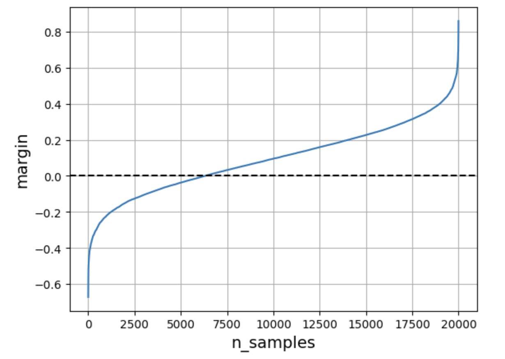
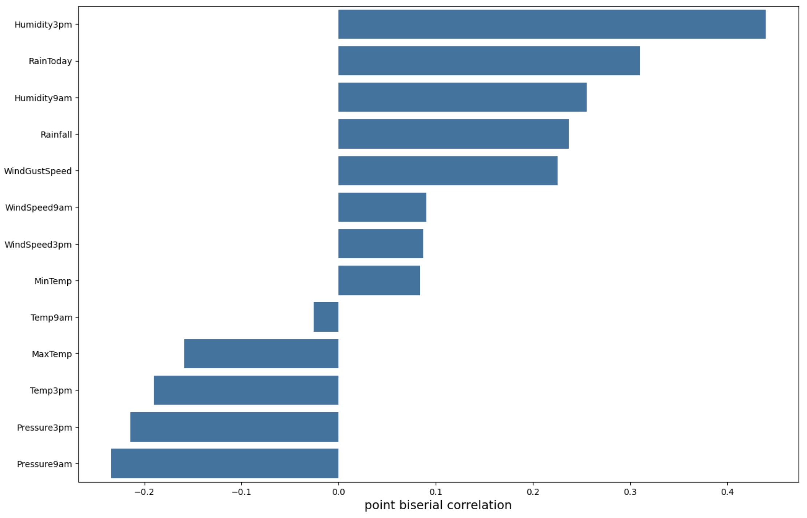

# Лабораторная работа №1
# Описание датасета
1. [Датасет](https://www.kaggle.com/datasets/jsphyg/weather-dataset-rattle-package) агрегирует информацию об атмосферных данных с целью предсказания наличия дождя на следующий день. В нем присутствуют как количественные, так и категориальные признаки. В ходе предварительного анализа данных (initial_eda.ipynb) были оставлены количественные признаки c пропусками менее 30%, а также бинарный признак RainToday. Все признаки были нормализованы.

- `Pressure9am` - атмосферное давление в 9:00
- `Pressure3pm` - давление в 15:00
- `MaxTemp` - максимальная температура за день
- `MinTemp` - минимальная температура за день
- `Temp9am` - температура в 9:00
- `Temp3pm` - температура в 15:00
- `WindGustSpeed` - максимальная скорость ветра за день
- `WindSpeed9am` - скорость ветра в 9:00
- `WindSpeed3pm` - скорость ветра в 15:00
- `RainToday` - факт дождя сегодня (0 или 1)
- `Rainfall` - кол-во осадков за день
- `Humidity9am` - влажность в 9:00
- `Humidity3pm` - влажность в 15:00

2. Пример отступов при обучении методом 9.2 (мультистарт со случайной инициализацией весов) для тестовой выборки представлен на графике ниже.

Видно, что большая часть объектов имеет положительный отступ, причем рост величины отступа линейный на большей части примеров, что может служить одним из признаков отсутствия переобучения.

Дополнительно был получен коэффициент корреляции pointbiserial из пакета scipy, который подходит для сравнения непрерывных признаков и бинарного таргета. Значения этого коэффициента для использованных признаков:

Обученные разными способами модели генерируют приблизительно одинаковые распределения весов для признаков:

Они достаточно близки к коэффициенту корреляции, поскольку модель учит только линейные связи между признаками и таргетом.

3. Результаты обучения различных версий модели

| Метрика / Метод| 9.1 | 9.2 | 9.3 | Эталон |
|-------|-------|--------|-------|-------|
| Accuracy | 0,722 | 0,677  | 0,653 | 0,847 |
| Precision| 0,437 | 0,400  | 0,380 | 0,765 |
| Recall | 0,798 | 0,857  | 0,847 | 0,441 |
|F1-score | 0,565 | 0,546  | 0,525 | 0,559 |

В качестве эталонного классификатора был выбран метод svm.SVC(kernel='linear') из sklearn: https://scikit-learn.org/stable/modules/generated/sklearn.svm.SVC.html#sklearn.svm.SVC

