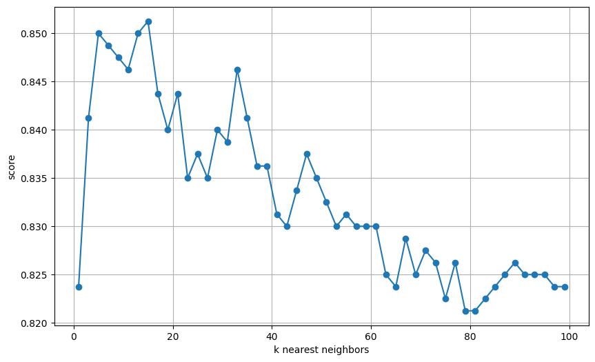
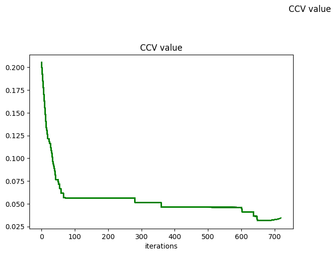
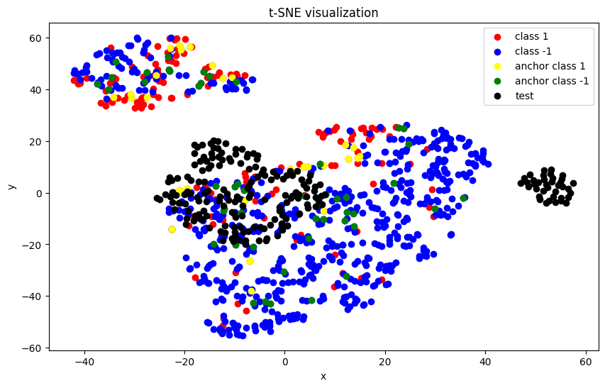
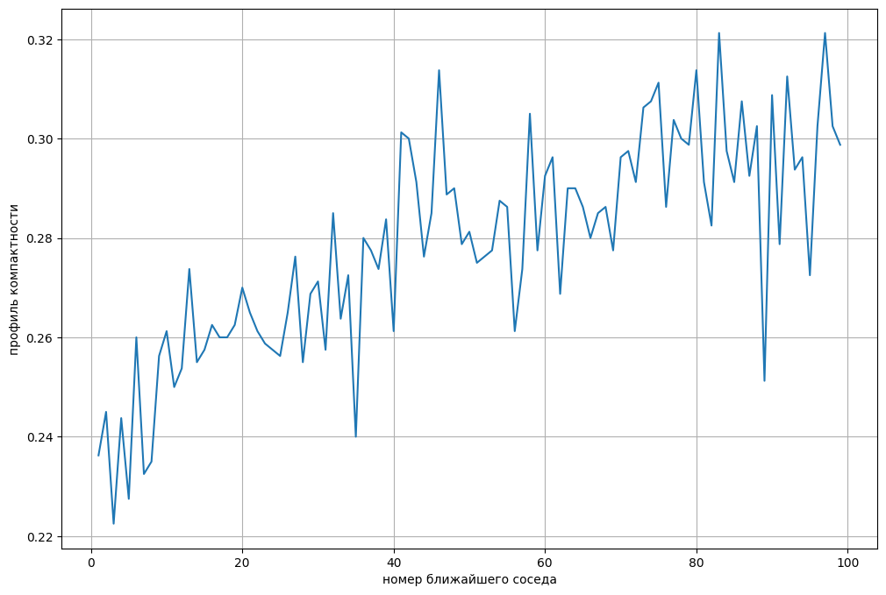

# Лабораторная работа №2

# Описание датасета
1. [Датасет](https://www.kaggle.com/datasets/jsphyg/weather-dataset-rattle-package) агрегирует информацию об атмосферных данных с целью предсказания наличия дождя на следующий день. В нем присутствуют как количественные, так и категориальные признаки. В ходе предварительного анализа данных (initial_eda.ipynb) были оставлены количественные признаки c пропусками менее 30%, а также бинарный признак RainToday. Все признаки были нормализованы.

- `Pressure9am` - атмосферное давление в 9:00
- `Pressure3pm` - давление в 15:00
- `MaxTemp` - максимальная температура за день
- `MinTemp` - минимальная температура за день
- `Temp9am` - температура в 9:00
- `Temp3pm` - температура в 15:00
- `WindGustSpeed` - максимальная скорость ветра за день
- `WindSpeed9am` - скорость ветра в 9:00
- `WindSpeed3pm` - скорость ветра в 15:00
- `RainToday` - факт дождя сегодня (0 или 1)
- `Rainfall` - кол-во осадков за день
- `Humidity9am` - влажность в 9:00
- `Humidity3pm` - влажность в 15:00

2. Предобработка датасета идентична методу из ЛР №1; для ускорения работы алгоритма отобрано 1000 случайных объектов датасета: 800 на обучающую выборку, 200 на тестовую.

# Описание алгорита
За основной алгоритм взят KNN с окном Парзена переменной ширины. Ядерную функцию можно задать по своему усмотрению, в ЛР реализована $K(r) = 1 / r$

## Подбор параметра k методом LOO
Для сформированной обучающей выборки график зависимости качества классификации от параметра k указан на рисунке.

Наилучшим значением оказалось k = 15 с accuracy = 0.85125

## Оценка качества лучшей модели на тесте и сравнение с KNN из sklearn
В таблице приведено сравнение качества самописного KNN с параметрок k = 15 и моделью sklearn.neighbors.KNeighborsClassifier:

| Метрика / Метод| Собственный| Эталон |
|-------|-------|--------|
| Accuracy | 0,81 | 0,81  |
| Precision| 0,77 | 0,77  |
| Recall | 0,34 | 0,34  |
|F1-score | 0,47 | 0,47 |

Главное отличие - время работы. При увеличении кол-ва объектов для оценки самописный метод начинает сильно замедляться. Это связано с тем, что расстояния до объектов высчитываются динамически в один поток. Алгоритмическая сложность поиска $O(N_{train} * N_{test})$

Метод из sklearn при вызове predict вычисляет все расстояния параллельно, причем использует оптимизации для метрики расстояния. Поэтому, несмотря на такую же алгоритмическую сложность (см. [документацию](https://github.com/scikit-learn/scikit-learn/blob/ea9e824705cc6313aa65413e9ee245fa974f8dd6/sklearn/metrics/_pairwise_distances_reduction/_dispatcher.py#L534)), выполнется на несколько порядков быстрее.

## Отбор эталонов
Для отбора эталонов использовалась жадная стратегия удаления не-эталонов по оценке значения CCV(k = 3). В результате удалось отобрать 80 опорных объектов из 800, при небольшом ухудшении качества. График изменения значения CCV в зависимости от кол-ва отброшенных элементов представлен ниже.

Для визуализации отобранных объектов выполнилось понижение размерности методом t-SNE.

Как видно, классы линейно неразделимы. Также это можно увидеть из слабо возрастающего профиля компактности

В таблице приведены метрики для KNN с параметром k = 15 с классификацией только по отобранным эталонам:

| Метрика / Метод| Собственный|
|-------|-------|
| Accuracy | 0,77 |
| Precision| 0,62 |
| Recall | 0,16 |
| F1-score | 0,25 |
