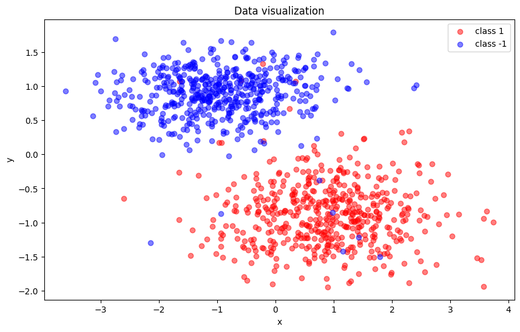
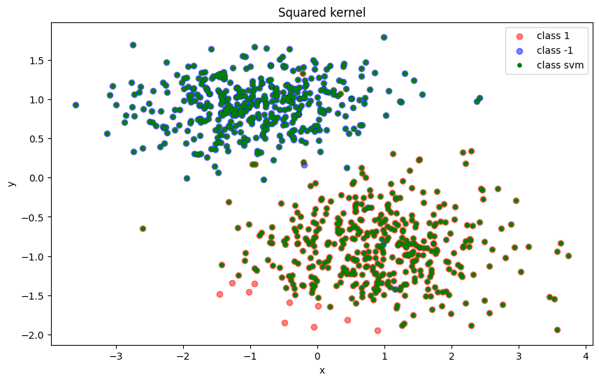
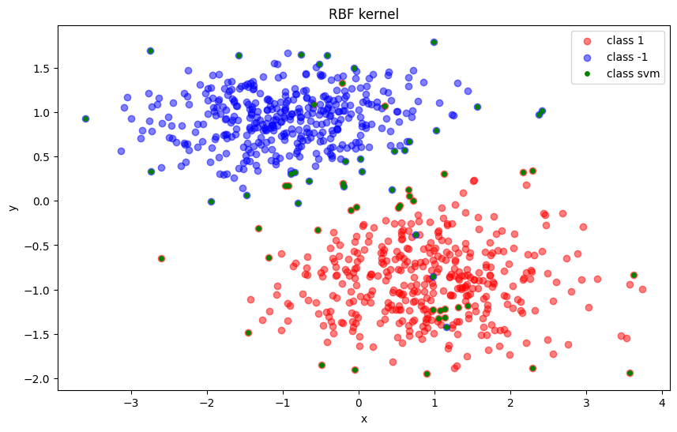

# Лабораторная работа №3

# Описание датасета
1. Датасет для бинарной классификации сгенерирован с помощью встроенного метода sklearn.datasets.make_classification:

```python
X, y = make_classification(n_samples=1000, n_features=2, n_informative=2, n_redundant=0, n_clusters_per_class=1, class_sep=1.2)
```
Распределение объектов выглядит следующим образом


# Описание алгорита
Тестировались вариации SVM с ядрами:
1. Линейное: $K(x, x') = <x, x'>$
2. Квадратичное: $K(x, x') = <x, x'>^2$
3. RBF: $K(x, x') = e^{(-\gamma ||x - x'||^2)}$


# Визуализация опорных векторов
   

## Оценка качества моделей и сравнение с SVM из sklearn
В таблице приведено сравнение качества самописных классов SVM и моделью sklearn.svm.SVC(kernel="linear"):

| Метрика / Метод| Linear | Squared | RBF | Эталон |
|-------|-------|--------|-------|-------|
| Accuracy | 0,960 | 0,540 | 0,960 | 0,960 |
| Precision| 0,938 | 0,500 | 0,947 | 0,947 |
| Recall | 0,978 | 0,402 | 0,967 | 0,967 |
|F1-score | 0,957 | 0,446 | 0,957 | 0,957 |
