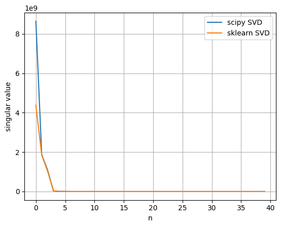
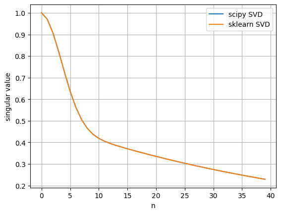
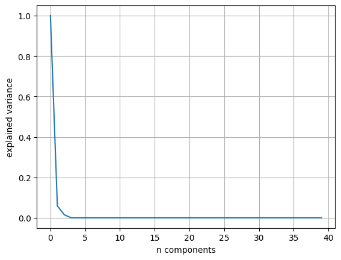
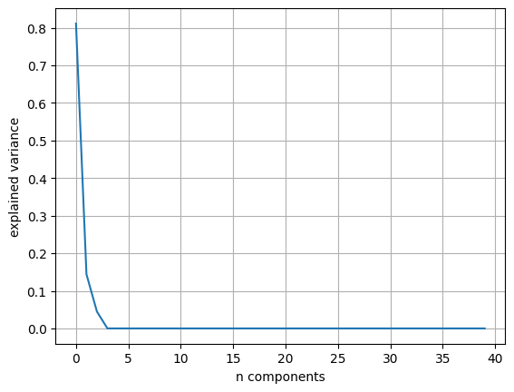
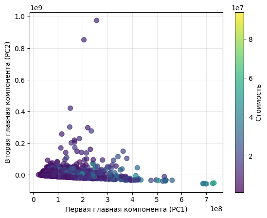

# Лабораторная работа №4

# 1. Описание датасета
[Датасет](https://www.kaggle.com/datasets/franciscogcc/financial-data) предназначен для задачи регрессии и описывает объем золота, который торговался в определенный день. В качестве признаков используются индексы золота с S&P, Nasdaq, Forex и других площадок.

# 2. Сравнение алгоритмов SVD из SciPy и Sklearn
Первое, на что стоит обратить внимание - различие в результатах сингулярного разложения для библиотек SciPy и Sklearn. На графиках ниже представлены распределения сингулярных значений, полученных на 2-х датасетах.

Для финансового датасета:

**SciPy**


```
output:
scipy_svd
array([8.63943073e+09, 1.86947349e+09, 1.09112210e+09, 2.96686367e+07,
       5.22075200e+06, 4.54152419e+06, 2.46155791e+04, 6.15469456e+03,
       4.82468646e+03, 2.10843511e+03, 1.41138390e+03, 1.07911118e+03,
       2.87186698e+02, 1.60561384e+02, 1.40159416e+02, 1.19488542e+02,
       8.50549992e+01, 4.91601085e+01, 4.75301153e+01, 4.53921816e+01,
       4.47120609e+01, 3.25046513e+01, 3.15991756e+01, 2.95478632e+01,
       2.54805467e+01, 2.44725661e+01, 2.22908558e+01, 1.62041840e+01,
       1.58466479e+01, 1.20130201e+01, 9.76539389e+00, 8.18424276e+00,
       7.86823925e+00, 3.03851906e+00, 6.21902921e-07, 6.21902921e-07,
       6.21902921e-07, 6.21902921e-07, 6.21902921e-07, 6.21902921e-07])
```

```
output:
sklearn_svd
array([4.38443067e+09, 1.84703038e+09, 1.02859929e+09, 2.84606720e+07,
       5.22074726e+06, 4.31881557e+06, 1.37064832e+04, 4.99998677e+03,
       3.20703838e+03, 1.41555054e+03, 1.07919407e+03, 8.98484468e+02,
       2.59693277e+02, 1.60248445e+02, 1.38742455e+02, 1.19563317e+02,
       8.31001886e+01, 4.89060260e+01, 4.54575195e+01, 4.27693938e+01,
       3.85721605e+01, 3.15106250e+01, 3.09914573e+01, 2.72964746e+01,
       2.55024479e+01, 2.43639919e+01, 1.61703915e+01, 1.58294846e+01,
       1.48756929e+01, 1.32439251e+01, 9.89999420e+00, 9.28691023e+00,
       8.00202666e+00, 6.26348963e+00, 2.75320076e+00, 4.18684979e-02,
       2.54520525e-02, 0.00000000e+00, 0.00000000e+00, 0.00000000e+00])
```

**Sklearn**


Для датасета, сгенерированного с помощью метода make_regression()
```python
from scipy.linalg import svd
from sklearn.datasets import make_regression


# тестовый датасет для сингулярного разложения
n_features = 40
n_informative = 5

x, y = make_regression(n_samples=2000, n_features=n_features, n_informative=n_informative, effective_rank=n_informative)

scipy_svd = svd(x)[1]

sklearn_model = PCA(n_components=40)
sklearn_model.fit_transform(x)
sklearn_svd = sklearn_model.singular_values_
```

```
output:
scipy_svd
array([1.        , 0.97049406, 0.90646661, 0.81972043, 0.72520439,
       0.63635843, 0.5619241 , 0.50510833, 0.46472426, 0.43721705,
       0.4185232 , 0.40521293, 0.39488949, 0.38610541, 0.37808871,
       0.37047082, 0.36309237, 0.35588993, 0.34883934, 0.34193097,
       0.33516008, 0.32852342, 0.32201821, 0.31564182, 0.3093917 ,
       0.30326533, 0.29726027, 0.29137413, 0.28560453, 0.27994918,
       0.27440582, 0.26897222, 0.26364621, 0.25842567, 0.2533085 ,
       0.24829265, 0.24337613, 0.23855696, 0.23383321, 0.22920301])
```

```
output:
sklearn_svd
array([0.99989547, 0.97029686, 0.9063047 , 0.81884   , 0.72461304,
       0.63635319, 0.56190153, 0.50508413, 0.46449585, 0.4370145 ,
       0.41822719, 0.40517155, 0.39487145, 0.38599312, 0.37782659,
       0.3704602 , 0.3629157 , 0.35587612, 0.348637  , 0.34193017,
       0.33486595, 0.32852164, 0.32198392, 0.31558301, 0.30936313,
       0.30319157, 0.29703635, 0.29137398, 0.28560389, 0.27994876,
       0.27438559, 0.26897091, 0.26358073, 0.25827634, 0.2533047 ,
       0.24824883, 0.24335942, 0.2385438 , 0.23371332, 0.22920293])
```

# 3. Эффективная размерность выборки
Для определения оптимального кол-ва новых признаков применяется анализ доли объясненной дисперсии. Она показывает, какую часть информации о данных мы теряем, отбрасывая первые i по значимости признаков. Ниже приводятся графики долей объясненной дисперси для 2-х версий PCA.

**Собственная модель PCA**


**Модель из sklearn**


Для первых признаков доли в моделях несколько отличаются. Это связано с отличиями в величинах собственных чисел (см. п.2). Тем не менее, общий вид графиков совпадает.

# 4. Сравнение работы алгоритмов PCA
Для проверки корректности написанного алгоритма было выполнено понижение размерности признакового пространства до n=2 компонент обоими алгоритмами. Результаты их работы представлены ниже

**Собственная модель PCA**


**Модель из sklearn**
