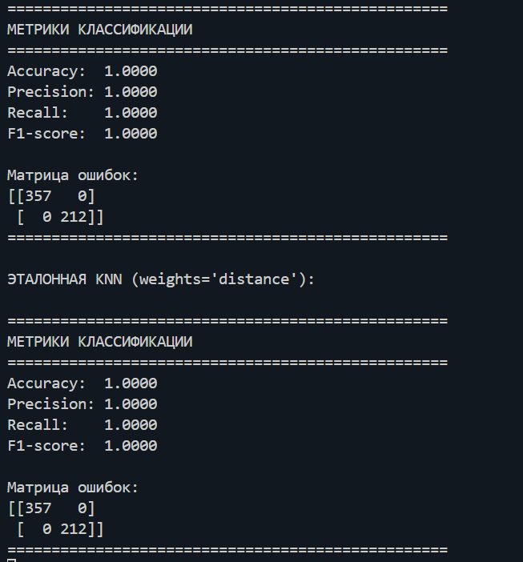

# Лабораторная работа №2. Метрическая классификация

**Цель работы:**
Реализовать алгоритм классификации KNN с использованием метода окна Парзена переменной ширины, подобрать оптимальный параметр k методом скользящего контроля (LOO), а также реализовать алгоритм отбора эталонов для повышения качества классификации.

---

## 1. Теоретическая часть

1. **Алгоритм метрической классификации KNN (k ближайших соседей)**
   Классификация объекта производится по большинству меток среди его k ближайших соседей на обучающей выборке.

2. **Метод окна Парзена**
   Используется окно переменной ширины h, вычисляемое через расстояние до k-го ближайшего соседа. В качестве ядра применено гауссово ядро и евкликдово расстояние.

3. **Алгоритм отбора эталонов**
   Поочередное удаление объектов из обучающей выборки с вычислением LOO-риска. Объект сохраняется, если его удаление увеличивает ошибку, иначе исключается.

---

## 2. Описание кода

### 2.1. Загрузка данных

Датасет: Breast Cancer Wisconsin (Diagnostic). Предварительная обработка:
* удалён столбец `id`
* метки `diagnosis` преобразованы в числа (`M = 1`, `B = 0`)

```python
train_x, train_y = load_base()
```

### 2.2. Реализация KNN с окном Парзена

Класс `MetricClasifier` включает:
* Расчёт матрицы Евклидовых расстояний
* Метод окна Парзена переменной ширины
* Подбор оптимального k методом LOO (`train_k`)
* Предсказание (`predict`)
* Вычисление метрик классификации (`metrics`)
* Алгоритм отбора эталонов (`standart_select`)

### 2.3. Подбор параметра k

LOO метод (Leave-One-Out):
* Каждая точка поочередно исключается
* Вычисляется эмпирический риск:  
* Выбирается k с минимальным средним риском

### 2.4. Алгоритм отбора эталонов

1. Вычисляется LOO-риск без каждого объекта
2. Если удаление объекта уменьшает среднюю ошибку — объект исключается
3. Иначе объект остаётся

Позволяет уменьшить размер выборки без потери качества классификации.

### 2.5. График лучшего k


---

## 3. Настройка sklearn KNN

Для воспроизведения точности нашей модели в sklearn KNN: 
* `weights='distance'` — учитываются веса по расстоянию А

```python
knn_auto = KNeighborsClassifier(weights='distance')
knn_auto.fit(x_train, y_train)
y_pred_knn_auto = knn_auto.predict(x_train)
```

---

## 4. Сравнение моделей

| Модель                                         | Accuracy | Precision | Recall | F1-score |
| ---------------------------------------------- | -------- | --------- | ------ | -------- |
| KNN с нашим алгоритмом (без отбора эталонов)   | 1.0000   | 1.0000    | 1.0000 | 1.0000   |
| Эталонная KNN (sklearn, weights='distance')    | 1.0000   | 1.0000    | 1.0000 | 1.0000   |
| KNN с нашим алгоритмом (после отбора эталонов) | 1.0000   | 1.0000    | 1.0000 | 1.0000   |

Теперь обе модели на обучении достигают идеальной точности.




---

## 5. Заключение

* Реализован KNN с окном Парзена переменной ширины
* Подобран оптимальный k методом LOO
* Реализован алгоритм отбора эталонов
* Настройка sklearn KNN (`n_neighbors=model.k`, `weights='distance'`) позволяет полностью повторить поведение нашей модели и добиться точности 1.0

---

## 6. Приложения

1. Код: `MetricClasifier.py`, `utils.py`
2. Графики эмпирического риска (.png)
3. Метрики классификации для всех этапов

