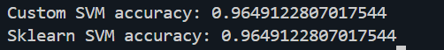
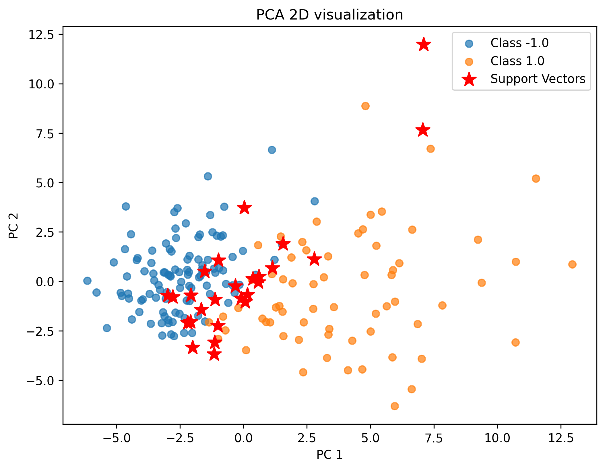
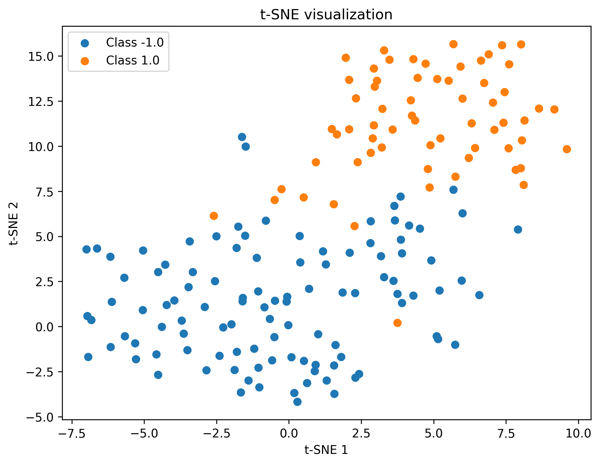
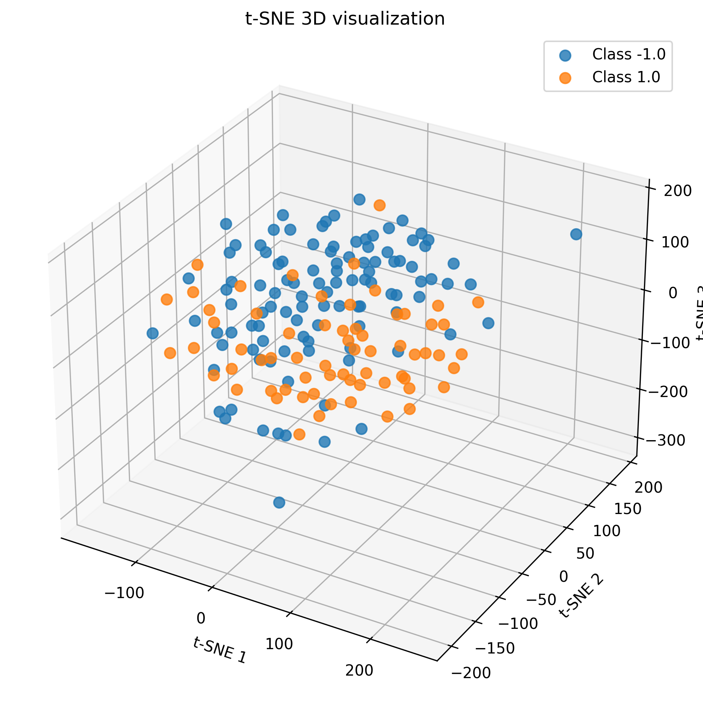

# Лабораторная работа №3 – Реализация SVM (Support Vector Machine)

## Теоретическая часть
В рамках лабораторной работы изучены аналитическая и геометрическая постановки задачи метода опорных векторов (SVM). Геометрическая постановка приводит к задаче квадратичного программирования (QP), которая может быть решена через двойственную задачу по λ (лямбда), где оптимизируются коэффициенты при ограничениях:

- максимизация ширины разделяющей полосы (margin)
- регуляризация с параметром штрафа C
- применение трюка с ядром (Kernel Trick) для построения нелинейных классификаторов

Рассмотрены популярные ядра:

- линейное
- полиномиальное
- RBF (не реализовано в текущей работе)

Также изучено влияние параметра регуляризации и выбор ядра на точность классификации и отбор признаков.

---

## Практическая часть
В ходе выполнения лабораторной работы были выполнены следующие шаги:

### ✅ 1. Выбор датасета для бинарной классификации
Был выбран датасет **Wisconsin Breast Cancer Diagnostic** с двумя классами:
- `M` (malignant) → `+1`
- `B` (benign) → `–1`

Данные автоматически скачиваются, если отсутствуют локально, после чего проходят обработку и масштабирование `StandardScaler`.

### ✅ 2. Реализация двойственной задачи по λ
Двойственная оптимизационная функция имеет вид:

```
L(λ) = − Σ λᵢ + ½ Σᵢ Σⱼ λᵢ λⱼ yᵢ yⱼ K(xᵢ, xⱼ)
```

Для нахождения оптимального λ использована библиотека `scipy.optimize.minimize` с методом `SLSQP`, при этом были учтены:
- ограничение равенства: `Σ λᵢ yᵢ = 0`
- границы: `0 ≤ λᵢ ≤ C`
- матрица ядра `K(xᵢ, xⱼ)` вычисляется вручную

### ✅ 3. Применение Kernel Trick
Реализована поддержка ядер:

- **Linear kernel**: скалярное произведение ⟨xᵢ, xⱼ⟩
- **Polynomial kernel**: (γ · ⟨xᵢ, xⱼ⟩ + 1)^d
  - γ = 1 / n_features, как в sklearn по умолчанию
  - d = степень полинома, задаётся в конструкторе

### ✅ 4. Построение линейного классификатора
Использовано линейное ядро для базовой классификации и корректного сравнения с эталоном.

### ✅ 5. Визуализация решения
Применены визуализации:
- `t-SNE 3D` предсказаний
- `t-SNE 2D + PCA 2D` распределения и выделения support vectors

### ✅ 6. Сравнение с эталонной реализацией
Custom‑SVM сравнивается с `sklearn.svm.SVC` при `C = 10`, ядро = `linear`. После добавления масштабирования данных точность становится сопоставимой.

---
 
 

## Результаты
| Метрика | Custom SVM | Sklearn SVM |
|--------|------------|-------------|
| Accuracy | 0.9649122807017544 | 0.9649122807017544 |



Визуализация PCA


Визуализация TSNE


Визуализация TSNE-3D

---

## Выводы
- Двойственная задача по λ решена корректно, классификация работает.
- Kernel Trick реализован и пригоден для нелинейной классификации.
- Масштабирование `StandardScaler` критично для получения сопоставимой точности.
- Custom‑SVM показала одинаковую точность с `sklearn.svm.SVC`, что подтверждает корректность реализации.

---
  