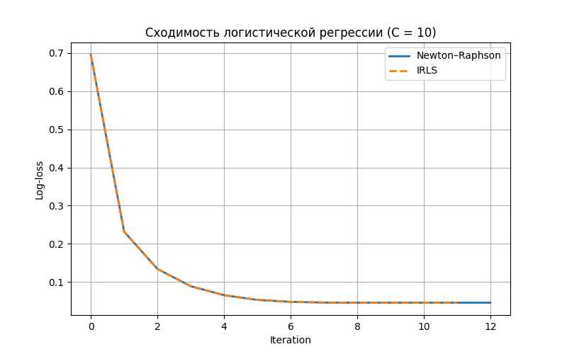

# Логистическая регрессия: Newton-Raphson и IRLS

## 1. Введение
На лекции рассмотрена многомерная нелинейная регрессия и её сведение к итерационному процессу IRLS. Также показано, как метод Ньютона-Рафсона применяется для решения задачи логистической регрессии. В этой работе реализована логистическая регрессия на примере датасета Breast Cancer, сравниваются результаты с эталонной реализацией `sklearn`.

## 2. Датасет
Используется датасет `Breast Cancer` из `sklearn.datasets`. Признаки нормализованы для стабильной работы методов.

```python
from sklearn.datasets import load_breast_cancer
X, y = load_breast_cancer(return_X_y=True)
X = (X - X.mean(axis=0)) / X.std(axis=0)
```

Разделение на тренировочную и тестовую выборки:
```python
from sklearn.model_selection import train_test_split
X_train, X_test, y_train, y_test = train_test_split(X, y, test_size=0.3, random_state=42, stratify=y)
```

## 3. Реализация логистической регрессии
Реализованы два метода:

1. **Newton-Raphson**
2. **IRLS (Iteratively Reweighted Least Squares)**

Основные моменты реализации:
- Используется сигмоида для вероятностей
- Лосс функция: log-loss с L2-регуляризацией
- Проверка сходимости по изменению лосса
- Весовые коэффициенты и свободный член инициализируются нулями

## 4. Сходимость
Ниже представлен график изменения функции потерь по итерациям для методов Newton-Raphson и IRLS.

```python
import matplotlib.pyplot as plt

plt.figure(figsize=(8, 5))
plt.plot(newton_model.loss_history, label="Newton–Raphson", linewidth=2)
plt.plot(irls_model.loss_history, label="IRLS", linestyle="--", linewidth=2)
plt.xlabel("Iteration")
plt.ylabel("Log-loss")
plt.title(f"Сходимость логистической регрессии (C = {C_value})")
plt.legend()
plt.grid(True)
plt.show()
```



## 5. Сравнение весов
Сравнение весов, полученных методами Newton-Raphson, IRLS и эталонной реализацией sklearn:

| Сравнение | Максимальная разница |
|-----------|--------------------|
| Ньютон vs IRLS | 0.0560 |
| Ньютон vs Sklearn | 0.0560 |
| IRLS vs Sklearn | 0.00001 |

## 6. Точность на тестовой выборке
Точность классификации на тестовой выборке:

| Метод | Точность |
|-------|----------|
| Newton-Raphson | 0.9766 |
| IRLS | 0.9766 |
| Sklearn | 0.9766 |

## 7. Сравнение вероятностей
Максимальная разница предсказанных вероятностей:

| Сравнение | Разница |
|-----------|---------|
| Ньютон vs IRLS | 0.0062 |
| Ньютон vs Sklearn | 0.0062 | 

## 8. Выводы
- Методы Newton-Raphson и IRLS эквивалентны для задачи логистической регрессии.
- Разница в весах между Newton и IRLS чуть больше, но точность на тестовой выборке одинакова.
- IRLS полностью совпадает с эталонной реализацией sklearn по весам и предсказаниям.
- Оба метода сходятся к одному минимуму log-loss, показывая корректность реализации.

