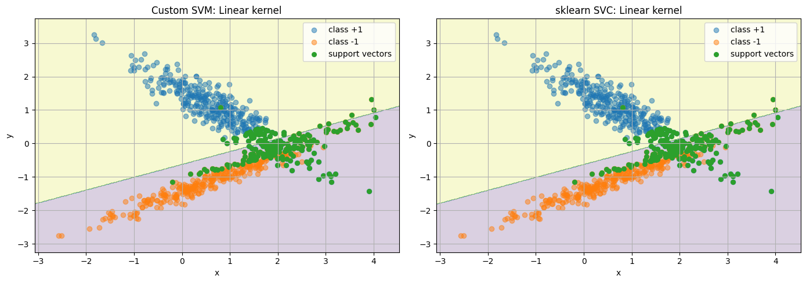
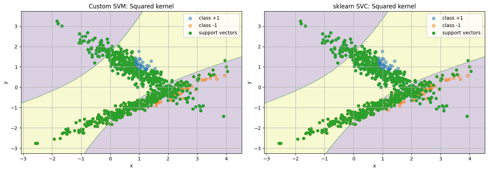
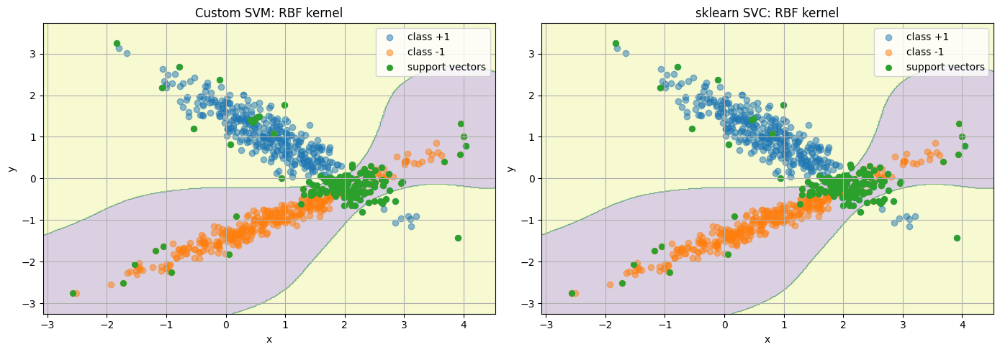

# Лабораторная работа № 3

## Описание датасета
```python
sklearn.dataset.make_classification(
        n_samples=1000,
        n_features=2,
        n_informative=2,
        n_redundant=0,
        n_clusters_per_class=1,
        class_sep=0.9,
        random_state=random_state,
    )
```

## Сравнение моей реализации SVM с эталонной

### Для Linear Kernel

| Метрика | Моя | Эталон |
|-------| --- |-------|
| Accuracy | 0.905 | 0.905 |
| Precision| 0.987 | 0.987 |
| Recall | 0.812 | 0.812 |
|F1-score | 0.891 | 0.891 |

### Для Squared kernel

| Метрика | Моя | Эталон |
|-------| --- |-------|
| Accuracy | 0.665 | 0.660 |
| Precision| 0.644 | 0.640 |
| Recall | 0.677 | 0.667 |
|F1-score | 0.659 | 0.653 |

### Для RBF kernel

| Метрика | Моя | Эталон |
|-------| --- |-------|
| Accuracy | 0.925 | 0.925 |
| Precision| 0.976 | 0.976 |
| Recall | 0.864 | 0.864 |
|F1-score | 0.917 | 0.917 |