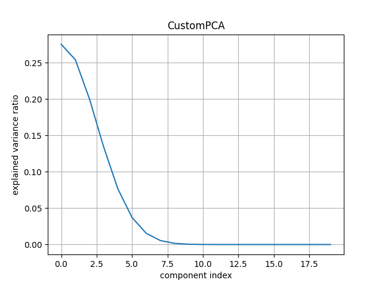
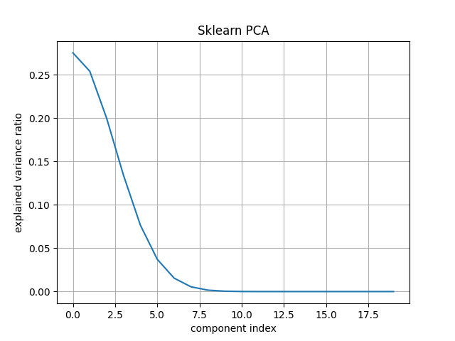
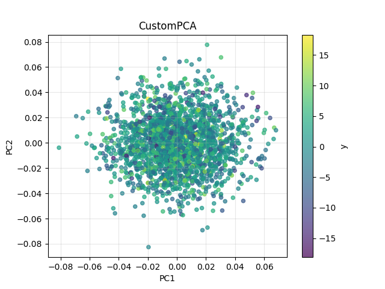
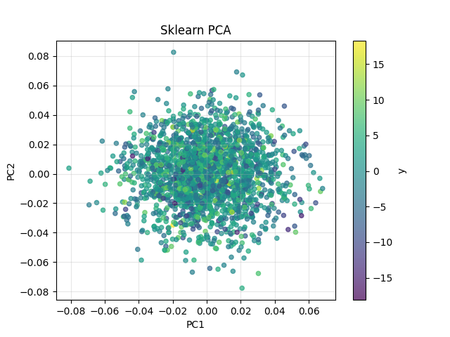

# Лабораторная работа №4

# 1. Описание датасета
Датасет сгенерирован с помощью приведённой ниже функции:
```python
def make_synthetic(seed: int = 0, n_samples: int = 2000, n_features: int = 40) -> Tuple[np.ndarray, np.ndarray]:
    from sklearn.datasets import make_regression

    X, y = make_regression(
    n_samples=2000,
    n_features=40,
    n_informative=5,
    effective_rank=5,
    tail_strength=0.0,
    noise=5.0,
    random_state=0,
)
    return X.astype(float), y.astype(float)

```

# 2. Сравнение моей реализации PCA c эталонной
Для сравнения работы алгоритмов привожу вывод, получаемый по итогу запуска скрипта main.py
Можно заметить, что компоненеты получаемые в результатет работы моего алгоритма и алгоритма реализованного в sklearn совподают

```
X shape: (2000, 40), y shape: (2000,)
Эффективная размерность выборки: 8
Первые 8 компонентов CustomPCA: [[-5.92246049e-03  1.61858663e-03  1.41395166e-02 ... -7.40364635e-08
   6.45295576e-09 -5.46728488e-09]
 [ 4.61189869e-03  4.39202369e-02  1.74262426e-02 ...  6.28089829e-08
  -4.61718058e-08 -3.94025231e-09]
 [-2.16613101e-02  1.47468756e-02 -2.06488820e-02 ... -1.45908169e-07
   5.38470205e-08 -8.10264316e-09]
 ...
 [-2.91004967e-02  3.71325056e-02 -1.93565172e-02 ...  1.91275676e-07
  -5.50699017e-08  5.34415650e-09]
 [ 3.96523087e-02  2.34184861e-02  1.10936086e-02 ...  2.16361369e-08
   7.88143568e-08  2.26717776e-08]
 [-4.65984102e-03  4.32784836e-02 -1.27267851e-03 ... -3.26110091e-07
  -2.99895042e-08 -3.14382967e-09]]
Первые 8 компонентов SklearnPCA: [[-5.92246049e-03 -1.61858663e-03  1.41395166e-02 ...  7.40364635e-08
  -6.45295576e-09 -5.46728488e-09]
 [ 4.61189869e-03 -4.39202369e-02  1.74262426e-02 ... -6.28089829e-08
   4.61718058e-08 -3.94025231e-09]
 [-2.16613101e-02 -1.47468756e-02 -2.06488820e-02 ...  1.45908169e-07
  -5.38470205e-08 -8.10264316e-09]
 ...
 [-2.91004967e-02 -3.71325056e-02 -1.93565172e-02 ... -1.91275676e-07
   5.50699017e-08  5.34415650e-09]
 [ 3.96523087e-02 -2.34184861e-02  1.10936086e-02 ... -2.16361369e-08
  -7.88143568e-08  2.26717776e-08]
 [-4.65984102e-03 -4.32784836e-02 -1.27267851e-03 ...  3.26110091e-07
   2.99895042e-08 -3.14382967e-09]]
```

# 3. График зависимости доли объяснимой дисперсии

**Собственная модель PCA**


**Модель из sklearn**



# 4. Сравнение работы алгоритмов PCA
Для проверки корректности написанного алгоритма было выполнено понижение размерности признакового пространства до n=2 компонент обоими алгоритмами. Результаты их работы представлены ниже

**Собственная модель PCA**


**Модель из sklearn**
