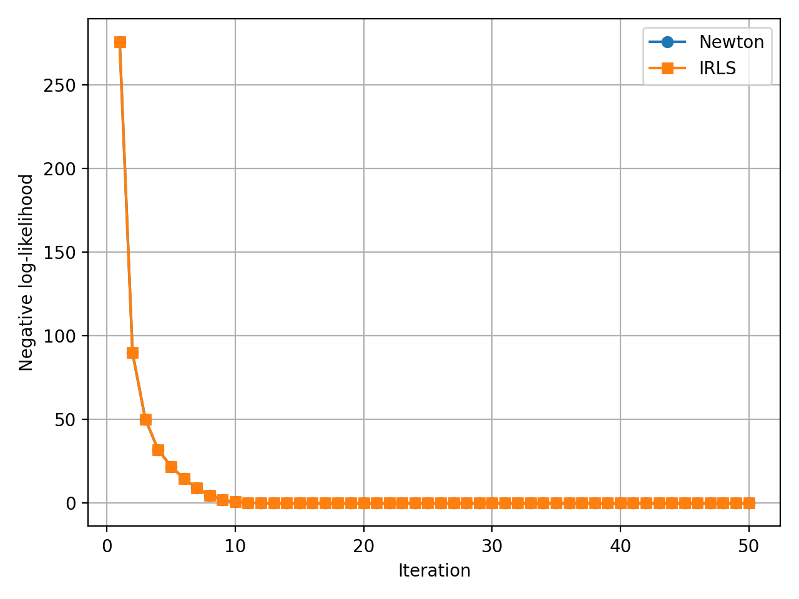
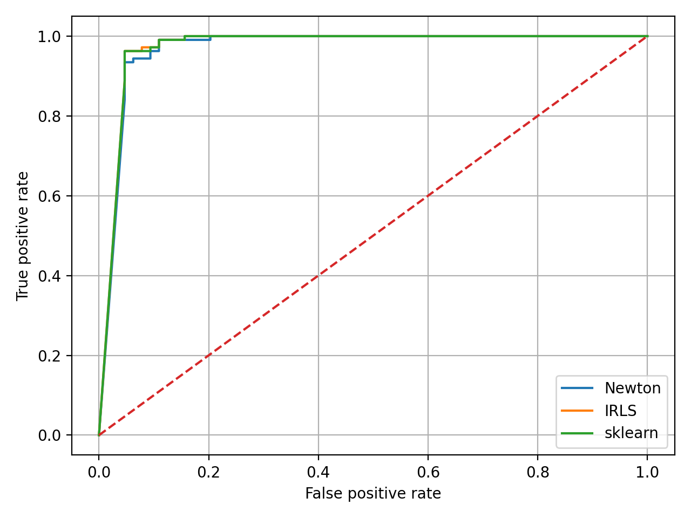

# Лабораторная работа №4

# Выбор датасета
В качестве датасеты был выбран [Breast Cancer Dataset](https://www.kaggle.com/datasets/yasserh/breast-cancer-dataset).
```python
data = load_breast_cancer()
X_raw = data.data
y = data.target.astype(float)

X_train_raw, X_test_raw, y_train, y_test = train_test_split(
    X_raw, y, test_size=0.3, random_state=seed, stratify=y
)

scaler = StandardScaler()
X_train = scaler.fit_transform(X_train_raw)
X_test = scaler.transform(X_test_raw)
```

# Графики конвергенции для реализованных методов


# ROC-кривая для реализованных и эталонного методов


# Сравнение реализованных методов с эталонным
Схожесть реализованных методов с эталонным можно оценить по графику roc-кривых из предыдущего пункта, а так же по выводу программы, демонстрирующей f1-score между методами:
```
f1 (Newton vs IRLS):  0.9805825242718447
f1 (Newton vs sklearn):  0.9805825242718447
f1 (IRLS vs sklearn):  1.0
```