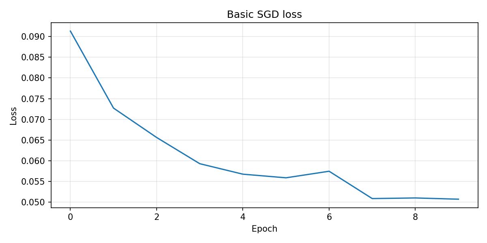
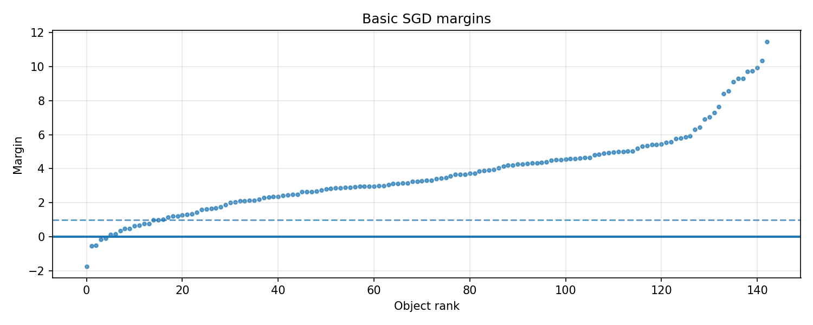
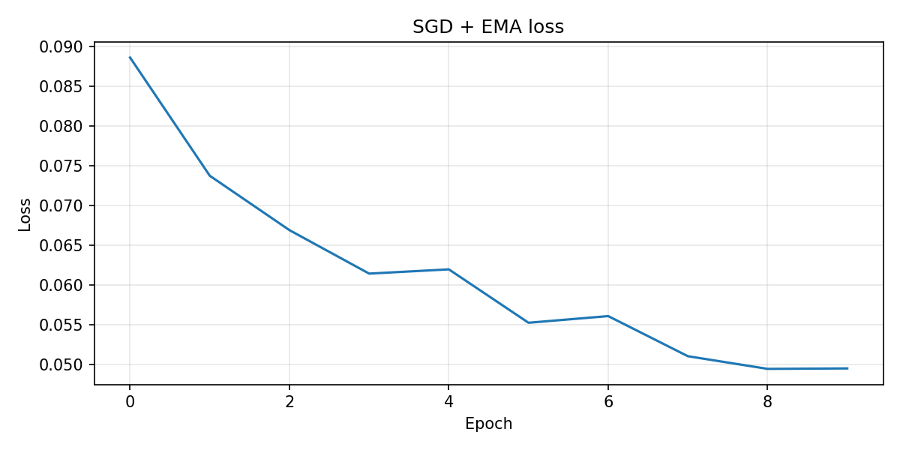
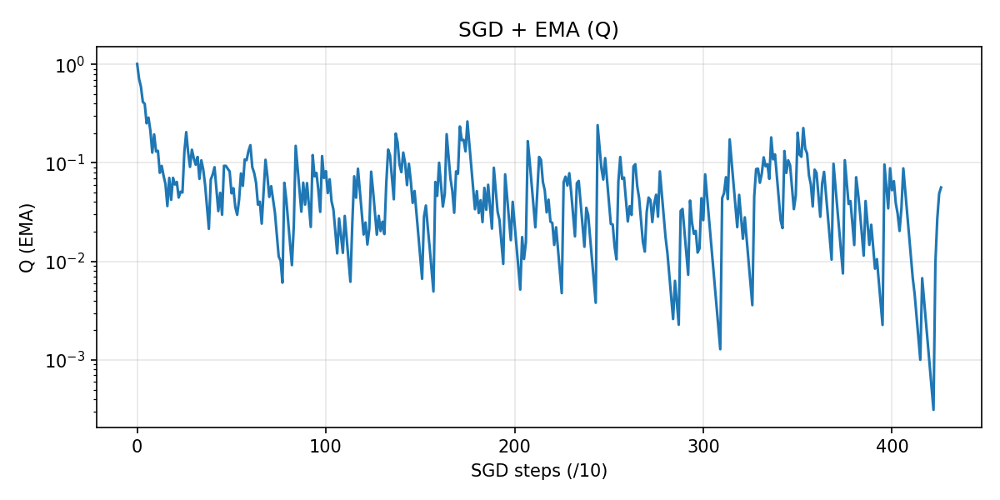
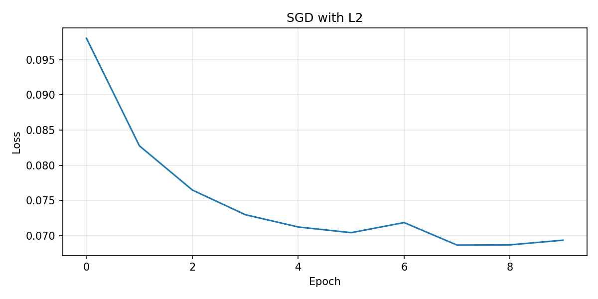
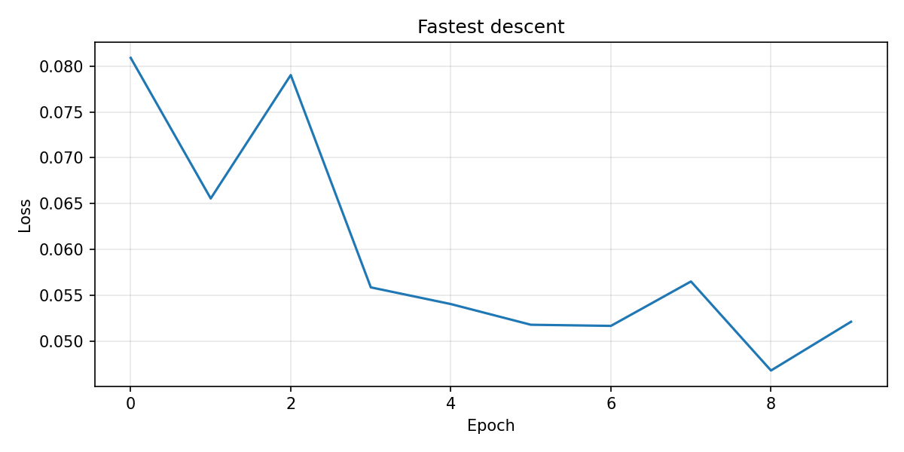
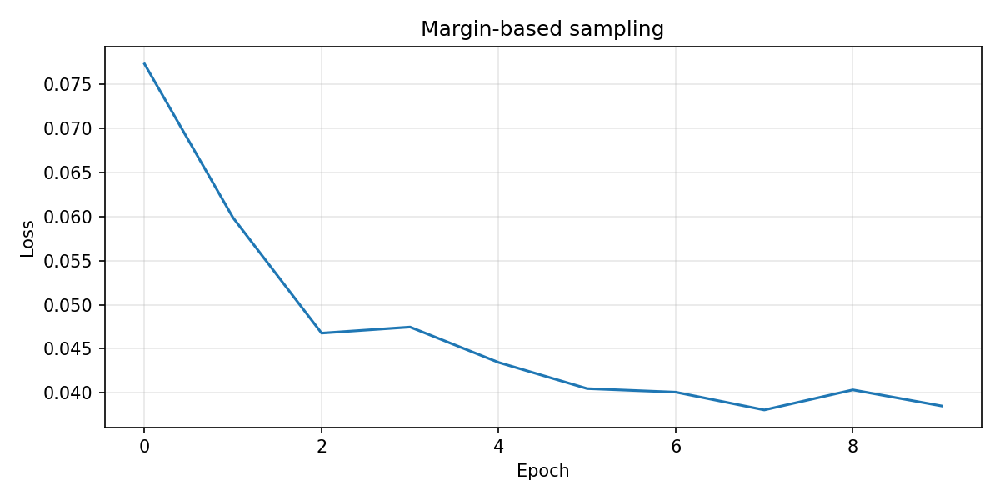
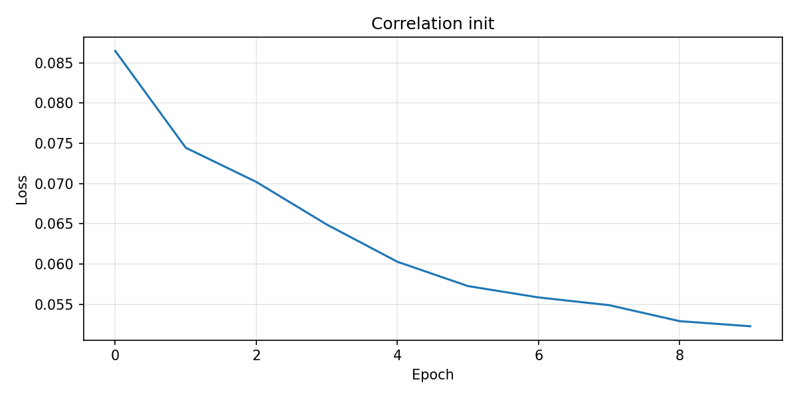

# Отчет по лабораторной работе  
## Линейный классификатор и стохастический градиентный спуск

---

## 1. Цель работы

Целью лабораторной работы является реализация линейного классификатора и последовательное исследование методов его обучения на основе стохастического градиентного спуска (SGD), а также анализ влияния различных улучшений алгоритма на качество классификации и скорость сходимости.

---

## 2. Данные и предварительная обработка

Для экспериментов использован датасет **Breast Cancer Wisconsin**  
https://www.kaggle.com/datasets/uciml/breast-cancer-wisconsin-data

Датасет содержит бинарную классификацию опухолей:
- `M` — злокачественная  
- `B` — доброкачественная  

В ходе подготовки данных:
- целевая переменная приведена к значениям `{-1, +1}`;
- выполнена Z-нормализация признаков;
- добавлен bias-признак;
- данные разделены на обучающую и тестовую выборки.

---

## 3. Теория и реализация (по порядку заданий)

### 3.1. Отступ объекта (Margin)

Отступ показывает, насколько уверенно классификатор относит объект к своему классу.

Формула отступа:
  
\( M_i = y_i \langle w, x_i \rangle \)

Интерпретация:
- \( M_i > 0 \) — объект классифицирован верно;
- \( M_i < 0 \) — объект классифицирован неверно;
- \( |M_i| \) — мера уверенности классификатора.

Отступ используется для:
- построения функций потерь;
- анализа качества классификации;
- выбора объектов при обучении.

---

### 3.2. Функция потерь (Hinge loss)

Для обучения используется hinge-функция потерь:

\( L(M_i) = \max(0, 1 - M_i) \)

Смысл:
- если объект классифицирован правильно и с запасом (\( M_i \ge 1 \)) — ошибка равна 0;
- если объект близок к границе или ошибочен — модель штрафуется.

Данная функция стимулирует не только правильную классификацию, но и наличие «запаса прочности».

---

### 3.3. Градиент функции потерь

Градиент вычисляется по одному объекту (стохастический режим):

- если \( M_i < 1 \), градиент равен \( -y_i x_i \);
- если \( M_i \ge 1 \), градиент равен 0.

Это приводит к тому, что обновления выполняются только по «сложным» объектам.

---

### 3.4. Базовый стохастический градиентный спуск (SGD)

Базовый алгоритм обучения:

1. случайно выбирается объект;
2. вычисляется градиент функции потерь;
3. веса обновляются по правилу:
   
\( w := w - \eta \nabla L \)

На этом этапе:
- нет инерции;
- нет регуляризации;
- используется обычный loss по эпохам.

---

### 3.5. Рекуррентная оценка функционала качества (EMA)

Полный пересчет ошибки на всей выборке при SGD дорог.  
Используется экспоненциальное сглаживание:

\( Q_t = \lambda \cdot \ell_t + (1 - \lambda) \cdot Q_{t-1} \)

Где:
- \( \ell_t \) — loss на текущем объекте;
- \( Q_t \) — сглаженная оценка качества.

EMA позволяет отслеживать динамику обучения без полного пересчета ошибки.

---

### 3.6. Стохастический градиентный спуск с инерцией (Momentum)

Инерция ускоряет обучение и уменьшает осцилляции.

Формулы обновления:

\( v_t = \gamma v_{t-1} + (1 - \gamma) \nabla L \)  
\( w_t = w_{t-1} - \eta v_t \)

Momentum накапливает направление движения и помогает быстрее проходить «овраги» функции потерь.

---

### 3.7. L2-регуляризация

Для борьбы с переобучением в функцию потерь добавляется штраф:

\( \frac{\lambda}{2} \|w\|^2 \)

Градиент при этом дополняется слагаемым \( \lambda w \).

Регуляризация:
- ограничивает рост весов;
- повышает устойчивость модели.

---

### 3.8. Скорейший градиентный спуск

Для квадратичных функций оптимальный шаг может быть вычислен аналитически:

\( \eta^* = \frac{1}{\|x_i\|^2} \)

Это позволяет автоматически подбирать шаг обучения для каждого объекта.

---

### 3.9. Предъявление объектов по модулю отступа

Вместо случайного выбора объектов используется эвристика:

\( P(x_i) \propto \frac{1}{|M_i| + \varepsilon} \)

Модель чаще обучается на объектах, находящихся близко к границе классов, что ускоряет улучшение качества.

---

### 3.10. Инициализация весов через корреляцию

Начальные веса вычисляются по формуле:

\( w_j = \frac{\langle y, f_j \rangle}{\langle f_j, f_j \rangle} \)

Такая инициализация позволяет стартовать ближе к разумному решению.

---

### 3.11. Мультистарт

Алгоритм запускается несколько раз с разными случайными начальными весами.  
Выбирается модель с наименьшим значением функции потерь.

Метод снижает риск попадания в неудачный локальный минимум.

---

## 4. Результаты экспериментов

Базовый стохастический градиентный спуск:

Рекуррентная оценка функционала качества (EMA):

Стохастический градиентный спуск с инерцией:

SGD с L2-регуляризацией:

Скорейший градиентный спуск:

Предъявление объектов по модулю отступа:

Инициализация весов через корреляцию:

Случайная инициализация + мультистарт:

---
Проведено сравнение с `SGDClassifier(loss='hinge')` из библиотеки scikit-learn.

---

## 5. Сравнение метрик качества классификации

Для оценки качества моделей использовались стандартные метрики бинарной классификации:
- **Accuracy** — доля правильно классифицированных объектов;
- **Precision** — точность определения положительного класса;
- **Recall** — полнота определения положительного класса;
- **F1-score** — гармоническое среднее Precision и Recall.

Ниже приведено сравнение метрик для всех этапов обучения, выполненных в рамках лабораторной работы.

| Модель | Accuracy | Precision | Recall | F1-score |
|------|----------|-----------|--------|----------|
| **STEP1: Basic SGD** | 0.965 | 0.980 | 0.925 | 0.951 |
| **STEP2: SGD + EMA** | 0.972 | 1.000 | 0.925 | 0.961 |
| **STEP3: SGD + Momentum** | 0.972 | 1.000 | 0.925 | 0.961 |
| **STEP4: SGD + L2** | **0.979** | **1.000** | **0.943** | **0.971** |
| **STEP5: Fastest Descent** | 0.965 | 0.980 | 0.925 | 0.951 |
| **STEP6: Margin-abs sampling** | 0.972 | 1.000 | 0.925 | 0.961 |
| **STEP7: Corr init + SGD** | **0.979** | 0.981 | **0.962** | **0.971** |
| **STEP8: Multistart (best)** | **0.979** | **1.000** | **0.943** | **0.971** |
| **Sklearn SGDClassifier** | 0.965 | 0.980 | 0.925 | 0.951 |

---

### Анализ результатов

- Базовый SGD уже демонстрирует высокое качество классификации.
- Добавление **EMA**, **Momentum** и **предъявления по модулю отступа** улучшает стабильность обучения, но даёт умеренный прирост метрик.
- **L2-регуляризация** и **инициализация через корреляцию** обеспечивают наилучший баланс между Precision и Recall.
- **Мультистарт** позволяет достичь оптимального решения, сопоставимого с лучшими конфигурациями.
- Собственная реализация не уступает эталонной реализации `SGDClassifier` из scikit-learn и в ряде конфигураций превосходит её по итоговым метрикам.

## 6. Выводы

В ходе работы:

1. Реализован линейный классификатор и базовый SGD.
2. Показано, что **Momentum** существенно ускоряет сходимость.
3. **L2-регуляризация** стабилизирует обучение и снижает переобучение.
4. Отбор объектов по **модулю отступа** позволяет фокусироваться на сложных примерах.
5. Инициализация через корреляцию и **мультистарт** повышают устойчивость обучения.

Таким образом, даже простой линейный классификатор при корректной настройке и обучении показывает высокое качество классификации.

