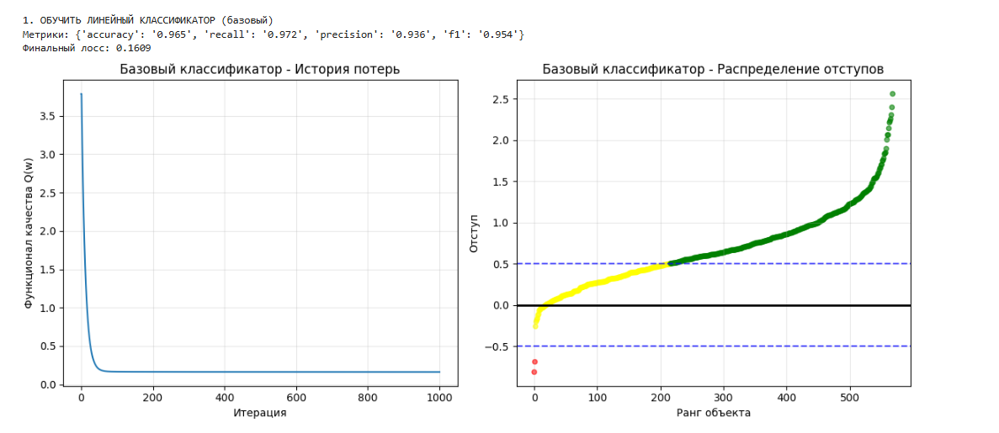
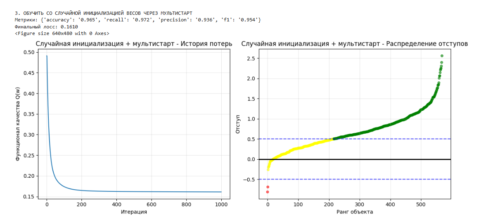
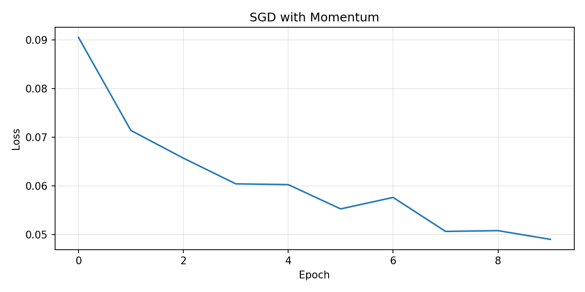

# Отчет по лабораторной работе: Линейный классификатор

## 1. Введение

Целью работы является реализация линейного классификатора с нуля и исследование методов стохастической оптимизации. В качестве основного алгоритма обучения выбран стохастический градиентный спуск (SGD) с инерцией (Momentum), L2-регуляризацией и различными стратегиями инициализации и отбора объектов.

Для выполнения лабораторной работы взят датасет (https://www.kaggle.com/datasets/uciml/breast-cancer-wisconsin-data)
Датасет содержит информацию о том, является ли опухоль доброкачественной или злокачественной. Вот описание признаков со страницы датасета:

~~~
Attribute Information:

1) ID number
2) Diagnosis (M = malignant, B = benign)
3-32)

Ten real-valued features are computed for each cell nucleus:

a) radius (mean of distances from center to points on the perimeter)
b) texture (standard deviation of gray-scale values)
c) perimeter
d) area
e) smoothness (local variation in radius lengths)
f) compactness (perimeter^2 / area - 1.0)
g) concavity (severity of concave portions of the contour)
h) concave points (number of concave portions of the contour)
i) symmetry
j) fractal dimension ("coastline approximation" - 1)

The mean, standard error and "worst" or largest (mean of the three
largest values) of these features were computed for each image,
resulting in 30 features. For instance, field 3 is Mean Radius, field
13 is Radius SE, field 23 is Worst Radius.

All feature values are recoded with four significant digits.

Missing attribute values: none

Class distribution: 357 benign, 212 malignant
~~~

- Таргет приведен к значениям (-1, 1)
- Выполнена Z-нормализация данных
- Взяты значения по худшим замерам (столбцы worst)
## 2. Теоретическая база и реализация

### 2.1. Отступ объекта (Margin)

Отступ показывает, насколько уверенно классификатор относит объект к классу. Для линейной модели $a(x) = sign(\langle w, x \rangle)$ отступ $M_i$ на объекте $(x_i, y_i)$ определяется как:

$$M_i = y_i \langle w, x_i \rangle$$

- $M_i < 0$: Классификатор ошибается.
    
- $M_i > 0$: Классификация верна.
    

**Реализация:**

Python

```
def _margin(self, X: np.ndarray, y: np.ndarray) -> np.ndarray:
    """M_i = y_i * (w·x_i)"""
    return y * (X @ self.w)
```

### 2.2. Функция потерь (Loss Function)

В работе используется квадратичная функция потерь (Quadratic Loss), которая является гладкой аппроксимацией пороговой функции потерь. С добавлением L2-регуляризации для предотвращения переобучения, функционал качества $Q(w)$ выглядит так:

$$Q(w) = \frac{1}{l} \sum_{i=1}^{l} (1 - M_i)^2 + \frac{\lambda}{2} \|w\|^2$$

Градиент функции потерь по весам $\nabla Q(w)$:

$$\nabla Q(w) = -\frac{2}{l} \sum_{i=1}^{l} (1 - M_i) \cdot y_i \cdot x_i + \lambda w$$

**Реализация:**

Python

```
def _loss_gradient(self, X: np.ndarray, y: np.ndarray, margin: np.ndarray) -> np.ndarray:
    # ∇Q(w) = -X^T @ ((1 - margin) * y) / n + λw
    grad = -X.T @ ((1 - margin) * y) / len(y)
    
    if self.config.use_regularization:
        grad += self.config.reg_coefficient * self.w
    return grad
```

### 2.3. Метод стохастического градиентного спуска с инерцией (SGD with Momentum)

Обычный SGD часто "застревает" в локальных минимумах или слишком сильно осциллирует в оврагах функции потерь. Метод инерции (Momentum) накапливает вектор движения, имитируя физику тяжелого шара, катящегося с горы.

Формула обновления весов:

$$v_t = \gamma v_{t-1} + (1 - \gamma) \nabla Q(w_{t-1})$$

$$w_t = w_{t-1} - \eta v_t$$

где $\gamma$ — коэффициент инерции (обычно 0.9), $\eta$ — темп обучения (learning rate).

**Реализация:**

Python

```
if self.config.use_momentum:
    # Накопление скорости (экспоненциальное сглаживание градиента)
    self.velocity = self.config.momentum * self.velocity + \
                    (1 - self.config.momentum) * grad
    w_new = self.w - self.config.learning_rate * self.velocity
else:
    w_new = self.w - lr * grad
```

### 2.4. Стратегия предъявления объектов (Active Learning)

Вместо случайного выбора объектов (стандартный SGD) реализована стратегия выбора объектов с наименьшим модулем отступа ("неуверенные" объекты, находящиеся близко к разделяющей гиперплоскости).

Вероятность выбора объекта $x_i$ обратно пропорциональна модулю отступа:

$$P(x_i) \propto \frac{1}{|M_i| + \varepsilon}$$

**Реализация:**

Python

```
def _sample_by_margin(self, X: np.ndarray, y: np.ndarray, margins: np.ndarray) -> tuple:
    weights = 1.0 / (np.abs(margins) + 1e-8)  # Обратно пропорционально отступу
    weights /= weights.sum()                  # Нормализация в вероятности
    indices = np.random.choice(len(X), size=self.config.batch_size, p=weights)
    return X[indices], y[indices]
```

### 2.5. Рекуррентная оценка функционала качества

В стохастическом режиме вычислять полный функционал качества на всей выборке дорого. Используется формула экспоненциального сглаживания (EMA) для оценки текущего уровня ошибки:

$$Q_t = \lambda \mathcal{L}(w_t) + (1 - \lambda) Q_{t-1}$$

где $\lambda$ — коэффициент забывания (lambda_forget).

## 3. Результаты экспериментов

Для анализа алгоритмов использовались метрики Accuracy, Precision, Recall и F1-score. Были проведены следующие эксперименты:

Базовый классификатор:


Инициализация весов через корреляцию:


Случайная инициализация весов + мультистарт:


Случайное предъявление объектов:


Предъявление по модулю отступа:


Стохастический градиентный спуск с инерцией:


Предъявление по модулю отступа без стохастичности


---

## 4. Сравнение с эталонной реализацией (Sklearn)

Было проведено сравнение с классом `SGDClassifier(loss='squared_hinge')` из библиотеки scikit-learn.


Собственная реализация показала сопоставимое качество классификации. Визуализация распределения отступов подтверждает, что обе модели строят похожую разделяющую гиперплоскость (большинство объектов имеют положительный отступ).

## 5. Выводы

В ходе работы был реализован и исследован линейный классификатор.

1. Применение **инерции** (Momentum) критически важно для ускорения сходимости SGD.
    
2. **L2-регуляризация** помогает удерживать веса в разумных пределах (видно по отсутствию резких скачков градиента).
    
3. Стратегия **отбора по отступам** работает как эффективная эвристика, позволяя модели фокусироваться на сложных объектах границы классов.
    

Модульная архитектура реализованного класса `LinearClassifier` позволяет гибко комбинировать эти методы для подбора оптимальной стратегии обучения под конкретный датасет.
