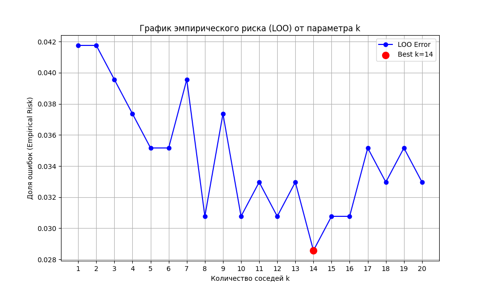
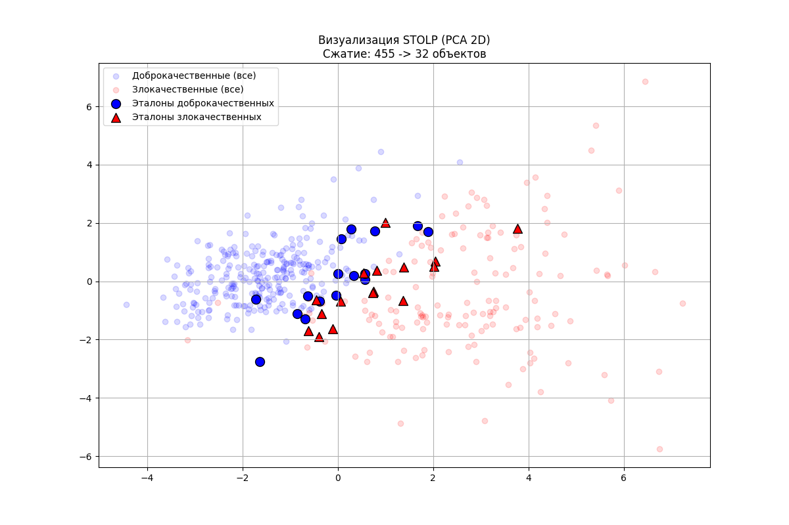

# Лабораторная работа №2  
## Метод *K* ближайших соседей с окном Парзена и отбором эталонов (STOLP)

---

## 1. Введение и предобработка данных

### 1.1. Выбор и подготовка датасета
**Датасет:** Breast Cancer Wisconsin (Diagnostic), задача бинарной классификации (Malignant / Benign).

**Предобработка данных:**
- **Признаки:** выбраны только признаки группы `_worst`, снижая размерность с 30 до 8 (исключены сильно коррелирующие *area* и *perimeter*).  
- **Нормализация:** Z-нормализация (Standard Scaling).  
- **Целевая переменная:** классы приведены к формату `{−1, +1}` для корректного расчёта отступов (margin).

---

## 2. Реализация алгоритма *K*NN с окном Парзена

### 2.1. Алгоритм и ядро Парзена
Реализован KNN с взвешиванием голосов соседей через Parzen Window.

**Используемое ядро:** *Гауссово ядро*  
\[
K(r, h) = \exp\left( -\left( \frac{r}{h} \right)^2 \right)
\]

**Адаптивная ширина окна:**  
\[
h = r_{(K+1)}
\]  
(расстояние до \((K+1)\)-го соседа)

Это позволяет автоматически подстраиваться под плотность данных:
- плотные области → маленькое h  
- разреженные области → большое h

**Формула классификации:**  
\[
a(x) = \text{sign}\left(\sum_{i=1}^K K(r_i, h)\, y_i\right)
\]

---

## 3. Подбор параметра *K* и сравнение

### 3.1. Метод Leave-One-Out (LOO)
Проведён LOO-скользящий контроль для поиска оптимального K.

**Результат:**
- Оптимальное значение: **K = 14**
- LOO-ошибка: **0.0286**

**Обоснование:**  
Малые K → переобучение.  
Большие K → пересглаживание.  
K=14 — оптимум.

### 3.2. Сравнение с `sklearn`

| Метрика | ParzenKNN (K=14) | Sklearn KNN (K=14) |
|--------|------------------|----------------------|
| Accuracy | **0.9649** | 0.9649 |
| F1 Score | 0.9535 | 0.9535 |
| Recall | 0.9535 | 0.9535 |

**Вывод:** Собственная реализация полностью совпадает по качеству со стандартной реализацией sklearn.

---

## 4. Алгоритм отбора эталонов (STOLP)

### 4.1. Идея метода
Алгоритм STOLP позволяет выделить минимальное подмножество объектов (**эталоны**), определяющих границу разделения.

**Отступ (margin):**
\[
M_i = y_i \cdot \text{Score}(x_i)
\]

**Основные шаги STOLP:**
- удаление шумовых объектов: \(M < 0\)
- формирование множества эталонов Ω
- итеративное добавление объектов, на которых текущий классификатор ошибается
- остановка при достижении идеальной классификации или при ограничении размера Ω

### 4.2. Результаты сжатия выборки

- **Изначально:** 455 объектов  
- **Удалено шума:** 13 объектов  
- **Итоговое число эталонов:** **32 объекта**

*(Визуализация: эталоны лежат у границы разделения; шум и лишние объектов удалены.)*

### 4.3. Качество после сжатия

| Выборка | Размер | Accuracy | Сжатие |
|--------|--------|----------|--------|
| Полная | 455 | **0.9649** | ×1 |
| Эталоны (STOLP) | 32 | **0.9649** | ×14.2 |

**Вывод:**  
STOLP уменьшает обучающую выборку **в 14.2 раза** без потери качества классификации.

---

## Заключение
В работе реализованы:
- KNN с адаптивным окном Парзена  
- подбор гиперпараметра K методом LOO  
- алгоритм STOLP для отбора эталонов

Эксперименты показали:
- корректность реализации (полное совпадение со sklearn)  
- устойчивость ParzenKNN  
- **значительное сжатие данных (−93%) без потери точности**

Метод STOLP эффективно уменьшает вычислительную нагрузку классификатора, сохраняя качество.
