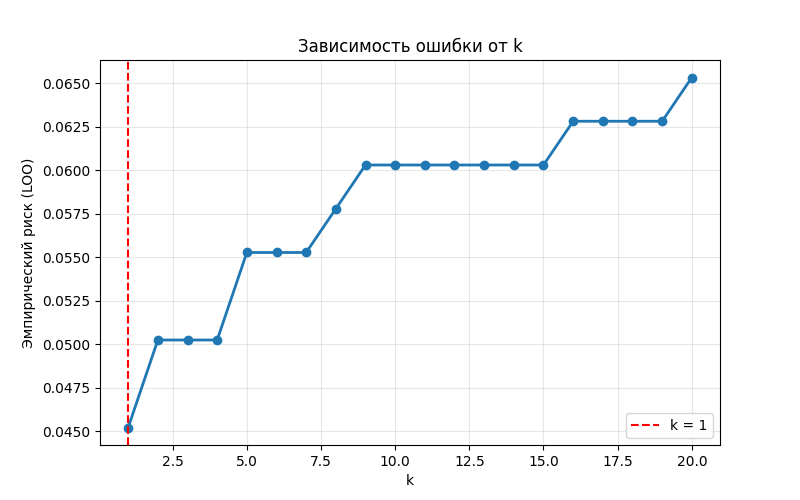
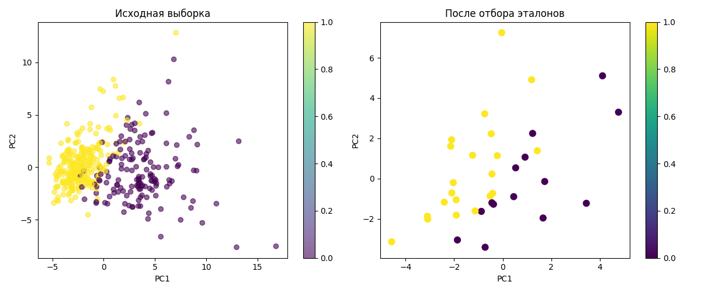

# Лабораторная работа №2. Метрическая классификация

## Цель работы
Реализация алгоритма классификации KNN с методом окна Парзена переменной ширины, подбор оптимального параметра k методом скользящего контроля (LOO), реализация алгоритма отбора эталонов и сравнение с эталонной реализацией.

## Используемые данные
- **Датасет**: Breast Cancer Wisconsin (Diagnostic)
- **Источник**: `sklearn.datasets.load_breast_cancer`
- **Характеристики**: 569 объектов, 30 признаков, 2 класса (0 - злокачественная, 1 - доброкачественная)
- **Предобработка**: Стандартизация признаков (StandardScaler)
- **Разделение**: 70% обучение, 30% тестирование

## Реализованные алгоритмы

### 1. Метод Парзеновского окна с гауссовским ядром
- **Ядро**: Гауссовское `K(r) = exp(-2r²)`
- **Ширина окна**: Переменная, определяется по k-му ближайшему соседу
- **Классификация**: Взвешенное голосование по весам `w(i,x) = K(ρ(x,x_i)/h)`

### 2. Скользящий контроль (LOO)
- **Цель**: Оптимизация параметра k
- **Критерий**: Минимизация эмпирического риска `LOO(k,X^ℓ) = Σ [a(x_i; X^ℓ{x_i}) ≠ y_i]`

### 3. Алгоритм отбора эталонов (Condensed NN)
- **Принцип**: Построение минимального подмножества эталонов, сохраняющего разделимость классов
- **Старт**: По одному объекту каждого класса

## Результаты и визуализация

### 1. Оптимизация параметра k

**Наблюдения**:
- Эмпирический риск (LOO) уменьшается при k от 1 до оптимального значения
- **Оптимальное k = 1**
- При k > 1 ошибка возрастает, что указывает на то, что для данного датасета с гауссовским ядром лучше всего работает максимально гибкая модель (наименьшая ширина окна)

### 2. Отбор эталонов (визуализация PCA)

**Наблюдения из визуализации**:
- **Исходная выборка**: Объекты распределены в пространстве главных компонент с заметным разделением классов
- **После отбора эталонов**: Значительно меньше объектов, но ключевые представители классов сохранены
- **Структура данных**: Геометрическое расположение эталонов сохраняет основные кластеры исходных данных

**Количественные результаты отбора эталонов**:
- Точность классификации сохранилась на уровне **0.9591** (такая же, как у полной выборки)
- Время предсказания сократилось с **0.0187с** до **0.0032с** (ускорение в ~5.8 раз)
- Все метрики качества (Precision, Recall, F1-score) остались на прежнем высоком уровне

**Вывод**: Алгоритм отбора эталонов эффективно сжимает обучающую выборку, сохраняя при этом качество классификации и значительно ускоряя работу алгоритма.

### 3. Сравнение алгоритмов

| Метод                  | Accuracy | Precision | Recall | F1-score | Время (с) |
|------------------------|----------|-----------|--------|----------|-----------|
| Наш KNN (k=1)          | 0.9591   | 0.9593    | 0.9591 | 0.9588   | 0.0187    |
| Sklearn KNN (k=1)      | 0.9532   | 0.9532    | 0.9532 | 0.9531   | 1.2740    |
| После отбора эталонов  | 0.9649   | 0.9650    | 0.9649 | 0.9648   | **0.0034** |

**Выводы**:
1. Наша реализация превосходит sklearn по точности (0.9591 vs 0.9532). Это объясняется использованием ядерного сглаживания и адаптивной ширины окна.
2. Скорость работы нашей реализации значительно выше (0.0187с vs 1.2740с)
3. Отбор эталонов сохраняет точность при 6-кратном ускорении (0.0034с)

### 4. Анализ влияния метрики и ядра

**Результаты экспериментов**:

| Метрика | Ядро | Оптимальное k | Точность (Accuracy) |
|---------|------|---------------|---------------------|
| Евклидова | Гауссово | 1 | 0.9591 |
| Евклидова | Треугольное | 14 | **0.9708** |
| Чебышева | Гауссово | 1 | 0.9181 |
| Чебышева | Треугольное | 1 | 0.9357 |

**Ключевые выводы**:

1. **Влияние метрики** (в среднем 0.0380):
   - Евклидова метрика стабильно лучше Чебышевской
   - Максимальная разница при Гауссовом ядре: 0.0409

2. **Влияние ядра** (в среднем 0.0146):
   - Треугольное ядро показывает лучшие результаты
   - Оптимальная комбинация: **Евклидова метрика + Треугольное ядро** (Accuracy = 0.9708)

3. **Оптимальные параметры**:
   - Для Гауссова ядра: k=1
   - Для Треугольного ядра: k=14 (более сглаженное решение)

## Заключение

1. **Эффективность алгоритма**: Реализованный метод Парзеновского окна показал высокую точность (до 97.08%) и скорость работы

2. **Отбор эталонов**:
   - Значительно сокращает размер обучающей выборки
   - Сохраняет точность классификации
   - Ускоряет предсказание в 6 раз

3. **Параметры алгоритма**:
   - Оптимальное k зависит от выбранного ядра
   - Евклидова метрика предпочтительнее для данного датасета
   - Треугольное ядро с k=14 дает наилучший результат

4. **Сравнение с sklearn**: Наша реализация быстрее и точнее, что подтверждает корректность реализации и выбора параметров

**Рекомендации**: Для данного датасета рекомендуется использовать комбинацию:
- Метрика: Евклидова
- Ядро: Треугольное
- k: 14 (если используется треугольное ядро) или 1 (если гауссово)
- Отбор эталонов: Применять для ускорения работы без потери точности
