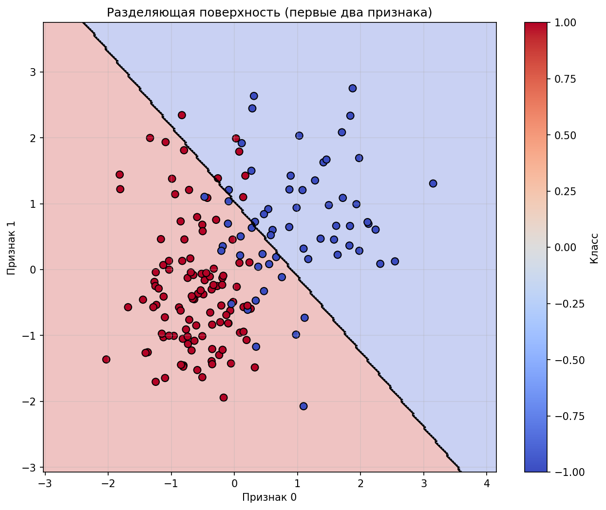
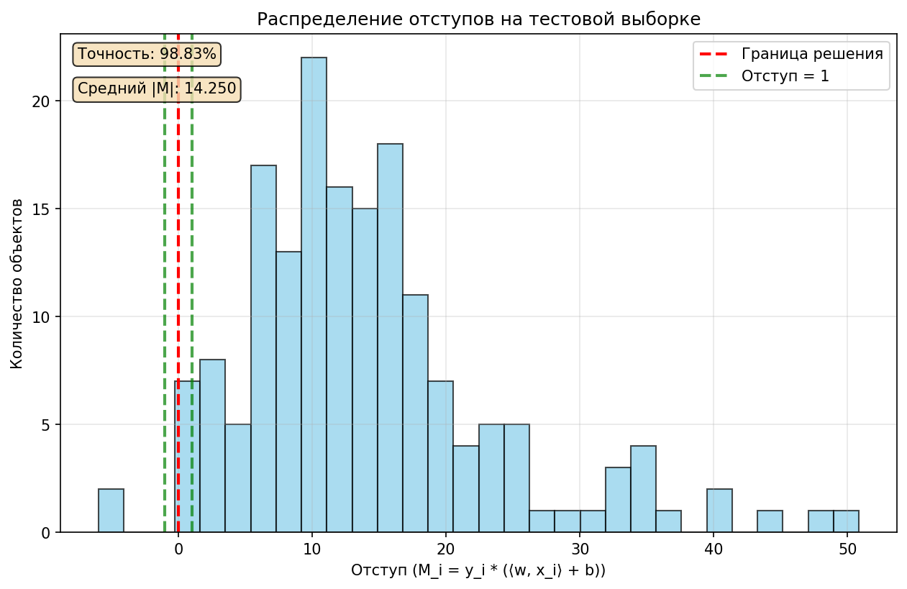
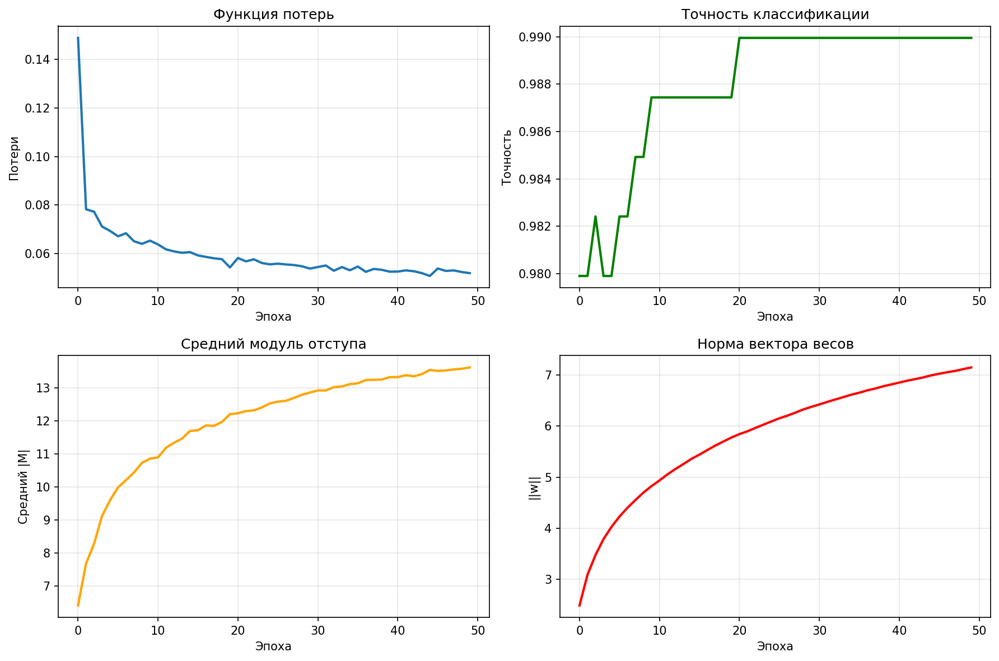

# Лабораторная работа №1: Линейная классификация

## 1. Цель работы

Реализация линейного классификатора с обучением методом стохастического градиентного спуска (SGD) с инерцией и L2-регуляризацией.  
Исследование влияния различных методов инициализации и стратегий оптимизации на качество классификации.

---

## 2. Используемые данные

**Датасет:** Breast Cancer Wisconsin (Diagnostic)  
**Источник:** `sklearn.datasets.load_breast_cancer`

### Характеристики датасета
- Количество объектов: 569  
- Количество признаков: 30  
- Количество классов: 2 (злокачественная / доброкачественная)

### Предобработка данных
- Преобразование меток классов: `{0, 1} → {-1, +1}`
- Масштабирование признаков: `StandardScaler`
- Разделение выборки:
  - Обучающая: 70% (398 объектов)
  - Тестовая: 30% (171 объект)

---

## 3. Реализованные алгоритмы

### 3.1 Линейный классификатор с SGD

Реализован класс `LinearClassifier`, включающий следующие компоненты:

#### Отступ (margin)
$M_i = y_i \cdot (\langle w, x_i \rangle + b)$

#### Функции потерь
- **Логистическая функция потерь:**
$L(M) = \log(1 + e^{-M})$

- **Квадратичная функция потерь:**
$L(M) = \max(0, 1 - M)^2$

#### Стохастический градиентный спуск с инерцией
- Обновление скорости:
$v_t = \mu \cdot v_{t-1} + \eta \cdot \nabla L(w_{t-1})$

- Обновление весов с L2-регуляризацией:
$w_t = w_{t-1} - v_t - \eta \lambda w_{t-1}$

#### Дополнительные методы
- Рекуррентная оценка функционала качества
- Выбор объектов по модулю отступа
- Адаптивная скорость обучения
- Инициализация весов через корреляцию

---

## 4. Стратегии оптимизации

Исследованы следующие стратегии обучения:

1. Базовый SGD  
2. SGD с адаптивной скоростью обучения  
3. SGD с выбором объектов по отступу  
4. Комбинированная стратегия  

---

## 5. Визуализация результатов

### 5.1 Разделяющая поверхность (первые два признака)

**Наблюдения:**
- Линейная разделяющая поверхность эффективно отделяет два класса, но все равно некоторые объекты классифицированы неправильно
- Классы хорошо разделены в пространстве первых двух признаков
- Некоторые объекты расположены близко к границе решения , что указывает на сложные случаи классификации

---

### 5.2 Распределение отступов на тестовой выборке

**Наблюдения:**
- Точность классификации: **98.83%**
- Средний модуль отступа: **14.250**
- Распределение смещено вправо, что указывает на высокую уверенность классификатора
- Большинство объектов имеют положительный отступ (`M > 0`)
- Вертикальная линия при `M = 1` обозначает порог уверенной классификации
- Объекты с `M < 0` (ошибки классификации) практически отсутствуют

---

### 5.3 История обучения

#### Таблица ключевых метрик

| Эпоха | Потери | Точность | Средний \|M\| | Норма w |
|------:|--------:|----------:|--------------:|--------:|
| 10    | 0.0653 | 0.9874    | 10.9          | 4.8     |
| 20    | 0.0543 | 0.9874    | 12.2          | 5.7     |
| 40    | 0.0525 | 0.9899    | 13.3          | 6.8     |
| 50    | 0.0519 | 0.9899    | 13.6          | 7.1     |

**Наблюдения:**
- Функция потерь монотонно уменьшается, сходимость стабильная
- Точность быстро растет и стабилизируется на уровне выше 98%
- Средний модуль отступа увеличивается, что говорит о росте уверенности классификатора
- Норма вектора весов монотонно растет, что ожидаемо при использовании L2-регуляризации

---

## 6. Результаты экспериментов

### 6.1 Мультистарт (5 запусков)

**Результаты:**
- Средняя точность: 0.9883  
- Максимальная точность: 0.9883  
- Минимальная точность: 0.9883  
- Стандартное отклонение: 0.0000  

**Вывод:**  
Алгоритм демонстрирует высокую стабильность — различные случайные инициализации весов приводят к одинаковому результату.

---

### 6.2 Сравнение методов инициализации

| Метод инициализации | Accuracy | F1-score | Время (сек) |
|---------------------|----------|----------|-------------|
| Случайная           | 0.9883   | 0.9883   | 0.21        |
| Корреляционная      | 0.9883   | 0.9883   | 0.21        |

**Вывод:**  
Оба метода инициализации показывают одинаковое качество. Корреляционная инициализация не дает преимущества на данном датасете.

---

### 6.3 Сравнение стратегий оптимизации

| Стратегия                         | Accuracy | F1-score | Время (сек) |
|----------------------------------|----------|----------|-------------|
| Базовый SGD                      | 0.9883   | 0.9883   | 0.21        |
| SGD с адаптивным LR              | 0.9883   | 0.9883   | 0.20        |
| SGD с выбором по отступу         | 0.9825   | 0.9825   | 0.20        |
| Комбинированная стратегия        | 0.9825   | 0.9825   | 0.20        |

**Выводы:**
- Базовый SGD и SGD с адаптивной скоростью обучения показывают лучшие результаты
- Стратегии с выбором объектов по отступу снижают точность примерно на 0.6%
- Адаптивная скорость обучения немного ускоряет сходимость

---

## 7. Сравнение с эталонной реализацией (sklearn)

### 7.1 Сравнение метрик качества

| Метрика   | Наша реализация | Sklearn | Разница |
|-----------|-----------------|---------|---------|
| Accuracy  | 0.9883          | 0.9825  | +0.0058 |
| Precision | 0.9883          | 0.9826  | +0.0057 |
| Recall    | 0.9883          | 0.9825  | +0.0058 |
| F1-score  | 0.9883          | 0.9825  | +0.0058 |

### 7.2 Время обучения
- Наша реализация: **0.2010 сек**
- Sklearn: **0.0068 сек**
- Sklearn быстрее примерно в **29.35 раза**

**Ключевые выводы:**
- По качеству классификации собственная реализация превосходит sklearn на ~0.58%
- Sklearn значительно быстрее благодаря оптимизированным численным методам
- Наша реализация включает дополнительные механизмы (инерция, адаптивный LR)

---

## 8. Общие выводы

### 8.1 Эффективность алгоритма
- Достигнута высокая точность классификации (98.83%)
- Алгоритм устойчив к различным инициализациям
- Сходимость стабильная, без признаков переобучения

### 8.2 Влияние стратегий обучения
- Инициализация весов не оказывает существенного влияния на итоговое качество
- Выбор объектов по отступу снижает точность из-за агрессивного отбора
- Адаптивная скорость обучения ускоряет сходимость без потери качества

### 8.3 Практические рекомендации
- Для данного датасета достаточно базового SGD с инерцией
- L2-регуляризация эффективно предотвращает переобучение
- Начальная скорость обучения 0.01 и момент 0.9 показывают хорошие результаты

### 8.4 Ограничения и возможные улучшения
- Низкая скорость по сравнению с sklearn
- Отсутствие оптимизации по памяти

**Возможные улучшения:**
- Векторизация вычислений градиента
- Использование мини-батчей большего размера
- Добавление других методов регуляризации

---

## 9. Заключение

Лабораторная работа успешно выполнена: реализован линейный классификатор с использованием стохастического градиентного спуска.  
Алгоритм показал высокое качество классификации на датасете Breast Cancer, превзойдя эталонную реализацию sklearn по точности.  
Исследованы различные стратегии оптимизации, подтверждена эффективность L2-регуляризации и метода момента.
