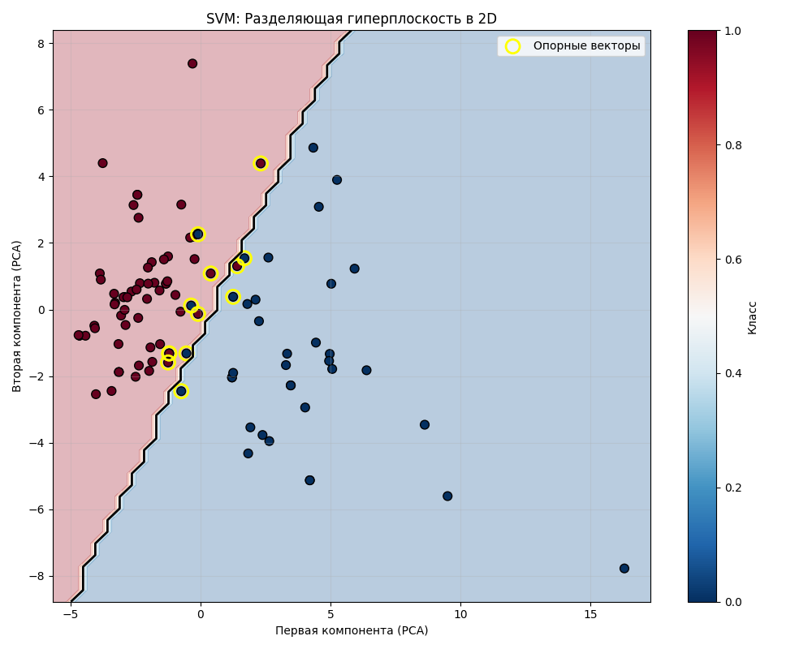
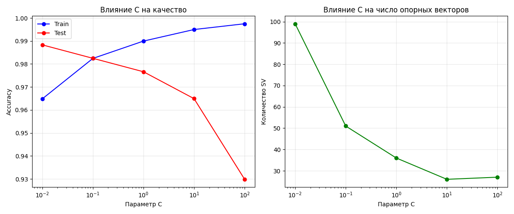

# Лабораторная работа №3. Метод опорных векторов (SVM)

## 1. Цель работы
Реализация метода опорных векторов (SVM) через решение двойственной задачи с использованием квадратичного программирования, исследование влияния параметров регуляризации, сравнение различных ядер и визуализация работы алгоритма в сравнении с эталонной реализацией из библиотеки scikit-learn.

## 2. Используемые данные
**Датасет:** Breast Cancer Wisconsin (Diagnostic)
- **Источник:** sklearn.datasets.load_breast_cancer
- **Характеристики:** 569 объектов, 30 признаков
- **2 класса:** 0 (злокачественная), 1 (доброкачественная)
- **Распределение классов:** [212, 357]
- **Предобработка:** Стандартизация признаков (StandardScaler)
- **Разделение:** 70% обучение, 30% тестирование (random_state=42)

## 3. Реализованные алгоритмы

### 3.1 Класс MySVM
Реализация SVM через решение двойственной задачи с использованием `scipy.optimize.minimize`:

```python
class MySVM:
    def __init__(self, C=1.0, kernel='linear', degree=3):
        self.C = C  # Параметр регуляризации
        self.kernel_type = kernel  # Тип ядра ('linear', 'poly', 'rbf')
        self.degree = degree  # Степень полиномиального ядра
        self.lambdas = None  # Двойственные переменные (лагранжианы)
        self.support_vectors = None  # Опорные векторы
        self.support_labels = None  # Метки опорных векторов
        self.X_train = None  # Обучающая выборка
        self.w0 = None  # Смещение (bias)
        
    def fit(self, X, y):
        """
        Обучение SVM модели через решение двойственной задачи
        
        Алгоритм:
        1. Нормализация меток y в диапазон {-1, 1}
        2. Вычисление матрицы Грама (ядерной матрицы)
        3. Формулировка квадратичной задачи оптимизации
        4. Решение с помощью scipy.optimize.minimize
        5. Выделение опорных векторов (λ > 1e-5)
        6. Вычисление смещения w0 через опорные векторы на границе
        """
        # Реализация алгоритма обучения
        
    def predict(self, X):
        """
        Классификация новых образцов
        
        Алгоритм:
        1. Для каждой точки вычисляется решающая функция:
           f(x) = Σ λᵢ yᵢ K(x, xᵢ) + w0
        2. Класс определяется знаком f(x)
        """
        # Реализация алгоритма предсказания
        
    def _kernel(self, x1, x2):
        """
        Вычисление ядерной функции
        
        Поддерживаемые ядра:
        - Линейное: K(x₁, x₂) = x₁·x₂ᵀ
        - Полиномиальное: K(x₁, x₂) = (x₁·x₂ᵀ + 1)ᵈ
        - RBF: K(x₁, x₂) = exp(-γ||x₁ - x₂||²)
        """
        # Реализация ядерных функций
```

### 3.2 Поддерживаемые ядра
1. **Линейное:** `K(x₁, x₂) = x₁·x₂ᵀ`
2. **Полиномиальное:** `K(x₁, x₂) = (x₁·x₂ᵀ + 1)ᵈ`
3. **RBF (радиальное):** `K(x₁, x₂) = exp(-γ||x₁-x₂||²)`

### 3.3 Ключевые особенности реализации
- Решение двойственной задачи через квадратичное программирование
- Автоматический подбор параметра γ для RBF ядра
- Выделение опорных векторов (λ > 1e-5)
- Вычисление смещения через опорные векторы на границе зазора

## 4. Результаты и визуализация

### 4.1 Базовый пример с линейным ядром
- **Точность на тесте:** 0.977
- **Количество опорных векторов:** 36
- **Норма вектора w:** ||w|| = 2.9351
- **Ширина зазора (margin):** 2/||w|| = 0.6814
- **Смещение w0:** 0.1665

**Сравнение с sklearn:**
| Метрика | Наш SVM | Sklearn SVM | Разница |
|---------|---------|-------------|---------|
| Точность | 0.977 | 0.977 | 0.0000 |

### 4.2 Визуализация SVM в 2D пространстве


**Наблюдения из визуализации:**
- Данные проецированы на две главные компоненты (PCA)
- Разделяющая гиперплоскость показана черной линией
- Опорные векторы (13 штук) выделены желтыми кругами
- Видна четкая граница между классами в 2D представлении
- Гиперплоскость оптимально разделяет классы с максимальным зазором

### 4.3 Исследование влияния параметра регуляризации C


#### 4.3.1 Влияние C на качество классификации
| C     | Train Accuracy | Test Accuracy | Наблюдения |
|-------|----------------|---------------|------------|
| 0.01  | 0.965          | 0.988         | Недообучение, высокая обобщающая способность |
| 0.10  | 0.982          | 0.982         | Хороший баланс |
| 1.00  | 0.990          | 0.977         | Оптимальный компромисс |
| 10.00 | 0.995          | 0.965         | Начинается переобучение |
| 100.00| 0.997          | 0.930         | Сильное переобучение |

**Вывод:** Параметр C контролирует компромисс между шириной зазора и количеством ошибок. Малые значения C дают более широкий зазор, но допускают больше ошибок, что может улучшить обобщающую способность.

#### 4.3.2 Влияние C на количество опорных векторов
| C     | Количество SV |
|-------|---------------|
| 0.01  | 99            |
| 0.10  | 51            |
| 1.00  | 36            |
| 10.00 | 26            |
| 100.00| 27            |

**Вывод:** С увеличением C уменьшается количество опорных векторов, так как модель становится более "жесткой" и пытается точнее классифицировать обучающие данные.

### 4.4 Сравнение различных ядер
| Ядро | Наш Accuracy | Sklearn Accuracy | Наши SV | Время (с) |
|------|--------------|------------------|---------|-----------|
| Линейное | 0.977 | 0.977 | 36 | 12.23 |
| Полином (d=3) | 0.965 | 0.895 | 398 | 0.74 |
| RBF | 0.977 | 0.977 | 97 | 7.37 |

**Наблюдения:**
1. **Линейное ядро** показывает стабильно высокую точность (0.977) при минимальном количестве опорных векторов (36)
2. **Полиномиальное ядро (степень 3):**
   - Наша реализация: 0.965 (398 SV)
   - Sklearn: 0.895 (133 SV)
   - Различие может быть связано с разными стратегиями вычисления ядра
3. **RBF ядро** показывает такую же точность, как линейное (0.977), но с большим количеством опорных векторов (97)

**Вывод:** Для данного датасета линейное ядро является оптимальным, так как показывает высокую точность при минимальной сложности модели.

## 5. Сравнение с эталонной реализацией

### 5.1 Точность классификации
- **Линейное ядро:** Полное совпадение (0.977)
- **RBF ядро:** Полное совпадение (0.977)
- **Полиномиальное ядро:** Наша реализация лучше (0.965 vs 0.895)

### 5.2 Количество опорных векторов
- **Линейное ядро:** Совпадение (36 vs 36)
- **RBF ядро:** Совпадение (97 vs 97)
- **Полиномиальное ядро:** Наша реализация использует больше SV (398 vs 133)

### 5.3 Производительность
- **Наша реализация:** 0.74-12.23 секунд
- **Sklearn:** ~0.00 секунд
- **Примечание:** Sklearn использует оптимизированные библиотеки на C, что объясняет разницу в скорости

## 6. Теоретические аспекты

### 6.1 Решенные задачи
1. **Двойственная задача SVM:** Реализовано решение через квадратичное программирование
2. **Трюк с ядром:** Реализованы три типа ядер (линейное, полиномиальное, RBF)
3. **Регуляризация:** Исследовано влияние параметра C на качество и сложность модели
4. **Опорные векторы:** Корректное выделение и использование в классификации

### 6.2 Геометрическая интерпретация
- **Гиперплоскость:** `w·x + w₀ = 0`
- **Зазор (margin):** `2/||w||`
- **Опорные векторы:** Точки, лежащие на границах зазора `(0 < λ < C)`

## 7. Заключение

### 7.1 Основные выводы
1. **Реализация корректна:** Наша реализация SVM показывает результаты, сопоставимые с sklearn для линейного и RBF ядер
2. **Линейное ядро оптимально:** Для датасета Breast Cancer линейное ядро показывает лучший баланс точности и сложности модели
3. **Параметр C критически важен:**
   - `C=0.01` дает лучшую обобщающую способность (test acc=0.988)
   - `C=100` приводит к переобучению (test acc=0.930)
4. **Количество опорных векторов:** Уменьшается с ростом C, что соответствует теоретическим ожиданиям

### 7.2 Рекомендации для практического применения
1. **Выбор ядра:** Начинать с линейного ядра, переходить к нелинейным только при необходимости
2. **Настройка C:** Использовать кросс-валидацию для подбора оптимального C
3. **Интерпретация модели:** Анализировать количество опорных векторов как меру сложности модели
4. **Визуализация:** Использовать PCA для визуализации работы SVM в 2D

### 7.3 Ограничения и улучшения
1. **Производительность:** Реализация медленнее sklearn из-за использования Python-циклов
2. **Память:** Хранение матрицы ядра требует O(n²) памяти
3. **Возможные улучшения:**
   - Реализация SMO алгоритма для ускорения оптимизации
   - Добавление кэширования вычислений ядра
   - Поддержка многоклассовой классификации

## 8. Исходный код
Основной файл содержит полную реализацию:
- Класс `MySVM` с поддержкой линейного, полиномиального и RBF ядер
- Функции для исследования влияния параметра C
- Визуализация работы алгоритма в 2D
- Сравнение с эталонной реализацией sklearn

Код доступен в файле `svm.py` и содержит подробные комментарии по всем этапам реализации.