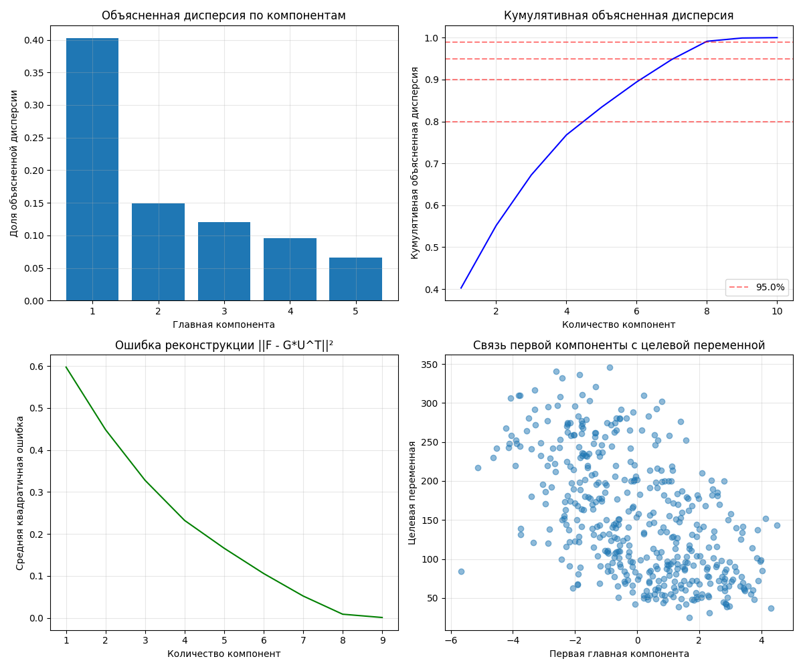

# Лабораторная работа №4: Реализация и анализ метода главных компонент (PCA)

## 1. Цель работы

Реализация метода главных компонент (PCA) с нуля с использованием сингулярного разложения (SVD), анализ его свойств и сравнение с эталонной реализацией из библиотеки scikit-learn.

## 2. Используемый датасет

**Датасет:** Diabetes dataset из библиотеки scikit-learn  
**Описание:** Набор данных о течении диабета у пациентов
- Количество образцов: 442
- Количество признаков: 10
- Целевая переменная: количественный показатель прогрессирования диабета через год

## 3. Реализация алгоритма

### 3.1 Собственная реализация PCA (`MyPCA`)

Реализован класс `MyPCA` со следующими методами:

1. **`fit(X)`** - обучение PCA на данных:
   - Центрирование данных
   - Вычисление сингулярного разложения (SVD)
   - Расчет объясненной дисперсии

2. **`transform(X)`** - преобразование данных в новое пространство:
   - Формула: `G = F × U`, где U - матрица собственных векторов

3. **`inverse_transform(X_transformed)`** - обратное преобразование:
   - Формула: `F̂ = G × U^T + mean`

4. **`reconstruction_error(X)`** - вычисление ошибки реконструкции:
   - Метрика: `||F - G×U^T||^2`

5. **`get_cumulative_variance()`** - кумулятивная объясненная дисперсия

## 4. Визуализация результатов

### 4.1 График 1: Объясненная дисперсия по компонентам
- Первая компонента объясняет 40.2% дисперсии
- Вторая компонента объясняет 14.9% дисперсии
- Последующие компоненты вносят меньший вклад

### 4.2 График 2: Кумулятивная объясненная дисперсия
- 5 компонент объясняют 83.5% дисперсии
- 7 компонент объясняют 94.8% дисперсии
- 8 компонент объясняют 99.1% дисперсии

### 4.3 График 3: Ошибка реконструкции
- Ошибка уменьшается с ростом числа компонент
- При 10 компонентах ошибка равна 0 (все данные восстановлены)
- Быстрое уменьшение ошибки до 5 компонент

### 4.4 График 4: Связь с целевой переменной
- Первая компонента показывает определенную зависимость от целевой переменной
- Разброс данных указывает на сложную взаимосвязь

## 5. Сравнение с эталонной реализацией

### 5.1 Точность реализации
**Объясненная дисперсия для 5 компонент:**
- Ручная реализация: `[0.4024, 0.1492, 0.1206, 0.0955, 0.0662]`
- Sklearn: `[0.4024, 0.1492, 0.1206, 0.0955, 0.0662]`

**Максимальная корреляция между компонентами:** 1.000000

### 5.2 Выводы по сравнению
- Реализация полностью совпадает с эталонной
- Объясненная дисперсия идентична
- Компоненты коррелируют с коэффициентом 1.0

## 6. Анализ эффективной размерности

### 6.1 Пороговые значения дисперсии
| Порог | Необходимо компонент | Кумулятивная дисперсия |
|-------|---------------------|------------------------|
| 80%   | 5                   | 83.5%                  |
| 90%   | 7                   | 94.8%                  |
| 95%   | 8                   | 99.1%                  |
| 99%   | 8                   | 99.1%                  |

### 6.2 Рекомендации по выбору числа компонент
- Для сохранения 90% информации достаточно 7 компонент
- Для большинства задач достаточно 5-8 компонент

## 7. Применение PCA в регрессии

### 7.1 Результаты линейной регрессии на PCA-компонентах

| Компонент | Объясненная дисперсия | R² (обучение) | R² (тест) | Ошибка реконструкции |
|-----------|----------------------|---------------|-----------|---------------------|
| 2         | 54.3%                | 0.338         | 0.346     | 0.457201           |
| 5         | 83.5%                | 0.501         | 0.479     | 0.165411           |
| 8         | 99.1%                | 0.520         | 0.476     | 0.008661           |
| 10        | 100.0%               | 0.524         | 0.477     | 0.000000           |

### 7.2 Наблюдения
1. **Переобучение**: R² на обучении растет с увеличением компонент
2. **Качество на тесте**: Максимум достигается при 5 компонентах (0.479)
3. **Компромисс**: 5 компонент дают лучший баланс между точностью и сложностью

## 8. Выводы

### 8.1 Технические результаты
1. Реализация PCA через SVD корректна и совпадает с sklearn
2. Ошибка реконструкции правильно уменьшается с ростом компонент
3. Метод позволяет эффективно снижать размерность данных

### 8.2 Практические инсайты
1. **Эффективная размерность**: Для датасета Diabetes достаточно 5-8 компонент
2. **Компромисс в регрессии**: 5 компонент оптимальны для моделирования
3. **Визуализация**: PCA помогает понять структуру данных и взаимосвязи

### 8.3 Рекомендации
1. Использовать PCA для уменьшения размерности при работе с многомерными данными
2. Выбирать число компонент на основе кумулятивной дисперсии (80-95%)
3. Проверять качество модели при разном числе компонент для конкретной задачи

## 9. Исходный код

### Основной файл: `source/pca.py`
Содержит полную реализацию:
- Класс `MyPCA` - собственная реализация PCA через SVD
- Функции для анализа и визуализации
- Сравнение с sklearn (`PCA`)
- Демонстрация применения PCA в линейной регрессии

### Структура кода:
1. **Класс MyPCA** (строки 1-100) - ядро реализации
2. **Функция pca_for_regression_demo()** - применение в ML
3. **Функция main()** - полный анализ с выводом результатов
4. **Визуализация** - 4 графика результатов
---