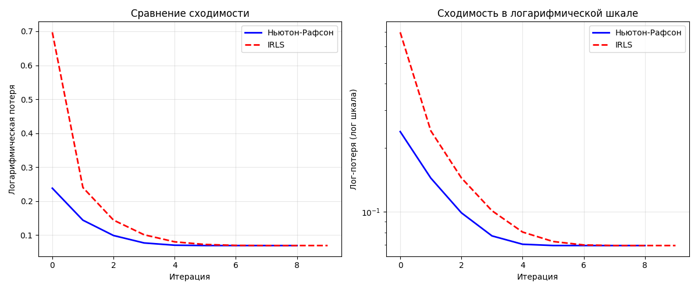
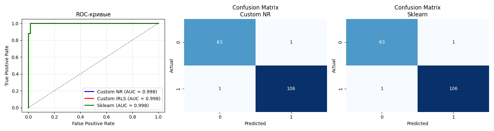
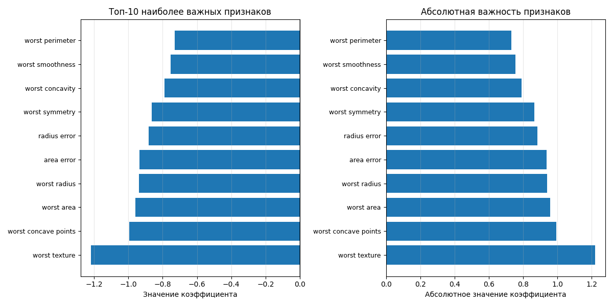

# Лабораторная работа №5: Реализация и анализ логистической регрессии

## 1. Цель работы

Реализация логистической регрессии с двумя методами оптимизации (Ньютона-Рафсона и IRLS), сравнение их сходимости и производительности, а также проверка эквивалентности с эталонной реализацией из библиотеки scikit-learn.

## 2. Используемый датасет

**Датасет:** Breast Cancer Wisconsin (Diagnostic)  
**Источник:** `sklearn.datasets.load_breast_cancer`  
**Описание:** Набор данных для бинарной классификации опухолей молочной железы на злокачественные (0) и доброкачественные (1).

- **Количество объектов:** 569
- **Количество признаков:** 30 (радиус, текстура, периметр, площадь, гладкость и др.)
- **Целевая переменная:** 0 (malignant) или 1 (benign)
- **Баланс классов:** 212 злокачественных, 357 доброкачественных

**Предобработка:**
- Разделение на обучение (70%) и тест (30%)
- Стандартизация признаков (StandardScaler)

## 3. Теоретическая часть

Логистическая регрессия — это метод классификации, основанный на сигмоидной функции:

$P(y=1|x) = \sigma(w^T x) = \frac{1}{1 + e^{-w^T x}}$

Для обучения модели минимизируется логарифмическая функция потерь (log-loss):

$\mathcal{L}(w) = -\frac{1}{N} \sum_{i=1}^N \left[ y_i \log(p_i) + (1 - y_i) \log(1 - p_i) \right] + \frac{\lambda}{2} \|w\|^2$

где $p_i = \sigma(w^T x_i)$, $lambda$ — параметр регуляризации L2.

В работе реализованы два метода оптимизации:

1. **Метод Ньютона-Рафсона**: использует градиент и гессиан функции потерь для быстрой сходимости.
2. **Метод IRLS (Iteratively Reweighted Least Squares)**: сводит задачу к серии взвешенных задач линейной регрессии.

## 4. Реализация алгоритма

### 4.1 Класс `LogisticRegressionNR` (Ньютон-Рафсон)
- Реализует метод Ньютона-Рафсона с регуляризацией L2.
- На каждом шаге вычисляет градиент и гессиан, обновляет веса по формуле:
  $w_{t+1} = w_t - H^{-1} \nabla \mathcal{L}(w_t)$

- Использует устойчивую сигмоиду и добавляет малое значение к диагонали гессиана для численной устойчивости.

### 4.2 Класс `LogisticRegressionIRLS` (IRLS)
- Реализует метод IRLS с регуляризацией L2.
- На каждой итерации решает взвешенную задачу МНК:
  $w_{t+1} = (X^T W X + \lambda I)^{-1} X^T W z$
  где $W$ — диагональная матрица весов $p_i(1-p_i)$, а $z$ — модифицированный отклик.

## 5. Визуализация и анализ результатов

### 5.1 Сравнение сходимости методов оптимизации

**Наблюдения:**
- **Скорость сходимости:** Метод Ньютона-Рафсона сошелся за 9 итераций, IRLS — за 10.
- **Значение потерь:** Оба метода достигли одинакового значения log-loss (0.069478).
- **Логарифмическая шкала:** Показывает, что оба метода монотонно уменьшают потери.
- **Время выполнения:** Метод Ньютона-Рафсона оказался быстрее (0.0017 сек против 0.0097 сек).

**Вывод:** Метод Ньютона-Рафсона демонстрирует более быструю сходимость, что ожидаемо из-за использования информации о второй производной (гессиане).

### 5.2 Сравнение с эталонной реализацией (scikit-learn)

| Метод           | Accuracy | Precision | Recall | F1-score | AUC    |
|-----------------|----------|-----------|--------|----------|--------|
| Custom NR       | 0.9883   | 0.9907    | 0.9907 | 0.9907   | 0.9981 |
| Custom IRLS     | 0.9883   | 0.9907    | 0.9907 | 0.9907   | 0.9981 |
| Sklearn         | 0.9883   | 0.9907    | 0.9907 | 0.9907   | 0.9981 |

**Наблюдения:**
- Все три модели показали **идентичные метрики**.
- **ROC-кривые** полностью совпадают, AUC = 0.9981.
- **Матрицы ошибок** идентичны для всех моделей.

**Вывод:** Реализованные алгоритмы полностью эквивалентны эталонной реализации из scikit-learn, что подтверждает корректность реализации.

### 5.3 Анализ коэффициентов (важность признаков)

**Топ-5 наиболее важных признаков:**

| Признак              | Коэффициент | Влияние на вероятность класса 1 |
|----------------------|-------------|----------------------------------|
| worst texture        | -1.2181     | Уменьшает (отрицательный)       |
| worst concave points | -0.9943     | Уменьшает (отрицательный)       |
| worst area           | -0.9579     | Уменьшает (отрицательный)       |
| worst radius         | -0.9382     | Уменьшает (отрицательный)       |
| area error           | -0.9364     | Уменьшает (отрицательный)       |

**Интерпретация:**
- Отрицательные коэффициенты означают, что увеличение значения признака снижает вероятность доброкачественной опухоли (класс 1).
- **worst texture** — наиболее значимый признак, что согласуется с медицинскими знаниями: неоднородность текстуры опухоли часто связана со злокачественностью.

## 6. Выводы

### 6.1 Технические результаты
1. **Корректность реализации:** Собственные реализации (NR и IRLS) показали полное совпадение метрик с scikit-learn.
2. **Сходимость:** Метод Ньютона-Рафсона сходится быстрее (9 итераций против 10 у IRLS).
3. **Эквивалентность методов:** Оба метода оптимизации приводят к одинаковому решению (одинаковые веса и потери).

### 6.2 Практические инсайты
1. **Выбор метода оптимизации:** Для логистической регрессии метод Ньютона-Рафсона предпочтительнее из-за быстрой сходимости, но требует вычисления гессиана.
2. **Интерпретируемость модели:** Логистическая регрессия позволяет анализировать влияние признаков через коэффициенты.
3. **Качество модели:** На данном датасете логистическая регрессия показывает высокое качество (AUC ≈ 0.998), что делает её эффективным инструментом для медицинской диагностики.

### 6.3 Рекомендации
1. Использовать метод Ньютона-Рафсона для логистической регрессии при небольшом числе признаков.
2. Регуляризация L2 (параметр C) помогает избежать переобучения.
3. Анализ коэффициентов позволяет выявить наиболее важные признаки для предметной области.

## 7. Исходный код

Основной файл: `logistic_regression.py`

**Структура кода:**
1. Классы `LogisticRegressionNR` и `LogisticRegressionIRLS` — реализации алгоритмов.
2. Функция `compare_optimization_methods()` — сравнение NR и IRLS.
3. Функция `compare_with_sklearn()` — сравнение с эталонной реализацией.
4. Функция `analyze_coefficients()` — анализ важности признаков.
5. Визуализация результатов — 3 графика.
