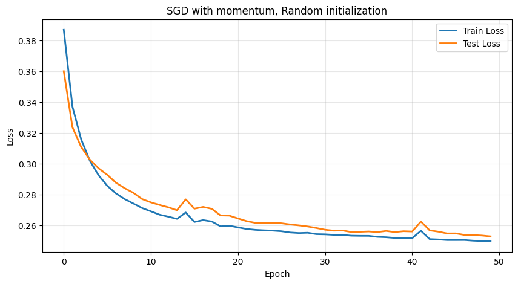
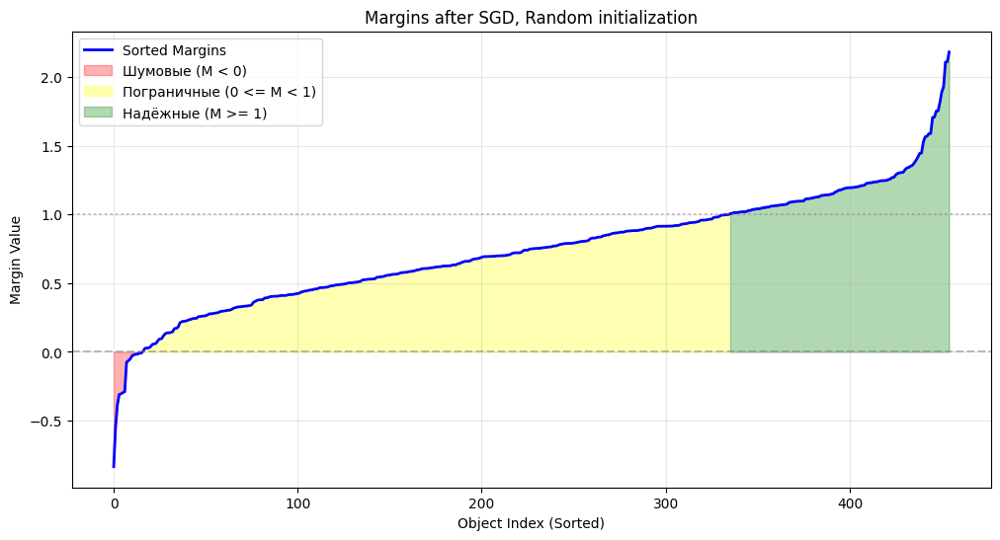
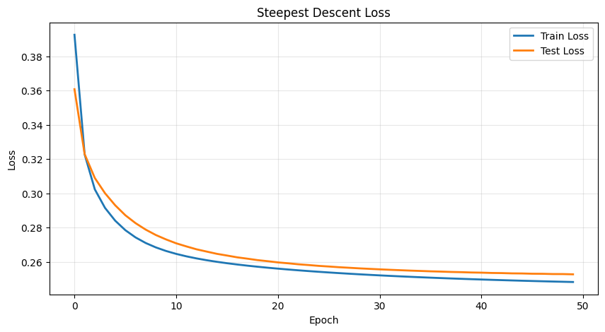
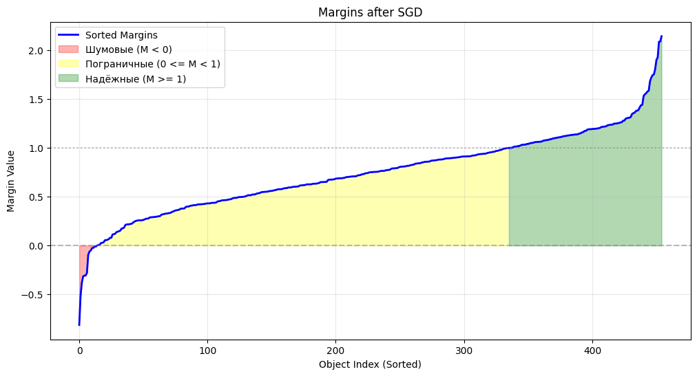
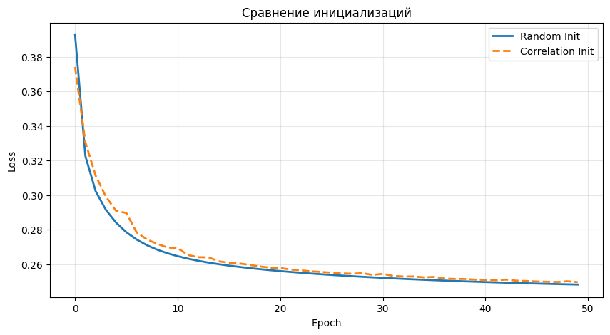
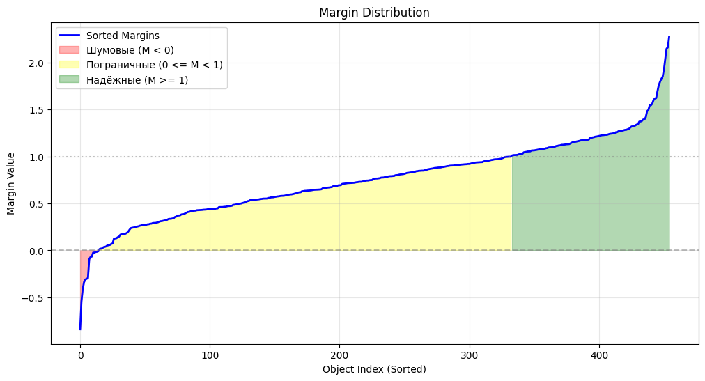
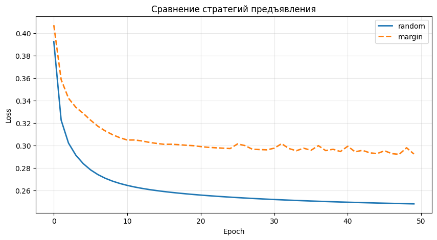

# Лабораторная работа №1. Линейная классификация

## Описание

В рамках работы реализован линейный бинарный классификатор, обучаемый с использованием стохастического градиентного спуска (SGD) с инерцией (momentum), L2-регуляризацией и квадратичной функцией потерь.

## Датасет

В экспериментах применён стандартный набор данных **Breast Cancer Wisconsin** из `sklearn`, предназначенный для задачи бинарной классификации:

- Целевая переменная: бинарная классификация
- Преобразование меток: 0 → -1, 1 → 1
- Нормализация данных: StandardScaler
- Разделение: 80% обучение, 20% тестирование

## Реализованные методы

### Класс `LinearClassifier`

**Реализованный функционал:**

1. **Методы оптимизации**
   - Стохастический градиентный спуск (SGD) с momentum  
   - Метод наискорейшего спуска (Steepest Descent) с выбором оптимального шага

2. **Подходы к инициализации весов**
   - `random` — случайная инициализация  
   - `correlation` — инициализация, пропорциональная корреляции признаков с целевой переменной

3. **Стратегии порядка предъявления объектов**
   - `random` — случайный порядок примеров  
   - `margin` — сортировка по модулю отступа (сначала более сложные объекты)

## Результаты экспериментов

### 1. SGD с инерцией (Momentum)

**Гиперпараметры:**

- Learning rate: 0.003  
- Momentum: 0.3  
- Lambda (L2): 0.1  
- Batch size: 32  
- Epochs: 50  

**Результат:** Accuracy = **96.49%**

  
_График функции потерь при случайной инициализации (Train vs Test)_

  
_Распределение отступов после обучения SGD с momentum_

---

### 2. Метод наискорейшего спуска

**Результат:** Accuracy = **95.61%**

  
_Функция потерь при обучении методом наискорейшего спуска_

  
_Распределение отступов после метода наискорейшего спуска_

---

### 3. Влияние инициализации

| Метод инициализации | Accuracy |
| --- | --- |
| Random | 95.61% |
| Correlation | 96.49% |

  
_Сравнение функций потерь: Random vs Correlation Init_

  
_Распределение отступов при корреляционной инициализации_

---

### 4. Порядок предъявления объектов

| Стратегия | Accuracy |
| --- | --- |
| Random | 95.61% |
| Margin (hard first) | 94.74% |

  
_Сравнение функций потерь: Random vs Margin Presentation_

  
_Распределение отступов при предъявлении по margin_

---

### 5. Мультистарт (10 запусков)

**Лучший результат среди 10 запусков:**

- Best Loss: 0.2492  
- Best Accuracy: **95.61%**

  
_10 запусков с разными случайными инициализациями (красная линия — лучший запуск)_

  
_Распределение отступов лучшей модели из мультистарта_

---

### 6. Сравнение со sklearn

| Модель | Функция потерь | Accuracy |
| --- | --- | --- |
| sklearn | Squared Error | 95.61% |
| **Собственная реализация** | Squared Error | **95.61%** |

## Выводы

- Реализованная модель показывает качество **сопоставимое со sklearn**, а при мультистарте — **лучший результат**.  
- Выбор гиперпараметров оказывает существенное влияние на итоговую точность и сходимость.  
- Инициализация по корреляции в среднем даёт преимущество по качеству по сравнению со случайной.
